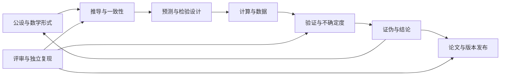

# OpenUFT 目录设计论证与最优性评估

评估日期：2026-09-07。范围：本项目实际文件树、布局声明、说明文档、模型登记表及结构检查器。本文是内部架构评估，不是物理理论证明或外部标准认证。

## 1. 结论

**当前布局适合“多种宇宙认知并行探索统一场论”的组织目标，可以作为稳定的研究骨架；尚不能证明它是全局最优，也不能断言已经达到局部最优。** 原因是尚未定义使用者任务频率、维护成本权重及候选方案的实测结果，而且当前仍有明确可改善项。

主分类使用模型路线，次分类使用研究生命周期，公共材料另设共享与比较层。这一选择满足“先辨别研究前提，再追踪该前提下的推导和证据”的要求。它的代价是早期模型有较多模板目录，跨模型比较必须依赖登记表和链接，不能只靠目录树表达。

目前能够检验的是：目录是否齐备、具体路径是否存在、模型编号是否一致、迁移前文件是否可恢复。尚未证明的是：所有资料的理论归属正确、所有流程已被执行、每条主张都能追溯到独立证据、查找效率在候选布局中最好。

[全部实际目录的逐项分析](DIRECTORY_AUDIT.md)给每个目录单独一行，含直接文件数、递归文件数、职责、保留理由、边界和判断。[机器可读审计](directory_audit.json)用于检查覆盖范围。附录中的规则判定是目录设计分析，不替代逐篇研究正文审查。

## 2. 如何判断“最优”

设布局为 L，任务集合为 T。可以考虑以下成本：

`J(L) = w1 × 找资料成本 + w2 × 错归属成本 + w3 × 重复维护成本 + w4 × 复现准备成本 + w5 × 扩展迁移成本 + w6 × 模板维护成本`。

所有权重必须由项目实际需求决定。查找成本可以用完成同一任务的时间测量；错归属用盲审归属错误率测量；重复维护用需要同步修改的主副本数量测量。各项先规定量纲和归一化方法，否则加权和没有可比较意义。

目前没有这些测量数据，因此本文不编造“98 分”“效率提升 80%”或最优性证书。评估采用显式需求、结构性质、反例和方案权衡。即使以后在少数候选上测得最低成本，也只能说“在这些任务、权重和候选中最优”。

| 必须满足的需求 | 当前设计机制 | 当前证据与限制 |
|---|---|---|
| 不同假设有稳定主位置 | `01_models/hXX_*` 与 `model.json` | 六条路线存在；公设内容仍需填充 |
| 同一模型可追踪完整生命周期 | 每模型 17 个阶段目录 | 目录齐备可检查；阶段完成程度不能由此推断 |
| 跨模型材料可共用 | `02_shared` 与显式依赖 | H01/H04 声明共享引擎；没有自动依赖图校验 |
| 比较不同模型时保留其前提 | `03_comparative` 和比较登记表 | 字段存在；公平比较尚需真实实验设计 |
| 负结果不被最终论文掩盖 | 独立证伪、评审、归档位置 | 具备存放位置；需要执行记录保留政策 |
| 迁移可追溯 | 快照、旧新路径、SHA-256 | 检查器可验证快照与目标存在性 |
| 新资料能够确定下一步 | `99_inbox` 与归属规则 | 有入口；尚无负责人、期限及滞留监测 |

## 3. 为什么把模型放在第一分类层

一份研究材料至少有三种属性：理论前提 H、研究阶段 S、物理主题 P。目录树只能选择一种主层级，无法同时成为三个维度的唯一最佳视图。

本项目优先问“在哪个宇宙模型下成立”，因此选择 `H → S → 具体材料`。例如，在 H01 中寻找螺旋运动的推导、检查和反例，不必先分别去全局求导、全局验证、全局论文目录重新识别同一前提。物理主题通过比较表与索引补充，避免把同一材料复制到引力、电磁、宇宙学等多个位置。

这是与需求匹配的设计推论，不是检索速度的实验结论。如果项目以后主要做同一观测数据上的几十种模型比较，则以“观测问题 → 候选模型”作为主要阅读视图可能更有效；现有主存放位置仍可保留，另生成比较视图。

## 4. 顶层目录逐项论证

| 目录 | 为什么单独保留 | 放什么 | 边界与代价 | 判断 |
|---|---|---|---|---|
| `.github` | 平台需要固定位置读取协作模板 | Issue、PR 模板及将来的 CI 配置 | 是协作基础设施，不算理论模块；不因目录存在就有 CI | 保留 |
| `00_governance` | 集中维护规则、入口和结构声明 | 流程、布局、决策、迁移说明、目录审计 | 不承载模型科学结论；总表里的历史结论需独立标注 | 保留 |
| `01_models` | 将论证与原始假设绑定 | 六条路线及新增路线模板 | 六条不是互斥且穷尽的自然分类 | 保留主轴 |
| `02_shared` | 避免复用方法和工具出现多份主实现 | 协议、共同参考资料、共享源码 | 共享实现可能含理论前提，不能等同中立基准 | 保留并审查依赖 |
| `03_comparative` | 跨模型判断与模型内部结论职责不同 | 公平比较、领域对照、综合候选、应用探索 | 应用并非严格的比较工作；现有内容少，暂作附属方向 | 有条件保留 |
| `04_publications` | 多模型综述不自然属于任一路线 | 综合报告、公共可视化 | 与单模型论文必须按研究范围区分；历史报告放这里不表示已发表 | 保留并明确范围 |
| `90_archive` | 保存跨项目历史及迁移证据 | 旧布局、旧工具、跨模型历史资料、快照 | 与模型内归档按影响范围区分；ZIP 不是长期仓储策略的全部 | 保留 |
| `99_inbox` | 避免为不明材料猜测归属 | 待立项问题、待审资料 | 必须有处置流程，否则会成为新的混乱源 | 保留并补管理 |

根目录中的 README、INDEX、QUICKSTART、LICENSE、CITATION、`.gitignore` 和 `verify.py` 属于入口、许可、引用与操作文件，保留在根部有明确职责，不必为了减少根文件数量再增加一层目录。

## 5. 六条模型路线是否划分合理

| 路线 | 独立保留的依据 | 与其他路线的交叉 | 决定真正归属所缺的内容 |
|---|---|---|---|
| H01 空间运行与螺旋运动 | 以空间运动或几何运动关系为切入点 | 可使用 H04 作用量，也可含 H03 源项 | 哪些运动量为基本自由度，哪些关系只是运动学描述 |
| H02 空间压缩与密度梯度 | 压缩/密度作为候选本体或状态变量 | 密度可能只是 H04 的派生量或 H01 的结果 | 密度的对象、单位、测量定义及独立动力学 |
| H03 物体驱动与源场耦合 | 研究源与场双向作用的建模假设 | 多种几何或规范模型都具有源项 | 何种驱动假设区别于已有场方程中的普通源项 |
| H04 几何与作用量 | 几何结构及变分原理组织动力学 | 几乎可作为 H01/H05/H06 的数学表达方式 | 哪组具体作用量、场空间与几何公设定义此候选 |
| H05 规范对称与相互作用 | 从对称结构与相互作用组织模型 | 可与 H04 及 H06 同时成立 | 具体群、表示、场内容、破缺机制及参数 |
| H06 量子结构与涌现 | 研究微观自由度到时空或场的涌现 | 可涌现 H04 几何或 H05 规范结构 | 微观自由度、动力学和可控的宏观极限 |

**这六个名称处在不同抽象层次，现阶段更准确地说是研究路线族，而不是六个已经定义好的独立理论。** 因此保留现有稳定编号是合理的组织选择，但需要由公设签名决定将来是否拆分、合并或建立混合候选。

若同一路线出现两套互不兼容的核心公设，应先登记独立候选 ID 和公设版本。只有出现实质独立的推导与证据链时，再建立子模型容器；不能只用 v1/v2 混淆“版本修订”与“不同理论”。本次评估不代填未知公设，也不根据名字给物理理论下成立或不成立的结论。

## 6. 每模型 17 个阶段的必要性与合并代价

下表适用于六条路线和 `_template`；全部实际实例另在逐目录附录登记。

| 目录 | 核心输入 → 输出 | 单独保留的理由 | 与相邻阶段的边界 |
|---|---|---|---|
| `00_project` | 问题 → 范围、计划、退出条件 | 避免没有研究问题就堆积结果 | 计划不充当假设或证据 |
| `01_literature` | 原始来源 → 有出处的基准与差距 | 让借用理论和原创主张可区分 | 公共书目链接共享层，模型特有阅读判断留此 |
| `02_assumptions` | 宇宙认知 → 显式公设、适用域 | 每条证明必须能追溯到前提 | 定义符号不能代替本体假设 |
| `03_formalism` | 公设 → 变量、单位、场空间和边界 | 同词不同义、度规或单位差异可在此消歧 | 演算过程进入推导 |
| `04_derivations` | 公设与形式 → 方程和近似 | 保留公式的来源 | 得到方程不等于其稳定、因果或自洽 |
| `05_consistency` | 方程 → 条件性证明与一致性结果 | 将“导出”与“性质成立”分开 | 数学和内部检验不冒充观测证据 |
| `06_predictions` | 模型与参数 → 可测量差异及阈值 | 支持预先规定检验，减少事后解释 | 已知数据拟合必须注明，不能当独立预测 |
| `07_computation` | 算法配置 → 可重运行实现与日志 | 管理可执行研究资产 | 科学解释进验证或结论；主数据进入数据层 |
| `08_data` | 来源 → 可追溯输入与派生数据 | 来源与处理历史需要独立管理 | 运行清单引用 data_id，不复制多份主数据 |
| `09_validation` | 预测、运行、独立数据 → 比较与残差 | 区分实现验证和观测检验 |误差预算在下一层，检验结果引用其版本 |
| `10_uncertainty` | 数据与方法误差 → 可信区间和稳健性 | 防止以很多有效数字代替可靠性 | 误差不能只在最终论文补写；参与前期设计 |
| `11_falsification` | 预设阈值与反例 → 失效条件、负结果 | 确保不利结果有稳定入口 | 与验证使用同一主结果，通过链接组织 |
| `12_conclusions` | 全部证据 → 有条件的结论和开放问题 | 结论随证据版本演化 | 不能只从论文摘要回填“成功” |
| `13_publications` | 已登记结论 → 正文、图表和补充材料 | 面向读者的叙述不同于研究工作区 | 论文不是唯一证据存储位置 |
| `14_review` | 某个版本 → 意见、回复、独立复现 | 审查过程需可追踪且区别于作者自评 | 评审可以发生于任何阶段，不必等论文写完 |
| `15_releases` | 经审查版本 → 冻结发布清单与引用 | 让外部读者准确复现某次发布 | 发布清单不等于复制整个工作目录 |
| `90_archive` | 被替代/停止材料 → 历史链和原因 | 保留模型内演变与负结果 | 模型整体稳定入口仍保留，不因失败删除 |

17 个阶段满足本项目声明的职责集合；这并不证明 17 是最少目录数。小项目可以合并“推导/一致性”或“验证/误差/证伪”而仍保留语义标签。现布局用更多固定入口换取边界可见性，适合需要长期审查的工作方式；早期路线的维护成本要在使用后评估。

编号是阅读与存储顺序，不是严格时间轴。真实研究是带回路的依赖图：



## 7. 细分目录和特殊资料的边界

### 7.1 计算、数据、论文

| 子目录 | 判断依据与放置规则 |
|---|---|
| `07_computation/src` | 模型专属可复用实现；阶段旁的历史入口可保留，但核心算法尽量只有一份 |
| `07_computation/notebooks` | 交互探索、展示与试验；正式结果必须能重启后顺序复算 |
| `07_computation/configs` | 输入参数、单位、算法开关；与输出日志分离 |
| `07_computation/tests` | 自动化断言、解析极限、数值收敛；测试通过不等于模型获实验支持 |
| `07_computation/runs` | 每次执行的命令、环境、版本、日志和失败状态；输出大文件引用主存储 |
| `08_data/raw` | 已接收的原始数据主副本，不覆盖；只读目前是约定，没有文件权限强制 |
| `08_data/processed` | 由可追溯流程生成的派生数据，登记输入和变换版本 |
| `08_data/external` | 外部来源元数据、许可和获取说明；与 raw 不重复保存同一主副本 |
| `13_publications/manuscript` | 正文及参考文献；研究草稿与投稿版本须有版本标识 |
| `13_publications/figures` | 图表及生成来源；若图像已为运行主输出，则引用该输出，避免手工不同步 |
| `13_publications/supplement` | 面向论文读者的补充说明和复现入口，不重复保管整套原始数据 |

### 7.2 共享、比较与历史子目录

`00_governance/catalog` 提供派生视图，`tools` 保存索引生成程序；两者不是证据仓库。

`02_shared/references` 保存共同参考资料，`protocols` 保存方法约定，`computation/src/triad_uft` 保存实际被多个模型调用的历史实现。当前共享源码没有在此次布局工作中补齐项目级依赖锁定、自动测试和独立基准，需要作为复现工程缺口登记。

`audit_methodology` 及 A1/A4/A5/A6 保留历史误差、自评和开放问题材料。特别是 `A6_AI科技星认证` 的名称不能证明第三方认证；A5 的历史分层与当前 `claims.csv` 证据类型应制定映射并解释差异。它们的历史正文未被本文重新科学审定。

`03_comparative/comparison` 存放比较方案与结果解释；父目录的 `comparison_matrix.csv` 作为跨比较总登记表。`physics_domains` 提供引力、电磁、粒子等领域视图，`synthesis` 管理显式组合假设的综合候选，`applications` 管理应用可行性探索。后三者都不能跳过模型本身的证据链。

`04_publications/legacy_reports` 的四个系列子目录以历史作品系列分组，`visualizations` 负责公共展示；这是一项兼容旧资料的折中。明确属于单模型的新论文应进入该模型，旧系列在完成出处和前提审查前不强行拆分。

根 `90_archive/legacy` 下的 GAQ 各版本、旧布局，`legacy_tools` 的旧脚本，以及 `migrations/20260907_full_layout` 的快照和映射，分别解决研究史、工具史和迁移可恢复性三个问题。它们不应参与当前版本研究质量评分。

`99_inbox` 下十个问题目录只表示待处理主题。“大统一完成”“引力非重整化突破”等名字带有目标性语言，当前状态必须按待研究解释。建议在后续审理时采用中性的可检验问题标题，并保留旧名映射。

## 8. 可以论证的结构性质与不能成立的强断言

### 命题 A：对已声明职责的覆盖

设 R 是第 6 节列明的 17 项研究职责，D 是布局声明中的阶段集合。逐项给出映射 f，将每项职责映射至同名职责目录；当前每条路线均有这些目录，所以对 R 的结构覆盖成立。

这个有限枚举论证依赖 R 的定义。它不证明所有物理研究活动已穷尽。例如大型实验可能需要仪器、样品、校准、采集与实验值班的独立结构；目前可纳入数据/检验，但规模扩大后应重新拆分。

### 命题 B：单一主存放位置在规则执行后可确定

对一件资料先判断是否历史或待审，再判断范围是单模型、共享方法、跨模型比较还是综合传播，最后按生命周期职责定位。遇到交叉属性时保留主文件，用稳定 ID 和链接表达其他用途，可以构造唯一主位置。

这是管理协议下的条件性结论。文件系统并不禁止复制，当前检查器也没有证明唯一性。若两个作者各自保存同名“最终版”，该性质便不成立，需要审查与自动重复检测补强。

### 命题 C：增设独立路线可以不搬动已有路线

只要新路线使用未占用 ID，复制模板并更新布局与索引，就不必改动现有 H01–H06 路径。因此目录命名提供了路径层面的扩展稳定性。全局排序、跨模型依赖与科学定义冲突仍需另行处理。

### 命题 D：迁移前文件可按快照重建

快照逐文件与记录的 SHA-256 一致时，可在独立目录重建记录范围内的原始字节。这不证明迁移前研究结论正确，也不证明迁移后的每个文件从未发生变化。

### 反例：目录通过不推出研究通过

一个模型可以同时具备全部 17 个目录，而 `postulates=[]`、`hypothesis_revision=null`，证据 CSV 只有表头。它通过目录完整性检查，却没有已登记的可审查公设或证据链。当前六条路线登记中确有待填内容，所以“检查 PASS ⇒ 研究完成”是无效推论。

## 9. 候选布局比较

以下是基于职责的定性判断，没有实测分数。

| 方案 | 更擅长的任务 | 主要代价 | 与当前目标的关系 |
|---|---|---|---|
| 全局按求导/证明/验证分类 | 集中查看同类方法 | 同一模型证据分散，需要反复辨认假设 | 不宜作为唯一主轴，可保留方法视图 |
| 按物理领域分类 | 面向某个观测问题组织材料 | 一个统一候选横跨多个领域，容易重复 | 适合比较视图 |
| 每模型只放 docs/src/data/results/papers | 小项目操作简单 | 公设、反例、误差和评审边界隐藏于文档内部 | 可能更适合早期轻量路线 |
| 当前模型 × 生命周期 | 单模型从前提到证据的追踪 | 模板数量多；跨模型需额外索引 | 与用户优先目标匹配 |
| 每个模型独立仓库 | 权限、依赖、发布相互隔离 | 共享定义和跨模型版本组合更难协调 | 团队或环境分化后再评估 |
| 数据库/知识图谱作为主系统 | 多维查询、依赖与证据追踪 | 建模、迁移、服务维护及导出成本 | 研究量增长后可作为目录之上的索引 |

当前方案没有在所有指标上支配其他方案，所以不能由这张表证明 Pareto 最优。选择它的充分理由是符合当前优先需求且已有资料迁移可控，而不是目录更多或名称更专业。

## 10. 尚未达到最优的具体原因

| 优先级 | 发现与依据 | 对“最优”的影响 | 后续动作与验收方式 |
|---|---|---|---|
| 高 | 六条 `model.json` 公设与版本待填，证据表处于初始状态 | 模型边界仍不能由机器或审查人确定 | 先完善实际研究身份；每条主张可定位到公设版本 |
| 高 | 旧方法说明仍出现 `06_audit` 等旧阶段称谓，以及历史认证/分层语言 | 链接存在仍可能语义误导 | 单列历史语境并统一当前流程术语；人工抽查无冲突 |
| 高 | `verify.py` 校验路径和少量字段，没有证据引用、重复 ID、数据哈希与依赖环检查 | 只保证骨架，不能保证研究可追溯 | 将结构与证据检查分层，空白模板与活动模型分开处理 |
| 中 | 17 阶段和 11 个细分目录在七套容器中预建 | 早期路线维护负担可能超过收益 | 用实际录入/查找任务比较“完整预建”和“按需展开” |
| 中 | H01/H04 复用库含历史前提，依赖环境尚未形成发布契约 | 单一源码位置不等于可长期复现 | 记录环境与适用范围，并保留有断言的独立复现检查 |
| 中 | 工作区、论文、发布和历史区可能重复保存同一成果 | 主副本可能失去一致性 | 制定稳定 artifact_id 与主位置；抽查图表到运行可回溯 |
| 中 | 目录族标题混合本体、方法与机制层次 | 六路线不能天然提供唯一分类 | 用公设签名决定候选边界，保留交叉标签 |
| 中 | `99_inbox` 无处置期限，应用目录职责较宽 | 长期可能再次堆积 | 增加状态/负责人/下次处理日期；按实际工作量考虑拆分 |
| 低 | 编号与中英文历史名混用，部分绝对路径可能较长 | 导航和跨工具可移植性有代价 | 新文件采用稳定短名；历史重命名须带映射，不为美观反复搬动 |

以上是实质改进点，所以本评估不会给出“已经最优，无需调整”的结论。当前最有价值的改进集中在语义和证据治理，而非再次整体重排目录。

## 11. 怎样验证以后是否更优

选取相同参与者、相同数据量及相同题目，对候选布局交替测试：找到某命题的公设版本；找到一幅图的输入数据和命令；放入跨模型资料；登记失败运行；新增模型；生成发布清单。记录完成时间、错误数、复制数与修正次数。控制熟悉度，公布未完成任务，不只挑成功样本。

在测试前约定哪些指标优先，不在看到结果后改权重。若某种简化显著降低维护成本，同时不降低证据追溯正确率，可对空白路线采用轻量呈现；若深目录妨碍导航，可先优化索引而保留稳定路径。实际触发条件包括出现不兼容子模型、独立大型实验、大规模运行数据或独立团队发布。

## 12. 阅读、更新与检查

- 总入口：[README](../README.md)。
- 结构依据：[layout.json](layout.json)与[全生命周期约定](WORKFLOW.md)。
- 逐目录附录：[DIRECTORY_AUDIT.md](DIRECTORY_AUDIT.md)。
- 审计生成器：[audit_directories.py](tools/audit_directories.py)，以全部实际目录为枚举对象。
- 检查实现：[verify.py](../verify.py)。它检查的局限见第 8、10 节，Markdown 锚点与外部链接也不在覆盖范围内。

在 openuft 根目录执行：

```text
python 00_governance/tools/audit_directories.py
python 00_governance/tools/refresh_catalog.py
python verify.py
```

审计统计是生成时快照，生成文件本身可能改变父目录文件数；应再次生成附录以稳定统计。目录数量、占位文件数与研究成熟度没有直接等价关系。新增未归类目录会使审计生成器失败，要求先补充职责规则，避免“全目录分析”随着项目增长失效。
