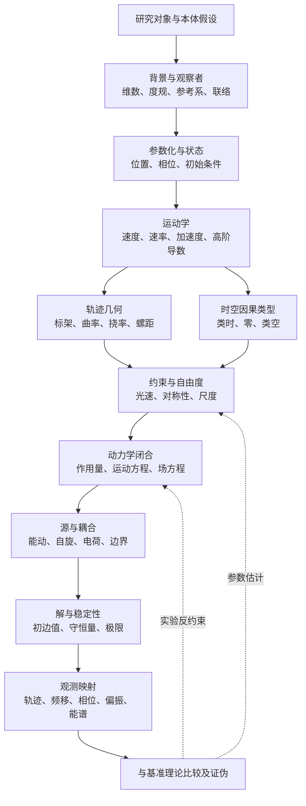

# 光速螺旋与一般运动：全维分类、基础量及底层关系图

所属体系：[S12 空间光速螺旋统一体系](../README.md)。

> **性质声明**：本文把“空间以光速作螺旋运动”当作待检验的模型假设，整理其数学描述需要哪些基础量。曲线几何中的恒等式是条件性数学结果；它们不构成空间本体运动的观测证据，也不自动导出标准模型或引力场方程。

**阅读路径**：[最小模型](#1-先固定对象与最小模型) → [基础运行量](#2-已有量之外最基础的运行量有哪些) → [运动分类](#2a-运动的完整分类坐标) → [常见类型对照](#2b-常见基本运动的特性表) → [光速螺旋模式](#2c-光速螺旋的运行模式与极限) → [对象与运动载体](#2d-对象类型刚体场与传播) → [底层关系图](#2e-底层关系图从对象到可检验预测) → [自由度与时空接口](#3-量纲与独立自由度盘点)。

## 1. 先固定对象与最小模型

取一个欧氏三维空间中的圆柱螺旋轨迹，以坐标时间 (t) 参数化：

\[
\mathbf x(t)=(R\cos\omega t,\;R\sin\omega t,\;ut),
\]

其中 (R\ge0) 是轨道半径，\(\omega\) 是相位角频率，\(u\) 是沿螺旋轴的有符号推进速度。这里把 S12 公设中的轴向参数 (b) 写成 (u)，以免与挠率混淆。导数给出

\[
\mathbf v=(-R\omega\sin\omega t,\;R\omega\cos\omega t,\;u),\qquad
v^2=R^2\omega^2+u^2.
\]

若另加光速约束 (v=c)，则

\[
R^2\omega^2+u^2=c^2.
\]

这条式子是本模型的**运动学约束**，不是运动方程。给定 (R,\omega,u) 中任意两个仍需第三个满足约束；它没有说明这些参数由什么源决定、如何随时空变化。

## 2. 已有量之外，最基础的运行量有哪些？

曲率 \(\kappa\)、挠率 \(\tau\)、频率与角速度并非一套完备变量。一个可计算、可与物理理论对接的描述至少需要以下层次。

### A. 轨迹、相位与尺度

| 量 | 符号/定义 | SI 量纲 | 作用 |
|---|---|---|---|
| 位置 | \(\mathbf x(t)\) | m | 指定轨迹及坐标原点、轴向 |
| 相位 | \(\phi(t)=\omega t+\phi_0\) | 1 | 描述绕轴进程；\(\phi_0\) 是初相位 |
| 半径 | \(R\) | m | 横向几何尺度 |
| 轴向推进速度 | \(u=dz/dt\) | m·s⁻¹ | 决定螺距和轴向运动分量 |
| 周期/普通频率 | \(T=2\pi/|\omega|\), \(f=1/T\) | s, Hz | 区分周期频率与角频率，\(|\omega|=2\pi f\) |
| 螺距 | \(p=uT=2\pi u/\omega\) | m | 每转的有符号轴向位移 |
| 弧长速度 | \(v=ds/dt=|\dot{\mathbf x}|\) | m·s⁻¹ | 曲线参数化不变量；光速假设写作 \(v=c\) |

必须给出参数化所用的时间：坐标时间、某个观察者的固有时，还是纯数学参数。若讨论真正的光样世界线，固有时沿零世界线不提供普通粒子时钟；不能不加说明地把它当作参数 (t)。

### B. 局部运动学量

\[
\mathbf a=\dot{\mathbf v},\quad \mathbf j=\dot{\mathbf a},\quad
\mathbf a\cdot\mathbf v=\tfrac12\,d(v^2)/dt.
\]

恒速时 \(\mathbf a\cdot\mathbf v=0\)，加速度只改变速度方向。对上述常参数螺旋：

\[
|\mathbf a|=R\omega^2,\qquad |\mathbf j|=R|\omega|^3.
\]

当 (v>0) 时，Frenet 标架给出单位切向 \(\mathbf T=\mathbf v/v\)、主法向 \(\mathbf N\)、副法向 \(\mathbf B=\mathbf T\times\mathbf N\)。对本模型：

\[
\kappa=\frac{R\omega^2}{v^2},\qquad
\tau=\frac{u\omega}{v^2},\qquad
\kappa^2+\tau^2=\frac{\omega^2}{v^2}.
\]

在 (v=c) 时即 \(\kappa=R\omega^2/c^2\)、\(\tau=u\omega/c^2\)，以及

\[
\kappa^2+\tau^2=\omega^2/c^2.
\]

这里的 \(\kappa,\tau\) 是**欧氏三维轨迹的 Frenet 不变量**，量纲均为 m⁻¹。它们不是自动等同于黎曼曲率张量、联络挠率张量或引力/规范场强。若 (R=0) 或 \(\omega=0\)，轨迹退化为直线，Frenet 主法向/挠率的常规定义需按极限处理。

### C. 状态、守恒量与相互作用

要从“怎么运动”走到“为什么这样运动”，还需要明确：

1. **状态量**：质量/静质量、能量、动量、自旋或内禀角动量、偏振/螺旋度，以及电荷等内部量；每个量须说明属于轨迹载体、场，还是模型的几何自由度。
2. **动力学变量**：作用量或等价的运动方程，广义坐标及共轭动量；若 \(R,\omega,u\) 可变，需给出它们的演化方程及约束保持条件。
3. **源与耦合**：质量—能量/应力、四流/电荷、自旋流等源，及耦合常数、符号约定和单位。仅把曲率或挠率命名为“引力/电磁分量”并不构成耦合方程。
4. **背景结构**：度规与时空维数、观察者/坐标系、联络；若主张时空本身运动，还需定义“空间点如何被追踪”及该运动相对什么背景有意义。
5. **初始与边界数据**：初始位置、相位、速度/场值、边界条件，以及允许解的正则性和稳定性。

守恒定律也不是从螺旋形状中凭空产生的。需由作用量的对称性或明确的场方程给出能量、动量、角动量、电荷等守恒流，并检验边界通量。

### D. 可观测量与实验接口

理论必须指出怎样把模型变量映射到可测结果，例如位置/轨迹、到达时间、相位差、频移、偏振、能谱、散射振幅、引力波或场强。需同时规定参考系、仪器响应、误差模型及相对现有理论的差分预测。若预测只是在重新命名已知量，或无法给出可区分的数值结果，就尚未形成检验。

## 2A. 运动的完整分类坐标

“运动类型”不是单一分类。一个对象可以同时是匀速、周期、平面圆周、受力运动；因此应按**互相独立的分类轴**登记，再组合成具体运动，而不是把所有名称排成一列。

### 分类轴一：速度大小如何变化

| 类型 | 判据 | 典型情形 | 需要记录的量 |
|---|---|---|---|
| 静止/瞬时静止 | $v=0$；瞬时静止指某一时刻速度为零 | 固定点、振子转向点 | 位置及首次非零导数；Frenet 标架在静止点不定义 |
| 匀速 | $dv/dt=0$ | 匀速直线、匀速圆周、常速螺旋 | 方向变化仍可使加速度非零 |
| 加速/减速 | $dv/dt>0$ / $dv/dt<0$ | 变速直线、非匀速转动 | 切向加速度 $a_T=dv/dt$ |
| 非匀速且变向 | $dv/dt\ne0$ 且 $\kappa\ne0$ | 变速曲线运动 | 切向与法向分量都要给出 |
| 速度连续但加速度跳变 | $\mathbf v$ 连续、$\mathbf a$ 不连续 | 理想碰撞/分段驱动模型 | 冲量、匹配条件；不能用单一光滑 Frenet 公式跨越跳点 |
| 速度本身跳变 | $\mathbf v$ 不连续 | 理想冲击近似 | 冲量或分布意义方程；经典轨迹导数失效 |

对任意光滑、非静止的三维轨迹，速度与加速度可拆为

$$\mathbf a=\frac{dv}{dt}\,\mathbf T+v^2\kappa\,\mathbf N,$$

第一项改变速率，第二项改变方向。故匀速不等于无加速度；匀速曲线只要求切向加速度为零。

### 分类轴二：轨迹的几何形状

| 轨迹类 | 几何判据/代表式 | 特征与边界 |
|---|---|---|
| 定点 | $\mathbf x(t)=\mathrm{const}$ | $v=0$；不是常规正则曲线 |
| 直线 | $\kappa=0$（正则段） | 方向不变；速率可恒定或变化；Frenet 法向与挠率不定义 |
| 平面曲线 | 轨迹落在固定平面；正则非直线段 $\tau=0$ | 圆、椭圆、抛物线等；平面性不决定速率 |
| 圆 | 到固定圆心距离恒定 | 匀速圆周时 $a_T=0$, $a_N=v^2/R$；角速度变化时不再匀速 |
| 一般空间曲线 | 不限于某固定平面 | 正则段由 $\kappa(s)$ 与 $\tau(s)$ 描述；须满足正则性 |
| 圆柱螺旋 | 半径固定，轴向位移对转角线性 | 常参数时 $\kappa,\tau$ 为常数；两者非零时为真正空间螺旋 |
| 变螺距/变半径螺旋 | 半径或每转推进量随参数变化 | $\kappa(s),\tau(s)$ 一般变化，须重新求导 |
| 摆线、波形、复合轨迹 | 由周期或分段函数组成 | 可自交或出现尖点；速度为零的点须分段处理 |

对正则曲线，若 $\kappa>0$，函数 $\kappa(s),\tau(s)$ 可局部确定曲线（差一个刚体运动）。若 $\kappa=0$ 或曲线不够光滑，应改用平行移动标架等方法。挠率为零是平面曲线的重要判据；直线上的挠率则不由 Frenet 公式定义，不能把“未定义”写成“等于零”。

### 分类轴三：时间结构与边界行为

| 类型 | 判据 | 注意点 |
|---|---|---|
| 周期运动 | 存在 $T>0$ 使完整状态按 $T$ 重复 | 只重复位置不一定重复速度、相位或内部状态 |
| 准周期运动 | 多个互不共度频率共同演化 | 一般不在有限时间后精确重复 |
| 非周期运动 | 无有限重复周期 | 可有短时振荡或长期趋近周期 |
| 有界/无界 | 位置是否始终留在有限区域 | 有界不必周期；无界也可局部周期 |
| 开放/闭合轨迹 | 是否回到同一空间点 | 闭合不等于完整状态周期 |
| 稳态/瞬态 | 描述量是否保持不变/经历有限演化 | 须说明指场、统计分布还是单条轨迹 |

### 分类轴四：加速度、约束与动力学来源

| 动力学状态 | 数学判据 | 例子/解释 |
|---|---|---|
| 惯性自由运动 | 指定惯性系中 $\mathbf a=0$；相对论中对应测地/零测地条件 | 坐标加速度为零只在特定坐标系成立 |
| 受力/非惯性运动 | 方程给出非零加速度或非测地偏离 | 外力、场耦合、约束力 |
| 约束运动 | 轨迹受几何或速度条件限制 | 绳、导轨、固定 $v=c$；须给约束力/乘子 |
| 驱动运动 | 外部输入持续供能或供角动量 | 驱动旋转、受迫振荡 |
| 耗散运动 | 有效能量/振幅流失 | 阻尼、辐射反作用；须说明能量去向 |
| 自由振荡/模态 | 内部方程与边界条件决定本征运动 | 频率由本征问题确定，不应预先任意指定 |

几何描述回答“轨迹长什么样”；动力学描述回答“为什么沿该轨迹运动”。两者必须由方程、约束和初边值条件连接。

### 分类轴五：相对论时空因果类型

相对于给定观察者，局部三维速度与 $c$ 的比较对应时空切向量因果类别（采用 $(-,+,+,+)$ 号差约定）：

| 类别 | 观察者测得速度 | 世界线切向量 $K$ | 物理解释 |
|---|---:|---|---|
| 类时 | $v<c$ | $g(K,K)<0$ | 有静质量物体的世界线；可定义固有时 |
| 类光/零 | $v=c$ | $g(K,K)=0$ | 光样传播；非零零向量没有普通固有时参数 |
| 类空 | $v>c$ | $g(K,K)>0$ | 可作几何曲线或空间方向，不能当作普通物质/信号的因果世界线 |

速度须由观察者四速度和度规定义，不能只看坐标导数。零条件只约束切向量，不要求空间投影为直线；投影弯曲由度规、介质或相互作用决定。

## 2B. 常见基本运动的特性表

| 运动 | 速率 | 曲率/挠率 | 加速度特征 | 周期/闭合 | 与光速螺旋的关系 |
|---|---|---|---|---|---|
| 静止 | 0 | Frenet 不定义 | 0 | 点轨迹 | 否 |
| 匀速直线 | 常数 | $\kappa=0$；$\tau$ 不定义 | 0 | 通常无界、不周期 | 取 $c$ 时是直线零传播，不是螺旋 |
| 变速直线 | 变化 | $\kappa=0$；$\tau$ 不定义 | 纯切向 | 可周期往返 | 不是螺旋，可作退化极限 |
| 匀速圆周 | 常数 | $\kappa=1/R$，平面 | $v^2/R$ 指向圆心 | 闭合且周期 | 轴向分量为零的平面退化端点 |
| 变速圆周 | 变化 | $\kappa=1/R$，平面 | 切向加速度加向心加速度 | 几何闭合，状态未必周期 | 仍是平面退化端点 |
| 抛体/平面曲线 | 可变 | 正则非直线段 $\tau=0$ | 由力/约束决定 | 常为开放轨迹 | 不是螺旋 |
| 匀速圆柱螺旋 | 常数 | $\kappa,\tau$ 常数且通常非零 | 纯法向；速率不变 | 有轴向推进时不闭合 | 最小几何原型 |
| 变速圆柱螺旋 | 变化 | 固定几何轨迹时曲线不变量不变 | 切向与法向并存 | 相位可周期，完整状态含推进 | 推广；恒速光速须满足点态约束 |
| 变形/变螺距螺旋 | 可变 | $\kappa(s),\tau(s)$ 一般变化 | 逐时计算 | 可周期或非周期 | 候选推广，需生成方程 |
| 任意三维曲线 | 可变 | 正则段由 $\kappa(s),\tau(s)$ 描述 | $a_T=\dot v$, $a_N=v^2\kappa$ | 任意 | 螺旋只是其中一类 |
| 零测地传播 | 观察者测得 $c$ | 由时空几何决定 | 仿射参数下协变加速度为零 | 由几何与边界决定 | 可有螺旋形空间投影，须另证其物理含义 |

## 2C. 光速螺旋的运行模式与极限

对 $\mathbf x(t)=(R\cos\omega t,R\sin\omega t,ut)$ 且 $v=c$，令横向速度比例 $q=R\omega/c$、轴向比例 $w=u/c$，则

$$q^2+w^2=1.$$

速度分配只有一个无量纲自由度（另有转向、轴向方向的符号及整体空间朝向）；绝对尺度仍未固定。主要模式如下：

| 模式 | 参数条件 | 速度分配 | 几何/运动性质 |
|---|---|---|---|
| 一般螺旋 | $R>0,\omega\ne0,u\ne0$ | 横向与轴向均非零 | $\kappa>0,\tau\ne0$ |
| 平面圆周极限 | $u=0$ | 全部速度为横向 | $\tau=0$；轨迹闭合，周期 $2\pi/|\omega|$ |
| 直线极限 | $R=0$ 或 $\omega=0$ | 方向固定 | $\kappa=0$；挠率不定义；无绕轴运动 |
| 近圆周 | $|u|/c\ll1$ | 横向主导 | 螺距小，$|\tau/\kappa|=|u/(R\omega)|\ll1$ |
| 近直线 | $|R\omega|/c\ll1$ | 轴向主导 | 横向偏转小、螺距相对大 |
| 反手性/反向推进 | 改变 $\mathrm{sgn}(\omega)$ 或 $\mathrm{sgn}(u)$ | 速率约束不变 | 挠率符号随 $u\omega$ 改变；曲率非负 |
| 变参数运行 | $R,\omega,u$ 随时间变化 | 恒速时仍须逐时满足速度约束 | 需要额外微分约束；常参数曲率公式不再适用 |

普通频率 $f=|\omega|/(2\pi)$ 非负；曲率按定义非负，挠率与手性可带符号。螺旋角必须声明相对于轴向还是横向定义，否则三角函数分量会互换。

## 2D. 对象类型：刚体、场与传播

“什么在运动”必须先于“怎样运动”回答。相同的螺旋图样可以是一个点的轨迹、刚体上一点的轨迹、场的相位线，或空间流场的流线；这些对象的方程和观测含义不同。

| 对象/运动载体 | 最小描述 | 适合的运动量 | 不可混同之处 |
|---|---|---|---|
| 点粒子/测试点 | 世界线 $x^\mu(\lambda)$ 或空间轨迹 $\mathbf x(t)$ | 速度、加速度、曲率、挠率、能动量 | 单条轨迹不能代表整个场或整个空间 |
| 刚体 | 质心位置 + 姿态（旋转矩阵/四元数） | 平动速度、角速度向量、角动量、惯量张量 | 刚体角速度不是曲线的 Frenet 挠率；一个点可同时有平动和绕质心转动 |
| 连续介质/流体 | 速度场 $\mathbf v(\mathbf x,t)$ 及密度、应力等 | 流线、迹线、涡线、涡量、散度 | 流线是某时刻速度场的切线曲线，通常不等于单个质点随时间走过的迹线 |
| 经典场 | 场值 $\Phi(\mathbf x,t)$ 及场方程 | 相位、振幅、梯度、通量、能量动量流 | 场的相位面/相位线不一定是能量或信息的轨迹 |
| 波/波包 | 色散关系 $\omega(\mathbf k)$、振幅与边界条件 | 相速度 $v_p=\omega/|\mathbf k|$、群速度 $v_g=|\nabla_{\mathbf k}\omega|$、前沿速度 | 相速度、群速度与信号前沿速度不普遍相等；传播速度不能直接叫空间点速度 |
| 时空几何/空间流 | 度规、观察者场、空间切片及其演化 | 外曲率、形变率、剪切、膨胀、旋转、联络与曲率 | “空间旋转”需要指定切片/观察者及坐标不变定义，不能只画坐标螺旋 |

波的模式还可分为行波/驻波、平面波/球面波/柱面波、单色/宽带、纵波/横波及不同偏振态。分类依据是场解和边界条件，而非粒子轨迹的 Frenet 分类。若提出“波相位沿螺旋前进”，应说明螺旋的是相位、波矢方向、能流还是载体轨迹，并分别定义其速度。

## 2E. 底层关系图：从对象到可检验预测

**图的读取规则：**几何链回答轨迹如何弯扭；因果链判定它能否代表物质或信号世界线；动力学链将方程、源和初边值条件闭合为演化；证据链把模型解映射到观测并允许排除模型。几何恒等式不能跳过动力学和证据链。

## 3. 量纲与独立自由度盘点

基础维度至少涉及长度 \(L\)、时间 \(T\)、质量 \(M\)、电流 \(I\)（或等价电荷维度）。本节运动学子系统中：

| 量 | 量纲 |
|---|---|
| \(R,p,s\) | \(L\) |
| \(t,T\) | \(T\) |
| \(v,u,c\) | \(LT^{-1}\) |
| \(\omega\) | \(T^{-1}\) |
| \(\kappa,\tau\) | \(L^{-1}\) |
| \(a\) | \(LT^{-2}\) |
| 相位 \(\phi\)、螺距角、\(u/c\)、\(R\omega/c\) | 无量纲 |

在恒定 (c) 约束下，速度分量由一个无量纲螺距角确定，例如 \(\sin\alpha=u/c\)、\(\cos\alpha=R\omega/c\)。几何曲线仍有尺度自由度：同时按 \(R\mapsto\lambda R\)、\(u\mapsto\lambda u\)、\(\omega\mapsto\omega/\lambda\) 变换，速度约束不变而曲率、挠率和频率改变。因此，“总速率为 (c)”并不能单独确定螺旋的尺寸或频率。要固定尺度，必须引入额外的边界条件、源参数或有证据的尺度关系。

仅有 \(\kappa,\tau,\omega,c\) 的关系只能给出曲线几何闭合，不能决定能量、质量、电荷、作用量或场强。量纲分析能排除不可能的公式，却不能单独求出无量纲耦合常数，也不能替代动力学。

## 4. 4D 时空版本必须另行定义

“三维空间轨迹以速度 (c) 前进”与“时空中的零世界线”相关，但不是同一句定义。平直时空中，若 \(x^\mu(\lambda)=(ct(\lambda),\mathbf x(\lambda))\)，零路径条件为

\[
g_{\mu\nu}\,\frac{dx^\mu}{d\lambda}\frac{dx^\nu}{d\lambda}=0.
\]

弯曲时空中还需指定光线是否为度规的零测地线、是否存在介质/有效度规或非测地力。若研究“空间自身旋转/螺旋”，则需要独立给出时空切片、观察者场（四速度）、空间流线、度规/联络及坐标不变的观测量。仅选一个坐标系画出螺旋，不足以证明存在坐标不变的空间运动。

4D 分析的基本对象包括：度规 \(g_{\mu\nu}\)、世界线切向量、零条件/归一化条件、协变加速度、曲率张量、联络挠率张量（若采用带挠率联络）、场张量、源张量和协变守恒式。必须把这些对象与上文的 3D \(\kappa,\tau\) 分开记号、分开推导。

## 5. 建议的最小闭合模型清单

要把光速螺旋从几何假设推进到物理模型，至少依次完成：

1. **对象定义**：空间流、粒子世界线、波包中心或场的相位线，明确唯一研究对象。
2. **运动学定义**：参数、参考系、度规、速度约束、相位与 Frenet/协变几何量。
3. **独立自由度盘点**：列出未知函数、常数、约束及其量纲；说明哪些由观测输入，哪些由方程决定。
4. **动力学闭合**：给出作用量/场方程与初边值条件，证明约束在演化中保持。
5. **物质与相互作用**：给出能量动量、自旋/电荷等源及耦合，推导而非指派对应关系。
6. **极限与一致性**：检查直线/圆周极限、低速极限、无源极限、坐标变换、稳定性及已知实验约束。
7. **定量预测**：从方程算出可观测量，给出与 GR、标准模型或其他基准模型不同的数值预测。
8. **独立复现与证伪**：公开推导、数据、误差和明确失败阈值；允许结果否定假设。

## 6. 结论与当前判定

- 已给出的常参数螺旋有一套最小运动学：位置、相位、半径、轴向速度、角频率、周期、螺距、弧长速度及其导数。
- 曲率和挠率之外，最先不能省略的是**参数化/参考系、速度分量、相位与尺度、加速度、Frenet 标架**；进入物理层还需状态量、源、作用量/场方程、背景几何、初边值条件和可观测量。
- 对该圆柱螺旋，\(v=c\Rightarrow R^2\omega^2+u^2=c^2\)，并推出 \(\kappa^2+\tau^2=\omega^2/c^2\)。这是给定参数化和定义后的数学推论，不验证“空间本身运动”的公设。
- 目前 S12 的公设登记包含这类运动学主张，但要成为闭合物理理论仍缺少不含糊的时空对象、动力学/作用量、源耦合、尺度确定机制及可区分的观测预测。特别是，几何量与时空曲率/挠率张量不可仅凭符号相同而认作同一物理对象。

## 参考与仓库内关联

- 仓库内曲率—挠率—频率的圆柱螺旋求导与精算材料：[算法联盟_v总等于c_曲率挠率频率_求导证明与精算验证_v1.md](../../../../算法联盟_v总等于c_曲率挠率频率_求导证明与精算验证_v1.md)（位于仓库根目录）。
- S12 公设登记与边界：[postulates.md](../02_基础公设/postulates.md)。
- NIST CODATA：真空光速的 SI 数值为精确定义值 [Speed of light in vacuum](https://physics.nist.gov/cuu/Constants/Value/c.html)。此事实规定 (c) 的单位换算，不为螺旋本体假设提供证据。
