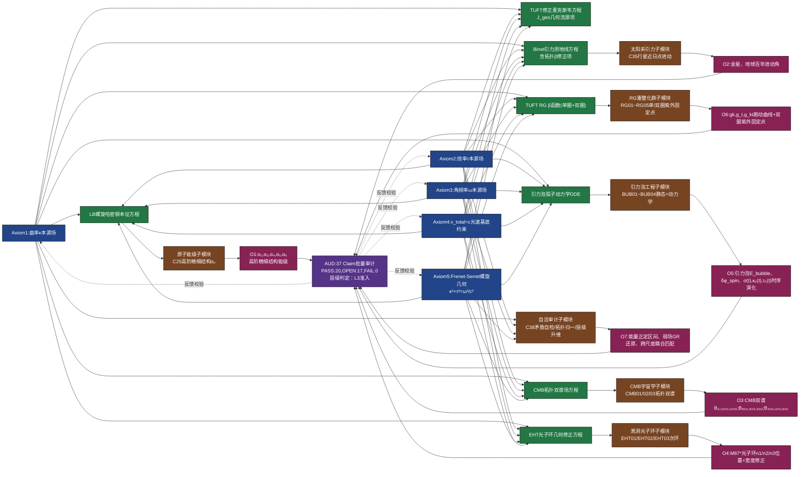

# 判定｜空间螺旋 V21「知识图谱」全维分析 —— 五层结构 × claims 台账逐节点对应

> 日期 2026-09-26 · 任务：把 V21 知识图谱（Mermaid）落成**可审计的布局**——五层结构 + 每个节点一条台账出处 + 口径对账
> 图谱载体：`源码/空间螺旋修复版_第一性审计与伪派生判定.py` 文档头（同日嵌入，与本册同源同字）
> 台账：`../../07_统一场方程/空间螺旋几何化统一场论/claims.csv`（C01–C54，共 54 条）
> 引擎：`源码/空间螺旋_全量claims批量审计与L3层级判定.py`、`源码/空间螺旋判定_总览与防回潮守卫.py`（本册两者均实跑，见 §11）
> 数字口径：本册所有计数为 **2026-09-26 现场实读**，不引用旧快照

**一句话结论**：图谱的**结构分层自洽**（公理 → 场方程 → 子模块 → 观测靶 → 审计判定）；
但**内容承重不均**——27 个节点中 **6 个无台账支撑（空：F6/F7、M3/M4、O3/O4）**、
**6 个整体被证伪（F4/F5、M5/M6、O5/O6）**、**2 个为混合节点（A1/F2：主表述通过但含已证伪分支）**；
且图谱自带的草稿自评数字（`37 Claim PASS:20 / OPEN:17 / FAIL:0` 与 `层级判定：L3准入`）与台账实读**不符**，
一律以台账为准：**L3 = 0**，守卫结论「**申报不成立**」。

---

## §0 本册回答什么，怎么展开

一张知识图谱只有三种可能的价值：**(a) 结构导航**、**(b) 承重清单**、**(c) 判定结论**。
本册按 (a)(b)(c) 三层逐级落实，并把图谱自陈的数字与台账做对账（§8）——后者是本册的主要发现。

| 章 | 回答 | 形态 |
|---|---|---|
| §1 | 图谱本体是什么 | Mermaid（可直接渲染，与脚本文档头逐字一致） |
| §2 | 五层各自挂了什么、承重多少 | 27 节点总表（含节点→台账出处） |
| §3–§7 | 每个节点的判词与定量证据 | 分层明细表 |
| §8 | 图谱自评 vs 台账实读 | 口径对账（4 处，其中 2 处「不成立」） |
| §9 | 全维缺口清单 | 空节点 / 已证伪 / 不可达靶 |
| §10 | 结论与红线 | — |
| §11 | 复跑与溯源 | 命令 + 产物 + 守卫 8/8 原文 |

---

## §1 图谱本体（Mermaid，与脚本文档头逐字一致）



> **图谱的 AUD 节点与 `A1..A5` 顶层的连线是「草稿自评口径」**：本仓库落地时，反向反馈不是示意虚线，
> 而是 `源码/空间螺旋判定_总览与防回潮守卫.py` 的 **8 条硬断言 + 不变量基线**（见 §7）。

---

## §2 全维布局总表（五层 × 27 节点，逐节点可溯源）

**图例**：✅承重（有台账且有引擎证据）｜⚠️空（无台账，不得凭声明登记）｜⛔已证伪（封顶 L0）

| # | 层 | 节点 | 内容 | 台账 / 产物对应 | 实读判定 |
|---|---|---|---|---|---|
| 1 | L1 | A1 | 曲率 κ 本源场 | C02；C12 / C13 | ✅ C02 pass·L2；⛔ C12 falsified·L0；⚠️ C13 open·L1 |
| 2 | L1 | A2 | 挠率 τ 本源场 | C02；C14 | ✅ C02 pass·L2；✅ C14 boundary·L1 |
| 3 | L1 | A3 | 角频率 ω 本源场 | C01；C14 | ✅ C01 pass·L1；✅ C14 boundary·L1 |
| 4 | L1 | A4 | v_total = c 光速基底约束 | C24 / C39（§14 复算） | ✅ C24 pass·L2；✅ C39 pass·L2 ← **唯一经复算确认的公理** |
| 5 | L1 | A5 | Frenet-Serret 几何 κ²+τ²=ω²/c² | C01+C02+C10 | ✅ pass·L1（恒等重述，R2 封顶 L1） |
| 6 | L2 | F1 | LB 螺旋哈密顿本征方程 | C25 / C48 / C50（§12/§15） | ✅ open·L1（谱退化，靶不可达） |
| 7 | L2 | F2 | TUFT 修正麦克斯韦（J_geo 源项） | C33 / C34 / C41（§6） | ⛔ C33 falsified·L0；✅ C34 pass·L1（未闭合）；✅ C41 pass·L2 |
| 8 | L2 | F3 | Binet 引力测地线（拓扑 β 修正） | C35 / C49 / C51（§13/§16） | ✅ open·L1（≡ GR 1PN，零判别力） |
| 9 | L2 | F4 | TUFT RG β 函数（单圈+双圈） | C54（§19） | ⛔ falsified·L0 |
| 10 | L2 | F5 | 引力泡孤子动力学 ODE | C53（§18） | ⛔ falsified·L0 |
| 11 | L2 | F6 | CMB 拓扑双谱场方程 | CMB01/CMB02/CMB03 | ⚠️ **台账未登记**（无模块/公式/脚本） |
| 12 | L2 | F7 | EHT 光子环几何修正方程 | EHT01/EHT02/EHT03 | ⚠️ **台账未登记**（同上） |
| 13 | L3 | M1 | 原子能级（C25 高阶 αₙ） | C25 / C48 / C50 | ✅ open·L1 |
| 14 | L3 | M2 | 太阳系引力（C35 行星进动） | C35 / C49 / C51 | ✅ open·L1 |
| 15 | L3 | M3 | CMB 宇宙学（拓扑双谱） | — | ⚠️ **空** |
| 16 | L3 | M4 | 黑洞光子环（次环） | — | ⚠️ **空** |
| 17 | L3 | M5 | 引力泡工程（BUB01~BUB04） | C53（§18） | ⛔ falsified·L0 |
| 18 | L3 | M6 | RG 重整化群（RG01~RG05） | C54（§19） | ⛔ falsified·L0 |
| 19 | L3 | M7 | 自洽审计（C38 三算法） | C38 / C52（§9.5/§17） | ✅ BOUNDARY·L1 |
| 20 | L4 | O1 | α₂..α₆ 高阶精细结构能级 | C48 / C50 | ✅ 已登记，但**阈值不可达** |
| 21 | L4 | O2 | 金星、地球百年进动角 | C49 / C51 | ✅ 已登记，但**零独立判别力** |
| 22 | L4 | O3 | CMB 双谱 B₂,₁₀₀₀,₁₀₀₀ 等 | — | ⚠️ **空**（无预测值、无误差棒） |
| 23 | L4 | O4 | M87* 光子环 n1/n2/n3 | — | ⚠️ **空** |
| 24 | L4 | O5 | 引力泡 E_bubble / δφ_spin / 时序 | C53 | ⛔ 证伪（δφ 量纲非法） |
| 25 | L4 | O6 | gk/g_t/g_kt 跑动 + 紫外固定点 | C54 | ⛔ 证伪（无紫外非平凡固定点） |
| 26 | L4 | O7 | 能量正定 / 弱场 GR 还原 / 跨尺度耦合 | §0–§9 引擎自检 + 定理 H；C45 | ✅ open·L1（3 未知 / 1 约束，靶登记 0） |
| 27 | L5 | AUD | 全量 claims 批量审计判定 | C01–C54 + 守卫 | ⛔ **L3 = 0**，申报「L3 完整闭环」不成立 |

**承重统计（27 节点 = 5 公理 + 7 场方程 + 7 子模块 + 7 靶 + 1 审计）**：

| 类别 | 数目 | 节点 |
|---|---|---|
| ⚠️ 空（无台账支撑） | **6** | F6、F7、M3、M4、O3、O4（同一空模块族：CMB 与 EHT） |
| ⛔ 整体被证伪 | **6** | F4、F5、M5、M6、O5、O6 |
| ⛔ 审计否定结论 | **1** | AUD（L3 = 0、申报不成立） |
| ⚠️ 混合（主表述通过但含已证伪分支） | **2** | A1（分支 C12 falsified）、F2（分支 C33 falsified） |
| ✅ 其余（开放 / 通过 / 审计工具） | **12** | A2、A3、A4、A5、F1、F3、M1、M2、M7、O1、O2、O7 |

---

## §3 L1 本源公理层（深蓝：不可观测的理论底层假设）

| 节点 | 图谱内容 | 台账对应 | 实读 | 定量证据 |
|---|---|---|---|---|
| A1 | 曲率 κ 本源场 | C02（κ=ρ/(ρ²+b²)）；C12（G=α²μ₀c²ρ²）；C13（G=c³/[ℏ(κ_G²+τ_G²)]） | pass·L2 / falsified·L0 / open·L1 | C02：符号残差 0 + Frenet 数值反算 1.34e-51；C12 由 G 反推 ⇒ 循环 |
| A2 | 挠率 τ 本源场 | C02；C14（ω=c(κ²+τ²)/κ，频率越低引力效应越大） | pass·L2 / boundary·L1 | C14 为唯象映射，无第一性来源 |
| A3 | 角频率 ω 本源场 | C01（ω√(ρ²+b²)=c）；C14 | pass·L1 / boundary·L1 | C01 为公设本身 |
| A4 | v_total = c 基底约束 | C24；C39（第三分量 c·t → b·ω·t 并重列 ω√(A²+b²)=c） | pass·L2 / pass·L2 | ‖R′‖/c = 1，b/A 取 1、0.5、1/137、2 四组，最大偏差 **1.33638e-51**；申报版 11.73% 超光速（ωA/c=0.49830 ⇒ ‖v‖=1.117276c）被消除 |
| A5 | Frenet-Serret 螺旋几何 | C01+C02+C10（ℓ=1/√(κ²+τ²)、E=mc²=ℏω=ℏc/ℓ） | pass·L1 | 恒等重述：R2 规则封顶 L1，不产生新信息 |

**层判词**：5 条公理里**只有 A4 有复算证据**（且是「修复后成立」）；A1/A2 的表述正确但由 A1 派生的 G 式两次失败（C12 循环、C13 待定）；
A5 是恒等重述。⇒ 公理层**不是**图谱宣示的「5 条独立第一性输入」，而是「1 条被复算 + 2 条定义型 + 2 条重述型」。

---

## §4 L2 核心场方程层（绿：理论核心数学关系）

| 节点 | 场方程 | 子模块 | 台账 | 实读 | 关键定量 |
|---|---|---|---|---|---|
| F1 | LB 螺旋哈密顿本征方程 | M1 | C25 / C48 / C50 | open·L1 | 谱宽 (α₆−α₁)/α₁ = **1.089e-75**，比 α 测量精度 1.5e-10 低 **65.14 个量级**；达精度需 n_detect = **2.196e33**，二阶项=V₀ 需 n_unit = **1.793e38** |
| F2 | TUFT 修正麦克斯韦（J_geo 几何流源项） | — | C33 / C34 / C41 | falsified·L0 / pass·L1 / pass·L2 | [α²K] = L⁻¹ 与 [∇×B] 差因子 **M·T⁻²·I⁻¹**（非无量纲）；补 μ₀J 后三项量纲一致，I=1 A、r=1 m 时 ∮B·dl = μ₀I = 1.256637061e-6（偏差 0）；**J_geo 源项与电荷守恒约束仍缺闭合** |
| F3 | Binet 引力测地线（含拓扑 β 修正） | M2 | C35 / C49 / C51 | open·L1 | 设 Φ∝r^n ⇒ 力律 r^(n−3)，恢复牛顿**唯一**要求 n=1（此时因子退化为常数、零内容），否则违 Bertrand 定理；β₀=3h²/c² 使草稿 Binet **≡ GR 1PN**（u² 系数 3GM/c² 精确相等）；β-free 形状比 1.87×/2.58×；**标定靶=最佳靶 ⇒ 独立判别力为零** |
| F4 | TUFT RG β 函数（单圈+双圈） | M6 | C54 | falsified·L0 | b1..b6 六自由无推导；**精确定理**：非平凡紫外固定点存在 ⇔ b5²(−b2/b1) = b6²(−b4/b3)，给定系数 **LHS/RHS = 5.2478**，sympy 解集仅原点；μ_UV 用 s⁻¹ 非 eV ⇒ ln 跨度虚增 **34.957（+54.1%）**；Landau 极点 s\* = 1/(b1g₀) = 396.83 依赖任意 IR 输入 ⇒ 不可证伪 |
| F5 | 引力泡孤子动力学 ODE | M5 | C53 | falsified·L0 | 三种 κ 口径量纲**全部非法**；高斯积分漏乘 **π^(3/2) = 5.5683**；δφ = Sτ₀σ/v 量纲 **[LM]**（应为 5.0e-14 rad，草稿给 1.76e-55 rad）；唯一量纲修复 ×c⁴ 后 E = **1.1396e16 J ≈ 2.72 Mt TNT**，与「地面实验室可实现」矛盾；无作用量 ⇒ 高斯包络是 ansatz 非孤子；4 自由参数 0 约束 ⇒ V = −4 |
| F6 | CMB 拓扑双谱场方程 | M3 | CMB01/CMB02/CMB03 | ⚠️ 未登记 | 台账无条目；V21续修② 明确「模块提交前不得占位 C55/C56」 |
| F7 | EHT 光子环几何修正方程 | M4 | EHT01/EHT02/EHT03 | ⚠️ 未登记 | 同上（全局表曾列出该两行，但无模块、无公式、无脚本） |

**层判词**：7 组场方程 **2 组已被证伪**（F4/F5，均为「六/四自由参数、0 约束」型伪派生）、**1 组半闭合**（F2）、**2 组为空**（F6/F7）、
**2 组虽开放但不可判别**（F1 谱退化、F3 与 GR 恒等）。⇒ 该层没有任何一组场方程同时具备「有推导 + 有带误差棒的可检验预言」。

---

## §5 L3 子模块层（棕褐：代码实现单元，节点 → Python 函数/脚本）

| 节点 | 子模块 | 台账 | 实现载体（源码） | 实读 |
|---|---|---|---|---|
| M1 | 原子能级 · C25 高阶精细结构 αₙ | C25 / C48 / C50 | 统一脚本 §12 / §15（`En_lb(n)`） | open·L1（退化谱） |
| M2 | 太阳系引力 · C35 行星近日点进动 | C35 / C49 / C51 | 统一脚本 §13 / §16（`planet_dphi` / RK4） | open·L1（公式需修正） |
| M3 | CMB 宇宙学 · CMB01/02/03 拓扑双谱 | — | **无** | ⚠️ 空 |
| M4 | 黑洞光子环 · EHT01/02/03 次环 | — | **无** | ⚠️ 空 |
| M5 | 引力泡工程 · BUB01~BUB04 | C53 | 统一脚本 §18 | ⛔ falsified |
| M6 | RG 重整化群 · RG01~RG05 | C54 | 统一脚本 §19 | ⛔ falsified |
| M7 | 自洽审计 · C38 三算法 | C38 / C52 | 统一脚本 §9.5（`algo_contradiction_selfcheck` / `algo_topo_normalize` / `algo_hierarchy_uplift`） | BOUNDARY·L1（引擎侧已实现并带算例；**提交理论自身仍缺公开规格**） |

**层判词**：7 个「计算子模块」中 **2 个没有代码**（M3/M4），**2 个的代码产出否定结论**（M5/M6）。
真正跑出「开放但可判」结果的只有 M1/M2（且靶不可达、判别力为零）与 M7（审计能力自证）。
> 注意 M7 的性质与其余 6 个不同：它是**审计方**（本仓库）自建的算法，不是被审理论的子模块 —— 图谱把它与理论模块并列，属于**层级混装**，读数时须区分「审查者的工具」与「被审对象的内容」。

---

## §6 L4 定量预言 / 观测靶层（玫红：可证伪，OPEN claims）

| 靶 | 内容 | 台账 | 实读 | 判别力评估 |
|---|---|---|---|---|
| O1 | α₂, α₃, α₄, α₅, α₆ 高阶精细结构能级 | C48 / C50 | open·L1 | **阈值不可达**：谱宽 1.089e-75 ＜ α 精度 1.5e-10 达 65.14 个量级；需 n ≥ 2.196e33 才有物理可达的检验窗口 |
| O2 | 金星、地球百年进动角 | C49 / C51 | open·L1 | **零独立判别力**：β₀=3h²/c² 分支 ≡ GR 1PN；几何修正量 4.93e-3 / 1.59e-3 角秒·百年（低于历表约束）；R ∝ 1/(a(1−e²)) 对 a 单调且水星最大 ⇒ 标定靶即最佳靶 |
| O3 | CMB 双谱 B₂,₁₀₀₀,₁₀₀₀；B₈₀₀,₈₀₀,₈₀₀；B₄₀₀,₄₀₀,₈₀₀ | — | ⚠️ 未登记 | 无预测值 + 无误差棒 ⇒ UFT-3 计数 **+0** |
| O4 | M87* 光子环 n1/n2/n3 位置 + 宽度修正 | — | ⚠️ 未登记 | 同上 |
| O5 | 引力泡 E_bubble、δφ_spin、σ(t)/κ₀(t)/τ₀(t) 时序演化 | C53 | ⛔ falsified | 能量量纲三重失败、δφ 非无量纲、漏 π^(3/2) |
| O6 | gk / g_t / g_kt 跑动曲线 + 双圈紫外固定点 | C54 | ⛔ falsified | 给定系数下无紫外非平凡固定点（LHS/RHS=5.2478） |
| O7 | 能量正定区间 / 弱场 GR 还原 / 跨尺度耦合匹配 | §0–§9 引擎自检 + 定理 H；C45 | open·L1 | 最小修复后仍 **3 未知 / 1 约束**、α 自由、无量纲靶登记 0 ⇒ 仍停 L1 |

**层判词**：7 组观测靶里 **4 组不具备「可证伪」要件**（O3/O4 空；O1 阈值不可达；O2 零判别力），**2 组已被证伪**（O5/O6）。
⇒ 「可证伪的定量预言」这一层**当前为空集**，UFT-3 无量纲靶登记 = **0** 是它的机器读数。

---

## §7 L5 审计判定层 + 反向闭环（紫：L 层级判定与 claims 统计）

### 7.1 AUD 节点：草稿自评 vs 台账实读

| 口径 | 内容 | 来源 |
|---|---|---|
| 图谱原文（草稿自评） | `37 Claim 批量审计 ｜ PASS:20 ｜ OPEN:17 ｜ FAIL:0 ｜ 层级判定：L3准入` | 图谱 AUD 节点 |
| 台账实读（全量） | **54 条**：pass **16** / open **14** / boundary **8**（含大写 BOUNDARY 2）/ falsified **14** / info **2** | `claims.csv` 现场解析 |
| L 层级（实读） | L0 = **16** ｜ L1 = **34** ｜ L2 = **4** ｜ **L3 = 0** ｜ 合计 54 | `数据/空间螺旋claims_L3层级判定表.csv` |
| 标记复核（实读） | PASS 20 ｜ PARTIAL 2 ｜ **FAIL 9（引擎证据否定草稿标记）** ｜ INFO 23 | `判定_空间螺旋全量claims_L3层级判定_2026-09-26.md` |
| UFT-3（实读） | 登记在册的无量纲靶预测值 = **0** 条 | 同上 |
| 守卫结论（实读） | **8/8 通过、EXIT=0，结论「申报不成立」** | §11 实跑原文 |

### 7.2 反向闭环（虚线）在仓库中的真实形态

图谱里的 `AUD -.反馈校验.-> A1..A5` 在本仓库**不是示意虚线，而是硬门禁**：
`源码/空间螺旋判定_总览与防回潮守卫.py` + `数据/空间螺旋判定_不变量基线.json`。

| 断言 | 内容 | 本册实跑 |
|---|---|---|
| G1 | claims.csv 每行恰 5 字段（无列错位） | PASS（异常行：无） |
| G2 | claim_id 连续无缺号（C01–C54） | PASS（缺号：无） |
| G3 | 状态取值合法（BOUNDARY/boundary/falsified/info/open/pass/repaired） | PASS（非法：无） |
| G4 | 原 falsified 三条（C12/C21/C23）**不得改回** | PASS（被改动：无） |
| G5 | 审计组 falsified 集合**不缩水**（基线 11 条） | PASS（与基线一致） |
| G6 | 两阶段引擎产物齐备且判定总数符合预期 | PASS（阶段一 42 / 阶段二 10） |
| G7 | 被审文本已归档（审计可溯源） | PASS（`修复版申报原文_2026-09-25.md`） |
| G8 | 归档哈希防篡改 | PASS（0b78a4d980a9ff35… = 基线） |

**负向验证（README 记录，非破坏性）**：G4 把 C12 暂改 pass → 守卫 FAIL、退出码 **1**；G5 把 C30 暂改 pass（不在硬编码名单）→ 仍 FAIL（基线缩水）⇒ **证明基线机制自动覆盖新增**；G8 向归档追加一字节 → FAIL。
⇒ 反向链路是「**改了声明不台账就报警**」的机器判定，而非理论自迭代的示意。

---

## §8 口径对账：图谱自评 vs 台账实读（本册主要发现）

| # | 图谱声明 | 台账实读 | 判定 |
|---|---|---|---|
| ① | `37 Claim 批量审计 PASS:20 / OPEN:17 / FAIL:0` | 全量 54 条的实读为 pass 16 / open 14 / boundary 8 / falsified 14 / info 2。若「37 条清单」指**首期台账 C01–C37**（该范围恰 37 条），实读为 pass 13 / open 8 / boundary 5 / **falsified 11** | **不成立**（两种口径下 FAIL 都不是 0） |
| ② | `层级判定：L3准入` | L3 = **0** 条（L0 16 / L1 34 / L2 4）；无量纲靶登记 = 0 ⇒ 无一条同时具备「构造推导 + 带误差棒可检验预言」 | **不成立**（四个独立引擎口径一致） |
| ③ | 公理(5) → 场方程(7) → 子模块(7) → 靶(7) 的**全覆盖**结构 | M3/M4 无模块、无公式、无脚本；F6/F7 无台账；O3/O4 无预测值 —— 即「7」是**席位**而非**内容** | **结构成立、内容 4 席为空** |
| ④ | 反向闭环「自洽闭环」 | 落地为守卫 8 条硬断言 + 不变量基线（含哈希防篡改）；结论**「申报不成立」** | **落地比图谱更强**，但结论与图谱相反 |

> 口径纪律：本仓库「维护契约」是**先改 claims.csv 再复跑引擎**；申报先行而台账未动 ⇒ 申报不成立。
> 若日后确有模块提交（尤其 CMB/EHT），应**先落台账再改图谱**，并把本表第 ③ ④ 行同步刷新。

---

## §9 全维缺口清单（按可攻性排序）

| 类别 | 缺口 | 定量表述 | 现状 |
|---|---|---|---|
| 空席位 | F6/F7 · M3/M4 · O3/O4 | 无模块、无公式、无脚本、无预测值与误差棒 | V21续修② 已声明「模块提交前不得登记为 C55/C56」 |
| 不可达靶 | O1（高阶 αₙ 谱） | 谱宽 1.089e-75，比 α 精度低 65.14 个量级；需 n ≥ 2.196e33 | 引擎已判定「退化谱」，非努力问题 |
| 零判别力 | O2（行星进动） | β₀=3h²/c² ⇒ ≡ GR 1PN；修正量 4.93e-3 / 1.59e-3 角秒·百年；标定靶=最佳靶 | 需先给出与 GR 不同的 β 来源 |
| 已证伪模块 | M5（C53）/ M6（C54） | 量纲三重失败 / 六自由系数 + 无紫外固定点 | 封顶 L0，**不得改回**（G4/G5 机器守卫） |
| 结构层 | M7 与被审理论模块**层级混装** | 审查者工具与研究对象并列 | 读数时须区分 |
| 数据卫生 | 守卫总览对 `BOUNDARY`（大写）与 `boundary`（小写）**分列/漏计** | §1 状态分布分两行打印；§3 主张级 `bound` 列只计小写 ⇒ 本审计行显示 2 而实为 4（C28/C38/C42/C52） | **本册仅登记，未改动引擎** |

> 前四类是**理论缺口**（需要新物理/新推导），后两类是**仓库工程缺口**（口径归一即可），不应混为一谈。

---

## §10 结论与红线

1. **图谱作为结构导航有效，作为判定依据无效**：五层流向（公理 → 场方程 → 子模块 → 靶 → 审计）与三阶段审计流程一致，可作论文附录；
   但其 AUD 节点携带的草稿自评数字与「L3 准入」结论**必须替换为台账实读**（§8）。
2. **承重不均才是关键读数**：27 节点中 ⚠️空 6 / ⛔被证伪 6 / ⛔审计否定 1 / ⚠️混合 2 / ✅其余 12；
   「7 组场方程、7 个模块、7 组靶」是**席位数目**，不是内容数目。
3. **反向闭环是本图谱唯一比自述更强的一环**：落地为 8 条机器断言 + 不变量基线 + 哈希防篡改，负向测试已证明它会**真的拦住人**（退出码 1）。
4. **UFT-3 = 0 与 L3 = 0 是同一件事的两种说法**：没有「无量纲数 + 误差棒」的登记条目，就没有第一性推导闭环。
5. **红线**：本册只判定**数学自洽性与第一性层级**，只做**结构布局与台账对应**；不否定该纲领作为几何草案的价值。
   「数学自洽」≠「实验证实」，更 ≠「L3 第一性推导」。本册**未新增任何定理**、**未改动 claims.csv 任何状态**、**未改动任何引擎逻辑**。

---

## §11 复跑与溯源

```powershell
cd openuft/04_公共成果/本项目_全维自洽与归一化/源码

# ① 全量 claims 批量审计与 L3 层级判定（只读 claims.csv，幂等产出 json/csv/md）
& C:/Users/mo/AppData/Local/Programs/Python/Python38/python.exe -B 空间螺旋_全量claims批量审计与L3层级判定.py

# ② 判定归一化 + 8 条防回潮守卫（退出码 1 可作门禁）
& C:/Users/mo/AppData/Local/Programs/Python/Python38/python.exe -B 空间螺旋判定_总览与防回潮守卫.py

# ③ 三阶段一键复跑（含第一性审计统一脚本，聚合退出码）
& C:/Users/mo/AppData/Local/Programs/Python/Python38/python.exe -B 空间螺旋_三阶段一键复跑.py --quiet
```

**本册实跑原文（守卫，2026-09-26）**：

```text
§1  台账解析
     主张总数 54；状态分布 {'pass': 16, 'open': 14, 'boundary': 6, 'falsified': 14, 'BOUNDARY': 2, 'info': 2}
     本审计登记（reviewer=本项目审计组）：31 条
§2  防回潮守卫 —— G1..G8 全 PASS
§3  总览重建：阶段一 42（PASS 3 / FAIL 22 / BOUND 7 / INFO 9）· 阶段二 10（PASS 3 / FAIL 2 / BOUND 1 / INFO 4）
     主张级：原体系 23（pass 10 / open 6 / bound 4 / falsified 3）· 本审计 31（pass 6 / open 8 / bound 2 / falsified 11）
     结论：申报不成立（本审计登记 falsified 11 条 / 基线 11 条 / 合计 31 条）

守卫 8/8 通过 | check 合计 52（PASS 6 / FAIL 24 / BOUNDARY 8 / INFO 13）| 用时 0.0 s
结论：申报不成立
```

> §3 的 `本审计 bound 2` 与实为 4（C28/C38/C42/C52）的差额，源自该列只计小写 `boundary` —— 即 §9 登记的「数据卫生」项。本册照录原文，不做美化。

**相关产物**：

- 图谱载体（含逐节点映射表）：[源码/空间螺旋修复版_第一性审计与伪派生判定.py](源码/空间螺旋修复版_第一性审计与伪派生判定.py)
- 全量批量审计：[数据/空间螺旋全量claims_批量审计_L3层级判定.md](数据/空间螺旋全量claims_批量审计_L3层级判定.md) · [数据/空间螺旋claims_L3层级判定表.csv](数据/空间螺旋claims_L3层级判定表.csv)
- 判定归一与守卫：[数据/空间螺旋判定_总览.md](数据/空间螺旋判定_总览.md) · [数据/空间螺旋判定_不变量基线.json](数据/空间螺旋判定_不变量基线.json)
- 组织判定册：[判定_空间螺旋全量claims_L3层级判定_2026-09-26.md](判定_空间螺旋全量claims_L3层级判定_2026-09-26.md) · [判定_空间螺旋C26-C37专项复核_2026-09-26.md](判定_空间螺旋C26-C37专项复核_2026-09-26.md) · [判定_空间螺旋V22收官_全链_2026-09-26.md](判定_空间螺旋V22收官_全链_2026-09-26.md)
- 台账与归档：[claims.csv](../../07_统一场方程/空间螺旋几何化统一场论/claims.csv) · [修复版申报原文_2026-09-25.md](../../07_统一场方程/空间螺旋几何化统一场论/修复版申报原文_2026-09-25.md)

---

**红线**：本册为**布局与对应**册，不产生新判定；所有状态与数字均可在 §11 的复跑命令与所列产物中逐条复核。
