# 全量理论体系架构与归一化（可复跑产物）

> 由 `源码/全量理论体系架构与归一化.py` 生成，**请勿手工编辑**。

## 一、结论：是否实现了统一场论？

**没有。** 联盟层判据 **2/6**，单体系最高 **2/6**（s13_duality_fractal_uft）。

| 判据 | 联盟层 | 依据 |
| --- | --- | --- |
| UFT-1 数学自洽 | ✅ | 存在 H/O 级无硬冲突体系（5 个） |
| UFT-2 四力统一 | ❌ | 无一体系给出含特有项的统一作用量 |
| UFT-3 常数派生 | ❌ | 18 体系登记无量纲预测数 = 0 |
| UFT-4 观测复现 | ❌ | 无一体系复现 SM 谱/耦合 |
| UFT-5 可证伪预言 | ✅ | S13/S14 有登记，但定量不足 |
| UFT-6 外部验证 | ❌ | 全部 unreviewed / unformulated |

## 二、体系级 UFT 达成度（18 体系）

| 体系 | 族 | 健康 | 层级 | U1 | U2 | U3 | U4 | U5 | U6 | 得分 | 判定 |
| --- | --- | --- | --- | --- | --- | --- | --- | --- | --- | --- | --- |
| S13 全域双向分形统一场论 | F4 | H | L3候选 | 1 | 0 | 0 | 0 | 1 | 0 | **2/6** | 纲领草案 |
| S01 螺旋三重奏与谱几何 | F1 | H | L0 | 1 | 0 | 0 | 0 | 0 | 0 | **1/6** | 未完成 |
| S03 GAQ 几何原子与作用量子 | F2 | O | L1/L4 | 1 | 0 | 0 | 0 | 0 | 0 | **1/6** | 未完成 |
| S04 IEG 信息熵引力 | F3 | O | L2/L4 | 1 | 0 | 0 | 0 | 0 | 0 | **1/6** | 未完成 |
| S11 GMUFT 几何自由度与耦合 | F5 | O | L2 | 1 | 0 | 0 | 0 | 0 | 0 | **1/6** | 未完成 |
| S14 挠率统一场论 TUFT | F1 | C | L1/L4+硬冲突 | 0 | 0 | 0 | 0 | 1 | 0 | **1/6** | 未完成 |
| P01 空间压缩与密度本体 | F6 | U | 无 | 0 | 0 | 0 | 0 | 0 | 0 | **0/6** | 未完成 |
| P02 物体驱动与源场本体 | F6 | U | 无 | 0 | 0 | 0 | 0 | 0 | 0 | **0/6** | 未完成 |
| P03 规范对称统一候选 | F6 | U | 无 | 0 | 0 | 0 | 0 | 0 | 0 | **0/6** | 未完成 |
| P04 量子结构与时空涌现候选 | F6 | U | 无 | 0 | 0 | 0 | 0 | 0 | 0 | **0/6** | 未完成 |
| S02 空间光速螺旋统一力 | F1 | C | L2/L4 | 0 | 0 | 0 | 0 | 0 | 0 | **0/6** | 未完成 |
| S05 HDU 高维紧致化统一 | F3 | C | L4 | 0 | 0 | 0 | 0 | 0 | 0 | **0/6** | 未完成 |
| S06 TCL 拓扑手征锁定 | F3 | C | L2/L4 | 0 | 0 | 0 | 0 | 0 | 0 | **0/6** | 未完成 |
| S07 GAQ 复曲率融合体系 | F2 | C | L1/L4+冲突 | 0 | 0 | 0 | 0 | 0 | 0 | **0/6** | 未完成 |
| S08 GAQ 常数几何化体系 | F2 | C | L1+方向误置 | 0 | 0 | 0 | 0 | 0 | 0 | **0/6** | 未完成 |
| S09 GAQ 粒子质量谱体系 | F2 | C | L1/L4+冲突 | 0 | 0 | 0 | 0 | 0 | 0 | **0/6** | 未完成 |
| S10 频率本源与复螺旋宇宙 | F1 | C | L1/L4+冲突 | 0 | 0 | 0 | 0 | 0 | 0 | **0/6** | 未完成 |
| S12 空间光速螺旋统一体系 | F1 | C | L2/L4+借用 | 0 | 0 | 0 | 0 | 0 | 0 | **0/6** | 未完成 |

## 三、归一化统计

| 健康度 | 数量 |
| --- | --- |
| H | 2 |
| O | 3 |
| C | 9 |
| U | 4 |

| 族系 | 成员数 | 说明 |
| --- | --- | --- |
| F1 | 5 | F1 螺旋运动学族（共享 Frenet 骨架，本体分叉） |
| F2 | 4 | F2 GAQ 复曲率谱系（v1→v6 版本线，应作版本序列管理） |
| F3 | 3 | F3 GAQ v3 三体系族（原著分册，已被 S07 v4 吸收） |
| F4 | 1 | F4 对偶分形族（唯一含 verified claims） |
| F5 | 1 | F5 几何耦合族（四自由度，场方程 OPEN） |
| F6 | 4 | F6 待建模占位族（无公设无 claims） |

## 四、架构图（Mermaid）

```mermaid
graph TD
  GOV[治理层: system_registry / claims.csv / verify.py]
  F1[F1 螺旋运动学族]
  F2[F2 GAQ 复曲率谱系]
  F3[F3 GAQ v3 三体系族]
  F4[F4 对偶分形族]
  F5[F5 几何耦合族]
  F6[F6 待建模占位族]
  S13[S13 全域双向分形统一场论 H]
  S13 --> F4
  S01[S01 螺旋三重奏与谱几何 H]
  S01 --> F1
  S03[S03 GAQ 几何原子与作用量子 O]
  S03 --> F2
  S04[S04 IEG 信息熵引力 O]
  S04 --> F3
  S11[S11 GMUFT 几何自由度与耦合 O]
  S11 --> F5
  S14[S14 挠率统一场论 TUFT C]
  S14 --> F1
  P01[P01 空间压缩与密度本体 U]
  P01 --> F6
  P02[P02 物体驱动与源场本体 U]
  P02 --> F6
  P03[P03 规范对称统一候选 U]
  P03 --> F6
  P04[P04 量子结构与时空涌现候选 U]
  P04 --> F6
  S02[S02 空间光速螺旋统一力 C]
  S02 --> F1
  S05[S05 HDU 高维紧致化统一 C]
  S05 --> F3
  S06[S06 TCL 拓扑手征锁定 C]
  S06 --> F3
  S07[S07 GAQ 复曲率融合体系 C]
  S07 --> F2
  S08[S08 GAQ 常数几何化体系 C]
  S08 --> F2
  S09[S09 GAQ 粒子质量谱体系 C]
  S09 --> F2
  S10[S10 频率本源与复螺旋宇宙 C]
  S10 --> F1
  S12[S12 空间光速螺旋统一体系 C]
  S12 --> F1
  F1 --> AUDIT[审计层: 7 个引擎]
  F2 --> AUDIT[审计层: 7 个引擎]
  F3 --> AUDIT[审计层: 7 个引擎]
  F4 --> AUDIT[审计层: 7 个引擎]
  F5 --> AUDIT[审计层: 7 个引擎]
  F6 --> AUDIT[审计层: 7 个引擎]
  AUDIT --> TGT[靶场层: 10 个无量纲靶]
  TGT --> VER[判定层: H/O/C/U + UFT 达成度 2/6]
  GOV --> AUDIT
```

> 交互式 SVG 版见 `04_公共成果/可视化/全量理论体系架构图.html`。

