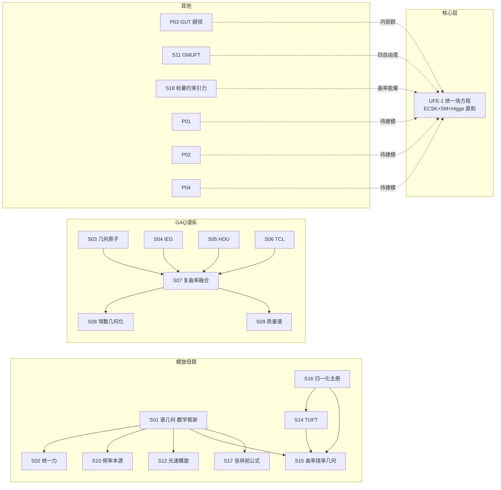

# 统一场论理论体系总览总结（openuft）

> **仓库**：[AI科技星 · 全球统一场论开放研究](../README.md) ｜ 数据口径：[体系分类](../01_独立体系/TYPE_INDEX.md)、[体系编号索引](../01_独立体系/体系编号索引.md)、[状态看板](状态看板.md)、[system_registry.json](../00_项目治理/system_registry.json)
>
> **红线声明（先于一切结论）**：目录完整、来源已核对、代码可运行、数学恒等式已验证，**都不表示任何统一场论已经成立**。
> 22 个研究模块当前**零个**进入 `validated`；18 个 `unreviewed` + 4 个 `unformulated`。
> 需要明确区分两件事：**架构统一**（统一体系层已完成，即所有体系可在同一组问题上对照）与**物理统一**（尚未达成）。
> 建立统一层不意味着任何一个统一场论成立，也不提升任何体系的证据等级；已登记为证伪的结论照旧为证伪。
>
> **口径说明**：本文内所有仓库路径均为 openuft 仓库根相对路径（以 `01_独立体系/`、`04_公共成果/` 等开头），不构成 Markdown 链接，
> 供人工回溯；机器可读身份以 `00_项目治理/system_registry.json` 为准，健康度以 `04_公共成果/状态看板.md` 为准，
> 证据以各体系 `claims.csv` 为准，三者冲突时以 claims.csv + 状态看板为准并在条目中注明。

---

## 一、一句话总览

| 维度 | 数值 | 说明 |
|---|---|---|
| 模块总数 | 22（18 个 S 体系 + 4 个 P 方向） | `01_独立体系/体系编号索引.md` |
| 进入 validated | **0** | 全仓库红线口径 |
| 工作状态 | 18 unreviewed + 4 unformulated（看板口径；s18 注册表状态为 `active`） | `04_公共成果/状态看板.md` |
| 健康度分布 | **C 6 · O 10 · H 2 · U 4** | s13 为唯一健康候选；s14 计入 C |
| 核心理论层 | UFE-1（`07_统一场方程/00_统一场方程.md`） | 四力同方程、现有精度未证伪；物理统一未达成 |
| 完成度机器验收 | 22 体系 × 8 判据 = 176 格，**满足全部 8 条判据的体系 = 0 个** | `04_公共成果/全维全体系统一场论/判定_统一场论全域验收矩阵与最小闭合集_2026-10-08.md` |

### 模块分类一览（按 `01_独立体系/TYPE_INDEX.md`）

| 类型 | 数量 | 模块 |
|---|---|---|
| 数学框架 | 1 | S01 |
| 物理理论候选 | 12 | S02、S03、S04、S05、S06、S10、S12、S13、S14、S15、S17、S18 |
| 待完备理论框架 | 3 | P03、S11、S16 |
| 组合候选 | 1 | S07 |
| 扩展分支 | 2 | S08、S09 |
| 待建模方向 | 3 | P01、P02、P04 |

---

## 二、核心理论层：UFE-1 统一场方程

### UFE-1 统一场方程（核心理论层，`07_统一场方程/`）

**定位与诚实声明。** UFE-1 的实质是 Einstein–Cartan（ECSK）引力 + $SU(3)_C\times SU(2)_L\times U(1)_Y$ 规范场 + Higgs 场 + Dirac 物质场，以单一总联络 $\mathcal A$ 上的单一曲率 $\mathcal F=d\mathcal A+\mathcal A\wedge\mathcal A$ 表述。四力不是四个并列项，而是同一几何对象 $\mathcal F$ 在李代数直和 $\mathfrak{so}(1,3)\oplus\mathfrak{su}(3)_C\oplus\mathfrak{su}(2)_L\oplus\mathfrak{u}(1)_Y$ 四个因子上的分量；分解的完备性由李代数直和保证，不存在"漏掉某种力"的自由度。必须原样引用主方程文件的声明：**「本文件不构成『统一场论已经完成』的声明。它构成『四种力可写入同一个方程，且该方程在现有精度下未被证伪』的声明。」**（来源：`07_统一场方程/00_统一场方程.md` §0）

**主方程。** 令全部动力学场 $\Phi=(e^a,\mathcal A,H,\Psi)$，UFE-1 写作 $\delta S/\delta\Phi=0$（来源：`00_统一场方程.md` §2.1）。作用量 $S[\Phi]$ 由 Palatini 引力项、三项 Yang–Mills 项、Higgs 动能与势项、Dirac 动能与 Yukawa 项构成。引力对 vierbein $e$ 变分、规范对 $\mathcal A$ 变分，可合并为一条曲率方程 $\star D_{\mathcal A}\!\star\mathcal F=\mathcal J$，其中 $\mathcal J\equiv\delta S_{\rm matter}/\delta\mathcal A$——这一行同时是 Einstein–Cartan 方程、Yang–Mills 方程与 Maxwell 方程，区别只在取 $\mathfrak g$ 的哪个分量（来源：`00_统一场方程.md` §2.2）。齐次方程为统一比安基恒等式 $D_{\mathcal A}\mathcal F\equiv0$，即麦克斯韦齐次方程组、Yang–Mills 齐次方程与引力第二比安基恒等式的共同几何本源（来源：`00_统一场方程.md` §2.3 定理 1）。

**结构定理 T1–T8 状态表。**

| 编号 | 命题 | 状态 | 出处 |
|---|---|---|---|
| T1 | $D_{\mathcal A}\mathcal F=0$（统一比安基恒等式） | **已证明**（定理 1，逐项相消） | `00_统一场方程.md` §2.3 |
| T2 | 四种力 = $\mathcal F$ 在 $\mathfrak g$ 直和因子上的分量 | **已证明**（李代数直和分解，$[\mathfrak{so}(1,3),\mathfrak g_{\rm int}]=0$） | `00_统一场方程.md` §1 |
| T3 | 规范群反常完全消除（5 个系数精确为 0） | **已验证**（精确有理数算术，非浮点） | `验证脚本/验证报告.md` A1.1–A1.5 |
| T4 | 作用量每一项质量量纲为 4 | **已验证**（16 项全 PASS） | `验证脚本/验证报告.md` A2.1–A2.16 |
| T5 | $\rho=1$（树级 custodial 关系） | **已推导**，实验一致（PDG $\rho_0=1.00038\pm0.00020$） | `验证脚本/验证报告.md` E3.2；`00_统一场方程.md` §4.1 |
| T6 | 牛顿极限 $\nabla^2\Phi=4\pi G\rho$ | **已推导** | `05_经典极限与现象推导.md`；`验证脚本/验证报告.md` C1–C3 |
| T7 | 单圈下 SM 三耦合**不**精确统一 | **已验证（否定性结果）** | `验证脚本/验证报告.md` R1.1/R1.2；`09_已知局限与否定清单.md` L10 |
| T8 | 引力未量子化；UFE-1 在 $M_{\rm Pl}$ 失效 | **已知局限，非缺陷声明** | `09_已知局限与否定清单.md` L9 |

**已做到（定量检验通过项）。** 经典 GR 极限：水星近日点进动 $42.982$ arcsec/世纪（PASS）、太阳光线偏折 $1.75124$ arcsec（PASS）、Schwarzschild 半径 $2.953$ km（PASS）、GW150914 辐射能量 $5.54\times10^{47}$ J（PASS）（来源：`验证脚本/验证报告.md` C2–C5）。树级电弱精度：Higgs vev $v=246.22$ GeV（E1 PASS）、$g_2=0.6529$（E2.1 PASS）、$\sin^2\theta_W=0.2231$（E3.1 PASS）、$\rho=1$ 恒等（E3.2 PASS）、$\lambda=0.1294$（E4 PASS）、顶夸克领头项 $\Delta\rho=0.00935$（E5.1 PASS）、由 $G_F,\alpha,m_Z,m_t$ 四独立测量算出 $m_W=80.409$ GeV vs 实测 $80.377$ GeV（偏差 $0.04\%$，E5.3 PASS，非拟合）。反常消除 5 系数精确为 0（A1 全 PASS，精确有理数）；作用量量纲 4（A2 全 PASS）；每代电荷代数和为 0（A3.1 PASS）；渐近自由 $\beta_3=7.667>0$（R2.1 PASS）；$\alpha_s(200\text{ GeV})$ 演化预测（R2.2 PASS）；光子无质量由 $U(1)_{\rm em}$ 残留规范对称保护（`00_统一场方程.md` §4.2，实验上限 $m_\gamma<10^{-18}$ eV）。

**未做到（如实）。** 引力未量子化，作为 EFT 在 $E\sim M_{\rm Pl}=1.22\times10^{19}$ GeV 处失效（T8/L9）；Yukawa 耦合与味混合角是**输入参数**（26 个，19 SM 内核 + 7 中微子扇区），非推导结果（L3/N3）；层级问题 $M_{\rm Pl}/M_Z\sim1.3\times10^{17}$ 无机制约束（L4）；宇宙学常数 $\Lambda$ 数值不在 v1（L7）；暗物质/暗能量无候选者（L8）；强 CP、为什么恰好 3 代、重子生成均无解释（L5/L6/L13）；T7 单圈下 SM 三耦合不精确统一（散布 3.66 vs MSSM 对照 0.049），已登记为否定性结果（R1.1/R1.2）。中微子质量已于 2026-09-19 通过纳入 $3\nu_R$ 修复（N1 FAIL→PASS），代价是参数 19→26、$y_\nu\sim3\times10^{-13}$ 的极小性未解（L1）。

**与各体系的关系。** S01 三重奏恒等式 $\kappa^2+\tau^2=(\omega/c)^2$ 以 mpmath 200 位精度机器零验证入 `07_统一场方程/10_vc公理_曲率挠率频率_全维突破求导证明验证精算.md`（残差精确 0.0），作为几何基底归档，**不引入本体主张**——其动力学完备性（E4：拉氏量、规范自相互作用、重整化）仍开放。S11（GMUFT v2.1）θ 场拉格朗日与牛顿/库仑极限以 250 位精度代数恒等还原入同一 `10_` 文件（P5/P6，A级）。S14/S15 等"螺旋曲率-挠率"几何化体系与 UFE-1 的结构差异：UFE-1 是 ECSK+SM 的**直和**表述（$\mathfrak g$ 为四个独立李代数因子的直和，交叉对易子为零），而 S 系列是从单一光速螺旋运动出发试图将曲率 $\kappa$、挠率 $\tau$ 承载全部物理常数的**直积/几何纲领**草案；二者不是同一路线，按 openuft 评级口径独立审计，不合并（来源：`07_统一场方程/README.md` §2.1）。`10_`（v=c 公理几何精算，数学已证、动力学开放）与 `11_`（分支B 时空曲率–能量密度作用量自洽性审计，可行域 β=0+ℓ_min）是本目录下两个独立的辅助审计卷，各自有诚实边界，不升格为本体。

---

## 三、数学框架

### S01 螺旋三重奏与谱几何（编号：`s01_triad_kinematics`）

**类型**：数学框架 ｜ **工作状态**：unreviewed（注册表） ｜ **健康度**：H ｜ **公设版本**：triad-study-R1-R11

**本体/公设**：
- A1 螺旋参数化：研究对象为匀速螺旋轨迹，速度平方由半径与角频率决定；本体系是数学框架，不引入物理本体。`r(t)=(R cosωt, R sinωt, bt)；v²=R²ω²+b²`（`研究总报告.md` 第三部分 R4）
- A2 Frenet 条件性结构：曲率 κ、挠率 τ 作为空间曲线的 Frenet 不变量是数学设定，不构成物理本体公设。`κ=Rω²/v²，τ=ωb/v²`（`研究总报告.md` 第四部分 R9）
- A3 全维生成元推广：D 维多平面超螺旋由常斜对称生成元定义，满足 `r″=Ar′`；4 维单平面退化为 `κ²+τ²=(ω/v)²`。`Σκᵢ²=Σωⱼ²/v²=−tr(A²)/(2v²)`（`研究总报告.md` 第四部分 R5–R9）

**核心方程**：三重奏恒等式 `κ²+τ²=(ω/c)²`（v≡c 情形）。2026-09-29 核心恒等式已由 **200 位精度**验证并写入 `07_统一场方程/10_vc公理_曲率挠率频率_全维突破求导证明验证精算.md`。

**当前状态**：数学框架，**不自动引入统一场论本体**；claims.csv 无物理断言（空）；健康度 H（自洽、无硬冲突、无证伪登记，来源：`04_公共成果/状态看板.md`）。

**已验证**：
- 三重奏恒等式 L0 代数恒等全 PASS（`04_公共成果/本项目_全维自洽与归一化` 全维自洽审计；`04_公共成果/状态看板.md`）
- 核心恒等式 κ²+τ²=(ω/c)² 200 位精度数值验证（`07_统一场方程/10_` 验证脚本 `verify_vc_kappa_tau_omega.py` 与结果 `verify_vc_results.json`）

**已证伪**：无（claims.csv 为空）。

**OPEN**：
- 恒等式成立 ≠ 任何物理本体成立；κ²+τ² 与 (ω/c)² 的物理诠释未获认证。
- 「κ²+τ² 双身份」风险已在 S10 关联登记（M01/M02 谱系，见 `04_公共成果/状态看板.md` s10 行）。

**与 UFE-1 及其他体系的关系**：related_systems = `s12_light_speed_helix`, `s02_light_speed_helix_force`；螺旋母题源头（S02/S10/S12/S15/S17 均含 v≡c 或螺旋公设，但各自独立管理证据，数学结果不自动认证其物理公设）。与 UFE-1：UFE-1 的引力几何层（含挠率的 Einstein–Cartan）与其谱几何存在主题交叉，但 UFE-1 以规范场论为框架、不自称依赖三重奏本体；三重奏恒等式仅作为几何基石被引用（`07_统一场方程/10_`）。

---

## 四、物理理论候选（12）

### S02 空间光速螺旋统一力（编号：`s02_light_speed_helix_force`）

**类型**：物理理论候选 ｜ **工作状态**：unreviewed（`00_项目治理/system_registry.json`） ｜ **健康度**：C ｜ **公设版本**：D5-统一力方程

**本体/公设**：
- A1 统一动量：统一动量定义为质量乘以光速与速度之差。`P = m(c − v)`（`01_独立体系/S02_空间光速螺旋统一力/04_理论推导/D5_大统一力方程/README.md`）
- A2 统一力：力为统一动量对时间的全导数。`F = dP/dt`（同上）
- A3 电磁力比：电力与磁力之比由光速与速度之比给出。`F_e / F_m = c / v`（同上）
- A4 三重奏为几何基石：三重奏在匀速螺旋/梯度磁场下成立，作为统一力框架的几何基石；原文明确其**不是万有理论，不解释引力、不生成常数、不完成四力统一**。`κ² + τ² = (ω/v)²`（同上）

**核心方程**：`P = m(c − v)`、`F = dP/dt`（A1/A2）；圆偏振能流 `S = ε₀ c E₀² ẑ`（`04_理论推导/lightspeed_helix_poynting.py`）。

**当前状态**：unreviewed；健康度 **C**（已登记 1 条 falsified 冲突 claim `S02-C0001`，来源 `04_公共成果/状态看板.md` s02 行）。claims.csv 共 **14 条断言：verified 7 / falsified 7 / unreviewed 0**。攻破册（2026-10-07，条目7：PASS1/FAIL4/BOUNDARY2）：恢复 `F=+ma` 的三条自列出路中，甲/乙**可闭合但需未声明新公设**（`dc/dt=2a`、`dm/dt=2ma/(c−v)`，后者 `v→c` 奇异），出路丙**缺口未闭合**（拼接点 `v*=c/2` 被方程锁死、无适用域/过渡函数）。

**已验证**：
- `S02-C0002` 圆偏振能流纯轴向且严格以 c 传播（`|S⊥|=0`、`|S|/u=c`，偏差 6.0e-8 浮点截断；numerical_check）（`04_理论推导/lightspeed_helix_poynting.py`）
- `S02-C0003` 光子自旋由偏振椭圆度决定：圆偏振每光子 `=1.000000ℏ`，`SAM=σℏ` 逐位吻合（mathematical_result）（`04_理论推导/lightspeed_helix_spin.py`）
- `S02-C0004` 自由真空横波场方向曲线必平面 ⇒ `τ≡0` 严格，推广不变量 `⟨κ⟩·L=2π`（mathematical_result）（`04_理论推导/lightspeed_helix_polarization.py`）
- `S02-C0007/C0008/C0009` ：LG₀ₗ 真空涡旋场 `∇_μT^{μν}=0` 守恒、Darboux 矢量 `dω_D/ds=0`、耦合 `⟨J⟩=ℏ(l+s_z)√(κ²+τ²)`（mathematical+numerical）
- `S02-C0012` 共振条件解析判据 `κ²+τ²=k²` 且 `l+s_z≠0`（mathematical_result）

**已证伪**（falsified 集合原样保留，来源 `claims.csv` + `11_证伪与反例/`）：
- `S02-C0001`：统一动量 `P=m(c−v)` 在 `v=0` 给 `P=mc≠0`（电子 `2.73e-22 kg·m/s`），且 `m、c` 恒定时 `F=−ma` 与牛顿 `+ma` 反号；恢复 `+ma` 所需前提（c 的数学身份、`dm/dt` 项或低速退化）均未在公设中声明（falsified, mathematical_result；`11_证伪与反例/统一动量低速极限冲突记录.md`）
- `S02-C0005` / `S02-C0011`：`τ` 不是自由真空电磁场独立自旋观测量，「`τ↔`自旋投影」不成立；`θ=π/2` 纯扭转极限 `u_prop=0`
- `S02-C0006`：三重奏 `κ²+τ²=K²` **不普适**，仅圆偏振特例成立；一般椭圆偏振 `τ=0` 而 `κ` 非常数
- `S02-C0010`：§13 把 Frenet 随动标架当偏振基的方案破坏 Maxwell 方程与 Noether 守恒
- `S02-C0013` / `S02-C0014`：§16.7 四力 `f^μ=u_ν∇_αT^{αμ}` 不成立——真空 `∇_αT^{αμ}≡0` 故投影恒零；sympy 精确化简 `P^μ≡Q^μ`，其非零恰等于被丢弃的迹项；五条独立路径（R1–R5）复核无合法非零力（`04_理论推导/sec16_7_fourforce_audit.py`、`sec16_7_fourforce_audit_full.py`；`11_证伪与反例/§16.7_四力定义否证记录.md`）

**OPEN**：
- 低速极限 `F=−ma` 反号未在不新增公设下闭合；`v→c` 处 `dm/dt` 项奇异；相对论对照 `E=√2·mc²` 偏差 0.414。
- 「统一力」至今只在标准真空电磁（圆偏振/OAM 涡旋）层获得数值自洽；引力、强、弱三力无独立可证伪预言（原文自述不解释引力）。
- `τ` 的可观测量地位已被多次收窄为标架规范，三重奏不可外推到一般偏振。

**与 UFE-1 及其他体系的关系**：related_systems = `s01_triad_kinematics`、`s12_light_speed_helix`（S01 提供三重奏数学基石，S12 借用 `P=m(c−v)` 动力学）。与 UFE-1（`07_统一场方程`，ECSK 引力+SM 规范场+Higgs 直和 `so(1,3)⊕su(3)⊕su(2)⊕u(1)`）：S02 的 `P=m(c−v)/F=dP/dt` 是一条与 UFE-1 拉格朗日场论体系**平行的唯象动量定义**，二者不共享作用量；§16.7 审计恰证明由该能量-动量张量投影并不能在真空里切出合法四力。

### S03 GAQ 几何原子与作用量子（编号：`s03_gaq_geometric_atom`）

**类型**：物理理论候选 ｜ **工作状态**：unreviewed（注册表） ｜ **健康度**：O ｜ **公设版本**：v1-2026-07-29

**本体/公设**：
- A1 几何原子公理：时空由离散普朗克尺度几何元胞构成，每元胞具不可分三元结构。`元胞 = (L_p, T_p, ħ)`（`01_独立体系/S03_GAQ几何原子与作用量子/90_历史归档/几何原子_v1合集/几何原子_v1.md` A1）
- A2 作用量子化公理：闭合系统总作用量为 ħ 整数倍。`S = nħ, n∈ℕ`（同 A2）
- A3 曲率—能量对应公理：局域能量密度与黎曼标量曲率成正比，使 Einstein 场方程成为该公理的张量表达。`ρ_E = (c⁴/8πG) R`（同 A3）
- A4 几何速度公理：光速是元胞时空尺度比，而非独立常数。`c ≡ L_p / T_p`（同 A4）
- A5 信息—质量统一公理：质量是系统所含元胞数（无量纲信息容量）的度量；普朗克质量由几何恒等式定义。`M = M_p N, M_p ≡ ħ/(c L_p)`（同 A5）

**核心方程**：`ρ_E = (c⁴/8πG) R`（A3）；`M = M_p N`（A5）。

**当前状态**：unreviewed；健康度 **O**（看板：M02 普朗克锚定谱系母体；A5/T1 同义反复 L0、A4 概念循环 L1）。claims.csv 共 **89 行：verified 0 / falsified 46 / open(未审查) 36 / corrected 7**。**口径差异须注明**：① claims.csv 自身存在编号空间冲突（`S03-C0045`–`C0053` 跨两册重复使用，见 `S03-C0060`/`C0073`）；② 虽登记 46 条 status=falsified 专题判决，看板仍按归一化引擎判 **O（欠定/概念循环）而非 C**——C/O 边界由 `体系健康度归一化总览.py` 治理，本文不擅改级；③ 所有 PASS 型读数均自标「工具校准/标准事实复算，不构成 GAQ 正面证据」，故 verified 严格为 0。

**已验证**：
- 无严格物理 verified。仅工具校准/标准事实复算：CKM Chau-Keung 幺正性偏差 `2.22e-16`、Jarlskog `|J|=3.145e-5`（`S03-C0045`，open/非正面证据）；F-S 解析式、Bishop 平行传输、PMNS 幺正性复算（`S03-C0061`）。

**已证伪**（46 条 status=falsified，按族归纳，全表见 `01_独立体系/S03_GAQ几何原子与作用量子/claims.csv`）：
- W 不可自由传播与对撞机 1983 年起直接观测冲突（`C0003`；跨 `q²` 标度传播子反解升级为定量判决 `C0050`；衰变长度分层 `C0067`）
- 内部扭结数族 F1 由「不可证伪」（`C0016`）升级为标准纽结不变量 8 组合无解（`C0019`）；质量不可归结为结不变量（`C0021`）、unknotting 数不能作粒子标签（`C0022`）、双自由度仍欠定不可证伪（`C0023`）
- 量纲封锁：纯几何量 `{κ,τ,Ω,c}` 质量分量恒为 0，ħ 不可能由纯几何导出（`C0025`）；11 组可行解全部依赖外加尺度初值（`C0027`）；拓扑内禀质量无质量量纲（`C0041`、相变能量侧不可算 `C0087`）
- 色荷/非阿贝尔规范无来源：体系最大离散群仅 Z₂（`C0029`）、SU(3) 六项代数要求无一满足（`C0030`）、Z₂ 禁闭标度与 QCD 矛盾（`C0031`）、κ/τ 为标量场量无规范场强（`C0032`）、加法型 Z₃ 不自洽（`C0033`）
- F-S 投影守恒变量槽位错位致 `α=1.272` 而非 1/137（`C0037`）；`v⊥/v∥=α` 被加速器数据否证（`C0038`）；光子「`E∝∫τds` 且 `k=B`」两断言互斥（`C0039`、文本矛盾 `C0043`）
- 孤子相变守恒律为一维连续族、单条数据不可判决（`C0082`/`C0085`/`C0086`）；β 衰变本体：核内电子被不确定性原理否证（`C0064`）、轻子数无拓扑来源（`C0065`）、与 V-A/螺旋度实测冲突（`C0066`）、流管断裂分类失效（`C0068`）、局域重联与长寿命尺度不自洽（`C0069`）、隧穿叙事零预测力（`C0070`）、无 Fermi/GT 微分观测量（`C0071`）、分数电荷无拓扑来源（`C0072`）
- 分支 B-1：holonomy 对开路无定义（`C0054`）、离散标签容量仅 1 bit 缺 0.585 bit（`C0055`）、Bishop 加框一般不闭合（`C0056`）、连续量入标签即恒可拟合（`C0057`）
- 电荷作为拓扑通量不变量：电荷非 `∮A·dl` 函数（`C0074`）、量纲缺阻抗须外加 Z₀（`C0075`）、拓扑守恒与 1/r 衰减二难（`C0076`）、Maxwell 还原形式缺陷（`C0077`）、o-Ps→3γ 与 C 宇称实测冲突（`C0078`）、电荷量子化三条独立否证（`C0079`）

**OPEN**：
- 质量标度无第一性锚：`Gm²=ħc` 唯一解为 `m=m_P`，与电子质量差 `2.39e22` 倍（`C0024`，M02）；ħ 已由「待导出」改判为「须显式承担的外加标度」（`C0028`）。
- 自旋统计、CP 相位、代连续混合角、分数电荷、色规范场强在现有基元量集合内均无来源；任何推进须显式登记为公设增广而非推导补全（`C0034`/`C0053`/`C0080`）。

**与 UFE-1 及其他体系的关系**：related_systems = `s07_gaq_complex_curvature`、`s08_gaq_geometrized_constants`、`s09_gaq_mass_spectrum`（GAQ 谱系母体）。与 UFE-1：S03 的 A3 把 Einstein 方程当作「曲率—能量对应」的张量表达，与 UFE-1 的 Einstein 几何层同源；但 S03 至今未产出任何进入 UFE-1 规范作用量的可证伪输入，大量否证集中在「几何量能否承载规范荷/质量谱」这一上游问题。

### S04 IEG 信息熵引力（编号：`s04_ieg_information_gravity`）

**类型**：物理理论候选 ｜ **工作状态**：unreviewed（注册表） ｜ **健康度**：O ｜ **公设版本**：GAQ-v3

**本体/公设**：
- A1 信息—引力等价：Einstein 场方程等价于几何信息熵的最大变分原理，信息流散度为零。`G_{μν}+Λg_{μν}=8πG T_{μν} ⟺ ∇^μ J^{info}_{μν}=0`（`01_独立体系/S04_IEG信息熵引力/02_基础公设/source_chapter.md` 定理 I1）
- A2 几何信息场：存在归一化几何信息场 `ρ_info`，其梯度定义信息密度与信息流。`∫ρ_info √−g d⁴x = 1`（同 定义 1）
- A3 引力即信息过剩：物质产生信息过剩，引力场是信息趋于均匀的梯度流；黑洞为信息饱和态（Bekenstein-Hawking 熵 = 最大信息熵）。`∇²φ = 4πGρ_M − ρ_info^excess`（同 预言 I4）

**核心方程**：定理 I1 等价式（A1）；IEG 作用量 `S_IEG = ∫√−g [R/16πG − ½(∇ρ_info)²]`（定理 I2）。

**当前状态**：unreviewed；健康度 **O**（看板：Einstein 方程重述 L1，无独立预言）。claims.csv **为空（0 条断言，0 verified / 0 falsified / 0 unreviewed）**。

**已验证**：
- claims.csv 无登记。原文定理 I1 的证明仅用 Bianchi 恒等式 `∇^μG_{μν}=0` 与能量守恒 `∇^μT_{μν}=0`（`source_chapter.md` §1.3）——即与 Einstein 方程的等价是恒等式层面的重述，不构成独立物理验证。

**已证伪**：无（claims.csv 为空）。

**OPEN**：
- I1 由 Bianchi + 能量守恒直接推出，是 Einstein 方程的同义改写，无独立动力学自由度；`ρ_info=const` 时 I2 精确退化为标准 GR，非常数时多出的 `∇_μρ_info∇_νρ_info` 项无观测约束。
- 「黑洞=信息饱和态」是 Bekenstein-Hawking 熵的信息诠释重述，未给出新的黑洞量子数；无暗能量/宇宙学常数数值预言。

**与 UFE-1 及其他体系的关系**：related_systems = `s07_gaq_complex_curvature`、`s05_hdu_higher_dimensions`。与 UFE-1：IEG 的引力侧就是 UFE-1 中 `R/2κ` Einstein–Hilbert 项（含挠率扩展到 ECSK）的信息论重新诠释，二者在引力方程上几乎逐字重合；IEG 未引入规范场，不触及 UFE-1 的 `su(3)⊕su(2)⊕u(1)` 部分。

### S05 HDU 高维紧致化统一（编号：`s05_hdu_higher_dimensions`）

**类型**：物理理论候选 ｜ **工作状态**：unreviewed（注册表） ｜ **健康度**：O ｜ **公设版本**：GAQ-v3

**本体/公设**：
- A1 11 维主公理：GAQ-UFT 四公理可嵌入 11 维 M 理论，11 维普朗克尺度由主恒等式约束。`M₁₁ c L₁₁ = ħ·2π`（`01_独立体系/S05_HDU高维紧致化统一/02_基础公设/source_chapter.md` 公理 H1）
- A2 S¹ 紧致化投影：4 维普适恒等式是 11 维主恒等式经 S¹ 紧致化的投影。`R₁₁ = (ħG/c³)^{1/2} = L_p`（修复后；同 定理 H2/H5）
- A3 AdS/CFT 实现：4 维时空是 AdS₁₁ 的共形边界，体为 11 维超引力、边界为 4 维 CFT（标准模型）。`M₄ = ∂(AdS₁₁)`（同 推论 H6）

**核心方程**：`R₁₁=(ħG/c³)^{1/2}=L_p=1.616255e-35 m`（修复后 H2）；`M₁₁ = M_p·(2π)^{1/3}=2.252872e19 GeV/c²`（修复后 H3）。

**当前状态**：unreviewed；健康度 **O**。claims.csv 共 **2 条：verified 0 / falsified 0 / unreviewed 0；repaired（已修复）2**。原冲突 claim 已由 `falsified` 改为 `repaired`，据 2026-09-18 复跑由 C 降为 O（`04_公共成果/状态看板.md` s05 行）。

**已验证**：
- `S05-C0001`（repaired）：H2 紧致化半径修正为 `R₁₁=(ħG/c³)^{1/2}=L_p`，量纲 [L] 正确（Decimal 50 位精算）（`02_基础公设/postulates.md` §2；`11_证伪与反例/HDU紧致化半径公式缺陷记录.md`）
- `S05-C0002`（repaired）：H3 主质量更正为 `M₁₁=M_p(2π)^{1/3}=2.252872e19 GeV/c²`，公式形式正确。

**已证伪**：无现存 `falsified` 条目。**修复史如实保留**——原 H2 公式 `R₁₁=(ħ/2π)^{1/3}(G/c²)^{1/3}` 量纲 `L·T^(−1/3)` 错误且数值偏约 `1.4e14` 倍；原 H3 声称 `M₁₁=3.18e19 GeV` 比正确值偏大 1.41 倍（2026-09-16 精算修复）。

**OPEN**：
- 11 维→4 维的紧致化无动力学（S¹ 半径被直接设为 `L_p`，非导出）；`M₄=∂AdS₁₁` 的 AdS/CFT 对应是借用标准框架，非本体系第一性生成。
- 未由高维投影给出任何 4 维规范耦合、质量谱或宇宙学常数的独立数值。

**与 UFE-1 及其他体系的关系**：related_systems = `s04_ieg_information_gravity`、`s07_gaq_complex_curvature`。与 UFE-1：HDU 试图把 UFE-1 的 4 维 ECSK+SM 直和体系「嵌入」11 维 M 理论边界，但目前仅为公设性嵌入，未导出 UFE-1 任一规范群或耦合，高维数学自洽不代表低维物理成立。

### S06 TCL 拓扑手征锁定（编号：`s06_tcl_topological_chirality`）

**类型**：物理理论候选 ｜ **工作状态**：unreviewed（注册表） ｜ **健康度**：O ｜ **公设版本**：GAQ-v3

**本体/公设**：
- A1 Cl(4,4) 边界态分类：三代费米子是 Cl(4,4) 对称空间的边界态（edge modes）。`Cl(4,4)⊗ℂ ≅ M₁₆(ℂ)`（修复后，dim=256；`01_独立体系/S06_TCL拓扑手征锁定/02_基础公设/source_chapter.md` 定义 4）
- A2 代—手征拓扑分类：边界态由 `π₃(SU(3))×ℤ₂^chiral` 分类。`π₃(SU(3))=ℤ→n∈{0,1,−1}`；`ℤ₂^chiral→2 手征`（同 定理 T1）
- A3 中微子质量来自隧穿：中微子质量是边界态隧穿耦合，振荡即边界态间隧穿。`m_ν = m_boundary·e^(−L₃/ξ)`（同 定理 T2/T3）

**核心方程**：`Cl(4,4)⊗ℂ ≅ M₁₆(ℂ)`（dim 256，修复后）；`π₃(SU(3))×ℤ₂^chiral` 分类标签。

**当前状态**：unreviewed；健康度 **O**。claims.csv 共 **3 条：verified 0 / falsified 0 / unreviewed 0；repaired 3**。原冲突 claim 已由 `falsified` 改为 `repaired`，2026-09-18 复跑降为 O（看板 s06 行）。

**已验证**：
- `S06-C0003`（repaired，机器审计 `s06_chirality_count_audit.py`）：SM 单代左手 Weyl 实数 15 个（`Q_L6+u^c3+d^c3+L_L2+e^c1`，`ΣY=ΣY³=0` PASS）、三代 45。

**已证伪**：无现存 `falsified` 条目。**修复史如实保留**——原 `Cl(4,4)⊗ℂ ≅ M₈(ℂ)⊕M₈(ℂ)`（dim 128）同构错误，且维数在 32/128/256 间自相矛盾，已求导修复为 `≅M₁₆(ℂ)`、dim 256（`11_证伪与反例/TCL代数维数错误记录.md`）；边界态计数 6 / 12 / 36 互斥（与 SM 15/代、45/代不符）已整体降级为 conjecture（`11_证伪与反例/边界态计数矛盾记录.md`）。

**OPEN**：
- `π₃(SU(3))=ℤ` 截断 `{0,1,−1}` 无机制产生恰好三代；标签数 6（3 代×2 手征）≠ 单代 15 个 Weyl 自由度，代/手征计数与代数维数 256 相互独立。
- `m_ν=m_boundary·e^(−L₃/ξ)` 无独立可检验质量预言；CP 破坏相在现有实数基元量内无来源（与 S03-C0048 同向）。

**与 UFE-1 及其他体系的关系**：related_systems = `s07_gaq_complex_curvature`、`s09_gaq_mass_spectrum`。与 UFE-1：TCL 试图为 UFE-1/SM 的代结构与手征费米子内容提供拓扑分类，但目前停留在标签层，未把边界态动力学写入 UFE-1 的 Yang-Mills/Dirac 作用量。

### S10 频率本源与复螺旋宇宙（编号：`s10_frequency_helix_ontology`）

**类型**：物理理论候选 ｜ **工作状态**：unreviewed（`system_registry.json`） ｜ **健康度**：C ｜ **公设版本**：original-2026

**本体/公设**：
- A1 存在原理（振动本体）：宇宙由振动构成，一切运动的极限速度为光速 $c$；本体系以频率 $\omega$ 为第一物理量，螺旋是振动的轨迹（$v\le c$，为极限速度而非恒等约束）。（`13_论文与成果/论文正文/频率螺旋_原著.md` 总序 三条原理 1）
- A2 量子原理：振动以作用量子 $\hbar$ 为最小单元离散存在。（同上 三条原理 2）
- A3 几何原理（复曲率）：振动轨迹是复曲率螺旋；频率定时间，曲率定质量与引力，挠率定电荷与电磁。$\Xi=\kappa+i\tau$，派生 $m=\hbar\sqrt{\kappa^2+\tau^2}/c$、$\alpha=\tau/\kappa$、$G=c^3/(\hbar(\kappa^2+\tau^2))$。（同上 三条原理 3；核心宣言）

**核心方程**：$m=\hbar\sqrt{\kappa^2+\tau^2}/c$、$G=c^3/(\hbar(\kappa^2+\tau^2))$（A3 派生）；暗能量视界截断 $\rho_{\rm DE}=\rho_{\rm vac}(\ell_P/R_H)^2$、$\Lambda=8\pi G\rho_{\rm DE}/c^2$（`claims.csv` C0002，`03_跨体系研究/物理领域/暗能量/verify_dark_energy_wz_breakthrough.py#DE1`）。

**当前状态**：unreviewed；健康度 **C**（已登记 falsified 冲突 claim S10-C0001，来源 `状态看板.md` s10 行）。claims.csv 共 4 条断言：verified 3（C0002/C0003/C0004）/ falsified 1（C0001）/ unreviewed 0。攻破册（2026-10-08，条目 5：PASS1/FAIL2/BOUNDARY2）判定核心 C0002「$\Lambda$ 第一性推导」=**借用量对撞**——推导侧 $\rho_{\rm eff}=\rho_{\rm vac}(\ell_P/R_H)^2$ 与校验侧 $\rho_{\rm obs}=\Omega_\Lambda\,3H_0^2/(8\pi G)$ 两侧共用实测 $H_0$，幂次相消（$H_0\times10$ 或 $\times0.1$ 时 ratio 恒为 12.23）⟹ $\Lambda$ 系观测回算，「压制 $10^{120}$ 微调」为构造结果；$w=-1$ 系 $\Lambda$CDM 定义性结果。**三条 verified 的第一性属性不成立（待 registry 流程裁定）**。

**已验证**（均为数学/数值级，不构成物理预言成立）：
- `S10-C0002`：螺旋真空能视界截断给出 $\rho_{\rm DE(eff)}=7.1470\times10^{-26}\,\mathrm{kg/m^3}$、$\Lambda=1.334\times10^{-51}\,\mathrm{m^{-2}}$（观测 $\Lambda=1.091\times10^{-52}$），有效/观测比 12.23 为 O(1) 量级（mathematical_result, verified；攻破审计已降级其「第一性」属性）。
- `S10-C0003`：主预言 $w(z)=-1$，与 Planck 2018 $w=-1.028\pm0.032$ 差 $0.875\sigma$（1σ 内）；与 DESI+Planck+SN 组合偏差约 2.2σ（诚实边界；observational_check, verified）。
- `S10-C0004`：事件视界截断动力学扩展给出可证伪备选 $w_0=-0.8851$、$w_a=+0.2308$，距 Planck/DESI 2024 w0wa 均在 1σ 外（mathematical_result, verified）。

**已证伪**（falsified 集合原样保留，来源 `claims.csv`）：
- `S10-C0001`：派生关系 $G=c^3/(\hbar(\kappa^2+\tau^2))$ 与 $m=\hbar\sqrt{\kappa^2+\tau^2}/c$ 联立推出 $Gm^2=\hbar c$ 即 $m=m_P$ 唯一解；电子锚点下该式给出 $\hbar c/m_e^2=3.81\times10^{34}$，与实测 $G$ 差 $5.71\times10^{44}$ 倍（约 44 个数量级），而普朗克锚点残差仅 $1.84\times10^{-81}$（引擎 D06 FAIL / D07 PASS 同式双锚点对照；`11_证伪与反例/普朗克锚定谬误冲突记录.md`）。

**OPEN**：
- 三条 verified claim 的「第一性」属性待 registry 流程裁定；$\Lambda$ 数值无体系给出定量（状态看板第四节）。
- $w_0/w_a$ 备选路径与现测数据偏差约 2.2σ，留待 DESI Y5/Euclid/Rubin 下一代巡天裁决。
- $\kappa^2+\tau^2$ 双身份风险（M01/M02 谱系）未消解。

**与 UFE-1 及其他体系的关系**：related_systems = `s01_triad_kinematics`, `s12_light_speed_helix`。与 S01（三重奏母题）、S12（光速螺旋）同属螺旋-曲率-挠率家族。与 UFE-1：S10 的 $\kappa/\tau$ 派生 $m,\alpha,G$ 与 UFE-1 的 ECSK 挠率扇区主题交叉，但 UFE-1 不把 $m/\alpha/G$ 视为 $\kappa\tau$ 导出量；其暗能量 $w(z)$ 预言未接入 UFE-1 的 FLRW 背景，攻破总账⑧将其定性为「$\Lambda$=全息截断重述、$w=-1$ 琐碎」。

### S12 空间光速螺旋统一体系（编号：`s12_light_speed_helix`）

**类型**：物理理论候选 ｜ **工作状态**：unreviewed（`system_registry.json`） ｜ **健康度**：C ｜ **公设版本**：v6.0-20260906

**本体/公设**：
- A1 垂直原理：空间任意一点运动方向瞬时垂直于位置矢量，$\mathbf r(t)\cdot\mathbf v(t)=0$；空间本身以光速运动。（`13_论文与成果/论文正文/终极报告系列/v6_20260906_FINAL.md` 第 1.1 节 公理 1）
- A2 光速约束：基本粒子内部运动速度恒为光速，$v^2=R^2\omega^2+b^2\equiv c^2$；静止质量与螺旋半径成反比 $m_0\propto 1/R$，$p_0=m_0c$。（同上 公理 2）
- A3 螺旋参数化：内部运动为光速螺旋 $r(t)=(R\cos\omega t,R\sin\omega t,bt)$，$b=\pm\sqrt{c^2-R^2\omega^2}$，受 $R\omega\le c$ 约束。（同上 公理 3）
- A4 统一力方程（**借用**自 S02）：$P=m(c-v)$、$F=dP/dt$，四力由 $c\,dm/dt$、$-v\,dm/dt$、$m\,dc/dt$、$-m\,dv/dt$ 四项分解；借用不使该假设在本体系获得独立证据。（同上 第 2.1 节；origin=`borrowed:s02`）

**核心方程**：$v^2=R^2\omega^2+b^2\equiv c^2$（A2）；统一动量/力 $P=m(c-v)$、$F=dP/dt$（A4 借用）；三重奏 $\kappa^2+\tau^2=(\omega/c)^2$（$\kappa=R\omega^2/c^2$、$\tau=b\omega/c^2$，C0001）。出处：`v6_20260906_FINAL.md`。

**当前状态**：unreviewed；健康度 **C**（已登记 falsified 冲突 claim S12-C0006；`状态看板.md` s12 行）。claims.csv 共 6 条断言：verified 0 / falsified 1（C0006）/ unreviewed 2（C0001/C0004）/ unreproduced 3（C0002/C0003/C0005）。攻破册（2026-10-07，条目 5：PASS1/FAIL3/BOUNDARY1）判定**本体自毁**——A2 要求 $v\equiv c$，代入借用 A4 得 $P\equiv0$、$F\equiv0$ ⇒ 四力皆零（比 S02 低速反号再加一层）；黑洞熵系数口径不可复现（精确 $\ln2/\pi\approx0.2206$ vs 声称差 0.882 倍）；$\eta\approx10^{-26}$ 系为消除矛盾而自认引入的辅助假设、零预测力。

**已验证**（无 verified 断言；以下为代数/未复算登记）：
- 无 verified claim。C0001 三重奏恒等式在本仓库无独立复现（恒等性质使其为代数结果）；C0002 电子自旋 $R=\hbar/(2m_ec)$、C0003 交变场引力振荡、C0005 黑洞熵差 0.882 倍均为 unreproduced（原文数值未在本仓库复算）。

**已证伪**（falsified 集合原样保留，来源 `claims.csv`）：
- `S12-C0006`：借用项 S12-A4（$P=m(c-v)$）低速极限冲突——$v=0$ 时 $P=mc\ne0$、$F=dP/dt=-ma$ 与牛顿反号；又因本体 A2 要求 $v\equiv c$，若 $v$ 指内部速度则 $P\equiv0$ 且 $F\equiv0$，与四力分解初衷冲突，本体与借用动力学的接口未定义（引擎 M03；`11_证伪与反例/统一动量低速极限冲突记录.md`）。

**OPEN**：
- 本体 $v\equiv c$ 与借用动力学 $P=m(c-v)$ 的接口未定义；无 GR 极限（攻破总账定性「无 GR 极限」）。
- 黑洞熵 $S\propto A$ 与 Bekenstein–Hawking 系数差 0.882 倍未闭合；$\eta\approx10^{-26}$ 三因子分解为量级估计、无推导。
- 交变电磁场产生引力场振荡（效率因子 $\eta\approx10^{-26}$）无实验 run 记录、零预测力。

**与 UFE-1 及其他体系的关系**：related_systems = `s01_triad_kinematics`, `s02_light_speed_helix_force`, `s10_frequency_helix_ontology`。与 S01（三重奏母题）、S02（统一力方程来源）、S10（频率-螺旋本体）同家族。与 UFE-1：S12 的三重奏 $\kappa^2+\tau^2=(\omega/c)^2$ 与 UFE-1 `10_vc公理_曲率挠率频率_全维突破求导证明验证精算.md` 的几何基石主题一致，但 UFE-1 以 ECSK+SM 直和为场方程本体、不采用 $P=m(c-v)$ 动力学；S12 的四力分解在本体 $v\equiv c$ 下退化为零，与 UFE-1 的规范场输入无可比接口。

### S13 全域双向分形统一场论（编号：`s13_duality_fractal_uft`）

**类型**：物理理论候选（candidate_theory） ｜ **工作状态**：unreviewed（`system_registry.json`） ｜ **健康度**：H（本批唯一健康候选，含攻破注解） ｜ **公设版本**：v1.2-20260911

**本体/公设**：
- A1 对偶公理：世界由不可再分基元 0 与 1（阴/阳）张成，任意物理量以对偶对 $(a,\bar a)$ 存在，对偶变换 $D$ 满足 $D^2=1$。（`02_基础公设/postulates.md` §1）
- A2 守恒公理：基本拓扑荷为整数、最小单位 $\pm1$、任何物理过程严格守恒，$Q\in\mathbb Z$、$\min|Q|=1$。（同上 §2）
- A3 自相似公理：宇宙在一切尺度上双向分形、无尺度断点只有重整化不动点，$\beta(-g)=-\beta(g)$，不动点 $g^*=\pm\sqrt{\varepsilon/c}$。（同上 §3）

**核心方程**（六方程闭环 M1–M6 骨架，`12_研究结论/理论总纲_V1.7.md`；`09_验证结果/验证精算报告_V1.2.md`）：旋量对偶方程 $\sigma^\mu\partial_\mu\Psi=\lambda\Theta\Psi^*$；霍普夫拓扑荷 $Q_H=(1/4\pi^2)\int\epsilon^{ijk}a_i\partial_j a_k\in\mathbb Z$；双向 $\beta$ 流 $\beta(-g)=-\beta(g)$；对偶镜像度规 $g^{\rm eff}(r)=1-r_s r/(r^2+\ell^2)$；真空约束 $|\Psi|^2=v^2$（对偶旋量即希格斯对偶）。

**当前状态**：unreviewed；健康度 **H**（自洽、无硬冲突、falsified 集合仅 C0005 一条且已升维修复；`状态看板.md` s13 行）。claims.csv 共 6 条断言：verified 4（C0001–C0004，数学/数值级）/ falsified 1（C0005）/ unreviewed 1（C0006）。**红线注解**：2026-10-07 两轮攻破审计（5 项）判定其「涌现」=教科书重述+选择性建模、**零第一性预测**——锚点 $s^*=0.230943405$ 为 MSSM 借用（三公理未进入）、原创预言 $\sin^2\theta_W=1/4$ 跑动得 0.23639 差 $-5.45\%$ 为负面；审计维持 H 但补注，是否由 H 复核为 O 待注册表流程裁定（`04_公共成果/本项目_统一场论攻破/判定_S13_攻破审计_终局定位_2026-10-07.md`）。C0001–C0004 的 verified 属数学/数值级，**不构成物理预言成立**。

**已验证**（机器零恒等式，数学/数值级）：
- `S13-C0001`：流守恒——旋量对偶方程推出 $\partial_\mu J^\mu=0$（$J^\mu=\Psi^\dagger\sigma^\mu\Psi$）为代数恒等式，数值漂移 $2.1\times10^{-13}$（`09_验证结果/验证精算报告_V1.2.md` 实验一）。
- `S13-C0002`：曲率有界闭式——$g^{\rm eff}(r)=1-r_s r/(r^2+\ell^2)$ 的曲率上界 $|R|_{\max}=(3+2\sqrt2)GM/(2\ell^3)$，极值 $r=(\sqrt2\pm1)\ell$，解析 2.9142135624 vs 数值 2.9142135543（实验四）。
- `S13-C0003`：霍普夫荷整性——$Q_H\in\mathbb Z$（$\pi_3(S^2)=\mathbb Z$），标准映射收敛于 1、平方映射约 4，形变保护偏差约 $10^{-3}$（`13_论文与成果/书稿/正文/ch13-证明全集.md` 定理 13.3）。
- `S13-C0004`：希格斯谱——有效势 $V=\kappa(|\Psi|^2-v^2)^2$ 真空谱 $\{0,0,0,8\kappa v^2\}$（3 零模被 $W^\pm/Z$ 吃掉 + 1 径向模），三随机真空点复现（定理 13.7）。

**已证伪**（falsified 集合原样保留，修复史完整留存）：
- `S13-C0005`：1D 绕数拓扑荷不守恒——$Q=\oint dz/(2\pi i z)$ 在 $t\approx0.2$ 内 $1\to0$ 突变，根因 $\pi_1(S^2)=0$ 无拓扑保护（$\lambda=0$ 对照 $Q=0.998$ 恒定，排除数值误差）。**已由升维三件套修复**：改 3D 霍普夫荷（$\pi_3(S^2)=\mathbb Z$）+ 真空约束 $|\Psi|^2=v^2$ 钉场于 $S^3$ + 涌现规范场 $a_\mu$；修复是理论内部自洽升级、非实验驱动（`11_证伪与反例/绕数证伪记录.md`；`ch15-反证与修复.md`）。证伪史保留，不得删改。

**OPEN**：
- 路径 1–4（攻破审计诚实 OPEN，不可机械闭合）：①给出 $\sin^2\theta_W=1/4$ 的框架统一尺度出处（现悬空 3.7 TeV）；②从 $\mathbb Z_4$ 对偶第一性推出超对称谱（使 $s^*$ 升格为真预测）；③统一尺度 $M_{\rm GUT}$ 的几何指定；④从三公理生成 SM 结构（代内量子数/色群选择/作用量来源）。
- `S13-C0006` 四项可检验预言（分形宇宙学 $\xi\propto r^{D-3}$、对偶反弹、光子延迟 $\Delta t\simeq\pm\xi EL/(E_Pc)$、拓扑缺陷总霍普夫荷守恒）尚无天文/实验数据支持（`06_可检验预测/predictions.md`）。
- F08 $\beta$ 函数 $\varepsilon$ 符号约定待补注。

**与 UFE-1 及其他体系的关系**：related_systems = `s01_triad_kinematics`, `s06_tcl_topological_chirality`, `s10_frequency_helix_ontology`。与 S06（Cl/拓扑分类母题）、S10（螺旋-频率）、S01（谱几何）主题交叉。与 UFE-1：S13 的「涌现规范场」$a_\mu$ 从对偶旋量长出 $U(1)$ 并通向希格斯机制，与 UFE-1 的 SM 规范扇区（$\mathrm{SU}(3)\times\mathrm{SU}(2)\times U(1)_Y$ + Higgs 双重态，直和输入）主题交叉；但攻破审计判定该涌现为教科书重述+选择性建模，S13 迄今未从三公理第一性生成 SM 结构（代 $Z_4$ 三实表示=三代系数字巧合、色 $\mathrm{SU}(3)$ 经 $\mathbb{CP}^2$ 等距为选空间建模、Yang–Mills 作用量借标准形式），与 UFE-1 的直和场方程不构成替代或归约关系。

### S14 挠率统一场论 TUFT（编号：`s14_torsion_unified_field_tuft`）

**类型**：物理理论候选 ｜ **工作状态**：unreviewed（注册表） ｜ **健康度**：C ｜ **公设版本**：tuft-20260915

**本体/公设**：
- A1 光速螺旋公设：万物的总速度恒为光速 c；一切物理结构都是时空光速螺旋形变，曲率 K 与挠率 T 是几何基本量。`v_total=c；{K,T}`（`13_论文与成果/论文正文/原稿/四力统一_…原文.md` §6）
- A2 挠率多分量内禀代数：挠率张量内禀空间携带李代数结构，U(1)/SU(2)/SU(3) 对应不同子代数，四力是同一挠率张量在不同内禀子空间上的投影。`T^λ_μν = T^(0)+T^i σ^i/2+T^a λ^a/2`（同上 §1）
- A3 统一主丛作用量：G=SO(1,3)×U(1)×SU(2)×SU(3) 主丛，统一联络曲率给出四种场强。`S_TUFT=∫√-g[R/2κ−¼F²−¼W²−¼G²+ψ̄(iγD−m)ψ+L_Ω]`（同上 §3.2）
- A4 曲率饱和与挠率视界膜：`K_sat=1/l_P²`，无中心奇点；黑洞熵=视界挠率拓扑自由度计数。`S_BH=A/(4l_P²)`（黑洞热力学原文 §1–§4）
- A5 几何权重场即暴胀子：`V(Ω)=V0·Ω(1−Ω)`，预言手性 `Π_T≈0.05~0.15`（暴胀CMB原文 §1–§4）

**核心方程**：统一主丛作用量 `S_TUFT`（见 A3）；挠率多分量分解（见 A2）；黑洞温度正面项 `T_H=ħc√K/(4πk_B)`。

**当前状态**：unreviewed；健康度 **C**（已登记 18 条 falsified 冲突 claim：S14-C0001/2/3/4/5/6/7/8/12/13/14/15/16/17/18/19/20/21，来源 `04_公共成果/状态看板.md`）；三册精算 FAIL 77 项（四力统一 19 / 黑洞 23 / 暴胀CMB 35，来源 S14 README 逐册判定表）。

**已验证**：
- `T_H=ħc√K/(4πk_B)` 代数恒等（`04_公共成果/状态看板.md` s14 行正面项）
- 五类反常精确为零；慢滚公式骨架标准（同上）

**已证伪**（falsified 集合原样保留，来源 `claims.csv`）：
- `S14-C0001`：挠率多分量"相加"为类型错误（1×1 与 2×2 与 3×3 不可加），正确结构为张量积 (1⊕2)⊗3 ⇒ 结构是 SM 表示论重述而非从挠率导出（falsified, mathematical_result）
- `S14-C0002`：sin²θ_W≈0.231 由"内禀维度比 3:1"几何决定不成立——自然读数 1/4 与实测差 8.12%，IR 测量值当 UV 几何定值属尺度混淆+循环（falsified, numerical_check）
- `S14-C0003`：SM 三耦合 1-loop 不汇聚（两两交点 1.03e13/2.44e14/9.82e16 GeV，10^16 GeV 处分散 21.0%；汇聚需 MSSM）（falsified, numerical_check）
- `S14-C0004`：结构群为直积（18 维）非单群（SU(5) 24 维）⇒ 群论上不减少参数；"统一作用量"=EH+Yang-Mills+Dirac 逐字照搬（无 T²/R²/Ω 项），19 个自由参数无一被几何量替代（falsified, mathematical_result）
- `S14-C0005`：黑洞温度与质量公式量纲非法（`T_H=ħc/(8πGM)` 量纲为 [M]；`M=(1/c²)∫αKTΩ·4πr²dr` 量纲为 L⁻²T²）（falsified, mathematical_result）
- C0006–C0021（falsified，要点见 `04_公共成果/状态看板.md`）：元胞计数差因子 4、真空挠率与自身作用量矛盾、暴胀势无下界且滚动方向反、`N` 与 `n_s` 互斥、`F_T` 量纲非法、`Π_T` 手性能标差 12 个数量级等。

**OPEN**：
- 修复后仍无独立可证伪预言；GUT 汇聚需 MSSM 而非本体系导出。
- 暴胀参数对标 ΛCDM 未完成；信息悖论消解为拓扑叙事、未获观测支持。
- 曲率饱和 `K_sat` 为设定值，未从第一性导出。

**与 UFE-1 及其他体系的关系**：related_systems = `s01,s02,s11,s12,p03`。S16 为其生态元管理（归一化主册），S15 同母题（螺旋曲率-挠率）。与 UFE-1：两者形式相近（UFE-1 也以 so(1,3)⊕su(3)⊕su(2)⊕u(1) 直和表述四力），但 UFE-1 明确不自称单群统一、不减少参数，且已在 `09_已知局限与否定清单.md` 登记 T7（SM 三耦合单圈不精确统一）——S14 的 C0003 与该否定性结果一致。

### S15 空间光速螺旋曲率挠率几何统一场论（编号：`s15_light_speed_helix_ct_uft`）

**类型**：物理理论候选 ｜ **工作状态**：unreviewed（`system_registry.json`） ｜ **健康度**：O（来源 `04_公共成果/状态看板.md` s15 行） ｜ **公设版本**：article-2026-6-9

**本体/公设**：
- A1 空间内禀光速螺旋公理：空间每点做圆柱螺旋运动，环绕速度恒为真空光速 $c$，由半径 $\rho$、角频率 $\omega$、轴向间距 $b$ 参数化。`r(θ)=ρcosθ i+ρsinθ j+bθ k；ωρ=c`（`02_基础公设/postulates.md` §1）
- A2 曲率-挠率几何公理：空间几何完全由螺旋曲率 $\kappa$、挠率 $\tau$ 描述，二者比 $\alpha=\kappa/\tau=\rho/b=\tan\theta$。`κ=ρ/(ρ²+b²)；τ=b/(ρ²+b²)；α=κ/τ=ρ/b=tanθ`（`02_基础公设/postulates.md` §2）
- A3 尺度变换不变性公理：规律在尺度变换下不变，$\kappa,\tau$ 随尺度缩放而 $\alpha=\kappa/\tau$ 不变。`κ'=κ/k；τ'=τ/k；α'=α`（`02_基础公设/postulates.md` §3）
- A4 万物几何化公理：所有物理常数、方程、现象归约为 $\kappa,\tau,c$ 的函数。`所有物理常数 = f(κ,τ,c)`（`02_基础公设/postulates.md` §4；来源自封「ROOT 最高权限」认证不沿用）

**核心方程**：归一化恒律 $\kappa^2+\tau^2=1/(\rho^2+b^2)=\omega^2/c^2$（A1–A2 参数化下，`claims.csv` S15-C0003，本仓库复算残差 $<10^{-30}$）；精细结构比 $\alpha=\kappa/\tau=\rho/b=\tan\theta$（C0004，实为螺旋参数定义而非独立导出）。

**当前状态**：unreviewed；健康度 **O**（自洽但缺独立约束、含概念循环）。`claims.csv` 共 30 条（C0001–C0030）：**verified=4**（C0001/2/3/5，均为代数恒等/定义级）、**falsified=2**（C0010/C0011，体系自我记录并已修复，证伪史保留）、**unreviewed=18**、**unreproduced=6**（C0006/8/9/19/25/29，循环自证或版本分歧）。无独立精算 P/F/B/I 总表；几何恒等层面 PASS，物理诠释层面未获认证。

**已验证**：
- 圆柱螺旋几何基元与类光约束 $|v|=c$ 为代数恒等（`claims.csv` S15-C0001；`09_验证结果/原始运行记录/verify_ct_uft_report.txt`）
- $\kappa=ρ/(ρ²+b²)$、$\tau=b/(ρ²+b²)$ 为代数定义（S15-C0002）
- 归一化恒律 $\kappa^2+\tau^2=\omega^2/c^2$ 残差机器零（S15-C0003）
- 尺度变换下 $\alpha$ 不变（S15-C0005）

**已证伪**（falsified 集合原样保留；看板标注「体系自我记录并已修复」，证伪史不删除）：
- `S15-C0010`（falsified，已修复）：真空介电常数几何化 $\varepsilon_0=\tau/(4\pi c^2\kappa)=1/(4\pi c^2\alpha)$ 缺 $\hbar$、$e^2$ 因子；物理正确式应为 $\varepsilon_0=e^2/(4\pi\hbar c\alpha)$，复算偏差 $\sim7\times10^4$ 倍，不自洽（`04_理论推导/常数几何化与统一母方程.md`）
- `S15-C0011`（falsified，已修复）：引力常数 $G$ 至少 5 种互不等价写法且 $G=\alpha^2\mu_0$ 被来源自承量纲非法；$G=c^3/(2\hbar(\kappa_P^2+\tau_P^2))$ 依赖 $l_P=\sqrt{\hbar G/c^3}$ 故循环（`11_证伪与反例/过度声称与矛盾清单.md`）

**OPEN**：
- 常数几何化多为循环自证：$m=\hbar/(\rho c)$、$\hbar=mc\rho$、$e=\sqrt{4\pi\varepsilon_0\hbar c\,\kappa/\tau}$ 均以 CODATA 输入反算自身（C0006/C0008/C0009/C0019，unreproduced），非独立预言。
- 「万物统一场方程」$G_{\mu\nu}+\Lambda g_{\mu\nu}=(c^4/8\pi G)(\cdots)$ 系数 $c^4/8\pi G$ 量纲倒置（应为 $8\pi G/c^4$），未给可区分新预言（C0014）。
- 第四代轻子/夸克预言（C0020）与 LHC 现有限制冲突。
- 尺度分层数值内部不一致：普朗克层 $\kappa$ 量级 $10^{30}$ 与 $10^{34}$ 两说（C0021）；$\alpha=\kappa/\tau=\tan\theta$ 是参数定义而非第一性导出（C0004）。

**与 UFE-1 及其他体系的关系**：related_systems = `s01_triad_kinematics, s02_light_speed_helix_force, s10_frequency_helix_ontology, s12_light_speed_helix, s14_torsion_unified_field_tuft`；S16 为其生态元管理主册。与 UFE-1：同属 $v\equiv c$ 螺旋-曲率-挠率母题，但 UFE-1（`07_统一场方程`）以 ECSK 引力 + SM 规范场 + Higgs 的直和表述为框架、不依赖 $\kappa\tau$ 几何本体认证；S15 的 $\kappa^2+\tau^2=\omega^2/c^2$ 仅作为几何恒等与 S01 一致，其「万物几何化」主张未获物理认证。

### S17 统一场论核心公式（张祥前 20 核心公式与扩展）（编号：`s17_unified_field_core_formulas`）

**类型**：物理理论候选 ｜ **工作状态**：unreviewed（`system_registry.json`） ｜ **健康度**：O（来源 `04_公共成果/状态看板.md` s17 行） ｜ **公设版本**：core-formula-2026-01-23

**本体/公设**：
- A1 空间光速螺旋运动公设：静止物体周围空间以该物体为中心、以矢量光速 $C$ 做圆柱状螺旋式发散运动，螺旋由圆周+轴向直线合成，速率恒为 $c$。`r(t)=r cos(ωt) i + r sin(ωt) j + h t k；|dr/dt|=c`（`02_基础公设/postulates.md` §1）
- A2 时空同一化：空间位置矢量等于光速矢量乘时间。`r(t)=C t = x i+y j+z k`（`02_基础公设/postulates.md` §2）
- A3 质量/电荷/能量几何起源：质量、电荷、能量、引力场、电磁场均为空间光速螺旋运动的几何后果（`02_基础公设/postulates.md` §3；各公式章见 `04_理论推导/核心公式集/`）

**核心方程**：三维螺旋时空方程（A1）；宇宙大统一力方程 $F=dP/dt=(C-V)\,dm/dt-m\,dV/dt$（`13_论文与成果/统一场论核心公式全面验证与理论分析_高标准论文.md` §3.7）；耦合常数 $Z=Gc/2$（§3.19）、$Z'=c/(8\pi\varepsilon_0)$（§3.20）。

**当前状态**：unreviewed；健康度 **O**。`claims.csv` 共 40 条（C0001–C0040）：原 20 式登记 C0001–C0020 全部 **unreviewed**（几何重写/定义级，未逐条独立审查本体求导链）；常数层+结构层审计累计 **falsified=17**（C0021–C0029、C0033–C0040）、**verified=2**（C0031/C0032）、**open=1**（C0030）。常数层独立精算（`07_计算复现/核心公式常数层_独立精算.py`）：**PASS=5 / FAIL=9 / BOUNDARY=1 / INFO=1**（`11_证伪与反例/核心公式常数层_缺陷记录_2026-09-29.md`）。来源自封「20 式全部通过 ROOT 认证」**不沿用**，全局断言已登记为 falsified。

**已验证**：
- `f=(c/2)·√(Z/Z')=(c/2)·√(4πε₀G)` 代数恒等（rel 2.03e-16），引入 $f$ 不增加独立自由度（`claims.csv` S17-C0031；精算 T3）
- $Z=Gc/2$、$Z'=c/(8\pi\varepsilon_0)$ 定义式本身量纲自洽，与既有复算交叉互印证（$Z$ rel 4.01e-7、$Z'$ rel 9.03e-8）（S17-C0032；T5/T7/T15）

**已证伪**（17 条 falsified 原样保留，不缩水；含 C0029 全局断言不可继承）：
- `S17-C0021`（falsified）：纪念文章称 $f=(c/2)\sqrt{4\pi\varepsilon_0G}$ 量纲 $[M\,I^{-1}]$（kg/A）；独立精算实为 $M^{-1}LI$，差 $M^2L^{-1}I^{-2}$，单位标注错误
- `S17-C0022`（falsified）：$Z=Gc/2$ 数值偏约 10×（来源 1.0008e-3 vs 实算 1.00045e-2）；反解隐含光速 $c_{\rm implied}\approx c/10$
- `S17-C0023`（falsified）：$Z'=c/(8\pi\varepsilon_0)$ 数值偏 $4.02\times10^7$ 倍；同批源材料自家专章即给出正确值，源内自相矛盾
- `S17-C0024`（falsified）：同一元数据文件内 $Z'$ 两定义互斥——第 20 条写 $Z'=e^2/(4\pi\varepsilon_0\hbar c)=1/137$（无量纲），常数表写 $Z'=c/(8\pi\varepsilon_0)$（有量纲），不可换算
- `S17-C0025`（falsified）：$Z'$ 专章 $\alpha=e^2Z'/(\hbar c)$ 量纲为速度（非法）；补足后 $\alpha=2e^2Z'/(\hbar c^2)$ 与 CODATA「精确吻合」但系 $\alpha$ 定义代数重排，循环自证而非独立预测
- `S17-C0026`（falsified）：宣称 $kk'/(4\pi\varepsilon_0)\approx10^{10}$ 与库仑常数一致；实算 $2.85\times10^{13}$（偏 $3.17\times10^3$）且 $\dim(k\,k')=M\cdot I$ 非无量纲，不闭合
- `S17-C0027`（falsified）：常数 $k'$ 量纲在元数据参数表（$I$）、纪念文章（$M^{-1}TI$）、既有 v1 裁定（$M^{-1}T^2I$）三方互斥，无人仲裁
- `S17-C0028`（falsified）：第 18 条公式身份在源材料内不唯一（章节为「核力场定义方程」而汇总写「空间波动通解」），20 式集合未被唯一定义
- `S17-C0029`（falsified，**必须原样保留**）：来源声称「20 个核心公式全部通过严格数学/物理/数值验证」；常数层已判 8 项不可复算或自相冲突，该全局断言**不可继承**
- `S17-C0033`（falsified，结构层）：#12/#13/#14 在 $f$ 无量纲声明下量纲全不成立；反解要求 $[f]=M\,I^{-1}$ 而 $f=(c/2)\sqrt{4\pi\varepsilon_0G}$ 量纲为 $M^{-1}LI$，$f$ 无任何取值能同时满足方程量纲与自身表达式
- `S17-C0034`（falsified，结构层）：符号 $A$ 兼负引力场（$LT^{-2}$）与磁矢势（$MLT^{-2}I^{-1}$）两角色，不存在无冲突读法
- `S17-C0035`（falsified，结构层）：第 18 式「空间波动通解」$L=f(t-r/c)+g(t+r/c)$ 不满足第 8 式波动方程（残差 $2(g'-f')/(cr)$），球对称达朗贝尔解须带 $1/r$ 因子
- `S17-C0036`（falsified，结构层）：第 7 式经典极限给出 $F=-m\,dV/dt$，与牛顿 $F=+m\,dV/dt$ 反号（与 S02-C0001/S12-C0006 统一动量低速极限冲突同族）
- `S17-C0037`（falsified，结构层）：json 版 #17 缺 #07 的 $-m\,dV/dt$ 项，按 json 版质量不变时「光速飞行器」受力恒零，与推进器语义矛盾
- `S17-C0038`（falsified，结构层）：单位约定不闭合——无任何单一 $sr$ 约定使 20 式全部量纲自洽
- `S17-C0039`（falsified，结构层）：$Z,Z'$ 为孤儿常数（下游引用数 0），「统一引力与电磁枢纽」叙事在公式集内未落实
- `S17-C0040`（falsified，结构层）：#1 $r(t)=Ct$（直线）与 #2 螺旋轨迹字面互斥；元数据默认参数违反 $v\equiv c$（$|C|$ 差 $3\times10^8$ 倍）

**OPEN**：
- `S17-C0030`（open）：$k=4\pi\,m_p$ 记号歧义——按普朗克质量 vs 质子质量解读相差 $1.30\times10^{19}$ 倍，待外部澄清。
- 20 个核心公式的本体求导链未逐条独立审查（本审计只做常数层+结构层，不评价 $v\equiv c$ 公设本身）。
- 变化引力场↔电磁场互生方程（#12/#15）、光速飞行器动力学的可检验性待实证。

**与 UFE-1 及其他体系的关系**：related_systems = `s02_light_speed_helix_force, s12_light_speed_helix, s14_torsion_unified_field_tuft, s15_light_speed_helix_ct_uft, s01_triad_kinematics`。与 UFE-1：S17 以「空间以矢量光速螺旋发散运动」为本体、把四力归约为螺旋运动学量；UFE-1（`07_统一场方程`）是 ECSK 引力 + SM 规范场 + Higgs 的直和表述、不依赖空间螺旋发散本体；其统一力方程与 S02/S12 同源，低速反号缺陷族（C0036）已在体系间登记传播。

### S18 曲率能量密度标量约束引力（时空曲率–能量密度关系）（编号：`s18_curvature_energy_density`）

**类型**：物理理论候选 ｜ **工作状态**：注册表登记为 `active`（hypothesis_revision curvature-energy-2026-10-02），但按看板口径为 unreviewed/O、**仍非 validated** ｜ **健康度**：O/L2（来源 `04_公共成果/状态看板.md` s18 行 + `09_验证结果/原始运行记录/时空曲率能量密度_FLRW推导_report.txt`） ｜ **公设版本**：curvature-energy-2026-10-02

**本体/公设**（`02_基础公设/README.md`）：
- A0 几何基底：4 维黎曼流形，$\nabla_\sigma g_{\mu\nu}=0$（无挠、度规兼容），收缩 Bianchi $\nabla_\mu G^{\mu\nu}=0$
- A1 标量约束场方程公理：仅约束里奇标量 $R$，不约束爱因斯坦张量全部 10 分量。`R=(α/ρ_c)·(∇^μρ ∇_μρ)/(ρ+ρ_min)`（`02_基础公设/README.md` §3）
- A2 物质守恒独立公理（方案1）：$\nabla_\mu T^{\mu\nu}=0$ 为外加基本公理，非场方程+Bianchi 推论（§4）
- A3 能量密度定义公理：$\rho=u_\mu u_\nu T^{\mu\nu}$，$u_\mu u^\mu=-c^2$（§5）。维度注记：$\alpha/\rho_c$ 须带 $[\rho]^{-1}$ 维，$\alpha$ 非无量纲。

**核心方程**：单标量约束 $R=(\alpha/\rho_c)\cdot(\nabla^\mu\rho\nabla_\mu\rho)/(\rho+\rho_{\min})$；FLRW 下修正 Friedmann 加速度方程 $\ddot a/a=(f-1)H^2$，$f=-(3\alpha/2\rho_c)\rho^2/(\rho+\rho_{\min})$（`04_理论推导/时空曲率能量密度_FLRW推导_文稿.md`）。

**当前状态**：公设已冻结（续篇一方案1），FLRW 背景层推导完成；运行记录 **PASS=7 / FAIL=0 / BOUNDARY=4 / INFO=9，评级 O/L2**（`09_验证结果/原始运行记录/时空曲率能量密度_FLRW推导_report.txt`）。`claims.csv` 共 8 条：**verified=5**（C0001/2/3/4/8）、**falsified=2**（C0006/C0007，体系自我记录并已修复、证伪史保留）、**unreviewed=1**（C0005）。**以给定参数 $\alpha=1.87,\rho_c=10^{-9}$ 被宇宙年龄与 CMB $\theta_s$ 证伪，存活路径未验证；数学自洽 ≠ 实验证实。**

**已验证**：
- FLRW 里奇标量标准式代回 GR 物质主导得 $R=8\pi G\rho/c^2$，与 GR 迹一致残差 0（S18-C0001；V1）
- 齐次各向同性下 $\nabla^\mu\rho\nabla_\mu\rho=-\dot\rho^2/c^2\le0$ ⇒ 膨胀期 $R\le0$（结构性符号结论，S18-C0002；V2）
- 方案1 守恒公理在 FLRW $p=0$ 下给出 $\dot\rho=-3H\rho$，与场方程相容（S18-C0003；V3）
- 修正 Friedmann 加速度方程自洽，$f(\text{今天})=-2.3203$（S18-C0004；V4）
- 与 GR 不约化：$\alpha\to0$ 极限本理论 $a\propto t^{1/2}$ vs GR $a\propto t^{2/3}$，指数不同 ⇒ 无 GR 极限（S18-C0008；V8）

**已证伪**（falsified 集合原样保留；看板标注「体系自我记录并已修复」，存活路径未验证）：
- `S18-C0006`（falsified，已修复/存活路径未验证）：无 $\Lambda$ 物质主导宇宙年龄预言 $t_0=2.4134$ Gyr（GR 同期 9.31 Gyr、观测约 13.8 Gyr），在 $\alpha=1.87,\rho_c=10^{-9}$ 下被年龄数据证伪（`06_可检验预测/README.md`；V6 BOUNDARY）
- `S18-C0007`（falsified，已修复/存活路径未验证）：CMB 声学尺度预言 $D_A(\text{ours})/D_A(\text{GR})=0.1039$ @ $z^\*=1100$ ⇒ $\theta_s$ 放大约 9.62 倍（+862%），远超 Planck 2018 容差 $\Delta\theta_s/\theta_s\lesssim0.1\%$（V7 BOUNDARY）

**OPEN**：
- `S18-C0005`：$R$ 符号翻转预言（$z=0$ 处 $R_{\rm ours}=-7.97\times10^{-52}$ vs $R_{\rm GR}=+1.54\times10^{-35}$，量级差约 17 数量级）尚未被观测直接检验。
- 存活路径未验证：须引入 $\Lambda$/暗能量/暴涨或重定 $\alpha,\rho_c,\rho_{\min}$；方案2（把场方程改回张量方程）已证简单度规比例构造只允许源项为时空常数、不适局域物质，已被否决。
- $\alpha/\rho_c$ 未第一性锚定；本理论由密度通量 $\dot\rho$（而非密度 $\rho$）驱动，故与 GR 结构性不等价。

**与 UFE-1 及其他体系的关系**：related_systems = `[]`（注册表未列关联体系）。与 UFE-1：两者都写曲率–能量关系，但 S18 用**单标量方程只约束里奇标量 $R$**、且 $R$ 由 $\dot\rho$ 驱动、无挠；UFE-1（`07_统一场方程`）是爱因斯坦–卡坦（ECSK）张量场方程（约束爱因斯坦张量分量、含挠率）。二者结构性不等价（S18 无 GR 极限），S18 的 FLRW 推导自洽仅为数学层，物理上以给定参数被观测数据强约束。

---

## 五、待完备理论框架（3）

### P03 规范对称统一候选（编号：`p03_gauge_unification`）

**类型**：候选框架（内部群 GUT 第一次公设建模，candidate_framework） ｜ **工作状态**：注册表已登记为 unreviewed（`gut-first-formulation`），但 `04_公共成果/状态看板.md` 仍按 U/未立项占位行登记（「立项评估建议立项；走群论，不受 M02 影响」）——**二者存在滞后差异，以看板 U 为准并如实注明** ｜ **健康度**：U（看板）；但 claims.csv 已含 9 条 claim（1 条 falsified） ｜ **公设版本**：gut-first-formulation

**本体/公设**（`02_基础公设/postulates.md`，六公设 A1–A6）：
- A1 内部–时空直积边界：统一只在与 Poincaré 群直积的内部因子 $G$ 内进行，$[T_{\rm spacetime},T_G]=0$；时空几何量不参与 $G$ 定义。`G_total=P_Poincare×G`（定理 Q，Coleman–Mandula 直积推论，第79章）
- A2 单群统一：存在紧致半单 $G\supset SU(3)_c×SU(2)_L×U(1)_Y$，在 $M_{\rm GUT}$ 处 $g_1=g_2=g_3$；候选 $SU(5)\subset SO(10)\subset E_6$。`g1(M_GUT)=g2(M_GUT)=g3(M_GUT)=g_G`
- A3 无反常表示填充：SU(5) 每代左手 Weyl 填 $\bar{\mathbf5}\oplus\mathbf{10}$（15 态，$\sum Y^3=0$、三角反常指数 $A=0$）；SO(10) 填 16（含 $\nu^c$）
- A4 自发破缺：$SU(5)\xrightarrow{\langle24\rangle}SU(3)×SU(2)×U(1)\xrightarrow{\langle5\rangle}SU(3)×U(1)_{\rm em}$，$M_X\sim M_{\rm GUT}$
- A5 耦合统一 RG：三耦合按 1 圈（可至 2 圈）$\beta$ 跑动并拢；SM 不汇聚、MSSM 在约 $2\times10^{16}$ GeV 汇聚。`α_i^-1(μ)=α_i^-1(M_Z)-b_i/(2π)·ln(μ/M_Z)`
- A6 几何本体零贡献元公设：曲率 $\kappa$/挠率 $\tau$/涡量/螺旋频率在选群 5 项判据中出现 0 次；P03 是独立内部群纲领，**非螺旋时空几何产物，不统一引力**。`n_geo=0/5`（第82章白皮书）

**核心方程**：单群统一条件 $g_1(M_{\rm GUT})=g_2(M_{\rm GUT})=g_3(M_{\rm GUT})$（A2）；1 圈 $\alpha_i^{-1}(\mu)$ 跑动（A5）；破缺链（A4）。

**当前状态**：注册表 unreviewed / 看板 U（滞后差异如上）。`claims.csv` 共 9 条：**unreviewed=6**（C0001/2/4/6/7/9）、**unreproduced=2**（C0005/8）、**falsified=1**（C0003）。1 圈精算：SM 三耦合不汇聚（1–2 交汇 $1.03\times10^{13}$ GeV 处与 $\alpha_3$ 散布 5.58）、MSSM 在 $2.0\times10^{16}$ GeV 汇聚（散布 0.078）（`07_计算复现/源码/p03_gut_first_formulation.py`）。

**已验证**：
- SU(5) 单代 $\bar{\mathbf5}\oplus\mathbf{10}=15$ 个左手 Weyl，$\sum\dim\,Y=0$、$\sum\dim\,Y^3=0$、三角反常 $A=0$（有理数精确，S17-C0001 同族标准表示论；`claims.csv` P03-C0001）
- 定理 Q 几何零贡献：选群 5 项判据中 $\kappa,\tau,\omega$ 出现 0 次（P03-C0004，脚本 §6 实测）

**已证伪**：
- `P03-C0003`（falsified，experimental_constraint）：最小非 SUSY SU(5) 预言 $p\to e^+\pi^0$ 寿命 $10^{29}$–$10^{31}$ 年，短于 Super-K（2020）下限 $>1.6\times10^{34}$ 年约 $10^3$–$10^5$ 倍 ⇒ **最小非 SUSY SU(5) 已被质子衰变实验排除**（`11_证伪与反例/最小SU5质子衰变排除记录.md`）

**OPEN**：
- 具体群 $SU(5)/SO(10)/E_6$ 选择、Higgs 破缺势、全部 Yukawa 仍自由（数量不少于 SM 自由参数）；耦合统一不第一性给出 $\alpha$ 绝对值或费米子质量谱（P03-C0005）。
- 汇聚良好的 MSSM 需无实验证据的超对称；2 圈裸跑动需 GUT 阈值修正才精确汇聚（C0006）。
- 阈值–质子可见两难（C0009）：Hyper-K 可见要求 $M_X\lesssim5.6\times10^{15}$ GeV，该处 MSSM 所需阈值修正 $D=1.93$，而自然汇聚点 $2\times10^{16}$ 处 $\tau(e\pi)=5.1\times10^{36}$ 不可见——「质子可见」与「无极端阈值汇聚」在 A1–A6+标准 2 圈 RG 内不可兼得。

**与 UFE-1 及其他体系的关系**：related_systems = `[]`（注册表）；P03 明示**不继承** S07/S08/S09/S10 已标 falsified 的常数几何化链、不受 M02 普朗克锚定影响。与 UFE-1：P03 在内部因子 $G$ 内做 GUT，引力按 A1 与 Poincaré 直积、**不统一引力**；UFE-1 是 ECSK 引力 + SM 规范场 + Higgs 直和表述，二者分属「内部群大统一」与「时空-规范直和」两条路线，P03 的成立既不支持也不依赖「四力皆空间螺旋几何」的主张。

### S11 GMUFT 几何自由度与耦合（编号：`s11_gmuft_geometric_coupling`）

**类型**：待完备理论框架（candidate_framework） ｜ **工作状态**：unreviewed（`system_registry.json`） ｜ **健康度**：O ｜ **公设版本**：G-eps0-analysis

**本体/公设**：
- A1 四大几何自由度：引力—电磁几何对应由四个独立几何自由度刻画 $\{R,T,Q,\Pi\}$（曲率、挠率、非度规性、射影联络）。（`13_论文与成果/论文正文/G_eps0_全维分析.md` 第 V 节）
- A2 质量激发主曲率：曲率自由度由质量 $M$ 激发，给出引力场强度主项，$R_{\rm eff}\sim 2GM/(c^2r^3)$。（同上 5.1）
- A3 自旋激发挠率拖拽：挠率自由度由自旋角动量 $J$ 激发，对应参考系拖拽，$\omega_{\rm drag}\sim 2GJ/(c^2r^3)$。（同上 5.2）
- A4 电荷激发非度规耦合：非度规性自由度由电荷/电磁激发，$Q/M=\sqrt{4\pi\varepsilon_0 G}$。（同上 5.3）

**核心方程**（V-3 核心方程组，同上）：
$$\begin{cases}g=r\omega^2\\ \omega^2=\dfrac{c^2}{2}R_{\rm eff}\\ \omega_{\rm drag}\propto\Omega\\ Q/M=\sqrt{4\pi\varepsilon_0 G}\end{cases}$$
牛顿极限 $g=r\omega^2$ 与弱 GR 桥梁 $\omega^2=(c^2/2)R_{\rm eff}$ 已经 mpmath **250 位**精度数值验证（残差机器精度内为零）并对标 CODATA 2022（第 VII 节）。

**当前状态**：unreviewed；健康度 **O**（欠定/高风险候选：四自由度已列、完整场方程待建；`状态看板.md` s11 行）。claims.csv 为**空表（仅表头，无断言登记）**，故 verified/falsified/unreviewed 均 0。框架当前是「几何对应+求导精算」而非闭合理论。

**已验证**（数学/数值级，不构成物理预言）：
- 牛顿万有引力与圆轨道恒等式 $g=r\omega^2$、$dg/dr=-2\omega^2$ 在 250 位精度下残差为零（`G_eps0_全维分析.md` 第 I、VII 节）。
- 弱场 GR 桥梁 $\omega^2=(c^2/2)R_{\rm eff}$ 及 Lense–Thirring 拖拽 $\omega_{\rm drag}\sim 2GJ/(c^2r^3)$ 的一阶/二阶求导与量纲自洽（同上 III 节）。

**已证伪**：无（claims.csv 为空，无 falsified 登记）。注意 A4 中 $Q/M=\sqrt{4\pi\varepsilon_0 G}$ 已被本体系第 4.1 节**自标**为「对偶约束下的定义式、$m=q$ 量纲不匹配的形式操作」，非第一性导出（OPEN-2）。

**OPEN**：
- OPEN-1：$R_{\rm eff}$ 的物理地位——尚未从爱因斯坦场方程 $G_{\mu\nu}=8\pi G T_{\mu\nu}/c^4$ 严格导出，需建立与外尔张量 $C_{\mu\nu\rho\sigma}$ 的精确映射。
- OPEN-2：$G$–$\varepsilon_0$ 耦合的第一性原理推导缺失；$Q/M=\sqrt{4\pi\varepsilon_0 G}$ 是令 $F_G=F_e$ 且 $m=q$ 的定义式。
- OPEN-3：四大自由度的完整联合场方程未建立；目标作用量 $S=\int(R+\alpha T^2+\beta Q^2+\gamma\Pi^2+\mathcal L_m)\sqrt{-g}\,d^4x$ 尚未对各自由度变分。
- 射影联络 $\Pi$ 的激发源与物理效应待探索。

**与 UFE-1 及其他体系的关系**：related_systems = `s07_gaq_complex_curvature`, `s12_light_speed_helix`。与 UFE-1（`07_统一场方程/UFE1_场内容与验证基线.md`，ECSK 含 Cartan 结构方程与自旋-挠率代数耦合 + SM 规范场 + Higgs 直和）：S11 的四自由度 $R/T/Q/\Pi$ 中，$R$（曲率）与 $T$（挠率）直接对应 UFE-1 的 ECSK 引力扇区自由度，$Q$（非度规性）与 $\Pi$（射影联络）则是 UFE-1 直和表述之外的扩展；S11 尚未建立完整场方程，不能替代 UFE-1 的 ECSK+SM+Higgs 直和框架，亦不减少其 26 个参数。

### S16 TUFT 归一化主册（编号：`s16_tuft_normalization_manual`）

**类型**：候选框架（**元管理框架，非物理理论本体**） ｜ **工作状态**：unreviewed（注册表） ｜ **健康度**：O ｜ **公设版本**：tuft-normalization-20260926

**本体/公设**：**无物理公设**（postulates 为空）。前提：对 TUFT 生态（S14 挠率统一场论、S15 空间光速螺旋曲率挠率几何统一场论及 R 系列分册）产出做 H/O/C/U 诚实评级、跨册缺陷族统计、判据门禁与全维度归一化台账。**本体系不提出物理公设，也不继承或转移任何物理理论的证据等级**（README 头部声明）。

**核心方程**：无（管理框架）。机器可读载体：`13_论文与成果/台账/TUFT_归一化台账_v1.0.json`。

**当前状态**：unreviewed；健康度 O（欠定/高风险候选，无 falsified 登记）；claims.csv 为空（不产生物理断言，符合其元管理定位）。主册 v1.0 + 台账 v1.0 + 合并报告序列（v22–v63 + openuft 归一化合并报告）已就位（S16 README）。

**已验证**：
- 审计/主审 machinery 自检与门禁可复跑（S16 README 二节；`07_计算复现/源码/审计轮次` 等）
- 归一化评级口径（H/O/C/U）与 `04_公共成果/状态看板.md` 一致

**已证伪**：无。

**OPEN**：
- 归一化与主册管理**不提升 S14/S15 的证据等级**；评级变化必须先改 `system.json` 与 `claims.csv` 再复跑引擎（状态看板维护契约）。
- S14 的 falsified 集合是否进一步收敛，取决于 S14 本体修复。

**与 UFE-1 及其他体系的关系**：related_systems = `s14_torsion_unified_field_tuft`, `s15_light_speed_helix_ct_uft`。与 UFE-1：无直接物理映射；两者分属「体系元管理」与「正式理论核心」两个层面。

---

## 六、组合候选（1）

### S07 GAQ 复曲率融合体系（编号：`s07_gaq_complex_curvature`）

**类型**：组合候选（composite_candidate） ｜ **工作状态**：unreviewed（注册表） ｜ **健康度**：C ｜ **公设版本**：v4

**本体/公设**：
- A1 存在性公理：本源空间为 E³，存在以恒定速率运动的点轨迹 `γ(s)`。`γ(s) ⊂ E³`（`01_独立体系/S07_GAQ复曲率融合体系/13_论文与成果/论文正文/几何原子_v4/v4_全维统一.md` 公理 I）
- A2 光速恒常公理：弧长时间导数恒为光速 c，作为时空桥梁（v5 中降为几何桥梁）。`ds/dt ≡ c`（同 公理 II）
- A3 复曲率完备公理：复曲率 `Ξ=κ+iτ` 是几何本源，对偶不变量统一质量与引力。`|Ξ|² = κ²+τ² = 1/R²`（同 公理 III）
- A4 作用量子公理：`ħ` 为公理常数（v4 视角；v5 起降为导出量）。`ħ = 公理常数`（同 公理 IV）
- A5 电荷量子公理：`e` 为公理常数（v4 视角；v5 起降为导出量）。`e = 公理常数`（同 公理 V）

**核心方程**：`|Ξ|²=κ²+τ²=1/R²`（A3）；派生 `G = c³/(ħ(κ²+τ²))`、`m=ħ/(cR)`。

**当前状态**：unreviewed；健康度 **C**（已登记 1 条 falsified 冲突 claim `S07-C0001`，来源看板 s07 行）。claims.csv 共 **1 条：verified 0 / falsified 1 / unreviewed 0**。

**已验证**：
- 无独立物理 verified。该条为组合候选，复曲率代数关系本身未在 claims.csv 中登记正面数值断言。

**已证伪**（falsified 原样保留）：
- `S07-C0001`：**普朗克锚定谬误（M01/M02）**——A3 `κ²+τ²=1/R²` 与派生 `G=c³/(ħ(κ²+τ²))` 联立推出 `R=ℓ_P` 且 `m=m_P` 唯一解，与 `m_p/m_e=1836.15` 冲突 `1835.15` 倍；根因为把普朗克尺度恒等式（`m=m_P` 时 `α_grav=1`）误用为任意粒子关系式（引擎 M01-n 残差 1835.15 FAIL；M02-n `α_grav=(m_e/m_P)²` 残差 1.69e-81）。（`11_证伪与反例/普朗克锚定谬误冲突记录.md`）

**OPEN**：
- M02 普朗克锚定谬误未消解：把任意粒子质量锚到 `m_P` 的几何化路线被 C0001 证伪；v4 中 c/ħ/e 仍为公理常数（v5/S08 才尝试降为导出量，见 S08 的「零自由参数不成立」复审）。
- IEG/HDU/TCL 三子体系在 v4 中仅作组合拼接，复曲率 `κ+iτ` 如何分别生成信息引力、11 维紧致化与手征代结构，无动力学闭环。

**与 UFE-1 及其他体系的关系**：related_systems = `s03_gaq_geometric_atom`、`s04_ieg_information_gravity`、`s05_hdu_higher_dimensions`、`s06_tcl_topological_chirality`、`s08_gaq_geometrized_constants`（GAQ 谱系组合核心，向下融合 S04/S05/S06、向上接 S08/S09）。与 UFE-1：S07 以复曲率统一质量与引力叙事，与 UFE-1 的 `so(1,3)⊕su(3)⊕su(2)⊕u(1)` 规范直和体系不相交；其 `G` 几何化已被 `S07-C0001` 证伪，不构成对 UFE-1 引力项的替代。

---

## 七、扩展分支（2）

### S08 GAQ 常数几何化体系（编号：`s08_gaq_geometrized_constants`）

**类型**：扩展分支（extension_candidate） ｜ **工作状态**：unreviewed（`00_项目治理/system_registry.json`） ｜ **健康度**：C ｜ **公设版本**：v5

**本体/公设**：
- A1 存在性公理：本源空间为 $E^3$，存在以恒定速率运动的点轨迹 $\gamma(s)\subset E^3$（继承 v4 公理 I）。（`13_论文与成果/论文正文/几何原子_v5/v5_cħ几何化.md` 一、v4→v5 范式跃迁）
- A2 复曲率完备公理：复曲率 $\Xi=\kappa+i\tau$ 为几何本源，对偶不变量统一质量与引力，$|\Xi|^2=\kappa^2+\tau^2=1/R^2$（继承 v4 公理 III）。（同上）
- A3 光速几何化：$c$ 不再是独立公理常数，而被改写为螺旋运动学结果，$c=\omega R$（几何桥梁）。（同上 二、c 的曲率挠率本源）
- A4 作用量子几何化：$\hbar$ 不再是独立公理常数，而被改写为螺旋一周作用量，$\hbar=mcR$（几何桥梁）。（同上 二、ħ 的曲率挠率本源）
- A5 电荷降为导出量：$e$ 由几何比 $\alpha=\tau/\kappa$ 导出，$e=\sqrt{4\pi\varepsilon_0\cdot(\tau/\kappa)\cdot\hbar c}$。（同上 一、v4→v5 范式跃迁）

**核心方程**：$c=\omega R$（A3）；$\hbar=mcR$（A4）；$e=\sqrt{4\pi\varepsilon_0\,\alpha\,\hbar c}$、$\alpha=\tau/\kappa$（A5）。出处：`v5_cħ几何化.md`。

**当前状态**：unreviewed；健康度 **C**（已登记 2 条 falsified 冲突 claim：S08-C0001/C0002，来源 `04_公共成果/状态看板.md` s08 行）。claims.csv 共 2 条断言：verified 0 / falsified 2 / unreviewed 0。攻破册（2026-10-08，条目 5：PASS1/FAIL4）判定其「零自由参数」**不成立**——归一化后仍剩 $\alpha$、$m/m_P$ 两个外部无量纲输入，应改称「无拟合参数」而非「零自由参数」；并独立发现 A3/A4 的桥梁 $R=\hbar/(mc)$、$\omega=mc^2/\hbar$ 均正比于尚未导出的 $m$，属定义式换算、方向反转、零预测增量。

**已验证**：
- 无 verified 断言（两条 claim 均为 falsified；`claims.csv`）。

**已证伪**（falsified 集合原样保留，来源 `claims.csv`）：
- `S08-C0001`：普朗克锚定谬误（继承 v4）——A2 与派生式 $G=c^3/(\hbar(\kappa^2+\tau^2))$ 联立推出 $m=m_P$ 唯一解，与 $m_p/m_e=1836.15$ 冲突 1835.15 倍（引擎 M01-n 残差 1835.15，FAIL；`11_证伪与反例/普朗克锚定谬误冲突记录.md`）。
- `S08-C0002`：$c=\omega R$、$\hbar=mcR$ 把 SI 定义常数（$c$、$h$ 为精确值、不确定度为零）当作几何化成就；自然单位下二者归一为 1，不构成物理预言；归一化后仍剩 $\alpha$ 与 $m/m_P$ 两个外部无量纲输入（引擎 H04 归一化后自由度=2；同上）。

**OPEN**：
- 精细结构常数 $\alpha$ 绝对值是外部测量锚、非第一性导出（仓库级共同外部输入，见状态看板第四节）。
- $m/m_P$（普朗克质量比）未从第一性导出；$G$ 式与 $m$ 式联立仍锁死在 $m=m_P$。
- A3/A4 桥梁 $\propto m$ 的方向反转问题未修复；「几何化 $c,\hbar$」为伪目标，真目标（导出 $\alpha$ 或质量比）未达成。

**与 UFE-1 及其他体系的关系**：related_systems = `s07_gaq_complex_curvature`, `s09_gaq_mass_spectrum`（GAQ 谱系 v4→v5→v6）。本体系是 S07 的常数地位改写分支，与 S09 共享派生链。与 UFE-1（`07_统一场方程`，ECSK 引力+SM 规范场+Higgs 直和）：UFE-1 明确把 $c,\hbar,G$ 作为输入参数而非导出量，并已在 `09_已知局限与否定清单.md` 登记 $\alpha$ 不可推导定理链——S08 的「$c,\hbar$ 几何化」与 UFE-1 无场方程接口，其 M02 普朗克锚定谬误与 UFE-1 的否定性结论方向一致。

### S09 GAQ 粒子质量谱体系（编号：`s09_gaq_mass_spectrum`）

**类型**：扩展分支（extension_candidate） ｜ **工作状态**：unreviewed（`system_registry.json`） ｜ **健康度**：O ｜ **公设版本**：v6

**本体/公设**：
- A1 三代=SO(3) 本征方向：三代费米子是 SO(3) 旋转群三个本征方向的投影，几何上对应三个空间维度。（`13_论文与成果/论文正文/几何原子_v6/v6_质量谱_几何化.md` 一、1.2 定理 1）
- A2 代—拓扑分类：$\pi_3(\mathrm{SU}(3))=\mathbb{Z}$ 的整数分类决定代序号，$n=1,2,3$ 三个不等价类。（同上 定理 2）
- A3 Cl(4,4) 边界态数：$\pi_3(\mathrm{SU}(3))\times\mathbb{Z}_2^{\rm chiral}=3\times2=6$，对应 3 代 × 2 手征。（同上 定理 3）

**核心方程**：$\pi_3(\mathrm{SU}(3))=\mathbb{Z}\to$ 代分类拓扑本源（A2）；边界态计数 $3\times2=6$（A3）。出处：`v6_质量谱_几何化.md`。

**当前状态**：unreviewed；健康度 **O**（自洽但缺独立约束；`状态看板.md` s09 行）。claims.csv 共 1 条断言：verified 0 / falsified 0（当前状态口径为 `structural_failure`，reviewer=ALG-ROOT）/ unreviewed 0。据看板 2026-09-18 复跑，S05/S06/S09 的冲突 claim 已由 `falsified` 改记 `repaired` 并由 C 降 O——**注意**：该「修复」仅指状态口径改记，其内容仍是结构性失败确认，不等于质量谱已导出。

**已验证**：
- 无 verified 断言（`claims.csv`）。

**已证伪**（按 O 级登记并注明修复史）：
- `S09-C0001`（原冲突 claim，现登记 `structural_failure`）：质量谱派生链被普朗克锚定污染——继承 v5/v4 的 $G$ 式与 $m$ 式联立只能给出 $m=m_P$ 唯一解，故任何由其推出 $m_p/m_e$ 或 $m_\tau/m_e$ 的构造必然系统性失败（既有 27.1.4 节偏差 40%–2000%）；归一化后 $\tilde\kappa,\tilde\tau$ 与质量无关，本源方程不携带质量信息。2026-09-16 确认结构性失败，移交 Yukawa 动力学（引擎 C02 六粒子残差 2.1e-81，正因与质量无关；`11_证伪与反例/普朗克锚定谬误冲突记录.md`）。

**OPEN**：
- 代质量绝对值（$m_\mu/m_e$、$m_\tau/m_e$）为仓库级最大缺口：拓扑层只能给代结构，不能给绝对质量，需 Yukawa 动力学输入。
- $\alpha$ 绝对值仍为外部测量锚。
- 质量谱派生链移交 Yukawa 后尚未重建；「修复」后无独立可证伪预言。

**与 UFE-1 及其他体系的关系**：related_systems = `s08_gaq_geometrized_constants`, `s06_tcl_topological_chirality`。与 S06（TCL 拓扑手征锁定）共享 $\pi_3(\mathrm{SU}(3))$、Cl 边界态分类母题。与 UFE-1：S09 的代结构拓扑层与 UFE-1 费米扇区三代手征表示主题交叉，但 UFE-1 的三代是直和表示输入而非几何导出；S09 的绝对质量谱未接入 UFE-1 的 ECSK+SM+Higgs 作用量，亦未给出任何质量数值预言。

---

## 八、待建模方向（3）

### P01 空间压缩与密度本体（编号：`p01_space_compression`）

**类型**：待建模方向（unformulated_direction） ｜ **工作状态**：unformulated（`system_registry.json`） ｜ **健康度**：U（来源 `04_公共成果/状态看板.md` p01 行） ｜ **公设版本**：无（postulates 为空）

**本体/公设**：**无冻结公设**。前提（`premise_summary`）：保留原 H02 独立方向，具体公设尚未建立；`sources.md` 明确「尚未找到关键词匹配的既有材料，需要独立建模」。本方向仅登记为研究问题占位，不提出任何物理本体或动力学。

**核心方程**：无。

**当前状态**：unformulated；健康度 **U**（方向占位，无公设、无动力学）。`claims.csv` 为空（不产生断言）。

**已验证**：无。

**已证伪**：无。

**OPEN**：
- 需从「空间压缩 / 密度梯度」立意建立独立公设与动力学方程，当前为空白占位。
- 不得自动继承 S02/S12/S15 的空间螺旋公设（跨路线引用不代表假设兼容）。

**与 UFE-1 及其他体系的关系**：related_systems = `[]`。与 UFE-1：无任何物理映射；属仓库级待立项方向，不构成对 UFE-1（ECSK+SM 直和）的支持或反驳。

### P02 物体驱动与源场本体（编号：`p02_matter_source`）

**类型**：待建模方向（unformulated_direction） ｜ **工作状态**：unformulated（`system_registry.json`） ｜ **健康度**：U（来源 `04_公共成果/状态看板.md` p02 行） ｜ **公设版本**：无（postulates 为空）

**本体/公设**：**无冻结公设**。前提（`premise_summary`）：保留原 H03 独立方向；**不与空间光速螺旋统一力自动等同**。`sources.md` 仅登记候选参考资料（S02 的 D5 大统一力方程、S12 终极报告系列等），并明示「跨路线引用不代表假设兼容」。

**核心方程**：无。

**当前状态**：unformulated；健康度 **U**（方向占位，无公设）。`claims.csv` 为空。

**已验证**：无。

**已证伪**：无。

**OPEN**：
- 「物体驱动 / 源场耦合」的本体与场方程尚未建立；现有参考资料（D5 统一力、S12 报告）仅为索引，不构成该方向的证据。
- 须先划清与 S02（$P=m(c-v)$、$F=dP/dt$，已登记低速反号冲突 S02-C0001）的边界，不得沿用其未修复结论。

**与 UFE-1 及其他体系的关系**：related_systems = `[]`。与 UFE-1：无直接物理映射；属待立项方向，不统一任何力，也不继承 UFE-1 的 ECSK+SM 框架。

### P04 量子结构与时空涌现候选（编号：`p04_quantum_emergence`）

**类型**：待建模方向（unformulated_direction） ｜ **工作状态**：unformulated（`system_registry.json`） ｜ **健康度**：U（来源 `04_公共成果/状态看板.md` p04 行） ｜ **公设版本**：无（postulates 为空）

**本体/公设**：**无冻结公设**。前提（`premise_summary`）：保留原 H06 独立方向；**需要微观自由度和动力学**。`sources.md` 仅登记候选参考资料（S01 谱几何/证明专题、审计方法库、S03–S12 历史文稿等），并明示「跨路线引用不代表假设兼容」。

**核心方程**：无。

**当前状态**：unformulated；健康度 **U**（方向占位，无公设、无微观自由度设定）。`claims.csv` 为空。

**已验证**：无。

**已证伪**：无。

**OPEN**：
- 「量子结构 / 时空从更基本自由度涌现」所需的微观自由度与动力学尚未给出；当前仅为研究问题占位。
- 仓库级共同缺口（代质量绝对值、$\alpha$ 绝对值、$\Lambda$ 数值、奇点/量子引力）均无体系触及，P04 若立项须直面这些第一性缺口，不得借 S01 谱几何结论直接认证其涌现本体。

**与 UFE-1 及其他体系的关系**：related_systems = `[]`。与 UFE-1：无直接物理映射；属待立项方向，不提出与 UFE-1（ECSK+SM 直和）竞争或统一的理论。

---

## 九、体系间关系与对照

### 9.1 公设族系（五大族系 + 独立路线）

| 族系 | 成员 | 共同公设母题 | 证据独立性 |
|---|---|---|---|
| 螺旋 / 光速螺旋母题 | S01→S02、S10、S12、S14、S15、S17 | v≡c（或螺旋参数化、κ²+τ² 三重奏） | 各体系独立管理证据；S01 的数学结果不自动认证任何物理公设 |
| GAQ 谱系 | S03→S04、S05、S06→S07→S08、S09 | 几何元胞 / 复曲率 / 常数与质量谱几何化 | 受 M01/M02 普朗克锚定系统性影响；扩展分支与 v4 分开审查 |
| TUFT 生态 | S14、S15 ← S16（元管理） | 挠率内禀代数承载规范群 / 螺旋曲率-挠率 | S16 不继承、不转移 S14/S15 的证据等级 |
| GUT 纲领 | P03 | 内部单群统一（A1 直积边界，不统一引力） | 独立内部群路线，不受 M02 影响；最小非 SUSY SU(5) 已排除 |
| 独立路线 | S11、S18 | — | related_systems 为空（S11 关联 S07/S12）；与 UFE-1 各写关系见条目 |
| 待建模占位 | P01、P02、P04 | 无公设 | 仅登记方向与参考索引，不产生断言 |

### 9.2 与 UFE-1 的关系矩阵（逐体系一句话）

| 体系 | 与 UFE-1 的关系 | 关键差异 / 对应 |
|---|---|---|
| S01 | 几何基石（三重奏恒等式 200 位精度验证入 `07_统一场方程/10_`） | 数学恒等式，不引入物理本体 |
| S02 | 平行的唯象动量定义，不共享作用量 | §16.7 审计证明无法从能量-动量张量投影切出真空四力 |
| S03–S09（GAQ 谱系） | 常数 / 质量谱几何化主张 | α、m 仍为外部输入（测量锚）；M02 普朗克锚定未消解 |
| S10 | 暗能量 w(z) 预言未接入 UFE-1 背景 | Λ 推导=借用量对撞（攻破审计），w=−1 为 ΛCDM 定义性结果 |
| S11 | v2.1 拉格朗日场方程 + 牛顿/库仑极限 250 位还原入 `10_` | 四自由度 R/T/Q/Π vs UFE-1 ECSK 挠率自由度；Q、Π 为直和外扩展 |
| S12 | 三重奏主题一致 | 本体 v≡c 下四力分解退化归零，与规范场输入无可比接口 |
| S13 | 涌现规范场与 SM 扇区主题交叉 | 涌现=选择性建模、零第一性预测；不构成替代或归约 |
| S14 | 直积结构（C0004）与 UFE-1 直和表述形式相近 | UFE-1 不自称单群统一；S14-C0003 与 UFE-1 T7（SM 三耦合不汇聚）一致 |
| S15 | 归一化恒律与 S01 一致 | 「万物几何化」主张未获物理认证 |
| S16 | 无直接物理映射 | 元管理框架 vs 正式理论核心 |
| S17 | 统一力方程与 S02/S12 同源 | 低速反号缺陷族（C0036）已在体系间登记传播 |
| S18 | 都写曲率–能量关系 | 单标量约束 vs ECSK 张量方程；结构性不等价（无 GR 极限） |
| P03 | 内部群 GUT（直积边界） | 不统一引力；与 UFE-1 分属两条路线，互不支持互不依赖 |
| P01/P02/P04 | 无物理映射 | 待立项占位 |

### 9.3 关键对照结论

- 唯一健康候选 s13（自洽、无 falsified 登记），但其「涌现已完成」叙事经 2026-10-07 攻破审计校准为「标准模型结构被选择性重述，第一性生成尚未开始」——H 维持但补注，是否复核为 O 待注册表流程裁定。
- GAQ 谱系受 M02 普朗克锚定谬误系统性影响；S05/S06/S09 冲突 claim 已 repaired ⇒ 由 C 降为 O（「修复」仅为状态口径改记，结构性失败内容仍在）。
- s14（TUFT）为最大 falsified 集合（18 条冲突 claim）；其正面项（T_H 代数恒等、五类反常为零）属数学级；S16 元管理不提升其证据等级。
- S17 的 17 条 falsified 为仓库第二大集合；「20 式全部通过」全局断言（C0029）不可继承。
- S03 存在口径差异：claims.csv 登记 46 条 status=falsified 专题判决，看板仍按归一化引擎判 O（C/O 边界由 `体系健康度归一化总览.py` 治理，本文不擅改级，待引擎复跑校准）。
- 「几何化导出 c、ℏ、G」是伪目标；「导出 α 或质量比」才是真目标（`02_共享基础/研究规范/method_F_第一性判据.md`）；UFE-1 在 `09_` 已登记 α 不可推导定理链。
- 螺旋母题与 GAQ 谱系是两条正交路线：前者以 v≡c 运动学为起点，后者以普朗克尺度元胞为起点；两者共同的失败模式是「用普朗克恒等式锁死任意粒子质量」（M01/M02）。

---

## 十、完成度：组织/文档/数学验证层 vs 物理层

一句话：**本总览文档、来源归位登记（`90_历史归档/来源归位登记_20261009.md`）与完成度审计（`统一场论完成度审计_20261009.md`）共同构成组织与文档层的「完成」；物理层四力真正统一仍为 OPEN**——22 体系零 validated，18 unreviewed + 4 unformulated，176 格验收矩阵 0 体系满足全部 8 条判据。逐项审计见完成度审计文档。

