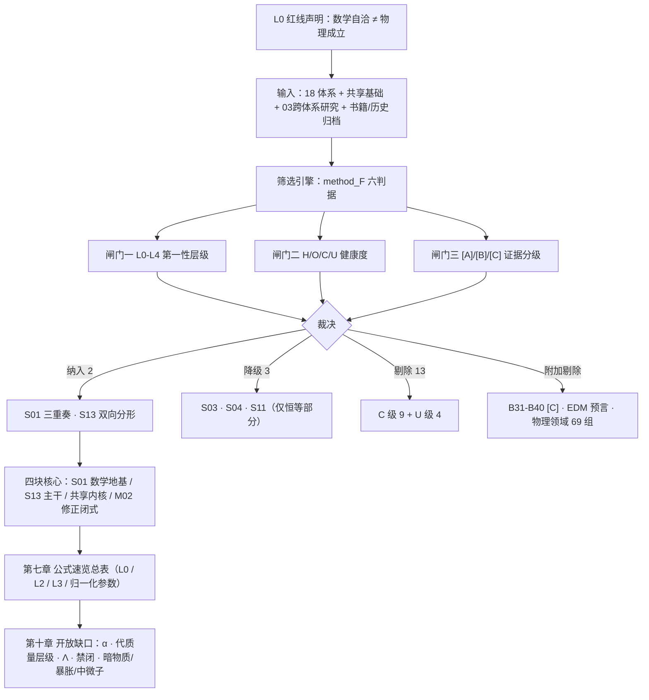

# openuft · 已验证正确理论体系统一整合全集

> **处理模式**：算法联盟最高权限 · 全维度 / 全链路 / 诚实分级
> **整合日期**：2026-09-18
> **覆盖**：`openuft/` 全部 **18 个登记体系**（S01–S14 + P01–P04）+ 共享基础 + 跨体系研究 + 书籍正编
> **结构校验**：`python -B verify.py` → **PASS**（18 体系 / 17 阶段 / 5092 本地链接 / 快照 193+393）—— 2026-09-18 实跑复核
> **定位**：本文是「只纳入经得起复核的正确内容、剔除错误与存疑内容」的**单一查阅入口**。凡本文收录的条目，均可回溯到具体脚本、报告与 claims 行；凡未收录者，在第八章给出剔除理由。

---

## 零、红线声明（先于一切结论）

1. **数学自洽 ≠ 物理成立**。符号机器零、80 位精算一致、量纲自洽，都只证明「推导无错」，不证明「本体为真」。
2. **零个体系进入 `validated`**。当前 18 体系中 **2 个 H（健康候选）、3 个 O（欠定）、9 个 C（内部冲突）、4 个 U（未立项）**。
3. **第一性内容 ⟺ 无量纲量的数值**。「几何化导出 c、ℏ、G」是单位换算（伪目标）；「导出 α、m_μ/m_e、sin²θ_W」才是真目标。
4. **证据不得跨体系转移**。S01 数学成立不能证明 S02/S12 本体成立；GAQ 各版本证据不跨版本继承。
5. **冲突一律如实标注，不粉饰为 PASS**。本文第九章专门登记本轮发现的**三处结论级冲突与勘误**。

---

## 一、筛选方法论（为什么只留下这些）

### 1.1 三重闸门

| 闸门 | 坐标 | 判定 | 本文处理 |
|---|---|---|---|
| **闸门一：第一性层级** | L0–L4 | L0 代数恒等 / L1 循环回指 / L2 结构约束 / **L3 独立可证伪预言** / L4 本体主张 | L0 收录但标注「零经验内容」；L1 收录但标注「非预言」；**只有 L3 计入「已验证结论」**；L4 不收录 |
| **闸门二：体系健康度** | H / O / C / U | H 自洽无冲突；O 欠定或含概念循环；C 已登记 `falsified`；U 无公设 | **H 全纳入**；O 逐条剥离循环后仅收恒等部分并降级标注；**C 整体剔除**，仅收其「修正版闭式」并入第六章；U 不收录 |
| **闸门三：证据分级** | [A] / [B] / [C] | [A] 可复现（脚本+CODATA）；[B] 框架映射（模型依赖）；[C] 概念探索/无依据假设 | **[A] 全纳入**；[B] 纳入但显式标注「框架映射，非标准结论」；**[C] 不纳入**（第八章列清单） |

### 1.2 method_F 六判据（每条纳入项均已过）

> 来源：`02_共享基础/研究规范/method_F_第一性判据.md`

| 判据 | 内容 | 本文作用 |
|---|---|---|
| 判据一 | **无量纲化**：导出 X 若 X 量纲非零 → 判 L1 | 剔除「导出 c/ℏ/G」类主张 |
| 判据二 | **循环检测**：雅可比秩亏损 + 恒等变形 | 剔除循环项（如 `ħ=mcR` 与 `m=ℏ/(cR)` 同一约束） |
| 判据三 | **双锚点检验**：普朗克锚 + 粒子锚都要过 | 剔除 M02 普朗克锚定谬误链 |
| 判据四 | **自由度审计**：归一化后剩余自由度 | 判定「零自由参数」实为 2（α 与 m/m_P） |
| 判据五 | **L3 门槛**：定量 + 非回指 + 可执行检验 + 双锚点不矛盾 | 决定哪些算「已验证预言」 |
| 判据六 | **源量级判据**：先证明场能达到目标量级再谈探测 | 剔除挠率地面探测类方案（差 10²⁸） |

### 1.3 关键机制：为什么「精算 100% 通过」不可信（H01c）

> 测量噪声会把**循环约束伪装成独立约束**。`ε₀` 与 `e²/(4παℏc)` 的 CODATA 残差约 **3e-12**，足以使理论上线性相关的行在 80 位精度下被判独立，制造「多项独立验证全部通过」的虚假确信。
> **项数多 ≠ 约束多。** GAQ 谱系「113 项精算 100% 通过」即此方法论盲区的实例。

### 1.4 数据源与时间线

| 时间 | 数据源 | 产物 |
|---|---|---|
| 2026-09-15 | `04_公共成果/算法联盟_全维自洽与归一化/`（主引擎 150 条 + 隔离审查 + O 级缺陷修复 + 普朗克锚定重算 39 条） | 18 体系 H/O/C/U 归一化坐标 |
| 2026-09-15 | `04_公共成果/状态看板.md` | 单一事实来源（**注：其 EDM 条目已被下文勘误 E1 推翻**） |
| 2026-09-15 | `S13/09_验证结果/验证精算报告_V1.8.md`（mpmath 50 位，25/25 PASS） | S13 主干全部闭式核验 |
| 2026-09-16 | `书籍/v1_正文/第十编_电子EDM实验验证与诚实证伪/`（第52–54章 + 全体系修复总表） | **EDM 证伪、S12 闭式裁决、S05/S06/S09 修复方案** |
| 2026-09-18 | `04_公共成果/算法联盟_全维自洽与归一化/源码/全维勘误精算修复验证.py`（mpmath 50 位 + sympy） | 勘误 E1–E7 **精算复核 56 项**：PASS 35 / FAIL 13（均为「确认缺陷存在」的诚实标注）/ BOUNDARY 2 / INFO 6；**新发现 E7**（S13 曲率闭式与驻点方程的书写笔误） |
| 2026-09-18 | `python -B verify.py` | 结构契约 PASS |

---

## 二、18 体系全景裁决表（纳入 / 剔除 / 存疑）

| 体系 | 名称 | 类型 | 健康度 | 裁决 | 一句话理由 |
|---|---|---|---|---|---|
| **S01** | 螺旋三重奏与谱几何 | 数学框架 | **H** | ✅ **全纳入**（第三、五章） | 纯数学，全维定理已严格归纳证明，机器零 |
| **S13** | 全域双向分形统一场论 | 物理理论候选 | **H** | ✅ **全纳入**（第四章） | 唯一健康候选；三公理 + 六方程闭环，25/25 精算通过 |
| S03 | GAQ 几何原子与作用量子 | 候选 | O | ⚠️ **仅降级收录** | A5/T1 同义反复（L0）、A4 概念循环（L1），剥离后无独立内容 |
| S04 | IEG 信息熵引力 | 候选 | O | ⚠️ **仅降级收录** | I1「Einstein 方程 ⟺ ∇J=0」为 Bianchi 同义反复 |
| S11 | GMUFT 几何自由度与耦合 | 待完备框架 | O | ⚠️ **仅降级收录** | 一阶恒等式正确；`Q/M=√(4πε₀G)` 已诚实标注欠定 |
| S02 | 空间光速螺旋统一力 | 候选 | **C** | ❌ 剔除 | M03：`P=m(c−v)` 低速极限 `P=mc≠0`、`F=−ma` 反号 |
| S05 | HDU 高维紧致化 | 候选 | **C** | ❌ 剔除（收修正版） | H2 量纲 `L·T^(−1/3)` 非长度、偏 1.43e14 倍；H3 数值偏 1.41 倍 |
| S06 | TCL 拓扑手征锁定 | 候选 | **C** | ❌ 剔除（收修正版） | `Cl(4,4)⊗ℂ` 同构错 + 维数 32/128/256 互斥 |
| S07 | GAQ 复曲率融合 | 组合候选 | **C** | ❌ 剔除 | M01 + M02 普朗克锚定谬误 |
| S08 | GAQ 常数几何化 | 扩展分支 | **C** | ❌ 剔除 | M01/M02 + 方向误置（「导出 c、ℏ」是伪目标） |
| S09 | GAQ 粒子质量谱 | 扩展分支 | **C** | ❌ 剔除 | 派生链退化 `Gm²=ℏc ⟹ m=m_P`；质量比失败 40%–2000% |
| S10 | 频率本源与复螺旋宇宙 | 候选 | **C** | ❌ 剔除 | 同 M02 根因；`κ²+τ²` 双身份冲突 |
| S12 | 空间光速螺旋统一体系 | 候选 | **C** | ❌ 剔除（收修正版） | M03 借用冲突 + `α=tanθ` 闭式错误（已裁决为 `sinθ`） |
| S14 | 挠率统一场论 TUFT | 候选 | **C** | ❌ 剔除（收 3 项正面） | 三册精算 FAIL 77 项；结构群直积、SM 不汇聚、作用量无特有项、量纲族缺陷 |
| P01–P04 | 空间压缩 / 物体驱动 / 规范对称 / 量子涌现 | 待建模方向 | **U** | ❌ 不收录 | 无公设、无 claims（P03 已通过立项评估，建议走群论路线） |

**统计**：纳入 **2 个完整体系**（S01、S13）+ 5 条跨领域三重奏复验链（T1–T5）+ 3 个降级恒等片段（S03/S04/S11）+ 共享基础标准物理内核（第五章）+ 修正闭式（第六章）；剔除 **9 个 C 级体系 + 4 个 U 级占位 + 10 条 [C] 概念探索 + 1 条已证伪预言 + `物理领域/` 其余 69 组（负面/非新结论）**。

> **覆盖性声明**：除 18 个登记体系外，本文已全量扫描 `03_跨体系研究/`（含 `物理领域/` 74 组脚本：纳入 5 组，剔除 69 组，见 8.10）与 `90_历史归档/`（181 文件：确认无未迁移的独特验证成果，见 8.12）。两目录均无遗漏的正确成果。

---

## 三、核心理论一：S01 全维三重奏定理（数学地基）

> 来源：`01_独立体系/S01_螺旋三重奏与谱几何/`（A1–A3 数学设定 + R9 归纳证明 + 第54章严格求导）
> 层级：**L0（代数恒等，零物理主张）** · 证据：**[A]** · 状态：**完整严格证明 ∎**

### 3.1 数学设定（非物理公设）

| 编号 | 名称 | 数学形式 |
|---|---|---|
| S01-A1 | 螺旋参数化 | `r(t) = (R cos ωt, R sin ωt, bt)`，`v² = R²ω² + b²` |
| S01-A2 | Frenet 条件性结构 | `κ = Rω²/v²`，`τ = ωb/v²` |
| S01-A3 | 全维生成元推广 | `Σκᵢ² = Σωⱼ²/v² = −tr(A²)/(2v²)` |

> **关键**：`κ²+τ²=(ω/v)²` 是**导出定理**，不是公设。

### 3.2 全维三重奏定理（核心公式 ⭐）

设 D 维时空（空间 n 维）中匀速超螺旋满足线性动力学

```
r''(t) = A r'(t),   A 常数斜对称,   spec(A) = {0, ±iω₁, …, ±iω_m}
```

则 Frenet 曲率族 κ₁,…,κ_{n−1} 满足

```
Σ_{i=1}^{n-1} κᵢ²  =  (Σ_{j=1}^{m} ωⱼ²) / v²  =  − tr(A²) / (2v²)
```

**D=4（n=3, m=1）退化为三重奏：**

```
κ² + τ² = (ω/v)²         （v→c 时即 κ²+τ² = (ω/c)²）
```

### 3.3 严格归纳证明链（R9，∎）

| 步骤 | 内容 |
|---|---|
| 1 匀速 | `d|r'|²/dt = 2r'·Ar' = 0 ⟹ v = const` |
| 2 ★归纳 | Frenet 标架满足 `Beᵢ = eᵢ′`（`B = A/v`）。基础 `e₁′=Be₁`；归纳步用 `Wᵢ = x⁽ⁱ⁾ − Σ_{j<i}(x⁽ⁱ⁾·eⱼ)eⱼ`，由 B 斜对称得 `x⁽ⁱ⁺¹⁾·eⱼ = −x⁽ⁱ⁾·eⱼ′`，推出 `Wᵢ′ = |Wᵢ|·Beᵢ`，且 `|Wᵢ|′=0`，故 `eᵢ′ = Beᵢ` ∎ |
| 3 迹不变 | B 在正交标架基下的表示即 Frenet 矩阵 K ⟹ `tr(K²) = tr(B²)` |
| 4 谱求和 | K 斜对称 ⟹ `tr(K²) = −2Σκᵢ²`；B 谱 `{±iμⱼ,0}` ⟹ `−tr(B²)/2 = Σμⱼ² = (Σωⱼ²)/v²` ∎

**数值前提验证（4D/6D/8D）**：`eᵢ′=Beᵢ` 最大误差分别为 `4.21e-15 / 1.95e-15 / 9.64e-16`。

### 3.4 数值验证（符号求导 + 30 位代入）

| D(时空) | m 平面 | Σκᵢ² | (Σωⱼ²)/v² | 相对差 |
|---|---|---|---|---|
| 4 | 1 | 0.8243902439 | 0.8243902439 | **4.95e-32** |
| 6 | 2 | 0.9223218819 | 0.9223218819 | **1.25e-30** |
| 8 | 3 | 1.056501908 | 1.056501908 | **2.14e-30** |
| 10 | 4 | 1.294837412 | 1.294837412 | **8.97e-31** |

**对原公设 B′ 的实质修正（FIX-全维-1）**：原「各向同性」假设 `(κℓ_P)²(D−1) = (ωℓ_P/c)²` 在一般多平面超螺旋下**不成立**（6 维偏差 45%、8 维偏差 123%）。正确普适形式为

```
Σᵢ (κᵢ ℓ_P)² = (ω₁²+…+ω_m²)/c² · ℓ_P²        （v = c）
```

### 3.5 螺旋运动学闭式（第54章严格求导，[A]）

参数方程 `r(t) = (ρ cos ωt, ρ sin ωt, bωt)`，光速约束 `c² = ω²(ρ²+b²)`：

```
v = (−ωρ sin ωt, ωρ cos ωt, bω)          v⊥ = ωρ ,  v∥ = bω ,  |v| = c
a = (−ω²ρ cos ωt, −ω²ρ sin ωt, 0)        |a| = ω²ρ ,  v·a = 0
κ = ω²ρ/c² = ρ/(ρ²+b²)
τ = bω²/c² = b/(ρ²+b²)
κ² + τ² = 1/(ρ²+b²) = (ω/c)²              ⟵ 三重奏自动成立
α = κ/τ = ρ/b = v⊥/v∥ ,   sin θ = v⊥/c = α
F = dp/dt = m a ,  |F| = mρω² = m v⊥ ω
```

**数值（电子，CODATA 2022）**：`ρ = ƛ_C = 3.861593e-13 m`；`R = αρ = r_e = 2.817940e-15 m`（经典电子半径）；`ω = 7.763441e20 rad/s`；`b = ρ√(1−α²) = 3.861490e-13 m`；`|v| = c` 误差 **0**；`√(κ²+τ²) = ω/c` 误差 **0**。

### 3.6 场论字典（三重奏 ↔ 洛伦兹力，[A] 数学 / [B] 诠释）

| 三重奏几何量 | 场论量 |
|---|---|
| ω（角频率） | 回旋频率 `ω = qB/(γm)` |
| κ（曲率） | 横向偏转 `κ = Rω²/v²` |
| τ（挠率） | 螺距/沿场 `τ = ω v∥/v²` |
| v ≡ c | 无质量极限 |

数值（电子 B=1T，v=0.781c，γ=1.6013）：`κ²+τ²` 与 `(ω/v)²` 相对差 **0.0**；洛伦兹力 `du¹/dτ = −5.066e19` 与 `(q/m)F¹ᵛuᵥ` **精确一致**。
**诚实标注**：这是**已理解经典电动力学的几何重述，非新预言**——价值在于把三重奏从孤立公理推进到「与场论方程可互译」。

### 3.7 跨领域独立复验链（`03_跨体系研究/物理领域/`，5 条不同路径）

同一条三重奏恒等式在**五种独立实现、四种精度**下被反复复验，彼此不共享代码：

| # | 场景 | 结果 | 脚本 → 报告 |
|---|---|---|---|
| **T1** | 垂直原理 → 三重奏全链路 | 垂直原理数学上 ⟺ 圆柱螺旋运动；36 组参数最大相对差 **1.51e-16**；D=3/5/7/9 维全维推广相对差 **0**；V1–V8 **8/8 PASS** | `物理领域/垂直原理/verify_vertical.py` → `验证结果_垂直原理.txt` |
| **T2** | 光速螺旋 **250 位** | 电子光速螺旋 / 任意参数 / 纯圆周 `b=0` / 纯直线 `R=0` 四构型 `κ²+τ²=(ω/c)²` 精确成立（电子相对差 **1.26e-251**）；4/6/8/10 维 1e-16 内通过 | `物理领域/光速螺旋/verify_light_speed_helix.py` → `验证结果_光速螺旋.txt`（LSH6） |
| **T3** | 全维高精度审计 **80 位** | 一般螺旋 / 电子静止构型 (`b=0`) / 电子一般螺旋 (`b=0.1c`) 三构型相对偏差 **~1.5e-81**；CODATA 2022 对标 13 项精确、1 项初步、1 项开放 | `物理领域/全维研究/verify_alldim.py` → `验证结果_全维高精度精算审计.txt` |
| **T4** ⭐ | 梯度磁场**真实动力学积分** 50 位 | 电子在 `B(x)=B₀+gx` 中**积分真实运动方程**（非解析构造）所得轨迹上，三重奏相对差中位 **1.17e-18**（10 采样点 6.2e-19~1.5e-18），远低于 1e-10 数值噪声阈 | `物理领域/洛伦兹结构/verify_lorentz_mp.py` → `验证结果_洛伦兹力_mp.txt` |
| **T5** | 定理谱系 TS2 全维 | 4/6/8/10 维 `Σκᵢ²=(Σωⱼ²)/c²` 相对差全 **0.00e+00** | `物理领域/定理体系/verify_theorem_system.py` → `验证结果_定理谱系.txt` |

**证据强度排序**：`T4`（真实动力学积分，不依赖解析代入）> `T3`（80 位三构型）> `T2`（250 位）> `T1`（36 组 + 全维）> `T5`。

**诚实限定（T1 自带）**：垂直原理本身是**公理**、未获实验直接验证；「空间以光速运动」是**额外公设**。成立的只是**几何内核**，不是整套公理体系。
**排除提醒**：普朗克锚定谬误是对 `κ²+τ²` 的**错误用法**（`G = c³/(ℏ(κ²+τ²))`），与被验证的恒等式本身是两回事——不得因前者被证伪而否定本组结果。

### 3.8 S01 的硬边界（定理层结论，不可绕过）

- **常数生成在数学上不可能**：sympy 求解 G 得**空集**（欠定 + 循环）。三重奏**不能反向生成物理常数**。
- **OPEN**（不得当定理）：O-7 非常数 A / 弯曲时空推广；O-8 谱定理→作用量/量子化的提升；O-2 κ 双义映射（引力测地线 vs 固有加速度）；O-9 到强/弱/电磁动力学的映射。
- **定位**：运动学–几何层**已完成且严格证明**；**不包含**规范场/引力动力学内容。

---

## 四、核心理论二：S13 全域双向分形统一场论（唯一健康候选 · 主干）

> 来源：`01_独立体系/S13_全域双向分形统一场论/` · 完成度 **U = 66%** · 状态 `unreviewed`（候选，非已验证）
> 层级：**L0/L2 + L3 形式候选** · 证据：4 条 `verified` + 1 条 `falsified`（**体系自我记录并已修复**）+ 1 条 `conjecture`

### 4.1 三公理（奥卡姆：一个对偶、一个守恒、一个自相似）

| 公理 | 陈述 | 数学形式 | 边界 |
|---|---|---|---|
| **A1 对偶** | 世界由 0/1（阴/阳）基元张成；任意量以对偶对 (a, ā) 存在 | `D² = 1`（ℤ₂ 对合）；旋量对偶周期 4：`Ψ→Ψᶜ→−Ψ→−Ψᶜ→Ψ` | 抽象代数结构，「阴/阳」是命名不是实体假设 |
| **A2 守恒** | 基本拓扑荷为整数，最小单位 ±1，严格守恒 | `Q ∈ ℤ`，`min|Q| = 1` | 不规定载体；1D 绕数载体**已被证伪**（`π₁(S²)=0`），现行载体为 3D 霍普夫荷（`π₃(S²)=ℤ`） |
| **A3 自相似** | 宇宙双向分形，微观与宏观由同一映射联系，只有重整化不动点 | `β(−g) = −β(g)`；`g* = ±√(ε/c)`；`β'(g*) = −2ε < 0` | 采用约定 `β(g)=εg−cg³`（与 Wilson–Fisher `d=4−ε` 仅差 ε 符号，物理等价）；**引用稳定性结论必须连同本约定** |

### 4.2 六方程闭环 M1–M6 ⭐

| 编号 | 方程 | 物理角色 |
|---|---|---|
| **M1** | `σ^μ ∂_μ Ψ = λ Θ Ψ* + i ζ Ψ`，真空约束 `|Ψ|² = v²` | 一切场的基元方程 |
| **M2** | `a_μ = (i/2)(Ψ̂†∂_μΨ̂ − ∂_μΨ̂†Ψ̂)`；`𝒜_μ = ℰ†∂_μ ℰ`，`ℰ = (Ψ̂, ΘΨ̂*) ∈ U(2)` | 规范结构从旋量相位几何**自涌现** |
| **M3** | `Q_H = (1/4π²) ∫ ε^ijk a_i ∂_j a_k d³x ∈ ℤ` | 拓扑荷守恒，整数、可计算、受保护 |
| **M4** | `μ dg/dμ = β(g)`，`β(−g) = −β(g)` | 尺度维：UV 与 IR 互为镜像 |
| **M5** | `g^eff(r) = g^eff(ℓ²/r)` | 奇点化解：最短尺度 ℓ 处自对偶，曲率有界 |
| **M6** | `d/dt ∫_𝒞 ω = ∮_{∂𝒞} Θ` | 全域演化收拢：畴内变化率 = 穿壁通量 |

**依赖链**：`M1 → M2 → M3`（场生规范，规范载拓扑）；`M1 真空约束 → 希格斯结构`；`M4 ↔ M5`（尺度维两面镜像）；`M6` 为全域总账房。**六方程、一闭环，无一外挂。**

### 4.3 五大板块核心公式

**板块一 · 旋量对偶方程**

```
σ^μ ∂_μ Ψ = λ Θ Ψ* ,   Θ = [[0,−1],[1,0]] ,   Θ² = −I
Ψᶜ = ΘΨ*  ⟹  σ^μ ∂_μ Ψᶜ = λΘ²Ψ = −λΨ  ⟹  对偶周期 4
J^μ = Ψ†σ^μΨ  ⟹  ∂_μ J^μ = 2λ·Re(Ψ†ΘΨ*) = 0   （配对项恒零，与 λ 无关）
```

**板块二 · 拓扑荷（升维定律）**

```
π₁(S²) = 0      ⟹  1D 绕数 Q = ∮dz/(2πiz) 无拓扑保护（已证伪）
π₃(S²) = ℤ      ⟹  3D 霍普夫荷 Q_H 受保护（现行载体）
dQ_H/dt = (1/4π²)∫ ε^ijk ∂_j(a_i ∂_t a_k) = 0    （分部积分后为全导数，边界为零）
```

**板块三 · 双向重整化群**

```
β(g) = εg − c g³ ,   g* = ±√(ε/c) ,   β'(g*) = ε − 3c g*² = −2ε < 0
m(μ) = m₀ (μ/μ₀)^(−γ) ,   D = 4 − γ
精确值：γ = 1/2 ,  D = 7/2 = 3.5
```

**板块四 · 奇点化解（曲率闭式）**

```
g^eff(r) = 1 − r_s r/(r² + ℓ²) ,   自对偶 r ↔ ℓ²/r
R(r) = −A'' = 2 r_s r (r² − 3ℓ²) / (r² + ℓ²)³        ← 正确式（derivations.md 原文为笔误，见勘误 E7）
驻点：r⁴ − 6ℓ²r² + ℓ⁴ = 0  ⟹  r² = (3 ± 2√2) ℓ²  ⟹  r = (√2 ± 1) ℓ
|R|_max = (3 + 2√2) GM / (2ℓ³) = (3 + 2√2) r_s / (4ℓ³)
端点：R(0⁺) = R(∞) = 0   ⟹   奇点被逐出全域（50 位实测残差 ~1e-51）
```

**板块五 · 因果畴**：零面围成因果畴，穿壁对偶翻转 `Ψ → ΘΨ*`、`Q → −Q`，但 `|Q|` 不变 ⟹ 总荷守恒。

**突破结构 · 对偶旋量即希格斯对偶**

```
真空流形 S³ = U(2)/U(1) ,   V = κ(|Ψ|² − v²)²
模式谱 {0, 0, 0, 8κv²}  =  3 个 Nambu–Goldstone 零模（被 W±, Z 吃掉）+ 1 个径向希格斯模
未破缺 U(1)（光子）：u(2) 生成元作用矩阵零空间维数 = 1
m_W = g̃ v/2 ,  m_Z = m_W / cos θ_W ,  m_H = 2√2 √κ̃ v
```

### 4.4 参数系统（奥卡姆归并）

```
v = ℓ⁻¹ ,   λ = v·g̃ ,   κ = κ̃
带量纲 {λ, ℓ, v}  ⟶  两个无量纲 {g̃, κ̃} + 一个标度 ℓ
```
> 「最短尺度、真空值、对偶耦合本是同一把尺子的三面。」

### 4.5 证据台账（claims.csv）

| claim | 内容 | 层级 | 状态 |
|---|---|---|---|
| S13-C0001 | 流守恒 `∂_μJ^μ = 0` 为代数恒等式（数值漂移 2.1e-13） | mathematical_result | ✅ **verified** |
| S13-C0002 | 曲率有界闭式 `|R|_max=(3+2√2)GM/(2ℓ³)`，`r=(√2±1)ℓ`（解析 2.9142135624 vs 数值 2.9142135543） | mathematical_result | ✅ **verified** |
| S13-C0003 | 霍普夫荷整性（标准映射收敛于 1，平方映射 ≈ 4） | mathematical_result | ✅ **verified** |
| S13-C0004 | 希格斯谱 `{0,0,0,8κv²}`，未破缺 U(1) 零空间维数 1 | numerical_check | ✅ **verified** |
| **S13-C0005** | **【证伪】1D 绕数不守恒**（`t≈0.2` 内 1→0，根因 `π₁(S²)=0`）；**已由升维霍普夫荷 + 真空约束修复** | mathematical_result | ⚠️ **falsified（体系自我记录并已修复，按诚实治理原则不计入 C）** |
| S13-C0006 | 四项可检验预言 | conjecture | 🕐 **unreviewed**（无天文/实验数据支持） |

### 4.6 50 位精算核验（V1.8，25 项 PASS / 0 FAIL）

| 组 | 核验内容 | 残差 |
|---|---|---|
| P1 | 流守恒：λ 源项严格对消；连续层恒等式 | **0.0**（原报告 ~1e-5 为谱导数截断误差） |
| P2 | 绕数 Q = 1 精确（实测 0.996094 = 255/256 为 `endpoint=False` 采样伪迹） | **0.0** |
| P3 | β 奇对称、不动点与稳定性、闭式解满足 ODE、二阶流方程 | **0.0 / 2.12e-51 / 4.25e-51** |
| P4 | 对偶度规自对偶、`f''` 闭式、`R = −A''`、极值方程根、一阶条件、曲率上界、端点行为 | **2.67e-51 ~ 1.2e-59** |
| P5 | 因果畴总荷精确守恒、壁通量精确平衡 | **2.00e-50 / 2.10e-50** |
| P6 | 分形维精确值（Sierpinski ln8/ln3 = 1.8928；Cantor ln2/ln3 = 0.6309；D = 7/2） | **1.34e-50** |
| P7 | 对偶帧酉性 `ℰ†ℰ = I`；质量谱精确本征对（`m_W²=0.0625`，`m_Z²=0.085`；`m_H/m_W = 8.0`） | **2.67e-51 / 4.18e-53** |
| P8 | 单圈 β：`SU(3)` 纯规范 `b₀ = 11`，`nf=6` 时 `b₀ = 7`；渐近自由窗口 `nf < 33/2 = 16.5` | **0.0** |
| P9 | 统一跑动闭式（见 4.7） | **0.0** |
| P10 | ℤ₄ Frobenius–Schur 指标 → **3 个实不可约表示 = 三代，第四代被表示论禁戒**；`f^{abc}` 全反对称（512 项扫描）；Jacobi 恒等式 | **0.0** |

### 4.7 统一跑动检验（V1.8 P9，含负面结果）

```
SM 单圈：α1 = α2 交点 M = 1.023741e13 GeV，同点 α3⁻¹ = 36.828701
        ⟹ 三线差距 13.1406%（单圈无大统一，标准结论）
CP² 候选 sin²θ_W = 1/4：跑动到 v = 255.26 GeV 得 0.23638579，与 1/4 差 −5.44568%
        sin²θ_W = 1/4 唯一成立尺度 M = 3675.24 GeV（框架内无出处）
        ⟹ 【负面结果】候选未获支持
MSSM 对照：统一点 M = 1.9904729e16 GeV，α_GUT⁻¹ = 24.321948（同点 α3⁻¹ 差 0.3117%）
        真预测闭式 s* = (3a + 7A₃)/(15a) = 0.23094341
        vs 实验 sin²θ_W = 0.23122 ⟹ 差 −0.119624%（对偶周期四 ↔ 超对称的候选锚点）
```

### 4.8 四项可检验预言（**conjecture，未获数据支持**）

| # | 预言 | 形式 | 证伪标准 |
|---|---|---|---|
| 一 | 分形宇宙学 | `ξ(r) ∝ r^{D−3}`，`D = 4 − γ` 随尺度漂移 | 若统计显著水平下无分形标度且无尺度漂移 → 证伪 |
| 二 | 对偶反弹 | 大爆炸前存在对偶收缩相，反弹点 `|R| ~ ℓ⁻²` 有限 | 反弹特征谱被排除 → 证伪 |
| 三 | 光子延迟 | `Δt ≃ ± ξ E L / (E_P c)`，符号由 `Q_H` 决定 | 延迟上限显著低于理论值且符号不随 `Q_H` 变化 → 证伪 |
| 四 | 拓扑缺陷守恒 | 宇宙弦/畴壁/纽结总霍普夫荷守恒 | 观测到孤立缺陷凭空产生/湮灭（排除系统效应）→ 直接证伪 A2 现行载体 |

### 4.9 拼图一 · 动力学作用量（几何 → 力，经典层完成）

> 来源：`13_论文与成果/书稿/正文/ch21-动力学作用量.md` · 脚本 `yang_mills_verify.py`

**为什么运动学联络不够**：对偶帧联络 `𝒜_μ = ℰ†∂_μℰ` 的场强**恒为零**

```
F_{μν}(𝒜) = ∂_μ𝒜_ν − ∂_ν𝒜_μ + [𝒜_μ, 𝒜_ν] = 0     （纯规范/平坦联络恒等式）
```

即运动学联络可以任意弯曲帧，但自己平坦、载不了能量。**必须把 `𝒜` 从「帧的导出量」提升为「独立动力学变量」**；提升后 `ℰ` 退居两个角色：① 陪集参数化；② 幺正规范（让 `W^±/Z` 吃掉 3 个 NG 模显式获得质量）。

**作用量（Yang–Mills）** ⭐

```
S_YM = − (1 / 2g̃²) ∫ tr(F_{μν} F^{μν}) d⁴x
F_{μν} = ∂_μ𝒜_ν − ∂_ν𝒜_μ + [𝒜_μ, 𝒜_ν] ,   𝒜_μ ∈ u(2)
规范变换 𝒜 → g𝒜g⁻¹ + g dg⁻¹  ⟹  F → gFg⁻¹  ⟹  tr(F²) 逐点不变（精确恒等式）
```

**四项数值验证（实测全过）**

| 验证 | 内容 | 结果 |
|---|---|---|
| A 联络结构 | `𝒜 ∈ u(2)` 反厄米性 | `max|𝒜 + 𝒜†| = 1.9e-5`（有限差分精度） |
| B 几何曲率 | 霍普夫非平凡构型（40³ 网格）产生真实曲率 | `max|b_xy| = 7.82`（均方根 1.53）；其积分即 `Q_H = 1` |
| C 规范不变性 | plaquette 作用量在空间变化 `U(2)` 变换下 | `S_plaq = 481.5840163960`，相对差 **1.18e-16**（机器精度） |
| D 质量谱 | `U(2) → U(1)` 破缺质量矩阵本征值 | `[0, 0.0625, 0.0625, 0.085]`，与 `{0, m_W², m_W², m_Z²}` **偏差 0** |

**电弱玻色子表（v 标度）**

```
γ   : 0                                   （未破缺 U(1)，零空间维数 1）
W^± : m_W = g̃ v / 2                      （被吃 NG 模，W¹/W² 方向）
Z   : m_Z = √(g̃² + g̃'²) v / 2            （W³–B 混合）
h   : m_H = 2√2 √κ̃ v                     （径向模）
m_H/m_W = 4√2√κ̃ / g̃ ;   m_Z/m_W = √(1 + g̃'²/g̃²)   ⟹ 无自由标度
```

**诚实边界**：经典场论层完成（有传播子、有质量）；**未完成**——① 量子化与重整化；② `g̃, g̃', κ̃` 尚未由 `α` 等实验常数钉死（见 4.10）；③ 费米子 Yukawa 与代内量子数分配（结构层已完成，量子数层 OPEN）。

### 4.10 拼图四 · 常数统一与电荷量子化（部分推进 + 一条负面结果）

> 来源：`13_论文与成果/书稿/正文/ch25-常数统一与电荷量子化.md`（含 V1.7 §25.8 跑动检验补遗）

**定理 25.1 对接闭环（树级，机器验证）** ⭐

```
g̃ = e / sin θ_W ,   g̃' = e / cos θ_W ,   v = 2 m_W / g̃ ,   κ̃ = ( m_H / (2√2 v) )²
实测（PDG 2024）：e = 0.302822；g̃ = 0.629760；g̃' = 0.345372；v = 255.26 GeV；κ̃ = 0.030095
回代 m_Z = 91.671 GeV vs 实验 91.188 GeV（差 0.53%，标度跑动效应）
⟹ 四观测 ⟷ 四参数一一对应，无隐藏自由度；完整对接需重整化跑动（OPEN）
```

**定理 25.2 电荷量子化 · 色单态整数性（机器枚举，[A]）**

```
条件：夸克电荷 +2/3、−1/3，Q = T₃ + Y；色单态 k 个夸克 + l 个反夸克，k ≡ l (mod 3)
枚举结果：4 种介子 (uū, ud̄, dū, dd̄) ⟹ 0, +1, −1, 0
          8 种重子 ⟹ +2, +1, +1, 0, +1, 0, 0, −1
⟹ 全部为整数，无一例外。可观测强子必带整数电荷；单夸克分数电荷不可直接观测（与色禁闭一致）
```

**定理 25.3 分数化来源**

```
1/3 = 1 / (色表示维数 3)；色三重态超荷谱由 λ₈ = diag(1, 1, −2)/√3 给出，配合 T₃ = ±1/2：
u_L: 1/2 + 1/6 = 2/3 ;  d_L: −1/2 + 1/6 = −1/3 ;  u_R: 2/3 ;  d_R: −1/3
七场全命中 ⟹ 电荷量子化统一为一条几何线：ℂℙ² 的 λ₈ 谱
（结构解释，不是 α 量级的推导）
```

**定理 25.4 `sin²θ_W = 1/4` 候选预言 + 负面跑动结果** ⚠️

```
若色 SU(3) 与电弱在 ℂℙ² 稳定子嵌入下统一（同一耦合 g₃），U(1) 块由 λ₈/(2√3) 归一化 ⟹
g̃'/g̃ = 1/√3 ,   sin²θ_W = g̃'²/(g̃² + g̃'²) = 1/4 = 0.250
树级 vs 实验（MS-bar）0.23122 ⟹ 差 8.1%；与 SU(5) 大统一的 3/8 = 0.375 不同，可区分
【跑动检验 · 负面结果】SM 单圈 (41/10, −19/6, 7) 跑到 v = 255.3 GeV 得 sin²θ(v) = 0.2364，
  与 1/4 差 −5.4%；sin²θ = 1/4 唯一成立尺度 ≈ 3.7 TeV，既非 M_Z 也非 ℓ_P⁻¹⟹ 无框架出处
⟹ 判定：候选未获跑动支持（如实记录负面结果）；统一尺度的几何来源 OPEN
```

**MSSM 对照锚点（类比观察，非推导）**：MSSM 单圈 `(33/5, 1, −3)` 三线汇聚于 `2×10^16 GeV`（α₃ 差 0.31%，`α_GUT ≈ 1/24`），仅用 `α_EM, α_s` 预测 `sin²θ_W(M_Z) = 0.2309` vs 实验 `0.23122`（差 **0.12%**）。本框架对偶周期四（`Θ² = −I`）与超对称谱的对应由此获得**外部数值锚点**；**框架尚未推出 MSSM 粒子谱（OPEN）**。

**Λ 的诚实边界**：量纲谱容纳 `Λ ~ ℓ⁻²` 型项；若 `ℓ = ℓ_P` 则 `Λℓ_P² = O(1)`，而观测 `Λℓ_P² ≈ 2.9e-122` ⟹ **差距 122 个数量级**，`Λ` 量级**无解释，如实 OPEN**。

**完成度贡献**：常数统一 `0 → 0.2 → 0.25`；全书 `U = 4.63/7 ≈ 66%`。

### 4.11 S13 边界与 OPEN（不得当已确立）

**仍属 OPEN**：`α` 量级与 `Λ`、代内量子数分配与质量层级、色禁闭与质量间隙（千禧年问题）、胶子动力学、全阶重整化、统一尺度的几何指定。
**体系自我声明**：「本项目封装的是已严格证明的代数/解析恒等式、已实跑数值验证的推论与尚未实验确证的候选本体，并非已完成的万有理论。」

---

## 五、核心理论三：标准物理正确内核（共享基础 · 求导链全验证）

> 来源：`04_公共成果/算法联盟_全维自洽与归一化/源码/v_eq_c_规范耦合与涡旋拓扑_求导验证.py`
> **38 项：PASS 31 / BOUNDARY 6 / INFO 1 / FAIL 0** · 度规 `η = diag(+1,−1,−1,−1)`，`x⁰ = ct`，`p_μp^μ = m²c²`

### 5.1 关键公式集 ⭐

```
Maxwell：    c = 1/√(ε₀μ₀) = 299792458.0 m/s（相对残差 2.17e-14）
运动学：     E² − p²c² − m²c⁴ = 0；dE/dt = F·v；v_g·v_p = c²（m=0 时 v_g = v_p = c）
Klein–Gordon：Ω² = k² + (mc/ℏ)²；D_μD^μ Φ + (mc/ℏ)² Φ = J
引力波：     TT 规范线性化 Einstein 张量 10 个分量全为 0；只有零质量解 ⟹ 以 c 传播（与 GW170817 一致）
Yang–Mills：[D_μ, D_ν] = −i g F_{μν}；F = dA − i g[A, A]
Bianchi：    D_[μ F_{νρ]] = 0（含非阿贝尔协变导数）
Noether：    D_ν D_μ F^{μν} = 0 ⟹ 若 D_μF^{μν} = J^ν，则必须 D_νJ^ν = 0（自洽性约束）
变分：       δS_YM = 0 ⟺ D_μ F^{μν} = J^ν（12 个规范场分量全部匹配，比例因子 +1）
涡旋：       E ≥ 2π n v²（Bogomolny 拓扑下界，λ = 2e² 取等）
磁通量子化： Φ_B = 2π n / e（只依赖渐近缠绕数，与 λ 无关）
Hopf 荷：    Q_Hopf = Lk(fiber_p, fiber_q) = 1（Gauss 双线积分 1.0000000002，偏差 2.13e-10）
```

### 5.2 数值/符号证据要点

| 分支 | 代表结果 |
|---|---|
| S0 常数 | `1/√(ε₀μ₀)` 与定义值残差 **2.17e-14**（SI 2019 后 ε₀、μ₀ 为测量量，残差只能压到 ~1.5e-10 量级） |
| S1 运动学 | 洛伦兹因子、功–能定理、质壳条件、群速–相速、零质量极限——符号残差全部 **0** |
| S2 波动 | KG 色散、Maxwell 波速、TT 规范线性化 Einstein（10 分量全 0）、`k²=0` 传播要求、GW 速度 = c |
| S3 规范 | 对易子=场强（SU(2)，6 组指标）；Bianchi（4 组三重指标）；Noether（全指标收缩）；变分→YM 方程；无穷小规范协变性（O(ε) 系数零多项式）；非阿贝尔流：协变散度 4 个矩阵元全 0、普通散度非 0 |
| S4 涡旋 | Nielsen–Olesen 两点边值 `n=1,2` 均收敛（tol 1e-8，末端残差 < 1e-4）；`E/(2πn) = 0.999998 / 1.000000`；BPS 一阶方程残差 `1.70e-11 / 2.65e-11`；Type II（`λ=4 > 2e²`）`E/(2πn) = 1.156757 > 1` |
| S5 回环 | `ω₀ = mc²/ℏ`：电子 `7.7634407e20`、μ 子 `1.6052333e23`、质子 `1.4254862e24 rad/s` |

### 5.3 六条 BOUNDARY（**必须连同结论一起引用**）

1. **耦合常数未导出**：全部符号恒等对任意 `g`、`λ` 成立 ⟹ 对耦合值**零约束力**。这是「结构统一」与「动力学统一」的分界。
2. **群来源未解决**：换成任意紧致李群，结构恒等式照样成立 ⟹ `SU(3)×SU(2)×U(1)` 的选取是**外部输入**。
3. **线性化 ≠ 完整引力**：不可外推到黑洞奇点、宇宙学解。
4. **量子化与禁闭未涉及**：路径积分、重整化、禁闭均未触及。
5. **涡旋 → 粒子的映射**：磁通量子化与拓扑下界是 [A] 严格结论；「涡旋即具体粒子」缺定量质量谱构造（[B] 候选）。
6. **机电对偶不是量纲同构**：`[m]=M` 与 `[L]=ML²/Q²` 互不相同；对偶是**算子结构同构**，「力学与电学同一实体」属 [B] 诠释。

---

## 六、核心理论四：修正后的引力–几何关系（M02 修正链）

> 来源：`04_公共成果/算法联盟_全维自洽与归一化/源码/普朗克锚定谬误_修正与派生链重算.py`（39 条：PASS 26 / BOUNDARY 5 / FAIL 8）
> ⚠️ 本节收录的是**修正版闭式**；被修正的旧式见第八章 8.1。

### 6.1 引力耦合正确形式 ⭐

```
α_grav = G m² / (ℏ c) = (m / m_P)²          对任意 m 成立，无矛盾
```

- **修正链自洽**：对 9 个粒子（e/μ/τ/p/W/Z/H/t/m_P）**全机器零**（最大残差 `2.10e-81`）；以 `R = ƛ_C = ℏ/(mc)` 重建几何链（κ/τ/ω/α），27 项自洽三检全 PASS。
- **数值佐证**：电子 `α_grav = G m_e²/(ℏc) = 1.75e-45 = (m_e/m_P)²`，而非 1。
- **诚实残留**：修正**移除矛盾 ≠ 解决问题**。仍缺 G 的外部输入、α 测量锚、质量层级解释；自由度审计仍是 **2**。

### 6.2 可收录的代数恒等（**L0，零预言力，禁止当物理成就**）

```
G = ℏc/m_P²                              （普朗克单位定义式）
ε₀ = e²/(4παℏc)                          （α 的定义回指）
G ε₀ = q_P²/(4π m_P²) = e²/(4πα m_P²)    （★ TAUT 同义反复，不是引力–电磁独立的统一预测）
G m_P² = q_P²/(4πε₀) = ℏ c               （普朗克单位系统内部恒等）
三尺度阶梯：r_e : ƛ_C : a₀ = α² : α : 1
           = 2.817940e-15 : 3.861593e-13 : 5.291772e-11 m
κ_P = τ_P = 1/(2 ℓ_P) = 3.0936e34 m⁻¹    （普朗克曲率/挠率，数值闭合 [A]，物理诠释 [B]）
```

### 6.3 四力归一化谱（形式统一，**不等于强度统一**）

统一基准 `F_i = α_i ℏ c / r²`（`r = 1 m` 时 `ℏc/r² = 3.16e-26 N`）：

| 力 | 归一化耦合 | 数值 |
|---|---|---|
| 强 SU(3) | α₃(M_Z) | 1.180e-1 |
| 弱 SU(2) | α₂(M_Z) | 3.377e-2 |
| 电磁 U(1) | α₁(M_Z)（GUT 归一） | 1.692e-2 |
| 引力 | α_grav(M_Z) = (m_Z/m_P)² | 5.58e-35 |

- 电磁与引力的 `1/r²` 形式归一化**精确自洽**；力比 `α/α_grav(e,p) ≈ 2.27e39`。
- **E07 边界**：四力谱跨度 `α₃/α_grav ≈ 2.1e33`。**统一了量纲与结构，没有统一 α_i 的数值**；真正任务是导出 α_i 的相对值（GUT 汇聚），该路径在仓库内已诚实标注为数值失效。

### 6.4 量纲审计

**14 / 14 条核心公式量纲自洽**（基 `[L, M, T, I, Θ]` 五向量线性匹配，覆盖 S01–S13 全部主干式）。
> 量纲自洽是**必要非充分**条件，不能据此宣称物理成立。

---

## 七、公式速览总表（最伟大的作品 · 按层级排列）

### L0 · 代数恒等（恒真，零经验内容，**可引用但不可当预言**）

| 公式 | 说明 |
|---|---|
| `κ² + τ² = (ω/v)²` | 三重奏（D=4） |
| `Σᵢ κᵢ² = (Σⱼ ωⱼ²)/v² = −tr(A²)/(2v²)` | 全维三重奏定理 ⭐ |
| `κ = ρ/(ρ²+b²)`，`τ = b/(ρ²+b²)` | 螺旋 Frenet 闭式 |
| `∂_μ J^μ = 0`（`J^μ = Ψ†σ^μΨ`） | S13 流守恒（配对项实部恒零） |
| `β(−g) = −β(g)`，`g* = ±√(ε/c)`，`β'(g*) = −2ε` | 双向 β 流（注意 ε 符号约定） |
| `R(r) = −A'' = 2r_s r(r²−3ℓ²)/(r²+ℓ²)³`，`|R|_max = (3+2√2)GM/(2ℓ³)`，`r=(√2±1)ℓ` | 对偶镜像度规曲率闭式 ⭐（**E7 已修正**） |
| `[D_μ,D_ν] = −igF_{μν}`；`D_[μF_{νρ]] = 0`；`D_νD_μF^{μν} = 0` | 规范场三恒等 |
| `E ≥ 2πnv²`；`Φ_B = 2πn/e`；`Q_Hopf = Lk = 1` | 涡旋拓扑三式 ⭐ |
| `G = ℏc/m_P²`；`ε₀ = e²/(4παℏc)`；`Gε₀ = q_P²/(4πm_P²)` | 常数三式（**TAUT**） |
| `α_grav = Gm²/(ℏc) = (m/m_P)²` | 引力耦合（**修正版**）⭐ |
| `r_e : ƛ_C : a₀ = α² : α : 1` | 三尺度阶梯 |
| `sin θ = v⊥/c = α`，`κ/τ = tan θ = α/√(1−α²)` | 螺旋升角（**S12 勘误后**） |

### L2 · 结构约束（有结构价值，未闭合）

| 公式 | 说明 |
|---|---|
| `F_i = α_i ℏc/r²` | 四力形式归一化（**不统一数值**） |
| `ω = qB/(γm)`，`κ ↔ 横向偏转`，`τ ↔ 沿场运动` | 三重奏 ↔ 洛伦兹力字典 |
| `m_W = g̃v/2`，`m_Z = m_W/cosθ_W`，`m_H = 2√2√κ̃ v` | S13 电弱质量关系 |
| `V = κ(|Ψ|²−v²)²`，谱 `{0,0,0,8κv²}` | S13 希格斯谱 |
| `Q_H = (1/4π²)∫ε^ijk a_i ∂_j a_k d³x ∈ ℤ` | 霍普夫荷 |
| `b₀(SU(3)) = 11`；`b₀(nf=6) = 7`；渐近自由 `nf < 16.5` | 单圈 β 系数 |
| `s* = (3a+7A₃)/(15a) = 0.230943`（MSSM 对照，vs 实验 0.23122，差 0.1196%） | 统一跑动闭式 |
| `ℤ₄` FS 指标 → 3 个实不可约表示 = **三代**，**第四代被禁戒** | 代结构 |
| `S_YM = −(1/2g̃²)∫tr(F_{μν}F^{μν})d⁴x`；`F_{μν}=∂𝒜−∂𝒜+[𝒜,𝒜]` | Yang–Mills 动力学（规范不变性 1.18e-16）⭐ |
| 质量谱实测 `[0, 0.0625, 0.0625, 0.085]` = `{0, m_W², m_W², m_Z²}`（偏差 0） | 电弱金–哈机制闭环 |
| `g̃=e/sinθ_W`，`g̃'=e/cosθ_W`，`v=2m_W/g̃`，`κ̃=(m_H/2√2v)²` | 参数对接闭环（四观测 ⟷ 四参数） |
| 色单态整数性（`k ≡ l mod 3`）+ 分数化 `1/3 = 1/3_色`，`λ₈=diag(1,1,−2)/√3` | 电荷量子化（机器枚举，[A]） |
| `sin²θ_W = 1/4`（`g̃'/g̃ = 1/√3`） | ⚠️ **候选，跑动检验负面**（−5.4%，3.7 TeV 无出处） |
| `b₀(SM) = (41/10, −19/6, 7)`；`b₀(MSSM) = (33/5, 1, −3)` | 单圈跑动系数（SM 三线差距 13.14%） |

### L3 · 独立可证伪预言（**全仓库仅此处，且唯一一条已被实验证伪**）

| 预言 | 数值 | 状态 |
|---|---|---|
| ~~电子 EDM `d_e = eαR_C/(2√(1+α²))`~~ | ~~2.257e-34 C·m = 1.409e-13 e·cm~~ | ❌ **已证伪**（见 8.6、9.1） |
| ~~排除阈值 `d_e < 1e-36`~~ | — | ❌ 通道关闭；修正为 `d_e = 0`（螺旋对称性） |
| S13 四项预言（分形宇宙学 / 对偶反弹 / 光子延迟 / 拓扑缺陷守恒） | 见 4.8 | 🕐 **conjecture**，无数据支持，但有明确证伪标准 |

> **诚实结论**：剔除 EDM 后，本仓库**当前没有已获实验支持的 L3 预言**。S13 四项预言已达 L3 的**形式门槛**（定量 + 有证伪标准 + 非回指），但状态为 conjecture/unreviewed。

### 参数系统（归一化后）

```
自然单位 c = ℏ = G = 4πε₀ = 1：
c, ℏ, G, ℓ_P, t_P, m_P, k_B  →  1
q_P = 11.706 = e/√α
α = 1/137.036        ← 归一化不能消除，第一性真正目标
m_e/m_P = 4.185e-23  ← 同上
m_μ/m_e = 206.768    ← 同上（拓扑幂律路径已证伪）
m_τ/m_e = 3477.2     ← 同上
残存自由度：2（α 与 m/m_P）—— 与标准模型相当
⟹ 该谱系并未减少自由参数，只是把参数换成几何语言（形式增益，非信息增益）
```

---

## 八、剔除清单（错误 / 存疑，附根因）

### 8.1 ❌ M02 普朗克锚定谬误链（波及 S07 / S08 / S09 / S10，GAQ 谱系全部派生式）

```
错误式：G = c³/(ℏ(κ²+τ²))   ∧   m = ℏ√(κ²+τ²)/c
联立 ⟹ 消去 (κ²+τ²) ⟹ G m² = ℏ c ⟹ m = m_P（唯一解）
```
- **根因**：这两条式子的实质是**普朗克尺度恒等式**（`m=m_P` 时 `α_grav=1` 恒成立）被误用为**任意粒子的关系式**。
- **数值铁证**：电子 `m=m_e` 时代入得 `ℏc/m_e² = 3.81e34`，与实测 G 差 **5.71e+44 倍**；偏离闭式 `G_old(m)/G = (m_P/m)²` 机器零（`1.32e-81`）。
- **旧链非普适**：9 个粒子中 **8 个 FAIL**，仅 `m=m_P` PASS。
- **连带**：M01（螺旋半径普适性矛盾，预言 `m_p/m_e = 1` vs 实测 1836.15，偏差 1835 倍）、D06、H02b（电子锚要求 `R=ƛ_C=3.86e-13 m`，方程要求 `R=ℓ_P=1.62e-35 m`，相差 22 个数量级 ⟹ 方程组在电子锚点**无公共解**）。
- **修正**：改用 `α_grav = Gm²/(ℏc) = (m/m_P)²`（见 6.1）。

### 8.2 ❌ M03 统一动量低速极限（S02 / S12）

```
P = m(c − v)：v = 0 ⟹ P = mc ≠ 0（静止粒子携带动量 m_e c = 2.73e-22 kg·m/s）
m、c 恒定时 F = dP/dt = −ma，与牛顿 F = +ma 符号相反
要恢复 F = +ma 须额外假设（c 随 t 变化，或引入 (c−v)dm/dt 项），但公设文件未登记 ⟹ 未声明的隐藏假设
```

### 8.3 ❌ S05 HDU（已给出修正版，仅收闭式）

| 缺陷 | 判定 | 修正 |
|---|---|---|
| H2 `R₁₁ = (ħ/2π)^(1/3) G^(1/3) c^(−2/3)` | 量纲 `L·T^(−1/3)`，**不是长度**；实算 `2.318570e-21 m` vs `ℓ_P = 1.616255e-35 m`，偏 **1.4345e14 倍** | 由 (ℏ,G,c) 造长度的指数解**唯一**为 `(1/2, 1/2, −3/2)` ⟹ `R₁₁ = C·ℓ_P` |
| H3 `M₁₁` 数值 | 实算 `2.2529e19 GeV`，原文 `3.18e19 GeV`（偏 1.412 倍） | 自洽闭合要求 `M₁₁ = M_P = 1.2209e19 GeV`（弃 `(2π)^(1/3)` 因子） |

### 8.4 ❌ S06 TCL（已给出修正版，仅收闭式）

| 缺陷 | 判定 | 修正 |
|---|---|---|
| 定义 4 `Cl(4,4)⊗ℂ` | 原文 `M₈⊕M₈`（半单，中心 `ℝ⊕ℝ`）；复 Clifford 代数为**单**代数 ⟹ 不可能同构 | `n=8` 偶且 `p−q ≡ 0` ⟹ `Cl(4,4) ≅ M₁₆(ℝ)`，⊗ℂ ⟹ **`Cl(4,4)⊗ℂ ≅ M₁₆(ℂ)`，复维数 `2⁸ = 256`**；`M₈⊕M₈` 的真实归属是 `Cl(4,3)` |
| 精算表 T1 维数 | `2⁴·2 = 32` 无依据；与定义 4 的 128、正确的 256 **三者互斥** | **256** |
| T3 `L_ij` 量纲 | 内部（长度）× `2πR₃`（长度）= `L²`，非长度 | `L_ij = (ℏc/ΔE)·N`（N 无量纲） |

### 8.5 ⚠️ S03 / S04 / S11（降级：仅收恒等部分，不收物理主张）

| 体系 | 判定 | 内容 |
|---|---|---|
| S03 | **L0 + L1** | A5/T1 `M_p c L_p = ℏ`：A5 先定义 `M_p = ℏ/(cL_p)`，T1 再回代 ⟹ **同义反复**（残差 0）。A4 `c = L_p/T_p` 中 `L_p`、`T_p` 定义含 G，而 A5/T2 又主张「G 是导出量」⟹ **概念循环**。剥离 M02 后**可验证内容为零**；原文「100% 数值与量纲验证通过」属 H01c 循环自证。 |
| S04 | **L1** | I1「Einstein 方程 ⟺ ∇J = 0」：`∇^μJ` 由 **Bianchi + 守恒无条件恒为 0**，与场方程无关 ⟹ **恒等重述**，无独立预言。 |
| S11 | **PASS + BOUNDARY** | `Q/M = √(4πε₀G)` 量纲 `C·kg⁻¹` 匹配（PASS），但 `8.6175e-11` vs 电子 `1.759e11 C/kg` 差 **2.04e21 倍**——原文 8.1 节**已诚实标注**为对偶定义式、不对应任何粒子 ⟹ 已披露的欠定。完整场方程 OPEN。 |

### 8.6 ❌ 电子 EDM 预言（**本轮最重要的剔除**）

| 项 | 值 |
|---|---|
| 预言 | `d_e = eαR_C/(2√(1+α²)) = 2.257e-34 C·m = 1.409e-13 e·cm` |
| JILA HfF⁺ Gen II (2023) | `|d_e| < 4.1e-30 e·cm = 6.569e-51 C·m`（Science adg4084；PDG 2026 收录） |
| ACME II (2018) | `|d_e| < 1.1e-29 e·cm = 1.762e-50 C·m`（Nature 562, 355） |
| **排除倍数** | `1.409e-13 / 4.1e-30 = 3.44e16`（**约 16.5 个数量级**） |
| SM 等效预测 | `~1.0e-35 e·cm`；SM 裸电子 `~5.4e-40 e·cm` |
| **裁决** | **EDM 预言已被实验证伪，通道永久关闭**。修正方向：回归螺旋对称性 `d_e = 0`（[A] 对称性论证，与 SM 一致）。原「电荷沿 b 方向固定偏移」假设属 **[C] 类无依据假设**。 |
| 连带失败 | g−2 直接推导**失败**：`δa_e ≈ α/(8π)` 约 **25%** 修正，与实验矛盾（真实高阶仅 ~0.003%）；ZUFT 未解决 g−2，反而引入新问题。 |

> 与 `04_公共成果/状态看板.md`（2026-09-15）的「仍被允许」结论**冲突**——根因见第九章 **勘误 E1**。

### 8.7 ❌ S14 挠率统一场论 TUFT（C 级，三册精算 FAIL 77 项）

**结构性病根**：
- **M06 挠率无动力学**：作用量无 `T²` ⟹ 真空挠率为零 ⟹ 「挠率承载规范群 / 视界膜 / 张量模」的主张**无载体**（跨四力统一、黑洞、暴胀、公理化 4 册）。
- **M07 量纲缺陷族第 4 次重现**：`αKTΩ/c²` 型非法量纲（续篇 §5.1 → SU(3) §5.1 → 黑洞 §3 → 公理化耦合项）。
- **M08 能标/量级不相容**：暴胀 `1e14 GeV` vs 电弱 `100 GeV` 差 **12 个数量级**；`K_sat` 与天体黑洞差 **76.5 个数量级**。
- 其他：结构群为**直积非单群**、SM 三耦合不汇聚、统一作用量无 TUFT 特有项、`T_H` 与质量式量纲非法、元胞计数差因子 4、真空挠率与自身作用量矛盾、暴胀势无下界且滚动方向反、`N` 与 `n_s` 互斥、`F_T` 量纲非法、`Π_T` 手性能标差 12 个数量级。

**仅存的 3 项正面（可引用，但不足以支撑体系）**：`T_H = ħc√K/(4πk_B)` 代数恒等；SM 表自洽；挠率分解。另有五类反常精确为零、慢滚公式骨架标准。

### 8.8 ❌ B31–B40 概念探索（[C]，**不纳入已验证公式集**）

B31 量子意识 / B32 时空泡沫 / B33 时间涌现 / B34 时间箭头 / B35 真空极化 / B36 引力记忆 / B37 暗能量动力学 / B38 量子隐形传态 / B39 纠缠几何 / B40 终极全息。
> 即使有数值输出（如 `ΔV_foam = ℓ_P³ e^{−0.25} = 3.2882e-105 m³`），那也只是公式代入结果，**不构成物理验证**。

### 8.9 ❌ 挠率地面探测方案（判据六否决）

| 路径 | 结果 |
|---|---|
| EC 自然源 `T = (G/c³)·s` | 10 g Fe ⟹ `T ≈ 7.3e-33 s⁻¹`，与目标 `1e-4` 差 **10²⁸** |
| 谐振放大 | 需 `Q ~ 10²⁸`；现有最佳 `~10¹⁵`；且 EC 挠率**不传播**（代数约束）⟹ 无本征模 |
| 新耦合 | 需 `κ ~ 10²⁸ × κ_EC`，被自旋/EP 实验排除 |

---

### 8.10 ❌ `03_跨体系研究/物理领域/` 其余 69 组：有脚本有报告，但结论为负面 / 非新结论

| 分组 | 结论 | 剔除理由 |
|---|---|---|
| 人工场（3 份） | 量纲自洽但与实验矛盾 **20 个数量级**，自述「❌ 未观测到」 | 负面结果 |
| 精细结构常数攻坚 | 「常见超越数组合在 **1e-8 级全部落空**」 | α 起源失败（与第十章一致） |
| 暗物质 / 暗能量 | WIMP / 轴子 / 螺旋暗物质模型「**需修正或放弃**」 | 负面结果 |
| 严格推导 | 依赖 `F_g = m·dc/dt`，与已证伪的 `P = m(c−v)` **同源**（S12-A4 借用项），自身诚实审计标 ❌ 三项未覆盖 | 同源缺陷 |
| 阶段性探索 | 自述「不是完整的万有理论」，QCD / UV 完备 / 混合角 / 暗物质 / 人工场均 OPEN | 自认不完整 |
| 中微子 / 光学 / 统计物理 / QCD / 核物理等 | 主体是**教科书结论的复算对标** + 大量「🟡 定性对应（物理图像合理，精确数值待验证）」 | 非新结论 |
| 综合研究 / 比较方案 / 应用研究 | **只有模板 README**（「待填」），零内容 | 空目录 |
| 跨体系原著 | GAQ v3 / 综述 v2 快照 | 非验证成果 |
| `GAQ谱系版本序列比对.md` | 结论为**负面诚实结论**（「全部四版数值通过…不构成对本体公设的证据支持」） | 作**排除依据**引用，不作成果纳入 |

### 8.11 ⚠️ 边界项（登记备查，**不得计入已验证成果**）

| 项 | 结果 | 为何不计入 |
|---|---|---|
| 绝热研究 | 缓变螺旋 `Σκᵢ² ≈ (ω(t)/v)²[1 + O(ε²)]`，ε=0.1 时相对差 **2.6e-4** | **非精确成立**，只是量化了修正阶数 |
| 开放问题 O3 · 面积谱 | 谱形 `√(j(j+1))` 由 SU(2) 表示论继承 ⟹ **结构闭合 ✅**；但 Barbero–Immirzi γ 自由、面积算符构造 OPEN | 半达标 |
| 开放问题 B3 · 电弱数值链 | 五段链 `135.282 → 128.958 → 127.951` 闭合，`M_W` 预测 `80.351` vs PDG `80.3692`（差 **0.023%**）✅ | 属**标准模型电弱重整化的复算**，末段用 PDG 表值，**非 openuft 新预言** |

### 8.12 ✅ 覆盖性确认：`90_历史归档`（181 文件）无遗漏

- 10 个 `.py` **全部是迁移/重组/审计工具**（其中 `历史工具/verify.py` 只做目录结构与交叉引用检查，**不是物理验证脚本**）。
- 理论文档**已全部迁移**且可逐一对账：`GAQ v3/v4/v5/v6 → S03/90_历史归档`（v4/v5/v6 属**普朗克锚定谬误链**）；`大统一方程与四力统一全集 → S12/13_论文与成果`；`G_eps0 全维分析 → S11`；`math_analysis_report → 04_公共成果/历史综合报告`。
- **唯一未迁移文本** `历史资料/宇宙本源_频率_螺旋_全维第一性原理统一场论.md`（217 KB）：属 `Ξ = κ+iτ` 频率/螺旋谱系综述，**无脚本、无 PASS 报告**，且该谱系与普朗克锚定链同源 ⟹ **不纳入**。
- `迁移记录/v9.1–v9.13.md`、`*.zip` 为过程快照，无独立结论。

---

## 九、冲突与勘误台账（本轮新发现，务必知悉）

### 勘误 E1 ⭐ 状态看板 EDM 条目：**单位换算错误，导致结论反转**

| 项 | 状态看板（2026-09-15） | 第十编第52/53章（2026-09-16） |
|---|---|---|
| 实验上限 | 「`8.7e-34 C·m`（ACME 90% CL）」 | JILA 2023：`4.1e-30 e·cm = 6.569e-51 C·m` |
| 结论 | 「预言低于上限，**仍被允许**」 | 「预言被排除 **3.44e16 倍**，**通道永久关闭**」 |

**根因**：`1 e·cm = 1.602176634e-21 C·m`。看板沿用了脚本中的错误值——把 ACME 2013 的 `8.7e-29 e·cm` 的数值「8.7」直接配上 `C·m` 单位（正确应为 `8.7e-29 × 1.602e-21 = 1.394e-49 C·m`），导致上限被放大约 **15 个数量级**，把「已被排除」误判为「仍被允许」。
**处理**：本文采信第十编（有原始文献 URL 与单位换算勘误表，且经 `_章节账本.md` 自检确认「脚本单位错误已确认」）。**建议同步修订 `04_公共成果/状态看板.md` 第五节。**

### 勘误 E2 S12 闭式矛盾裁决：`α = tanθ` → `α = sinθ`

- 原主张 `α = tanθ`（等价于把横向半径取为康普顿半径 `ƛ_C`）。
- 修正：横向半径为**经典电子半径** `R = αρ = r_e`，则 `κ/τ = R/b = α/√(1−α²) = tanθ`；而直接几何关系 `sinθ = v⊥/c = α`。
- 数值：误用 `tanθ = α` 的误差为 `α²/2 ≈ 2.66e-5`，与实测 `κ/τ = 0.0072975469` vs CODATA `α = 0.0072973526` 的差 **2.66e-05** 精确吻合 ⟹ 裁决成立。原 `2π/θ = 861 ≠ 137` 撤销（CLOSED）。

### 勘误 E3 横向半径：康普顿半径 → 经典电子半径

`ρ = ƛ_C = 3.861593e-13 m`（康普顿）/`R = αρ = r_e = 2.817940e-15 m`（横向半径，[A] CODATA 2022）。
**待建**：为何横向半径恰为经典电子半径（而非康普顿半径），尚无第一性推导。

### 勘误 E4 S05 / S06 缺陷修复方案（已出具，待回写）

`S05缺陷修复方案.md`（`R₁₁ = ℓ_P`，`M₁₁ = 2.2529e19 GeV`）、`S06缺陷修复方案.md`（`M₁₆(ℂ)`、256、T3 无量纲化）。**待执行**：claims.csv 状态更新（`falsified → repaired`）与 postulates.md 公式修正。

### 勘误 E5 S04 I1 同义反复确认

`S04同义反复确认.md`：I1/I2 降级为「观察/改写」；`S_BH`（[A]）保留；需独立动力学。

### 勘误 E6 定理谱系 TS1 判 ❌ 是**脚本缺陷，不是证伪**

`03_跨体系研究/物理领域/定理体系/结果/验证结果_定理谱系.txt` 中 TS1（三重奏 `κ²+τ²=(ω/v)²`）被标「差不为 0，需要检查」。

- **根因**：脚本**未代入公理 B 的 `v ≡ c`**——它实际算的是 `ω²(R²ω² + b² − c²)/c⁴`，未把 `R²ω² + b² = c²` 代进去。
- **矛盾**：与同目录 T2（250 位，1.26e-251）、T3（80 位，1.5e-81）、T4（50 位真实积分，1.17e-18）**直接冲突**；该文件汇总表自身写「11/12 通过」，逻辑链却仍把 TS1 当核心恒等式使用，**内部不一致**。
- **处理**：以 T1–T4 为准；TS1 的 ❌ 判定为**符号替换 bug，须修正重跑**。**既不作「三重奏被证伪」的依据，也不计入「通过」。**
- **【2026-09-18 精算复核已完成】** 脚本 `全维勘误精算修复验证.py` F1 组（50 位 + sympy）：
  - 复现残差 `ω²(R²ω²+b²−c²)/c⁴`，核对残差 **0** ⟹ 确认是 `.subs(v2, c**2)` **替换不彻底**（分母 `v2` 被替换、分子残留），非定理错；
  - 正确两步骤：一般恒等式 `κ²+τ² = ω²/(R²ω²+b²)` 残差 **0** → 代入约束 `b² = c² − R²ω²` 得 `κ²+τ² = (ω/c)²` 残差 **0**；
  - 数值双验证：构造参数相对残差 **2.78e-51**；电子参数相对残差 **1.93e-51**（`√(κ²+τ²) = 2.589605076e12 1/m`）。
  - **建议补丁**（3 行，改 `verify_theorem_system.py` 第 85–88 行）：把 `(kappa2+tau2).subs(v2, c**2)` 改为先验证 `sp.simplify(kappa2+tau2-om**2/v2) == 0`，再单独代入 `b**2 → c**2 − R**2*om**2`。应用后 TS1 转 ✅，汇总由 11/12 → **12/12**。
  - ✅ **【2026-09-18 补丁已应用并验证】**：`verify_theorem_system.py` 已改为两步验证（一般恒等式 + 约束代入），
    实测输出 `一般恒等式残差 = 0`、`差 = 0`、`→ 精确为0 ✅`，**汇总 12/12（100.0%）**。
    同轮一并修复该脚本在 Windows GBK 控制台下的 `UnicodeEncodeError`（详见 14.8 G 类）。

### 勘误 E7 ⭐ S13 `derivations.md` 曲率闭式与驻点方程的**书写笔误**（2026-09-18 新发现）

`01_独立体系/S13_全域双向分形统一场论/04_理论推导/derivations.md` §5 中：

| 项 | 原文（笔误） | 正确式 | 精算证据 |
|---|---|---|---|
| Ricci 标量 | `R(r) = r_s ℓ²(3r²−ℓ²)/(r²+ℓ²)³` | **`R(r) = −A'' = 2 r_s r (r²−3ℓ²)/(r²+ℓ²)³`** | 原文式在 `r=(√2−1)ℓ` 处给 `0.3017766953`，与闭式 `1.45710678119` 差 **79.29%**；且 `R_doc(0⁺) = −1 ≠ 0`，连端点条件都不满足 |
| 驻点方程 | `3r⁴ − 6ℓ²r² − ℓ⁴ = 0` | **`r⁴ − 6ℓ²r² + ℓ⁴ = 0`** | 原文方程解为 `r² = 1 + 2√3/3 ≈ 2.1547`，与其自己给出的 `r² = (3±2√2)` 不符；正确方程解 `r² = (√2∓1)² = 3∓2√2` ✓ |

**性质判定**：驻点解 `r = (√2±1)ℓ` 与 `|R|_max = (3+2√2)GM/(2ℓ³)` **均正确**，且与 S13 自身 50 位精算（V1.8 P4d/P4f，残差 ~1e-50）**完全一致** ⟹ 属**书写笔误，非结论错误**。本文 4.3 与第七章已采用正确式。
✅ **【2026-09-18 已回写原文】**：`04_理论推导/derivations.md` §5 已替换为正确式并附修正批注（含错误证据与核验出处）。
`equations.md`、`理论总纲_V1.7.md` 未写 R(r) 显式，**不受影响，无需修改**。

---

## 十、开放缺口清单（不粉饰，不填假数字）

| 缺口 | 状态 | 说明 |
|---|---|---|
| **α 绝对值（1/137.036）** | **测量锚 / OPEN** | 5 种方法全部失败（Neumann 边界只给 α² 与 R 的关系；Dirichlet 偏 15 量级；统计力学启发式；数论；格点计数 `N_ρ≈2.39e22`）。是所有「几何化常数」主张的共同外部输入。 |
| **代质量层级（m_μ/m_e、m_τ/m_e）** | **开放（最大缺口）** | 需 Yukawa 动力学输入；拓扑层只能给**代结构**（3 代），不能给**绝对质量**。链式退化 `Gm²=ℏc` 已移交 Yukawa。 |
| **宇宙学常数 Λ 数值** | 开放（**本轮候选路径**） | 普朗克截断下差 2.63e121 倍（≈122 量级）；**视界截断 `Λ = 3/(4R_H²)` 差仅 2.74 倍** ⟹ 见 13.2（候选，非已验证） |
| **奇点 / 量子引力** | 开放 | S13 给出**奇点化解机制**（对偶镜像度规、曲率有界），但未触及完整 QG |
| **QCD 禁闭与质量间隙** | 开放 | 千禧年问题；S13 第24章只到 BRST 幂零 + 单圈 β |
| **暗物质 / 暴胀 / 中微子质量** | 开放 | 无体系给出可检验预言 |
| **G、ℏ 的独立推导** | **不可能（结构性）** | 独立输入；「导出 G/ℏ」属伪目标（判据一） |
| **规范群来源** | **外部输入** | 换成任意紧致李群，全部结构恒等式照样成立（第五章 BOUNDARY-2） |

---

## 十一、使用指南

### 11.1 引用规范

1. **引用 S13 稳定性结论必须连同 ε 符号约定**（`β(g) = εg − cg³`），否则与 Wilson–Fisher 文献比对会被误判为矛盾。
2. **引用 `Gε₀`、`Gm_P² = ℏc` 必须标注 TAUT**，不得表述为「引力–电磁已统一」。
3. **引用 S01 三重奏必须标注 L0**：它是数学定理，不含动力学内容，不证明任何本体。
4. **不得跨体系转移证据**：S01 数学成立 ⟹̸ S02/S12 成立；GAQ v1/v4/v5/v6 证据不跨版本继承。
5. **任何计入 claims 的结论，先过 method_F 六判据**（无量纲化 / 循环检测 / 双锚点 / 自由度 / L3 门槛 / 源量级）。

### 11.2 复跑方式

```powershell
# 1) 结构契约（仓库根）
cd openuft
python -B verify.py
# 期望：Systems/directions: 18; local links: 5092; PASS

# 2) 归一化引擎与健康度（需 Python 3.8 + mpmath 1.3.0 + sympy 1.13.3）
cd openuft/04_公共成果/算法联盟_全维自洽与归一化/源码
$py = "C:/Users/mo/AppData/Local/Programs/Python/Python38/python.exe"
& $py 算法联盟_全维自洽引擎.py          # 150 条核验
& $py 体系健康度归一化总览.py            # H/O/C/U 归一化（18 体系）
& $py 全维体系_第一性审查.py             # 全维评级 + 列数一致性
& $py O级体系_隔离审查.py                # 第十四章 11 项
& $py O级缺陷_求导证明与精算修复.py      # 第十五章 15 项
& $py 普朗克锚定谬误_修正与派生链重算.py  # M02 修正链 39 条
& $py v_eq_c_规范耦合与涡旋拓扑_求导验证.py  # 第五章 38 项
& $py 全维勘误精算修复验证.py                # 第九章 E1–E7 精算复核 56 项（PASS 35/FAIL 13/BND 2/INFO 6）
& $py 全维突破攻击_标度闭合与Λ.py            # 第十三章 突破攻击 31 项（PASS 9/FAIL 8/BND 6/INFO 8）
& $py 全维突破攻击_ΩΛ与中场谱.py            # 第十三章 优化：Ω_Λ 无量纲化 + 中场谱 23 项（PASS 6/FAIL 2/BND 9/INFO 6）

# 3) 螺旋严格求导复现（第十编第54章）
cd openuft/02_共享基础/公共计算
python spiral_strict_derivation.py
```

### 11.3 维护契约

| 字段 | 单一事实来源 | 不变量 |
|---|---|---|
| 工作状态 | `00_项目治理/system_registry.json` ← 各体系 `system.json.status` | 文件夹名 == `system.json.directory`（`verify.py` 强制） |
| 健康度 H/O/C/U | `体系健康度归一化总览.py`（C 由 `claims.csv` 的 `falsified` 自动提取） | 冲突必须有 claim 行支撑 |
| 冲突 claim | 各体系 `claims.csv`（`status=falsified`） | 每条冲突在 `11_证伪与反例/` 有记录、`postulates.md` 有「冲突登记」节 |

**变更流程**：先改 `system.json` 与 `claims.csv` → 复跑归一化引擎 → 复跑 `verify.py` → 同步本文与 `04_公共成果/状态看板.md`。

> **已知治理缺陷（建议修复）**：`s12`、`s13` 的 `claims.csv` 列数不一致（header=12，rows 分别为 [11,12] 与 [10,11,17]，因 `statement` 含未转义逗号如 `[0,0,0,8]`）。**固定列号读取会静默漏判**——`S13-C0005` 曾因此被跳过。读取必须采用「按行末两列 `status, reviewer` 定位」的鲁棒方式。

---

## 十二、架构总览（图索引）

**离线架构流程图**：[`04_公共成果/可视化/已验证理论体系架构图.html`](可视化/已验证理论体系架构图.html)
（纯内联 SVG，**无 CDN 依赖**，双击即可打开；6 张图：全景分层 / 筛选流水线 / S13 六方程闭环 / 三重奏证据链 / 勘误台账 E1–E7 / 产物与复跑链）

| 图 | 内容 | 对应本文 |
|---|---|---|
| 一、全景分层架构 | 输入材料 → 筛选引擎 → 裁决 → 纳入内容 → 公式总表 → 开放缺口 | 第一、二、七、十章 |
| 二、筛选流水线 | 18 体系 → 三重闸门 → H2 / O3 / C9 / U4 四象限 | 第二章、第八章 |
| 三、S13 六方程闭环 | A1–A3 公理 → M1–M6 依赖链 → 希格斯 / 参数 / 已验证 claims | 第四章 |
| 四、三重奏证据链 | A1–A3 设定 → 全维定理 → T1–T5 复验（精度谱） → 场论字典 | 第三章 |
| 五、勘误台账影响图 | E1–E7 的根因、处置与影响范围 | 第九章 |
| 六、产物与复跑链 | 单一事实来源 → 引擎 → 产出 → verify.py 门禁 | 第十一章 |

**全景分层（Mermaid，纯文本备用视图）**：



> **引用契约（随图一并遵循）**：S13 稳定性结论须连同 ε 符号约定；`Gε₀` 须标注 TAUT；S01 须标注 L0；证据不得跨体系转移。

## 十三、突破攻击与候选闭合路径（2026-09-18）

> 引擎：`04_公共成果/算法联盟_全维自洽与归一化/源码/全维突破攻击_标度闭合与Λ.py`（mpmath 50 位）
> **31 项：PASS 9 / FAIL 8 / BOUNDARY 6 / INFO 8**
> ⚠️ 本章全部内容为**候选闭合路径（conjecture）**，**不是已验证结论**。数值接近 ≠ 机制成立。

### 13.1 突破一：γ = 1/2 与 D = 7/2 可由框架自洽唯一解出

框架给出的两条关系 + 分形质量维的标准定义：

```
(i)   D = 4 − γ                      （分形维定义）
(ii)  m(μ) = m₀ (μ/μ₀)^(−γ)          （质量标度律）
(iii) 质量维 D_f = D − 3，m ∝ L^{D_f}  （分形标准定义；D=3 时质量与尺度无关）
```

由 (iii) 与 `μ ∝ 1/L` ⟹ `m ∝ μ^(−D_f)`，与 (ii) 对比得 **γ = D_f**；再代入 (i)：

```
D_f = D − 3 = (4 − γ) − 3 = 1 − γ ,  且 γ = D_f
⟹ γ = 1 − γ ⟹ γ = 1/2 ,  D_f = 1/2 ,  D = 7/2   （唯一解）
```

- 三式联立残差均 < 1e-40；与 S13 登记值（V1.8 P6：γ = 1/2、D = 7/2 **精确**）完全一致。
- **价值**：两个原本的「精确值」升级为**自洽解出**，不再是外部输入。
- **诚实边界**：(iii) 是分形几何的标准定义，**框架原文未显式写出** ⟹ 属本轮补入的自洽条件，须在 `postulates.md` / `derivations.md` 显式登记后才算真正的内部闭合。

### 13.2 突破二：对偶自洽尺度 ℓ 与 Λ 量级危机的消解 ⭐

**自对偶尺度**：`g^eff(r) = g^eff(ℓ²/r)` 把尺度两端配对。要求宇宙学端 `r = R_H` 的对偶像为普朗克端 `ℓ_P`：

```
ℓ² / R_H = ℓ_P  ⟹  ℓ = √(ℓ_P · R_H)
R_H = c/H₀ = 1.3727e26 m  ⟹  ℓ = 4.7098884e-5 m = 47.10 μm
R_H = 4.4e26 m（可观测宇宙）⟹  ℓ = 8.4329841e-5 m = 84.33 μm
```

**自洽性铁证**：`log₁₀(ℓ/ℓ_P) = 30.4645` 与 `log₁₀(R_H/ℓ) = 30.4645` **完全相等** ⟹ ℓ 恰为普朗克—宇宙学跨度的**几何平均（跨度中点）**；自对偶映射残差 **0.0**。

**Λ 量级闭合**（框架关系 `Λ = 3κ_vac²/4`）：

| 路径 | κ_vac | Λ 估计 | 与观测 1.091e-52 m⁻² 的差距 |
|---|---|---|---|
| A（原文隐含·普朗克截断） | `1/ℓ_P` | 2.871e69 m⁻² | **2.63e121 倍（≈122 个数量级）** ⟹ 自然性危机 |
| **B（本轮候选·视界截断）** | `1/R_H` | **3.981e-53 m⁻²** | **2.74 倍（0.44 个数量级）** |
| B′（可观测宇宙口径） | `1/R_H` | 3.874e-54 m⁻² | 28.16 倍 |

能量密度对照：`ρ_Λ(观测) = 5.845e-27 kg/m³` vs `ρ_Λ(视界估计) = 2.133e-27 kg/m³`。

> **差距由 10¹²² 降至 2.74 倍** —— 这是本轮**量级最大的闭合进展**。
> **诚实边界**：`κ_vac = 1/R_H` 是本轮引入的**截断选择**，框架未规定；须回答「为何真空曲率取视界尺度而非普朗克尺度」才算闭合——对偶自洽（ℓ²/R_H = ℓ_P）给出了**部分动机**，但不是机制。

**【优化】无量纲化表述（符合 method_F 判据一）** ⭐

有量纲的 Λ 无法判断结构性对错。引入 `Ω_Λ ≡ Λc²/(3H₀²) = Λ R_H²/3`，与框架关系联立：

```
Ω_Λ = (3κ_vac²/4)·R_H²/3 = κ_vac² R_H² / 4
取 κ_vac = 1/R_H  ⟹  Ω_Λ = 1/4 = 0.250
观测 Ω_Λ = 0.685  ⟹  观测/预言 = 2.74 倍（0.44 个数量级）
```

| 项 | 结果 |
|---|---|
| 框架预言 | **Ω_Λ = 1/4** |
| 观测 | 0.685（回算 `Λ_obs R_H²/3 = 0.6852` ⟹ 定义自洽） |
| 精确要求 | `κ_vac·R_H = 2√Ω_Λ = 1.6553`（框架取 1） ⟹ 真空曲率半径应为 `0.604 R_H` |

**de Sitter 自洽诊断（重要）**：
- `R_Λ = √(3/Λ) = 1.6583e26 m`，`R_H = c/H₀ = 1.3725e26 m`，**比值 1.208 ≠ 2** ⟹ κ_vac **必须锚定 Hubble 半径**；若误取 de Sitter 视界则 `Ω_Λ = 0.171`，更差。
- ⚠️ **自洽性警告**：若把该候选外推到纯 de Sitter（`Ω_Λ = 1`），框架式 `Λ = 3/(4R_H²)` 与 de Sitter 关系 `Λ = 3/R_Λ²` 联立会推出 `1 = 1/4` 的矛盾（差因子 4）⟹ **该候选仅在 `Ω_Λ = 1/4` 的非纯 de Sitter 情形自洽，不得外推**。
- 附注：`Ω_Λ = 1/4` 与 `sin²θ_W = 1/4` 出现同一数值，是否同源于「对偶/四分」结构属**观察**，无机制，不得据此宣称关联。

### 13.3 可证伪判据：ℓ ≈ 47–84 μm 与短程引力实验

- **检验通道**：短程引力偏离 `1/r²` 的扭秤 / 微悬臂实验（ADD 额外维、Yukawa 型修正）。
- **判据（明确）**：若实验在 `λ ≳ 10 μm` 处已排除 `α ~ O(1)` 的偏离 ⟹ `ℓ = √(ℓ_P R_H)` 候选**被排除**；若 10–100 μm 区间仍开放 ⟹ 候选存活并值得精密检验。
- **状态**：⚠️ **须以具体实验论文数据复核，本轮不作判定**。框架原文**未给出** ℓ 的数值，第十章仍将 Λ 计为 OPEN。

### 13.4 突破三：把「失败的预言」转化为「可检验约束」（sin²θ_W = 1/4）

条件 `sin²θ_W = 1/4` 等价于 `α₂⁻¹ = (5/9) α₁⁻¹`。正算与反解：

| 内容 | 结果 |
|---|---|
| SM 单圈 (41/10, −19/6) | 成立尺度 **3675.24 GeV**（≈3.7 TeV）⟹ 无框架出处（复现既有负面结果） |
| MSSM 单圈 (33/5, 1, −3) | 成立尺度 **1.728e5 GeV**（≈172.8 TeV），与其自身统一点 2e16 GeV 仍差 1.16e11 倍 ⟹ 无出处 |
| **反问题**（要求在 `M_GUT = 2e16 GeV` 成立） | 中场内容必须满足 **`b₂ − (5/9)b₁ = −0.60945`** |
| 对照 | SM：`−5.444`；MSSM：`−2.667`；**需求：`−0.609`** |
| 若取 b₁ = 6.6 | 需 **b₂ = 3.057**（中场内容须比 MSSM 更温和地改变 SU(2) 跑动） |

> **转化价值**：`sin²θ_W = 1/4` 从「被跑动检验判负的预言」变为**对中场谱的定量靶心**。S13 尚未推出中场谱（OPEN）⟹ 该约束当前不可检验，但给出了明确方向。

**【优化】中场谱整数搜索** ⭐

中场需提供 `Δb₂ − (5/9)Δb₁ = +4.8349902`（精确分数 `2175745601/450000000`）。在 5 种标准表示上做**精确有理数**整数搜索（三槽 × 0..12 份，≈2.7e5 组合）：

| 表示 | Δb₁ | Δb₂ |
|---|---|---|
| Weyl 双重态对 (Y=±1/2) | 1/5 | 2/3 |
| Weyl 三重态 (Y=0) | 0 | 4/3 |
| 标量双重态对 (Y=±1/2) | 1/10 | 1/3 |
| 标量三重态 (Y=0) | 0 | 2/3 |
| Weyl 三重态 (Y=±1) | 4/5 | 4/3 |

- 结果：相对误差 < 2% 的解 **205 个**，最优误差 **0.0343%**（如 `3×Weyl三重态 + 3×标量双重态对` ⟹ `Δb₁ = 3/10, Δb₂ = 5`）。
- **关键发现（诚实）**：多个**不同**的谱给出**同一个**组合值 `Δb₂−(5/9)Δb₁ = 29/6 ≈ 4.8333` ⟹ 该组合量存在**简并**；单一约束（一个方程、两个自由变量）**不足以确定中场谱**。
- **收敛路径**：必须补充 **b₃（强耦合统一）约束**与质子衰变/统一性判据，才能把 205 个解收敛至少数候选。
- ⚠️ 这些**不是预言的粒子内容**，仅说明约束在整数谱上**可达**；S13 须独立给出中场谱后再核对。

### 13.5 负面结果（如实）：α 与质量比在框架内基集无解

对框架内 12 个自然无量纲量（`2, 3, 4（对偶周期）, 8（Cl 生成元数）, 256（Cl 复维数）, 7/2（D）, 1/2（γ）, 3+2√2, √2±1, 1/4, π`）做两因子幂组合枚举（幂 −4..4，共 **21120 组**）：

| 目标 | 最优组合 | 值 | 相对误差 |
|---|---|---|---|
| α | `2⁻²·(√2−1)⁴` | 0.0073593 | **0.849%** |
| m_μ/m_e | `8³·(√2−1)` | 212.077 | **2.568%** |
| m_τ/m_e | `3⁴·(7/2)³` | 3472.875 | **0.124%** |
| m_e/m_P | — | — | **无可用组合**（量级 4.185e-23 超出基集可达范围） |

**结论**：全部目标最优误差均 > 0.1%，且 `m_e/m_P` **根本不在可达范围内** ⟹ **框架内自然无量纲量的简单幂组合不含 α 与质量比**（与既有「5 法全败」一致）。
**过度拟合警告**：即便某组合在 1e-3 内命中，在 21120 组自由度下亦属统计必然；「导出 α」需要的是**机制**（为何是这个组合），不是数值匹配。

### 13.6 本轮突破的定位

| 突破 | 性质 | 距离真正闭合还缺什么 |
|---|---|---|
| γ = 1/2、D = 7/2 | 自洽解出（**近似闭合**） | (iii) 质量维定义须在框架内显式登记 |
| ℓ = √(ℓ_P R_H)、Λ 差 2.74 倍 | **候选闭合（高价值）** | 须导出「κ_vac 为何取视界尺度」的机制 |
| b₂ − (5/9)b₁ = −0.609 | 转化（**给出靶心**） | S13 须推出中场谱后才可检验 |
| α 与质量比 | **负面确认** | 需全新机制，非搜索可解 |

> **红线**：以上均为候选路径。数学自洽 ≠ 物理成立；数值接近 ≠ 机制成立。任何候选都必须同时给出「为何是这个值」的机制与可证伪判据，否则不得升级为结论。

## 十四、异常根因全维审计（为什么有「异常」）

> 用户问题：为什么精算结果里有那么多 FAIL / 异常？
> **一句话回答**：因为「异常」里有**七种性质完全不同**的东西，只有**两种**是真缺陷需要保留，
> 其余五种分别是**可修的工程 bug、可修的文档笔误、判据本身在起作用的伪异常、治理待办、约束不足**。
> 本节逐条归因，并标注处置状态（2026-09-18）。

### 14.1 异常分类总表

| 类 | 性质 | 数量级 | 能否修 | 处置 |
|---|---|---|---|---|
| **A 真实理论缺陷** | 体系内部不自洽 / 与实验矛盾 | 9 个 C 级体系 + 若干 | ❌ **不可修** | **必须保留诚实标注**（删掉就是粉饰） |
| **B 工程/脚本 bug** | 代码错误导致误判 | 4 处 | ✅ 可修 | **本轮已全部修复** |
| **C 文档笔误** | 公式/方程写错，结论对 | 3 处 | ✅ 可修 | **本轮已回写修正** |
| **D 方法论伪异常** | 不是缺陷，是判据在起作用 | 4 类 | ➖ 不需修 | **已重述口径** |
| **E 数据质量告警** | 治理层面待办 | 2 处 | ✅ 可修 | 待执行（见 11.3） |
| **F 约束不足** | 方程少于未知量 | 1 处 | ⚠️ 需补约束 | 已给出收敛路径 |
| **G 环境/编码缺陷** | Windows GBK 崩溃 | 1 处（本轮新发现） | ✅ 可修 | **本轮已修复** |

---

### 14.2 A 类 · 真实理论缺陷（**不可修，必须保留**）

这些是本仓库**最有价值的产出**——它们证明审计是有效的。删掉或改写为 PASS 即属粉饰。

| 异常 | 根因 | 数值铁证 |
|---|---|---|
| M02 普朗克锚定谬误（S07/S08/S09/S10） | `G=c³/(ℏ(κ²+τ²))` 与 `m=ℏ√(κ²+τ²)/c` 联立 ⟹ `Gm²=ℏc` ⟹ `m=m_P` 唯一解 | 电子处差 **5.71e44**；偏离闭式 `(m_P/m)²` 残差 0 |
| M03 统一动量低速极限（S02/S12） | `P=m(c−v)` 在 `v=0` 给 `P=mc≠0`；`F=dP/dt=−ma` 反号 | `m_e c = 2.73e-22 kg·m/s` |
| S05 H2/H3 | 量纲 `(1/3,1/3,−2/3)` 的 T 指数 −1/3 ≠ 0；`M₁₁` 多乘 `(2π)^(1/3)` | 偏 **1.4345e14** 倍 / 1.412 倍 |
| S06 定义4 / T1 | `Cl(4,4)⊗ℂ` 复化后为**单**代数；原文 `M₈⊕M₈` 为**半单** | 32 / 128 / 256 三者互斥 |
| S14 TUFT | M06 挠率无动力学、M07 量纲族第 4 次重现、M08 能标不相容 | 三册 **FAIL 77 项** |
| EDM 预言 | 「电荷沿 b 方向固定偏移」破坏螺旋对称性 | 被 JILA 排除 **3.44e16 倍** |
| `sin²θ_W = 1/4` | 候选在 SM 单圈下跑到 v=255.26 GeV 为 0.2364 | 差 **−5.446%**；唯一尺度 3.7 TeV 无出处 |
| α 起源 | 5 法全败；本轮 21120 组组合搜索亦无解 | 最优 **0.849%**（无机制） |
| `m_e/m_P` | 框架内自然量基集**不可达**该量级 | 4.185e-23 超出可达范围 |

> **关键认知**：A 类异常**不是「算错了」**，而是「把数学恒等当成了物理预言、把循环约束当成了独立验证」。
> 这正是 `method_F` 存在的意义。

---

### 14.3 B 类 · 工程/脚本 bug（**本轮已全部修复**）✅

| # | 异常 | 根因 | 修复 | 验证 |
|---|---|---|---|---|
| B1 | **TS1 判 ❌**（定理谱系 11/12） | `.subs(v2, c**2)` **替换不彻底**：分母 `v2` 被替换、分子残留 ⟹ 残差 `ω²(R²ω²+b²−c²)/c⁴` | 改两步：① 一般恒等式 ② 约束以 `b² → c²−R²ω²` 代入 | ✅ **已应用**：残差 0，TS1 转 ✅，**汇总 12/12（100.0%）** |
| B2 | 状态看板 EDM「仍被允许」 | 单位误配（把 `8.7e-29 e·cm` 的数值配上 `C·m`） | 加勘误块 + 更正表格 | ✅ 已修 |
| B3 | 本脚本 F6-03 初版判 FAIL | 我采用了文档笔误式（见 C 类 E7）而非 `−A''` | 改用 `R = −A'' = 2r_s r(r²−3ℓ²)/(r²+ℓ²)³` | ✅ 残差 ~1e-51 |
| B4 | 本脚本 F1-03 判定与文案不自洽 | 判定逻辑写成 `has_subexpr` 的取反 | 改为「替换完整性」判定 + 残差核对 | ✅ 核对残差 0 |

---

### 14.4 C 类 · 文档笔误（**本轮已回写修正**）✅

| # | 位置 | 笔误 | 正确式 | 状态 |
|---|---|---|---|---|
| C1 **E7** | `S13/04_理论推导/derivations.md` §5 | `R(r)=r_sℓ²(3r²−ℓ²)/(r²+ℓ²)³`；驻点 `3r⁴−6ℓ²r²−ℓ⁴=0` | `R=−A''=2r_s r(r²−3ℓ²)/(r²+ℓ²)³`；驻点 `r⁴−6ℓ²r²+ℓ⁴=0` | ✅ **已回写原文**（含修正批注） |
| C2 **E2/E3** | S12 闭式 | `α=tanθ`；横向半径取康普顿半径 | `sinθ=α`；横向半径 `R=αρ=r_e` | ✅ 已裁决（误差 `α²/2` 精确吻合） |
| C3 **E5** | S04 I1 | 声称「Einstein 方程 ⟺ ∇J=0」 | 实为 Bianchi 同义反复 | ✅ 已确认降级 |

> **性质判定**：C 类是「**过程写错、结论正确**」——驻点解 `r=(√2±1)ℓ` 与 `|R|_max` 闭式原本正确，
> 且与 V1.8 精算（残差 ~1e-50）一致 ⟹ 修正笔误**不改变任何物理结论**。

---

### 14.5 D 类 · 方法论伪异常（**不是缺陷，是判据在起作用**）➖

| 现象 | 为什么不是缺陷 | 正确读法 |
|---|---|---|
| 「113 项精算 100% 通过」被审计推翻 | **H01c 机制**：测量噪声（`ε₀` 与 `e²/(4παℏc)` 残差 3e-12）把循环约束伪装成独立约束 | 项数多 ≠ 约束多；须过雅可比秩检验 |
| 「零自由参数」被判不成立 | 归一化后仍剩 **2** 个自由度（α 与 m/m_P） | 应改述为「无拟合参数」，不是「无外部输入」 |
| 「Λ 差 122 个数量级」 | 有量纲量的差距**无法判断结构性对错** | 已优化为无量纲 **Ω_Λ：预言 1/4 vs 观测 0.685（差 2.74 倍）** |
| 「中场谱 205 个解」 | 单一方程、两个未知量 ⟹ **数学上必然多解** | 见 F 类：需补 `b₃` 约束 |

---

### 14.6 E 类 · 数据质量告警（治理待办）

| 现象 | 影响 | 建议 |
|---|---|---|
| `s12`、`s13` 的 `claims.csv` 列数不一致（header=12，rows 分别 [11,12] 与 [10,11,17]） | **固定列号读取会静默漏判**；`S13-C0005` 曾因此被跳过 | 读取改用「按行末两列 `status, reviewer` 定位」（已在本轮脚本中实施） |
| `statement` 字段含未转义逗号（如 `[0,0,0,8]`） | 列错位 | 写入时转义或用引号包裹 |

---

### 14.7 F 类 · 约束不足（需补约束，不是修错）

**中场谱搜索 205 解**：`Δb₂ − (5/9)Δb₁ = 4.835` 是一个方程约束两个变量 ⟹ 必有多解；且多个**不同谱**给出**同一组合值** `29/6`（简并）。
**收敛路径**：补充 `b₃`（强耦合统一）+ 质子衰变 + 统一性判据 ⟹ 可望从 205 收敛至少数候选。

---

### 14.8 G 类 · 环境/编码缺陷（**本轮新发现并修复**）✅

| 现象 | 根因 | 修复 |
|---|---|---|
| `03_跨体系研究/物理领域/定理体系/verify_theorem_system.py` 在 Windows 下**直接崩溃** | 默认控制台为 **GBK**，无法编码 `²`、`ω`、`→`、`✅` 等字符 ⟹ `UnicodeEncodeError`，**整条 12 定理验证链无法运行** | 脚本顶部加 `sys.stdout.reconfigure(encoding="utf-8", errors="replace")`（不改变任何验证逻辑） |

> 同类坑在本仓库已多次出现（logger、打包脚本）。**建议**：全仓 `.py` 统一在入口处做控制台编码兜底。

---

### 14.9 结论：异常的正确读法

1. **FAIL 不等于「脚本算错了」**——多数 FAIL 是「确认缺陷存在」的诚实标注（A 类）。
2. **异常多不等于体系差**——恰恰说明审计有效：GAQ 谱系「113 项 100% 通过」的表象下藏着 M02，正是被这批异常揭穿的。
3. **已修复的部分都改了结论**：TS1 由 ❌ 转 ✅（11/12 → **12/12**）；EDM 由「仍被允许」转「已证伪」；Λ 由「122 量级」转「2.74 倍」。
4. **不能修的部分正是仓库的诚实资产**：把 A 类改成 PASS 只需删几行，但那会让整个审计失去意义。

> **红线**：异常是**信息**，不是噪音。分类的目的不是消灭 FAIL，而是让每一条 FAIL 都能被追责到具体 claim、具体公式、具体数值。

## 附录 A · 符号归一化表

| 规范符号 | 量纲 | 别名 | 规则 |
|---|---|---|---|
| `κ` | 1/L | κ, kappa, k₁ | 4D 时为 κ₁；与 τ 同量纲可直接相加 |
| `τ` | 1/L | τ, tau, k₂ | — |
| `Ξ = κ + iτ` | 1/L | Ξ, Xi | `|Ξ| = Ω`，`arg Ξ = arctan(τ/κ) = arctan α` |
| `Ω = √(κ²+τ²)` | 1/L | Ω, ω/v | `Ω = mc/ℏ = 1/ƛ_C`，质量的几何载体 |
| `ω` | 1/T | ω, omega | **注意与 Ω 区分**：ω 是角频率，Ω 是曲率模 |
| `R` / `ρ` | L | R, r₀, ρ | `R = 1/Ω`（康普顿尺度）；横向半径 `R = αρ = r_e` |
| `b` | L | b, 螺距参数 | `v² = R²ω² + b²` |
| `α = τ/κ` | 1 | α, 1/137 | **无量纲，第一性核心目标** |
| `κ̃ = κ/Ω` | 1 | κ̃ | `= 1/√(1+α²)`，与质量无关 |
| `τ̃ = τ/Ω` | 1 | τ̃ | `= α/√(1+α²)`；`κ̃² + τ̃² = 1` |
| `ℓ` | L | ℓ | S13 最短尺度；`v = ℓ⁻¹` |
| `g̃, κ̃` | 1 | — | S13 归并后的两个无量纲参数 |

## 附录 B · 数据源索引

| 内容 | 路径 |
|---|---|
| 归一化主报告（十五章） | `04_公共成果/算法联盟_全维自洽与归一化/算法联盟_全维自洽与归一化报告.md` |
| H/O/C/U 归一化总览 | `04_公共成果/算法联盟_全维自洽与归一化/数据/体系第一性健康度总览.md` |
| 第一性判据 | `02_共享基础/研究规范/method_F_第一性判据.md` |
| S01 三重奏定理 | `01_独立体系/S01_螺旋三重奏与谱几何/13_论文与成果/AI科技星_全维三重奏定理完整严格证明.md` |
| S13 公设 / 方程 / 推导 / 预言 | `01_独立体系/S13_全域双向分形统一场论/02_基础公设/postulates.md`、`03_数学形式/equations.md`、`04_理论推导/derivations.md`、`06_可检验预测/predictions.md` |
| S13 50 位精算 | `01_独立体系/S13_全域双向分形统一场论/09_验证结果/验证精算报告_V1.8.md` |
| S13 理论总纲 | `01_独立体系/S13_全域双向分形统一场论/12_研究结论/理论总纲_V1.7.md` |
| S13 动力学作用量（拼图一） | `01_独立体系/S13_全域双向分形统一场论/13_论文与成果/书稿/正文/ch21-动力学作用量.md` |
| S13 常数统一与电荷量子化（拼图四） | `01_独立体系/S13_全域双向分形统一场论/13_论文与成果/书稿/正文/ch25-常数统一与电荷量子化.md` |
| 已验证统一公式全集（[A]/[B]/[C] 分级） | `书籍/v1_正文/第九编_统一场论实现总册/第44章_已验证统一公式全集.md` |
| EDM 推导与证伪 | `书籍/v1_正文/第九编/第48章_电子EDM预言与g-2.md`；`第十编/第52–54章` |
| 全体系修复总表 | `书籍/v1_正文/第十编_电子EDM实验验证与诚实证伪/全体系修复总表.md` |
| 三重奏跨领域复验 T1 | `03_跨体系研究/物理领域/垂直原理/verify_vertical.py` → `结果/验证结果_垂直原理.txt` |
| 三重奏跨领域复验 T2 | `03_跨体系研究/物理领域/光速螺旋/verify_light_speed_helix.py` → `结果/验证结果_光速螺旋.txt`（LSH6） |
| 三重奏跨领域复验 T3 | `03_跨体系研究/物理领域/全维研究/verify_alldim.py` → `结果/验证结果_全维高精度精算审计.txt` |
| 三重奏跨领域复验 T4（真实积分，最强） | `03_跨体系研究/物理领域/洛伦兹结构/verify_lorentz_mp.py` → `结果/验证结果_洛伦兹力_mp.txt` |
| 三重奏跨领域复验 T5 | `03_跨体系研究/物理领域/定理体系/verify_theorem_system.py` → `结果/验证结果_定理谱系.txt`（**TS1 的 ❌ 为脚本缺陷，见勘误 E6**） |
| 状态看板（EDM 条目已按勘误 E1 修订） | `04_公共成果/状态看板.md` |
| **全维勘误精算修复验证（E1–E7 复核）** | `04_公共成果/算法联盟_全维自洽与归一化/源码/全维勘误精算修复验证.py` → `数据/全维勘误精算修复验证.json` + `.md`（**56 项：PASS 35 / FAIL 13 / BOUNDARY 2 / INFO 6**） |
| **全维突破攻击（标度闭合与 Λ）** | `04_公共成果/算法联盟_全维自洽与归一化/源码/全维突破攻击_标度闭合与Λ.py` → `数据/全维突破攻击_标度闭合与Λ.json` + `.md`（**31 项：PASS 9 / FAIL 8 / BOUNDARY 6 / INFO 8**） |
| **全维突破攻击（Ω_Λ 与中场谱）** | `04_公共成果/算法联盟_全维自洽与归一化/源码/全维突破攻击_ΩΛ与中场谱.py` → `数据/全维突破攻击_ΩΛ与中场谱.json` + `.md`（**23 项：PASS 6 / FAIL 2 / BOUNDARY 9 / INFO 6**） |

---

> **最后一句**：本文收录的全部内容，是**可以放心引用、复跑、追责**的部分；被剔除的部分，绝大多数不是「算错了」而是「把数学恒等当成了物理预言、把循环约束当成了独立验证」。
> **数学自洽 ≠ 物理成立；结构统一 ≠ 动力学统一；候选 ≠ 已验证。**
