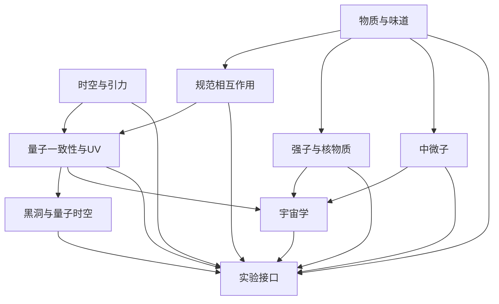

# 14 · 全物理依赖图与量子挠率首个可复算切片

> 日期：2026-10-09  
> 状态：全物理问题地图 + 最小 Einstein–Cartan–Dirac 挠率积分的条件推导。平方配方和高斯消去可复算；从完整 24 分量 contorsion 到下述归一化局部项的逐指标展开仍需单独补算。此工作不等于量子引力 UV 完备或四力统一已完成。
> **进展（2026-10-09，续）：** 完整 contorsion 指标展开、二次不变量约化、轴挠率耦合判据、手征 Fierz 基底与 SM 手征四费米匹配，以及该切片范围的量子约束/反常审计，已在[15 卷](15_挠率算符基底与SM手征匹配_量子约束与反常审计_2026-10-09.md)完成并由零依赖验证器 `验证脚本/torsion_operator_basis.py` 逐项固化（9/9 PASS）。本卷 §2.3 自述的「Fierz/群指标/反对易约化都没做」中 **Fierz 项已补**；完整 Warsaw 独立基约化与一圈/RG/UV 仍未做。
> **进展（2026-10-10，续）：** 最小 EC 树级算符 $-\tfrac{3\kappa_g^2}{16}J_5^2$ 已**机械展开为独立规范单态矢量流四费米算符**（逐对系数规则 + 独立算符计数 120/171，含/不含 $\nu_R$），由 `验证脚本/sm_chiral_fourfermion.py` 固化（11/11 PASS），见[16 卷](16_SM手征四费米匹配_J5平方展开_2026-10-10.md)。§2.3 点名的「SM 手征算符匹配」在矢量流层面已闭合；完整 SMEFT 独立基（Fierz+EOM+色解耦）与一圈/RG/UV 仍未做。

[量子统一研究规格](13_量子引力与四力统一_研究规格和可检验方程_2026-10-09.md) · [EC + SM 共同变分方程](12_共同变分场方程_全维推导验证与螺旋边界_2026-10-09.md) · [空间螺旋几何化攻关判据](空间螺旋几何化统一场论/43_宇宙几何化与四力统一_物理攻关判据及路线图_2026-10-09.md)

## 1. “全物理体系”的模块地图

要避免把不同层次的问题塞进一条方程，完整理论至少要覆盖以下层级。依赖关系表示先后逻辑，不表示这些问题已经解决。

| 模块 | 要描述的自由度/现象 | 统一框架必须给出的结果 | 当前基线/缺口 |
|---|---|---|---|
| M1 时空与引力 | vierbein、度规、自旋联络、引力波、强场 | 经典 GR/EC 极限、约束与传播谱 | EC + SM 共同作用量已列；量子 UV 完备未有 |
| M2 规范相互作用 | $SU(3)_C\times SU(2)_L\times U(1)_Y$ 及破缺 | 规范表示、耦合、Ward 恒等式、质量本征态 | SM 结构作输入；母群与耦合统一未由螺旋推出 |
| M3 物质与味道 | 手征费米子、三代、Higgs、混合 | 反常消除、质量/混合矩阵及来源 | Yukawa 与混合参数仍是输入 |
| M4 强子与核物质 | QCD 非微扰、禁闭、手征破缺、核力 | 从 QCD 到强子/核有效理论的匹配 | 微观 QCD 已知；低能多体计算需非微扰方法 |
| M5 中微子 | 质量、振荡、Dirac/Majorana 性质 | 与振荡数据匹配的质量机制及新预言 | 最小 $\nu_R$ 只是选择，不是机制推导 |
| M6 宇宙学 | 暗物质、暗能量、暴胀/初始条件、结构形成 | 背景演化、扰动谱、成分丰度与数据联合拟合 | 标准宇宙学含经验输入；本理论未解释暗部门 |
| M7 黑洞与量子时空 | 熵、信息、奇点、视界附近量子态 | 可定义的量子态/振幅、熵与可观测关系 | 仍属量子引力未解区域 |
| M8 量子一致性与 UV | 量子测度、反常、幺正性、重整化群 | 完备量子定义、有限预测参数或明确 EFT 截断 | 量子 EFT 可用于低能；Planck 尺度完成机制未定 |
| M9 实验接口 | 粒子、原子、引力波、宇宙学、天体物理 | 预注册数值预测、误差与排除阈值 | 本项目尚无超出基线的独立新数值预测 |



> **2026-10-09 修订（机器核账 A1/A3/A5）：** 原图用 `Q`/`BH`/`COS`/`EXP` 四个别名节点承载 M8/M7/M6/M9 的标签，同时又让 `M6/M7/M8` 以裸编号出现在"→ EXP"里 ⇒ 9 个模块画成了 12 个节点，其中 M6/M7/M8 被拆成两个互不相干的副本：别名副本只进不出（吞掉上游入边、且到不了 M9），裸编号副本只出不进（入度为 0）。字面读法会把"量子一致性/黑洞/宇宙学"读成没有上游依赖的独立起点，与表格口径冲突。现改为一个模块一个节点、编号与节点一一对应，边集语义不变。

**验收原则：** M1–M8 有各自可计算定义后，M9 才能比较。一个现象“能写成几何量”不代表它已由该理论解释；只有参数来源和独立预测也闭合，才算理论解释。

## 2. 首个可复算切片：最小 EC 中挠率是辅助场

本节只处理：四维、最小 Hilbert–Palatini Einstein–Cartan 引力，耦合对称化的最小 Dirac 费米子；暂不加入 Holst/非最小项、独立挠率平方耦合或传播挠率。将联络分解为 $\omega=\overset\circ\omega(e)+K$ 后，最小模型里的 contorsion $K$ 无导数项；费米子只耦合其完全反对称部分。整体符号依号差、曲率及轴流定义而变；以下直接**定义轴矢量挠率变量 $S_\mu$ 的归一化**，使由该标准最小模型约定得到的局部扇区写成

$$\mathcal L_S=e\left[+\frac{3}{4\kappa_g^2}S_\mu S^\mu-\frac34 S_\mu J_5^\mu\right],\qquad
J_5^\mu=\sum_r\left(\bar\psi_{R,r}\gamma^\mu\psi_{R,r}-\bar\psi_{L,r}\gamma^\mu\psi_{L,r}\right),\qquad
\kappa_g^2=8\pi G=M_{\rm Pl}^{-2}.$$

该式是选定作用量与 $S_\mu$ 归一化后的**最小模型扇区**，不是任意挠率理论的普遍项。最小 Dirac 耦合只使完全反对称（轴矢量）挠率部分与轴流耦合；其余代数挠率分量没有独立传播动能。

### 2.1 经典代数解与平方配方

对 $S_\mu$ 作代数变分：

$$\frac{1}{e}\frac{\delta S}{\delta S_\mu}=+\frac{3}{2\kappa_g^2}S^\mu-\frac34J_5^\mu=0
\quad\Longrightarrow\quad
S^\mu=\frac{\kappa_g^2}{2}J_5^\mu.$$

等价地，完成平方：

$$+\frac{3}{4\kappa_g^2}S^2-\frac34S\!\cdot\!J_5
=+\frac{3}{4\kappa_g^2}\left(S-\frac{\kappa_g^2}{2}J_5\right)^2
-\frac{3\kappa_g^2}{16}J_{5\mu}J_5^\mu.$$

所以在上述明示约定下，消去辅助挠率后的树级有效作用量是

$$S_{\rm eff}=S_{\rm GR}[e]+S_{\rm SM}[e,\overset\circ\omega,A_3,W,B,H,\psi]
+\int d^4x\,e\,\left(-\frac{3\kappa_g^2}{16}J_{5\mu}J_5^\mu\right).$$

该四费米算符是维数六，系数 $\kappa_g^2$ 的质量维数为 $-2$，故拉氏量维数 $6-2=4$。不同号差、$\gamma^5$、挠率定义或加入 Holst/非最小耦合会改变符号/系数组合；必须先固定约定再对照文献。标准 minimal EC-Dirac 给出轴流接触项、而更一般挠率 EFT 可产生更丰富流-流结构的事实，见[Diakonov、Tumanov、Vladimirov 的系统导数展开](https://arxiv.org/abs/1104.2432)及[Karananas 等人的 EC 物质耦合分析](https://doi.org/10.1103/PhysRevD.104.064036)。

将全部手征流记作 $J_R^\mu=\sum_r\bar\psi_{R,r}\gamma^\mu\psi_{R,r}$、$J_L^\mu=\sum_r\bar\psi_{L,r}\gamma^\mu\psi_{L,r}$，则 $J_5=J_R-J_L$，交叉项展开为

$$\mathcal L_{4\psi}=-\frac{3\kappa_g^2}{16}\left(J_R^2+J_L^2-2J_R\!\cdot J_L\right).$$

因此此树级切片只固定一个特定的手征流-流线性组合；它没有固定完整的 SM/EFT 四费米算符表。群指标、同味费米场的 Fierz/反对易约化和 RG 混合都还要逐项完成。

### 2.2 量子路径积分中的高斯消去

对这个**不含 $S_\mu$ 导数的二次局部核**，形式高斯积分可直接完成同一平方配方：

$$\int\mathcal DS\,\exp\!\left[i\int d^4x\,e\left(+\frac{3S^2}{4\kappa_g^2}-\frac34S\!\cdot\!J_5\right)\right]
\propto\mathcal N[e]\,\exp\!\left[i\int d^4x\,e\left(-\frac{3\kappa_g^2}{16}J_5^2\right)\right].$$

此处“精确”仅指对指定的 $S$ 高斯变量积分；$\mathcal N[e]$ 是局部核行列式，其正则化可能重整化宇宙学项或其他局域反项。它没有积分掉 $e$、光子、胶子、W/Z、Higgs 或费米子，也没有量子化度规，更没有定义 Planck 尺度 UV 完备理论。加入 $T^2$、曲率平方导致的导数核或非最小耦合后，这个简单局部代数消去就须重算，不能沿用本式。

**测度口径（2026-10-09 补，机器核账 D2–D4）：** $\mathcal N[e]$ 的**函数形式取决于 $S$ 的测度定义**。取朴素坐标测度 $\prod_x dS(x)$ 时，行列式给 $\prod_x e(x)^{-2}$（$S_\mu$ 有 4 个分量，每点指数 $-N_{\rm comp}/2=-2$），其对数依赖是 $\sum_x\ln e$ 而**不是** $\int d^4x\,e$：可以构造"体积和相同、乘积不同"的两组构型（例如 $e=(1,2,3,4)$ 与 $e=(1,1,4,4)$，和同为 10，积为 24 与 16），故它不能写成 $\int e$ 的仿射函数，也就不能只归入宇宙学项。只有采用以 $\int e\,S^2$ 为范数的**协变测度**，$e$ 依赖才整体抵消，剩下与格点数成正比的常数，才退化为宇宙学项反项。⇒ 上一段"可能重整化宇宙学项"这句话只在协变测度下成立；测度未声明时它是一条待定的口径，不是结论。这正是 §3"完整联络测度、Jacobian"那一行要做的事。

### 2.3 SM 手征表示中的四费米结构

对每一代，定义在各自内部表示内缩并的规范单态流：

$$j_{Q_p}^\mu=\bar Q_{Lp}\gamma^\mu Q_{Lp},\quad
j_{L_p}^\mu=\bar L_{Lp}\gamma^\mu L_{Lp},\quad
j_{u_p}^\mu=\bar u_{Rp}\gamma^\mu u_{Rp},\quad
j_{d_p}^\mu=\bar d_{Rp}\gamma^\mu d_{Rp},\quad
j_{e_p}^\mu=\bar e_{Rp}\gamma^\mu e_{Rp}.$$

若包含 $\nu_R$，再加 $j_{\nu_p}^\mu$；若选最小 SM 场内容则该项不存在。于是

$$J_L^\mu=\sum_p(j_{Q_p}^\mu+j_{L_p}^\mu),\qquad
J_R^\mu=\sum_p(j_{u_p}^\mu+j_{d_p}^\mu+j_{e_p}^\mu+[j_{\nu_p}^\mu]),\qquad
J_5^\mu=J_R^\mu-J_L^\mu.$$

代回得

$$\mathcal L_{4\psi}=-a\left[(J_R)^2+(J_L)^2-2J_R\cdot J_L\right],\qquad
a=\frac{3\kappa_g^2}{16}.$$

因此：

- 同手征块 $J_R^2,J_L^2$ 的整体系数为 $-a$；
- 左右手交叉块 $J_R\cdot J_L$ 的整体系数为 $+2a$；
- 各代与各表示的流在总流平方中按上述求和出现，初始权重由统一 $J_5^2$ 固定，而非逐项另拟合。

在不做 Fierz 换道的当前写法里，这些结构属于常见 Warsaw 基底的矢量流四费米类型，共 **15 个** flavor-diagonal 线性组合：$Q_{qq}^{(1)}$、$Q_{ll}$、$Q_{lq}^{(1)}$、$Q_{uu}$、$Q_{dd}$、$Q_{ee}$、$Q_{ud}^{(1)}$、$Q_{eu}$、$Q_{ed}$、$Q_{qu}^{(1)}$、$Q_{qd}^{(1)}$、$Q_{qe}$、$Q_{lu}$、$Q_{ld}$、$Q_{le}$；颜色/弱同位旋指标在每个流内缩并。

> **补充（2026-10-10）：** 该四费米结构已按三代/各表示完全展开为独立规范单态矢量流算符并逐对验证系数，见[16 卷](16_SM手征四费米匹配_J5平方展开_2026-10-10.md)（独立算符数含/不含 $\nu_R$ 为 $120/171$，同流 $-a$、同手性 $-2a$、异手性 $+2a$）。

> **2026-10-09 修订（机器核账 C3）：** 原列举漏了 $Q_{eu}$、$Q_{ed}$ 两个右手单态跨味组合（由 $j_e\!\cdot\!j_u$、$j_e\!\cdot\!j_d$ 生成，同属 $(RR)(RR)$ 块）。现为 15/15 完整列举。若加入 $\nu_R$，条目由 15 增到 21（命名以 $\nu$SMEFT 基底为准，此处不代选）。

规范单态流只能生成上述"单态"（上标 1）结构：三重态与色八重态成员 $Q_{qq}^{(3)}$、$Q_{lq}^{(3)}$、$Q_{qu}^{(8)}$、$Q_{qd}^{(8)}$、$Q_{ud}^{(8)}$ 在本切片的树级系数**为零**。这是可证伪签名而不是缺陷：若实验看到这些成员非零且无法由 RG 混合解释，则本切片被否证。

**味道结构（本切片的可算推论）：** 各代流以"求和后进平方"的方式进入 $J_5^2$，即每个双线性内部味道对角、整体为 $\sum_{p,p'}$ 的 Tr 型结构，全部味道指标系数由同一个 $a$ 钉死 ⇒ 该算符**味道盲**。$\sum_p j_p$ 在任意味道旋转下不变（机器验证：$U^{\mathsf T}U=1\Rightarrow\sum_p j'_p=\sum_p j_p$，对上型与下型各取独立旋转亦成立）⇒ 转到质量基后形式不变 ⇒ **树级不产生 FCNC**。环路 Yukawa 混合仍可在更低量级重新引入味破坏，但其量级被 $\kappa_g^2$ 压低，不可观测。

Warsaw 完整独立基底的建立还要用费米统计和 Fierz 关系消除冗余；本条列举只是识别当前结构的落点，不等于完成了全基底约化。[Grzadkowski 等人的维数六基底](https://arxiv.org/abs/1008.4884)。

### 2.4 费米子方程的有效修正

在本文 $-3\kappa_g^2J_5^2/16$ 拉氏量约定下，对 $\bar\psi_r$ 变分得到轴流立方项：

$$i\gamma^\mu\overset\circ D_\mu\psi_r
-\frac{\partial V_{\rm mass+Yukawa}}{\partial\bar\psi_r}
-\frac{\partial\mathcal L_{\rm other}}{\partial\bar\psi_r}
-\frac{3\kappa_g^2}{8}J_{5\mu}\gamma^\mu\gamma^5\psi_r=0,$$

再按手征投影 $P_{L/R}$ 取相应 Weyl 方程；$\overset\circ D_\mu$ 包含该场的内部表示协变导数。

费米子质量/Yukawa 的符号依原作用量定义；最后一项来自 $\partial J_5^2/\partial\bar\psi_r=2J_{5\mu}\gamma^\mu\gamma^5\psi_r$。每个双线性中的内部指标须按表示缩并成规范不变量。将所有 SM 手征表示整理到独立规范不变的四费米算符基底时，还要施加群指标收缩、费米统计、Fierz 恒等式及方程运动约化；本节没有宣称已经产生完整 SMEFT/WET 基底或跑动系数。

### 2.5 量级与可观测性边界

由于 $\kappa_g^2=M_{\rm Pl}^{-2}$，接触系数绝对值为 $3/(16M_{\rm Pl}^2)$。若定义 $|C_{4\psi}|=1/\Lambda_{\rm EC}^2$，则

$$\Lambda_{\rm EC}=\frac{4}{\sqrt3}M_{\rm Pl},\qquad
\frac{|\mathcal L_{4\psi}|}{|\mathcal L_{\rm kin}|}\sim\frac{3}{16}\left(\frac{E}{M_{\rm Pl}}\right)^2.$$

这个接触尺度已经高于 reduced Planck scale，因此不能把该 EFT 外推到接触相互作用“变大”的区间；那恰是量子引力 UV 补全尚未给出的区域。普通粒子能标下该修正极小。若要讨论高密度宇宙态，需给出 EFT 截断仍成立的证明，以及完整的费米子算符平均；不能用经典“自旋流体”平均替代量子费米子平均。系统展开研究指出二者可能不同，并对可观测性给出谨慎结论。[原始研究](https://arxiv.org/abs/1104.2432)。

**口径声明与数值（2026-10-09 补，机器核账 E1–E7，CODATA2022 字面量、Decimal 定点复算）：** 上式与全文的 $M_{\rm Pl}$ 必须是**约化**普朗克质量 $M̄_{\rm Pl}=\sqrt{\hbar c/(8\pi G)}$；若改用非约化 $M_{\rm Pl}=\sqrt{\hbar c/G}$，同一公式给出的数值相差 $\sqrt{8\pi}=5.0133$ 倍。机器读数：

- $M̄_{\rm Pl}=2.4353\times10^{18}$ GeV，$M_{\rm Pl}=1.2209\times10^{19}$ GeV，比值 $5.0133$（与 $\sqrt{8\pi}$ 一致）；
- $\Lambda_{\rm EC}=(4/\sqrt3)M̄_{\rm Pl}=5.6241\times10^{18}$ GeV，$\Lambda_{\rm EC}/M̄_{\rm Pl}=2.3094$；
- 接触系数 $a=3/(16M̄_{\rm Pl}^2)=3.1615\times10^{-38}\ {\rm GeV}^{-2}$，反解 $1/\sqrt a$ 与 $\Lambda_{\rm EC}$ 逐位一致；
- 与弱有效相互作用强度 $G_F/\sqrt2=8.2475\times10^{-6}\ {\rm GeV}^{-2}$ 同量纲可直接比：**比值 $3.83\times10^{-33}$**；
- 以现有约 10 TeV 量级的接触（复合）相互作用灵敏度为参照，要让该接触项达到同量级需灵敏度提升约 **$3.16\times10^{29}$ 倍**（10 TeV 是声明的外部输入，不是本理论推出的）；
- $|\mathcal L_{4\psi}|/|\mathcal L_{\rm kin}|$ 读数：1 TeV $\to3.16\times10^{-32}$，13.6 TeV $\to5.85\times10^{-30}$，$10^{10}$ GeV $\to3.16\times10^{-18}$。

⇒ 这条 dim-6 接触项在 M9 意义上是"有确定系数、但比现有接触相互作用灵敏度低约 30 个量级"的预言；它可以用作**一致性约束**（系数被 $\kappa_g^2$ 唯一钉死，无自由参数可调），但不能作为本项目已给出的可观测新信号。

## 3. 从本切片到全理论还差什么

| 关口 | 本节所得 | 仍需的实际计算 |
|---|---|---|
| 自由度/约束 | 最小模型中 $S_\mu$ 为辅助变量 | 全部 vierbein/联络的 Hamilton/BRST 约束与物理态计数 |
| 挠率量子积分 | 指定轴矢量局部二次核的高斯消去 | 完整联络测度、Jacobian、规范固定和反常审计 |
| contorsion/手征基底 | 完整 contorsion 展开、$T^2$ 约化、轴耦合判据、$(V-A)$ Fierz 与 16 基完备性（→ [15 卷](15_挠率算符基底与SM手征匹配_量子约束与反常审计_2026-10-09.md)，9/9 PASS） | 味/群指标 + 费米统计 + EOM 的完整 Warsaw 独立基约化；一圈/RG/UV |
| 量子修正 | 给出树级确定的一个 dim-6 结构 | 环图反项、混合与 RG 跑动、规范不变算符匹配 |
| UV 完备性 | 无 | 展示可靠固定点、其他 UV 构造，或诚实声明仅为 EFT |
| 四力统一 | 共同变量仍可写在 $\delta\Gamma/\delta\Phi=0$ | 推出母群/几何结构、耦合与手征物质，不能只拼接直和群 |
| S12 来源 | 尚无场映射 | 推导螺旋场到 vierbein/联络/内部表示及新预测 |
| 全宇宙物理 | 给出 M1–M9 问题图 | 逐个处理暗部门、初始条件、强子物理、黑洞量子态与观测拟合 |

## 4. 本轮结论

1. 最小 EC-Dirac 模型内，轴矢量挠率是代数辅助场；经典消去与其量子高斯积分在树级生成同一局部轴流—轴流四费米算符。
2. 这个结果是有明确假设的一块低能拼图；不是传播的“挠率量子粒子”、不是完整量子引力、更不是新的四力统一方程。
3. “全物理体系”依赖关系已列成 M1–M9 地图。完整 contorsion 展开、手征 Fierz 基底与量子约束/反常审计已在[15 卷](15_挠率算符基底与SM手征匹配_量子约束与反常审计_2026-10-09.md)闭合；下一步应做一圈闭合与 RG 跑动，再做约束/BRST 和谱分析；UV 完备性与新实验预测须继续单列验收。
4. **约定层已机器核账（§5，33 条目 / PASS 30 / FAIL 0 / BOUNDARY 2 / INFO 1）：** 本轮修掉两处真实文档缺陷——依赖图把 9 个模块画成 12 个节点（M6/M7/M8 被拆成互不相干的两个副本）、算符列举漏 $Q_{eu}$ 与 $Q_{ed}$；并把 $M_{\rm Pl}$ 的约化口径、路径积分测度口径、可观测性量级补成显式声明。剩下两条 BOUNDARY 是“可证伪签名”与“待定口径”，不是缺陷。

## 5. 机器核账（2026-10-09）

仪器：[`验证脚本/ufec14_convention_audit.py`](验证脚本/ufec14_convention_audit.py) —— 零第三方依赖（精确多项式用 `fractions`，物理常数用 `decimal` 定点），**读侧**直接从本文件正文解析 mermaid 图与算符列举；产出 [`验证脚本/ufec14_convention_audit.json`](验证脚本/ufec14_convention_audit.json)。详表见[14A 卷](14A_挠率切片约定审计与全依赖图机器核账_2026-10-09.md)。

```bash
cd openuft/07_统一场方程/验证脚本 && python -B ufec14_convention_audit.py
```

**当前：33 条目 — PASS 30 / FAIL 0 / BOUNDARY 2 / INFO 1，退出码 0。** 修前读数 PASS 26 / FAIL 4（A1、A3、A5、C3），四处已全部按门禁修入上文。

| 组 | 核的是什么 | 读数 |
|---|---|---|
| A 依赖图 | 正文 mermaid 图与 M1–M9 模块表是否一致 | 修前 12 节点/9 模块、M6/M7/M8 各被拆成两个互不相干的副本、别名副本到不了 M9；修后 9 节点、入度为 0 的只有 M1/M3、每个模块都能到 M9、无环、M9 为汇点 |
| B 约定/量纲 | Dirac 代数、$S_\mu$ 归一化、平方配方、变分解、EOM 系数 | 全 PASS。$[S]=1$ 由 L_S 两项同维**分别**解出且一致（与 $[T]=1$ 相符，手算这里极易出错）；平方配方是含体积权重的精确恒等式；二次核非退化 $∂²L/∂S²=(3/2)/\kappa_g^2$；手征块系数 $-3/16,\,-3/16,\,+3/8$ |
| C 算符落点 | SM 手征流落到的矢量流型条目数与味道结构 | 15（含 $\nu_R$ 为 21）；修前缺 $Q_{eu},Q_{ed}$；非单态成员树级为零（可证伪签名）；味道系数全等 ⇒ 树级无 FCNC |
| D 测度口径 | $\mathcal N[e]$ 的函数形式随测度而变 | 朴素测度给 $\sum\ln e$（已构造"和相同、积不同"的反例，证明它不能写成 $\int e$ 的仿射函数），协变测度才退化为宇宙学项 ⇒ 文档那句话必须声明测度 |
| E 能标/M9 | 约化 vs 非约化普朗克质量、$\Lambda_{\rm EC}$、与弱作用强度及现有灵敏度的比 | 见 §2.5 数值清单；$\Lambda_{\rm EC}=5.62\times10^{18}$ GeV 只在约化口径下成立，换口径差 $\sqrt{8\pi}=5.0133$ 倍 |

**与相邻仪器的分工：** 同目录 `torsion_operator_basis.py` 负责 24 分量 contorsion 指标代数、$T^2$ 约化、$(V-A)$ Fierz 与 16 基完备性（→ [15 卷](15_挠率算符基底与SM手征匹配_量子约束与反常审计_2026-10-09.md)）；本仪器负责归一化约定、量纲、算符落点、测度口径、能标数值与依赖图拓扑。二者**互不共享代码** ⇒ 同一结论有两条独立出处。

## 参考资料

- D. Diakonov, A. G. Tumanov, A. A. Vladimirov, [Low-energy general relativity with torsion: a systematic derivative expansion](https://arxiv.org/abs/1104.2432), *Phys. Rev. D* 84, 124042 (2011)。
- B. Grzadkowski, M. Iskrzyński, M. Misiak, J. Rosiek, [Dimension-Six Terms in the Standard Model Lagrangian](https://arxiv.org/abs/1008.4884), *JHEP* 10 (2010) 085。
- G. K. Karananas, M. Shaposhnikov, A. Shkerin, S. Zell, [Matter matters in Einstein-Cartan gravity](https://doi.org/10.1103/PhysRevD.104.064036), *Phys. Rev. D* 104, 064036 (2021)。
- J. F. Donoghue, [General relativity as an effective field theory: the leading quantum corrections](https://arxiv.org/abs/gr-qc/9405057), *Phys. Rev. D* 50, 3874 (1994)。
