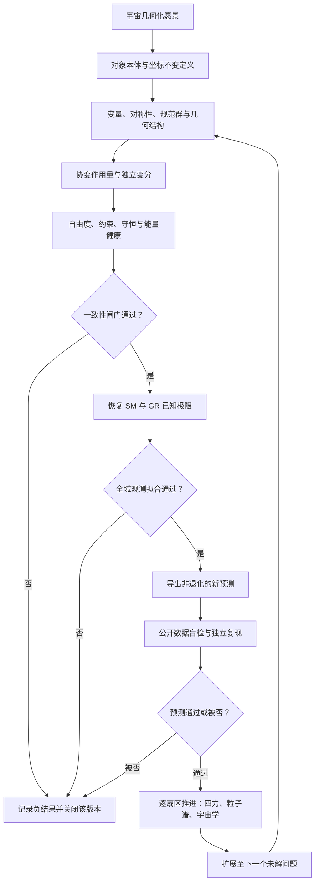

# 43 · 宇宙几何化与四力统一：物理攻关判据及路线图

> 日期：2026-10-09  
> 定位：承接 39–42 号总纲、负结果与纵波判据，明确“攻破物理”必须跨越的定理、动力学、现象学和实验关口。  
> 结论等级：**研究目标与审计路线**，不是新物理结果，也不宣称四力统一或未解之谜已被解决。

[39 总纲](39_全维度统一场论_总纲与整合_2026-10-07.md) · [40 路线规划](40_全维度分析与最优路径规划_2026-10-07.md) · [41 Q-ball 负结果](41_电荷约束Q-ball决定性负结果_2026-10-07.md) · [42 纵波对撞](42_纵波L3实验设计_对撞Langmuir_2026-10-09.md) · [UFE-2 正典与排除清单](26_UFE2_正典_统一场方程正确子集规范_2026-10-03.md)

---

## 0. 结论先行

“把宇宙几何化、统一四力、解决所有未解问题”是一个**远期目标集合**，不是目前已经获得的理论结果。现有材料能支持的最强结论是：圆柱螺旋有可复核的几何恒等式；UFE-2 的一个正确子集能组织若干电磁关系；若干 TUFT 场和孤子路径经审计被缩窄、否定或标为开放。项目自己的最新总纲仍登记 **L3 可检验预言计数为 0**。

本轮最重要的推进不是再把更多现象叫作“几何”，而是指出第一道物理门槛：**最新 UFE-2 纵波候选必须先通过源项、Gauss/Ampère 约束、能量通量和等离子体色散的一致性审查，之后才值得做实验。** 若过不了，就明确收窄或撤回该分支；把冲突藏在“特殊真空态”措辞里不算统一。

## 1. “四力统一”必须指什么

标准模型的强、弱、电磁相互作用由局域规范结构组织；引力在广义相对论中由时空几何与能量—动量相联系。[PDG 标准模型综述](https://pdg.lbl.gov/2025/reviews/rpp2025-rev-standard-model.pdf)；[Einstein 方程与时空曲率](https://www.einstein-online.info/en/explandict/einsteins-equation/)。因此，四力统一至少要完成下列工作，而不是只写一个总名称或一个含多个场的方程：

1. 从同一个定义良好的几何/代数起点给出自由度、场的变换律与作用量。
2. 推导出正确的低能规范结构与物质表示：电磁、弱、强三扇区的规范群、荷、手征结构、粒子谱与相互作用。
3. 推导引力的度规/联络动力学，并在弱场、太阳系、双星和引力波极限恢复已验证结果。
4. 解释各耦合、质量、混合角和尺度从何而来，区分输入、拟合与真正推导出的数值。
5. 给出至少一项相对标准模型 + GR 的**非退化新预测**，说明误差、适用域、参数先验和可失败阈值。

曲率、挠率、相位、涡量可以是有用的几何变量，但对象身份必须从定义和变分推导得出。三维轨迹的 Frenet 曲率/挠率、时空联络的曲率/挠率、规范联络的场强是不同数学对象；共享符号或量纲不等于统一。挠率是几何结构的一种可能变量，不是标准意义下与强、弱、电磁、引力并列的“第五种/第四种力”。

## 2. 当前路线逐项裁决

| 子路线 | 仓库内现有结果 | 可以保留的内容 | 下一道硬门槛 |
|---|---|---|---|
| 光速螺旋几何 | 在明确的欧氏圆柱螺旋参数化下，曲率、挠率和频率满足条件性恒等式 | 数学几何与量纲关系 | 把“空间本身运动”变成坐标不变、可耦合、可测的定义；说明观察者、切片和被追踪对象 |
| UFE-2 电磁扇区 | 正典已将矢势身份定为电磁；若干关系可由其本构式推出，但 Gauss 定律是外部输入，$\vec A=\vec v$ 是物理假设 | 电磁方程的条件性重写/候选扩展 | 从作用量独立推导本构和源项；恢复规范冗余或证明替代自由度健康；完整验证荷守恒、能动张量和实验边界 |
| $f$ 磁通标定 | $f=m_e/(2e)$ 由“单电子螺旋磁通等于超导磁通量子”得到 | 可登记为候选参数识别 | 论证 Cooper 对磁通量子 $h/2e$ 为何适用于单电子轨迹，而非把待证物理对应塞入前提；对独立数据作盲预测 |
| UFE-2 纵向波 | 形式色散 $\omega=V_zk$ 与 Langmuir 长波色散不同；最新对照已指出等离子体低频截止冲突 | 一个清晰的可否证候选 | 先完成下节源项与真空一致性审计；明确适用介质、源、能量定义及完整响应函数 |
| 质荷与标量孤子 | 原始无质量项势没有有限荷局域 Q-ball；代数质荷式不等于数值粒子模型 | 负结果、代数恒等式、扩展模型可作为新分支 | 原稿分支应保持关闭；若扩展势，需重新变分、给出有限能量/荷解、稳定性和独立质量荷预测 |
| Einstein–Cartan 挠率 | 仓库中自旋源与挠率关系可在明确理论前提下推导；纯复标量场不自动具有所需内禀自旋流 | 条件性的 EC 几何关系 | 指定正确物质表示与自旋流；证明与费米物质相符；处理实验限制，不能拿标量包络直接替代费米自旋 |
| 引力统一扇区 | 23 式正典把若干原“引力场”公式判为量纲失败，并撤下 UFE-2 矢势的引力身份 | 失败记录与重建需求 | 从新作用量重新导出度规/联络方程；恢复牛顿、PPN、引力波传播与能量守恒；与 GR 数据联合拟合 |
| 量子层 | 单圈 $\phi^4$ 系数复现标准结果；完整引力—挠率 RG 系统未闭合 | 可复算的已知结果 | 给出完整自由度、规范固定、鬼场、正规化方案、可重整/EFT 截断和可观测的 RG 结果；重现标准模型量子极限 |

## 3. 纵波分支：先做一致性审计，再谈实验

42 号报告使用近似 Langmuir 色散 $\omega^2\simeq\omega_p^2+3k^2v_{\rm th}^2$。在弱阻尼、长波的经典等离子体域，它有非零等离子体频率 $\omega_p$；这与候选式 $\omega=V_zk$ 在 $k\to0$ 时归零的行为不同。两者不是“把仪器调一调”就能同时成立的同一个介质模态。

还必须先查一个更基础的条件分支。若候选纵波被说成**无源真空中的时变电场**，并同时要求 $\vec B=0$、$\vec E\parallel\vec k$，那么 Maxwell 方程给出：

$$\nabla\cdot\vec E=0,\qquad \nabla\times\vec B=\mu_0\vec J+\frac{1}{c^2}\partial_t\vec E.$$

源自由真空 $\vec J=0$ 且 $\vec B=0$ 时，第二式要求 $\partial_t\vec E=0$；非零、时变的纵向场不能按标准 Maxwell 真空解传播。若 $\nabla\cdot\vec E\ne0$，则必须提供电荷源；若介质电流抵消位移电流，则必须把介质动力学纳入模型。若 UFE-2 主张修改 Maxwell 方程，也必须直说并给出完整作用量、守恒律与可区分预测，不能一边借用 Maxwell 约束、一边删掉冲突项。

### 纵波分支的闸门顺序

1. **定义对象**：电场的纵向模、带源近场、等离子体集体模，还是新的真空自由度？四者不能混称。
2. **写全方程**：给出场方程、Gauss 约束、源连续方程和介质响应；禁止只对单一平面波 Ansatz 代入。
3. **推导能量与通量**：由同一作用量得到正定能量、守恒流和群速度。$\vec S=0$ 只说明标准电磁 Poynting 向量为零；若另有能流，必须从应力—能量张量导出。
4. **恢复已知极限**：复现 Langmuir/Bohm–Gross 模型中适用域的色散；或者限定一个明确的真空/介质条件，并证明它没有与 Gauss、Ampère、荷守恒或实验冲突。
5. **再设计实验**：预注册频率—波数关系、近场电场方向、磁场上限、背景等离子体密度依赖和误差模型。测到“纵向信号”本身不足以识别新理论，因为经典带源近场与等离子体也有纵向响应。

任一闸门失败即停止该版本的实验升级；只允许在清楚标注“模型修订”的新版本中重开。

## 4. 宇宙几何化要面对的经验账本

“所有未解之谜”不是一个单一问题。应把已确立的观测事实与其理论解释分开登记：

| 问题域 | 已知事实/现状 | 几何化理论必须额外解释什么 |
|---|---|---|
| 强、弱、电磁相互作用 | 标准模型用局域规范结构组织并通过大量实验检验 | 推出正确规范群、表示、手征性、耦合和散射结果，而非只重命名势场 |
| 引力 | GR 以时空几何描述引力；强场和引力波持续提供检验 | 量子一致性或明确低能 EFT；保留等效原理及太阳系、脉冲星、引力波极限 |
| 暗物质 | 多类引力/结构观测指向非重子暗成分，但微观本体未知 | 同时拟合结构形成、CMB、引力透镜、星系团和局域搜索；修改引力须全球一致 |
| 暗能量/宇宙加速 | 标准宇宙学的 $\Lambda$ 描述与数据相容，微观来源仍不明 | 从几何/场动力学推出状态方程、演化和扰动，并解释尺度为何如此小 |
| 中微子 | 振荡确立非零质量平方差和混合；绝对质量尺度及 Dirac/Majorana 性质仍待定 | 给出质量机制、混合参数和可测的无中微子双 β 衰变或其他判据 |
| 物质—反物质不对称 | 宇宙以物质为主；标准热史要求重子数破坏、C/CP 破坏及非平衡等条件 | 具体机制须从模型参数推出正确不对称量并满足实验约束 |
| 量子引力 | GR 与量子场论的完整高能结合尚无已验证的实验理论 | 自洽 UV/有效描述、幺正/因果性、黑洞与宇宙学极限及可观察效应 |
| 味道、层级与强 CP 等 | 参数结构精确已知但深层来源仍有理论问题 | 从对称性/拓扑/几何推导参数，不能用自由函数逐项拟合后宣称解释 |

经验边界由 Particle Data Group 的标准模型、中微子、暗物质、暗能量与宇宙学综述持续更新：[标准模型](https://pdg.lbl.gov/2025/reviews/rpp2025-rev-standard-model.pdf)、[中微子](https://pdg.lbl.gov/2025/reviews/rpp2025-rev-neutrino-mixing.pdf)、[暗物质](https://pdg.lbl.gov/2025/reviews/rpp2025-rev-dark-matter.pdf)、[暗能量](https://pdg.lbl.gov/2025/reviews/rpp2025-rev-dark-energy.pdf)、[大爆炸宇宙学与重子生成](https://pdg.lbl.gov/2025/reviews/rpp2025-rev-bbang-cosmology.pdf)。这些综述说明的是问题边界与现有约束，不替任何新模型背书。

## 5. 可落地的攻关顺序与停止条件

### 第 I 阶段：冻结定义，建立统一基准

- 固定“螺旋”的对象身份：世界线、场相位线、流线、刚体姿态或空间切片中的哪一个。
- 固定时空符号、单位、维数、观察者、规范群、场内容和变量量纲。
- 建立可机器核验的主张账本：公设、恒等式、推导、近似、拟合输入、实验预言、负结果分列。
- 将同一结论的所有版本连到唯一正典；历史稿不能覆盖较新否定判据。

**停止条件**：变量身份、规范变换或方程量纲未确定，不进入拟合和实验预测。

### 第 II 阶段：先让一个最小模型健康

为每个候选作用量完成：变分独立复核、Hamiltonian/能量下界、约束闭合、自由度计数、特征锥/双曲性、因果性、线性稳定性、守恒律及初边值适定性。对粒子候选再要求有限总能、有限荷、可控辐射和全谱稳定性。

**停止条件**：出现鬼自由度、负能不稳定、约束传播失败、无限能量尾部或源守恒矛盾时，关闭该版本，不以数值收敛掩盖解析缺陷。

### 第 III 阶段：先恢复已知物理，再寻找新物理

- 电磁：完整 Maxwell/QED 低能极限、规范不变性、荷守恒、辐射与散射。
- 弱/强：正确的非阿贝尔规范结构、手征物质、异常消除、QCD/电弱观测量。
- 引力：牛顿极限、PPN、等效原理、引力波速度/偏振/色散及强场双星。
- 宇宙学：BBN、CMB、增长结构、透镜和背景膨胀史共同拟合。

**停止条件**：若只通过把标准方程逐项写成几何记号才能恢复数据，它是重述，不是新统一；若新项破坏已测极限，须先被排除或明确受限。

### 第 IV 阶段：挑一个能真正区分模型的预测

冻结参数来源和先验后，输出对照表：基准模型预测、新理论预测、差值、误差、主要系统误差、公开数据/复现流程、排除阈值。先用现有公开数据做盲检和留出样本；有剩余区分度后再提出专门实验。

**停止条件**：预测依赖事后调参、使用了定义恒等式、或与标准模型在可达精度内完全相同，就不登记为独立预言或 L3。

### 第 V 阶段：逐题解决宇宙学与粒子物理开放问题

每个问题单独立项、单独证伪，不声称一条几何关系同时解释所有问题。建议优先级：

1. **纵波一致性**：先判定候选是源自由模还是带源/介质模，完成 Maxwell/Langmuir 对照。
2. **引力扇区**：以协变作用量重构，并先过 GR 弱场/引力波约束；这是“四力统一”的必要瓶颈。
3. **物质谱与自旋**：解决标量 Q-ball 失败后，比较真正带费米表示/拓扑荷的模型；核验量子数、统计、自旋—挠率耦合。
4. **一个宇宙学目标**：暗物质、暗能量、物质不对称或暴胀择一，给出全数据联合似然和相对 ΛCDM/标准模型的增益。
5. **量子闭合**：在明确 EFT 或 UV 完备目标后计算可观测 RG/散射，不把复现已知单圈系数说成新预言。

## 6. 底层攻关关系图

图的逻辑是串联闸门，不是“从几何直接跳到万物统一”。任何一关的失败都应缩小结论范围；通过单个扇区不自动认证其他扇区。

## 7. 本轮审计产出与当前状态

1. **把目标拆成可判定标准**：四力统一需同时有共同结构、正确已知极限、源/物质表示和新预测。
2. **确定最新短板**：UFE-2 纵波的 Langmuir 冲突之外，还须面对真空 Gauss/Ampère 条件和能量通量定义；现阶段先做理论一致性，不先宣称实验突破。
3. **保留负结果**：原始 Q-ball 路线、既有量纲失败和撤销引力身份均进入路线图，不以模型改名恢复。
4. **防止过度宣称**：圆柱螺旋 Frenet 恒等式、标准 $\phi^4$ 单圈系数、条件性 Maxwell 关系均不单独构成宇宙统一证据。
5. **量化状态**：依 39/40/42 号本地审计口径，当前仍无通过观测的 L3 新预言；本报告本身不修改 claims.csv，也不提升证据等级。

## 参考与仓库内证据

- [39 · 全维度统一场论总纲](39_全维度统一场论_总纲与整合_2026-10-07.md)：系统组成、开放边界与 L3=0 声明。
- [40 · 全维度分析与最优路径规划](40_全维度分析与最优路径规划_2026-10-07.md)：参数标定候选及引力/量子/可观测性缺口。
- [41 · 电荷约束 Q-ball 决定性负结果](41_电荷约束Q-ball决定性负结果_2026-10-07.md)：原势下有限荷局域解失败。
- [42 · 纵波 L3 实验设计与 Langmuir 对撞](42_纵波L3实验设计_对撞Langmuir_2026-10-09.md)：候选色散关系的已知冲突。
- [26 · UFE-2 正典与排除清单](26_UFE2_正典_统一场方程正确子集规范_2026-10-03.md)：矢势身份裁定、引力公式排除与 L3 边界。
- [PDG 2025 标准模型综述](https://pdg.lbl.gov/2025/reviews/rpp2025-rev-standard-model.pdf)、[暗物质综述](https://pdg.lbl.gov/2025/reviews/rpp2025-rev-dark-matter.pdf)、[暗能量综述](https://pdg.lbl.gov/2025/reviews/rpp2025-rev-dark-energy.pdf)、[中微子综述](https://pdg.lbl.gov/2025/reviews/rpp2025-rev-neutrino-mixing.pdf)、[大爆炸宇宙学综述](https://pdg.lbl.gov/2025/reviews/rpp2025-rev-bbang-cosmology.pdf)。

> **最终判词**：几何化是强有力的建模策略，但不是成功判据。当前路线确有可保留的数学结构，也有已记录的失败和开放假设；离“四力统一、解决所有未解问题”仍缺关键动力学、粒子内容、引力闭合和经观测通过的新预测。下一步最实在的攻关，是先完成纵波分支的零源/带源一致性审计，并独立重构引力作用量；通过之前，不把整体称为已统一理论。
