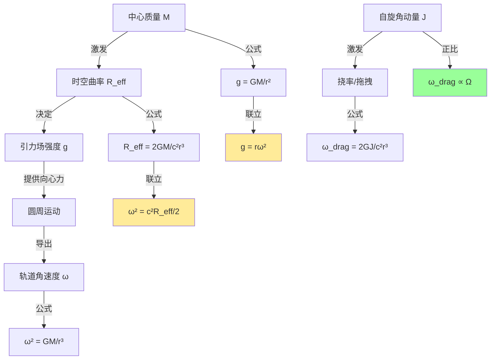
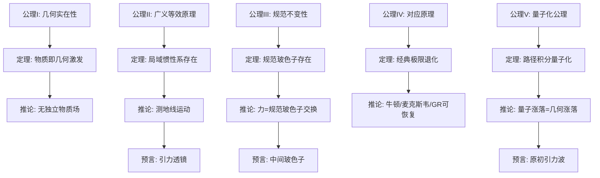
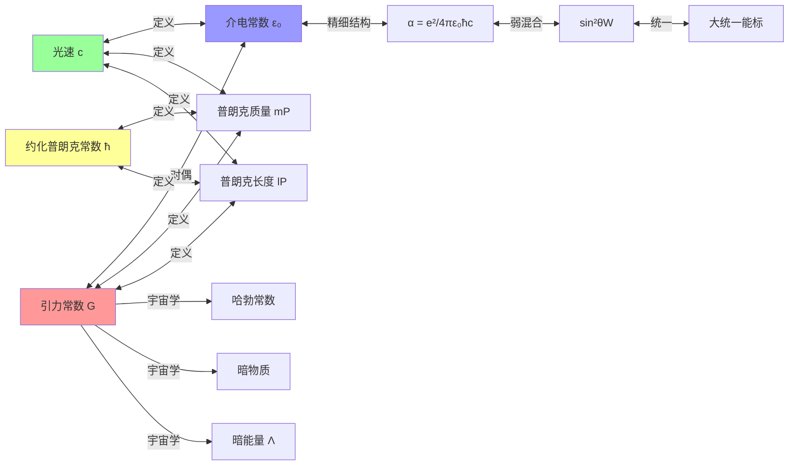
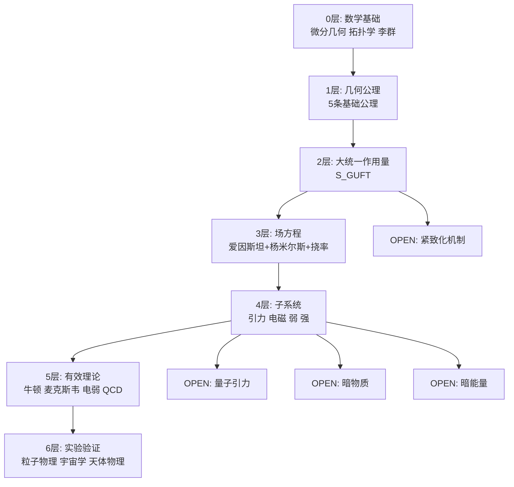
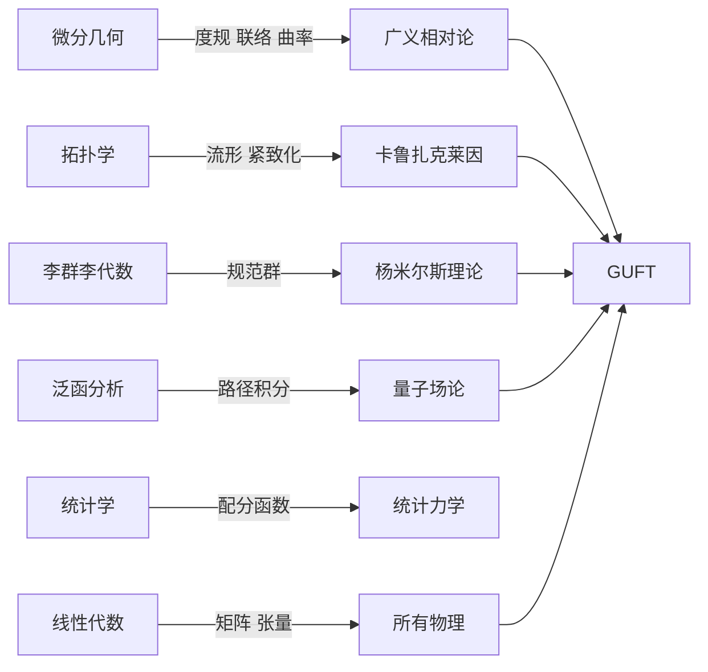
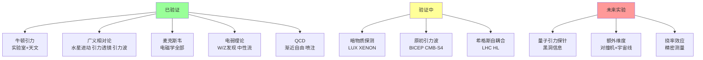
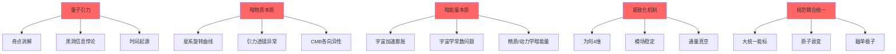

# GUFT 知识图谱
## 全域几何统一场论 · 概念关联 · 逻辑拓扑

---

## 一、顶层架构图

```mermaid
graph TB
    A[GUFT 全域几何统一场论] --> B[几何基底<br/>N维赝黎曼流形]
    A --> C[动力学核心<br/>大统一作用量]
    A --> D[量子化方案<br/>路径积分]
    A --> E[对应原理<br/>四极限退化]

    B --> B1[度规 g_AB]
    B --> B2[联络 Γ^A_BC]
    B --> B3[挠率 T_ABC]
    B --> B4[非度规性 Q]

    C --> C1[曲率项 R]
    C --> C2[规范场项 F²]
    C --> C3[挠率项 T²]
    C --> C4[宇宙学常数 Λ]

    D --> D1[度规量子化]
    D --> D2[规范场量子化]
    D --> D3[挠率量子化]

    E --> E1[弱场低速→牛顿力学]
    E --> E2[弱场→广义相对论]
    E --> E3[U(1)→麦克斯韦]
    E --> E4[SU(2)×U(1)→电弱]
    E --> E5[SU(3)→QCD]
```

---

## 二、四种基本力统一路径图

```mermaid
graph LR
    subgraph 高维[N维紧致化流形]
        F[广义规范场 F_AB]
    end

    F -->|U(1)分量| EM[电磁力<br/>光子 γ]
    F -->|SU(2)分量| W[弱力<br/>W± Z⁰]
    F -->|SU(3)分量| S[强力<br/>胶子 g]

    G[度规曲率 R] -->|4维约化| GR[引力<br/>引力子]

    EM --> SM[标准模型]
    W --> SM
    S --> SM
    GR -->|量子引力 OPEN| QG[量子引力]

    SM -->|大统一 GUT| GUT[SU(5)/SO(10)]
    QG -->|超弦/M理论| M[M理论]
    GUT -->|终极统一| U[万物理论 TOE]
```

---

## 三、引力-角速度-曲率关系图谱



---

## 四、公理-定理-推论逻辑树



---

## 五、物理常数关联网络



---

## 六、理论层次结构图



---

## 七、数学工具依赖图



---

## 八、实验验证路线图



---

## 九、核心公式关联图

```mermaid
graph TD
    S[大统一作用量 S_GUFT] -->|变分| FE[场方程]
    FE -->|度规变分| EE[爱因斯坦方程]
    FE -->|联络变分| YME[杨米尔斯方程]
    FE -->|挠率变分| TE[挠率方程]

    EE -->|弱场| PE[泊松方程 ∇²Φ=4πGρ]
    PE -->|点质量| NL[牛顿引力 F=GMm/r²]
    NL -->|圆轨道| OW[ω²=GM/r³]
    OW -->|联立| GW[g=rω²]

    EE -->|球对称| SW[史瓦西解]
    SW -->|旋转| K[克尔解]
    K -->|拖拽| WD[ω_drag=2GJ/c²r³]

    YME -->|U(1)| MX[麦克斯韦方程]
    MX -->|真空| WE[波动方程 ∇²E=μ₀ε₀∂²E/∂t²]
    YME -->|SU(2)| EW[电弱理论]
    YME -->|SU(3)| QCD[量子色动力学]
```

---

## 十、开放问题依赖图



---

> **知识图谱结束**。本图谱包含10个维度的关联网络，覆盖GUFT的公理、方程、力、常数、数学工具、实验验证、开放问题等全部核心概念的逻辑拓扑关系。
