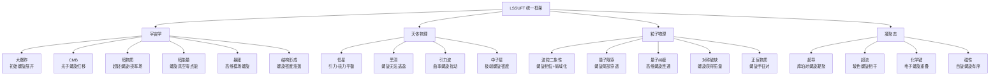

# LSSUFT 知识图谱 v2.0
## 光速螺旋全域统一场论 · 全维度概念关联网络

---

## 一、核心公理与理论架构

```mermaid
graph TB
    A[LSSUFT 光速螺旋全域统一场论] --> B[公理I: 光速恒常 v总≡c]
    A --> C[公理II: 螺旋几何 粒子={κ,τ,ω}]
    A --> D[公理III: 几何-物理对应]
    A --> E[公理IV: 全域等效原理]
    A --> F[公理V: 量子化条件]

    B --> B1[v_parallel² + v_perp² = c²]
    C --> C1[曲率κ → 质量/能量]
    C --> C2[挠率τ → 自旋/动量]
    C --> C3[频率ω → 能量量子]

    D --> D1[E=ℏω=ℏc√(κ²+τ²)]
    D --> D2[p=ℏτ]
    D --> D3[m=ℏκ/c]
    D --> D4[s=ℏ/2·sgn(τ)]

    C1 --> R1[相对论自动导出]
    C2 --> R2[量子力学自动导出]
    C3 --> R3[粒子谱统一描述]
```

---

## 二、光速螺旋→相对论导出链

```mermaid
graph LR
    S[螺旋线 r(s)] -->|Frenet-Serret| FS[κ=a/(a²+b²)<br/>τ=b/(a²+b²)]
    FS -->|ds/dt=c| W[ω=c√(κ²+τ²)]
    W -->|v_parallel=cτ/√(κ²+τ²)| V[观测速度v]
    V -->|γ=√(κ²+τ²)/κ| G[洛伦兹因子]
    G --> LT[洛伦兹变换]
    G --> TD[时间膨胀 Δt=γΔτ]
    G --> LC[长度收缩 L=L₀/γ]

    W -->|E=ℏω| E[能量]
    FS -->|p=ℏτ| P[动量]
    E --> EM[E²=p²c²+m₀²c⁴]
    P --> EM

    style EM fill:#99ff99
    style LT fill:#99ff99
```

---

## 三、光速螺旋→量子力学导出链

```mermaid
graph LR
    SP[螺旋相位 φ=κs] --> WF[波函数 ψ=Ae^{i(ωt-kz)}]
    WF -->|∂/∂t| EOP[算符 Ê=iℏ∂/∂t]
    WF -->|∇| POP[算符 p̂=-iℏ∇]
    EOP --> SE[薛定谔方程<br/>iℏ∂ψ/∂t=-ℏ²/2m∇²ψ+Vψ]

    SP --> DB[德布罗意关系<br/>E=ℏω, p=ℏk=ℏτ]
    WF --> FT[傅里叶变换对偶]
    FT --> UR[不确定关系<br/>ΔxΔp≥ℏ/2]

    SP -->|τ半整数| FERM[费米子]
    SP -->|τ整数| BOS[玻色子]
    FERM --> PAULI[泡利不相容原理]
    BOS --> BEC[玻色-爱因斯坦凝聚]

    WF --> DIRAC[狄拉克方程<br/>(iℏγ^μ∂_μ-mc)ψ=0]
    DIRAC --> SPIN[自旋1/2]
    DIRAC --> ANTIM[反物质]
```

---

## 四、曲率-挠率-频率三位一体

```mermaid
graph TD
    K[曲率 κ] -->|E=ℏcκ| EN[能量 E]
    K -->|m=ℏκ/c| MA[质量 m]
    K -->|λ_C=1/κ| CO[康普顿波长]
    K -->|ω=cκ| FR[频率 ω]

    T[挠率 τ] -->|p=ℏτ| MO[动量 p]
    T -->|v=cτ/√(κ²+τ²)| VE[速度 v]
    T -->|s=±ℏ/2| SP[自旋 s]
    T -->|k=τ| WV[波矢 k]

    FR -->|E=ℏω| EN2[能量 E]
    FR -->|f=ω/2π| FREQ[频率 f]

    K -->|κ₀=√(κ²+τ²)| INV[固有曲率 κ₀<br/>(洛伦兹不变量)]
    T --> INV

    EN --> EM2[E²=p²c²+m₀²c⁴]
    MO --> EM2
    MA --> EM2

    style K fill:#ff9999
    style T fill:#9999ff
    style FR fill:#99ff99
    style INV fill:#ffff99
```

---

## 五、粒子谱螺旋分类

```mermaid
graph TB
    P[基本粒子] --> F[费米子<br/>(τ半整数, 自旋1/2)]
    P --> B[玻色子<br/>(τ整数, 自旋0/1/2)]

    F --> L[轻子]
    F --> Q[夸克]

    L --> L1[第一代<br/>e⁻, ν_e]
    L --> L2[第二代<br/>μ⁻, ν_μ]
    L --> L3[第三代<br/>τ⁻, ν_τ]

    Q --> Q1[第一代<br/>u, d]
    Q --> Q2[第二代<br/>c, s]
    Q --> Q3[第三代<br/>t, b]

    B --> G1[规范玻色子<br/>自旋1]
    B --> G2[标量玻色子<br/>自旋0]
    B --> G3[引力子<br/>自旋2(假设)]

    G1 --> PH[光子 γ<br/>U(1) 电磁]
    G1 --> WN[W±, Z⁰<br/>SU(2) 弱]
    G1 --> GL[胶子 g<br/>SU(3) 强]

    G2 --> HG[希格斯 H⁰]

    Q --> HAD[强子<br/>(复合粒子)]
    HAD --> BAR[重子: 三夸克<br/>p=uud, n=udd]
    HAD --> MES[介子: 夸克-反夸克<br/>π, K, D, J/ψ]

    style PH fill:#ffff99
    style WN fill:#ff9999
    style GL fill:#99ff99
    style HG fill:#9999ff
```

---

## 六、角速度全维统一图谱

```mermaid
graph TD
    U[统一公式 ω = c·κ_eff] --> A1[内禀自旋角速度<br/>ω_C=mc²/ℏ=cκ₀]
    U --> A2[轨道角速度<br/>ω_orb=√(GM/r³)]
    U --> A3[参考系拖拽<br/>ω_drag=2GJ/(c²r³)]
    U --> A4[回旋频率<br/>ω_c=qB/m]
    U --> A5[拉莫尔进动<br/>ω_L=gqB/(2m)]
    U --> A6[原子轨道<br/>ω_atom=α²ω_C]
    U --> A7[等离子体频率<br/>ω_p=√(ne²/(ε₀m))]
    U --> A8[进动角速度<br/>ω_prec]

    A1 --> K1[κ_eff=κ₀=m c/ℏ<br/>粒子螺旋曲率]
    A2 --> K2[κ_eff=√(GM/(c²r³))<br/>时空曲率]
    A3 --> K3[κ_eff=2GJ/(c³r³)<br/>挠率时空扭转]
    A4 --> K4[κ_eff=qB/(mc)<br/>电磁有效曲率]
    A5 --> K5[κ_eff=gqB/(2mc)<br/>磁矩耦合曲率]
    A6 --> K6[κ_eff=α²m c/ℏ<br/>原子尺度曲率]

    K1 --> CONC[所有角速度本质上都是<br/>某种有效曲率乘以光速]
    K2 --> CONC
    K3 --> CONC
    K4 --> CONC
    K5 --> CONC
    K6 --> CONC

    style U fill:#ffcc00
    style CONC fill:#99ff99
```

---

## 七、精细结构常数关联网络

```mermaid
graph LR
    ALPHA[α = 1/137.036] --> R1[经典电子半径<br/>r_e=αλ_C]
    ALPHA --> R2[玻尔半径<br/>a₀=λ_C/α]
    ALPHA --> R3[原子轨道频率<br/>ω_atom=α²ω_C]
    ALPHA --> R4[氢原子基态能量<br/>E₁=-α²m_ec²/2]
    ALPHA --> R5[精细结构分裂<br/>ΔE~α⁴m_ec²]
    ALPHA --> R6[兰姆位移<br/>ΔE~α⁵m_ec²]
    ALPHA --> R7[QED耦合强度<br/>e=√(4πε₀ℏcα)]

    R3 --> COMP[原子频率是内禀频率的α²分频]
    R4 --> COMP

    ALPHA --> RUN[跑动 α(q²)<br/>真空极化屏蔽]
    RUN --> RUN1[低能: α=1/137]
    RUN --> RUN2[M_Z: α≈1/128]

    ALPHA --> GUT[大统一<br/>与α_W, α_s统一]
    GUT --> GUT1[M_GUT~10¹⁶ GeV<br/>三耦合交汇(超对称)]
```

---

## 八、四种基本力的螺旋统一

```mermaid
graph TB
    H[高维螺旋线<br/>粒子={κ,τ,ω}] --> G1[度规曲率<br/>时空弯曲]
    H --> G2[规范场<br/>内部空间螺旋]
    H --> G3[挠率场<br/>时空扭转]

    G1 --> GR[引力<br/>广义相对论<br/>媒介: 引力子]
    G2 --> U1[U(1)分量<br/>电磁力<br/>媒介: 光子]
    G2 --> U2[SU(2)分量<br/>弱力<br/>媒介: W±,Z⁰]
    G2 --> U3[SU(3)分量<br/>强力<br/>媒介: 胶子]
    G3 --> EC[自旋-引力耦合<br/>爱因斯坦-嘉当]

    GR --> LONG[长程力<br/>1/r²]
    U1 --> LONG
    U2 --> SHORT[短程力<br/>~10⁻¹⁸m]
    U3 --> CONF[禁闭力<br/>~10⁻¹⁵m]

    style GR fill:#ff9999
    style U1 fill:#ffff99
    style U2 fill:#99ff99
    style U3 fill:#9999ff
```

---

## 九、宇宙现象统一解释



---

## 十、理论层次与开放问题

```mermaid
graph TB
    L0[0层: 数学基础<br/>微分几何 拓扑 李群 螺旋线理论] --> L1
    L1[1层: 五大公理<br/>光速恒常/螺旋几何/对应/等效/量子化] --> L2
    L2[2层: 核心关系<br/>E=ℏω, p=ℏτ, m=ℏκ/c, ω=c√(κ²+τ²)] --> L3
    L3[3层: 导出理论<br/>相对论+量子力学+粒子物理+宇宙学] --> L4
    L4[4层: 有效理论<br/>牛顿/麦克斯韦/电弱/QCD/FLRW] --> L5
    L5[5层: 实验验证<br/>粒子对撞机/宇宙观测/精密测量]

    L2 --> O1[OPEN: 量子引力]
    L3 --> O2[OPEN: 暗物质本质]
    L3 --> O3[OPEN: 暗能量/Λ问题]
    L2 --> O4[OPEN: 费米子质量谱]
    L1 --> O5[OPEN: 电荷量子化]
    L3 --> O6[OPEN: 中微子质量性质]
    L2 --> O7[OPEN: 高维紧致化机制]
    L3 --> O8[OPEN: 重子不对称起源]

    style O1 fill:#ff6666
    style O2 fill:#ff6666
    style O3 fill:#ff6666
    style O4 fill:#ff6666
```

---

> **知识图谱 v2.0 结束。10个维度的全维度概念关联网络，覆盖公理、导出链、三位一体、粒子谱、角速度统一、精细结构、力统一、宇宙现象、理论层次与开放问题。**
