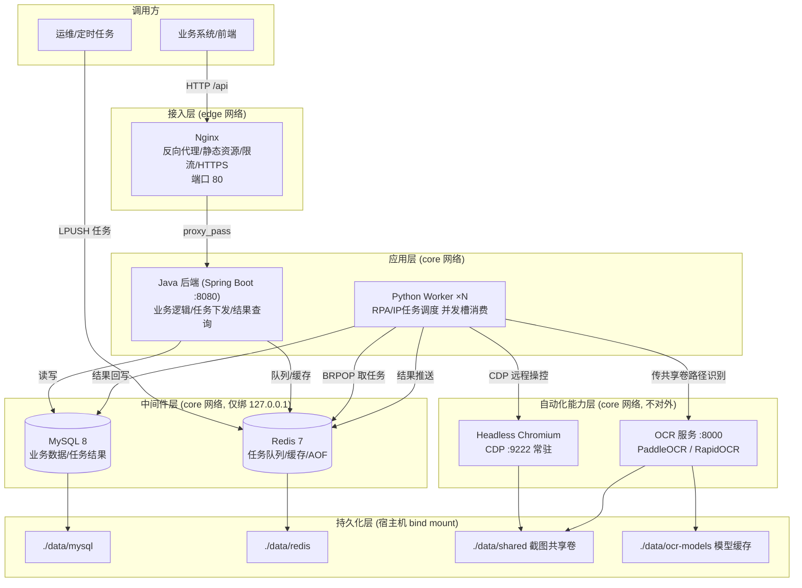

# 01 · 架构设计

## 1. 设计目标

| 目标 | 落地手段 |
|---|---|
| **一键部署、傻瓜式** | install 脚本自动装 Docker、生成强密码、按架构选引擎、拉起全部服务并做健康检查 |
| **跨平台 Win/Linux** | 全部服务容器化，Linux 用 `.sh`、Windows 用 `.ps1`，compose 文件完全一致 |
| **跨 CPU（x86/ARM/信创）** | 基础镜像全部选用官方多架构镜像；OCR 双引擎（飞桨/ONNX）按架构自动切换 |
| **稳定高效** | 服务拆分隔离、模型/浏览器常驻预热、共享卷零拷贝传图、统一健康检查与重启策略 |
| **可运维** | 统一目录、统一 `.env`、统一日志轮转、一键备份恢复、离线交付 |
| **可扩展** | Worker/OCR/浏览器均可水平扩容，Java 后端无状态，Nginx 可前置 LB |

## 2. 逻辑分层架构图



## 3. 组件职责与选型理由

| 组件 | 镜像 | 职责 | 为什么这么放 |
|---|---|---|---|
| **Nginx** | nginx:1.27 | 唯一对外入口：反向代理 Java、静态资源、限流、gzip、HTTPS | 中间件全部隐藏，只暴露 80；证书/限流集中管理 |
| **Java 后端** | eclipse-temurin:17-jre + 业务 jar | 业务 API、任务下发（写 Redis 队列/MySQL）、结果查询 | 无状态，配置全部走环境变量，可多副本 |
| **Worker** | python:3.10-slim 自建 | 消费任务队列、驱动浏览器、调 OCR、落库 | 与 Java 进程/依赖完全隔离，崩溃不影响业务，可独立扩缩容 |
| **Browser** | 官方 Playwright 镜像 | 常驻 Headless Chromium，对外只提供 CDP | 浏览器最重（吃内存、启动慢），独立容器常驻复用；Worker 不装浏览器，镜像小 |
| **OCR** | python:3.10-slim 自建 | 模型启动加载一次、常驻提供 HTTP 识别 | 避免每任务加载模型（冷启动数秒）；单实例串行保证线程安全，高并发扩副本 |
| **MySQL** | mysql:8.0 | 业务数据 + `rpa_task` 任务结果表 | 数据落 `./data/mysql`，备份/迁移就是打包目录 |
| **Redis** | redis:7.2 | 任务队列(List)、结果队列、缓存 | AOF everysec，`volatile-lru` 保证队列 key 不被淘汰 |

## 4. 一次自动化任务的完整时序

```mermaid
sequenceDiagram
    autonumber
    participant J as Java后端
    participant R as Redis队列
    participant W as Worker
    participant B as Chromium(CDP)
    participant O as OCR服务
    participant M as MySQL

    J->>M: 落一条 rpa_task(status=0)
    J->>R: LPUSH rpa:tasks {url,actions,need_ocr}
    W->>R: BRPOP 阻塞取任务
    W->>M: status=1 执行中
    W->>B: connect_over_cdp 复用常驻浏览器
    W->>B: new_context(代理/视口) -> goto(url) -> actions
    B-->>W: 页面渲染完成
    W->>B: screenshot -> /data/Txxx.png (共享卷)
    W->>O: POST /ocr {"path":"/data/Txxx.png"} (只传路径)
    O-->>W: {text, lines[]}
    W->>M: status=2 + result_text + snapshot_path
    W->>R: LPUSH rpa:results 结果消息
    Note over W,B: context.close() 释放页面; 浏览器进程继续常驻
```

**性能关键点（决定快慢的不是 Docker，而是调用形态）：**
1. 浏览器与 OCR 模型**只启动一次**，Worker 只做连接/调用 —— 单任务省去数秒冷启动。
2. 截图走**共享卷路径**，Worker→OCR 不传图片字节，零序列化开销。
3. 批量场景用 OCR 的 `/ocr/batch`，一次 HTTP 处理多图。
4. Docker 本身对 CPU/GPU 推理的损耗仅 1%~3%，远小于上述设计收益。

## 5. 网络隔离模型

```mermaid
flowchart LR
    subgraph 宿主机
        direction LR
        EXT["外部请求"] -->|:80| NG
        subgraph ent-edge["ent-edge 网络"]
            NG
        end
        subgraph ent-core["ent-core 网络(内部)"]
            NG2[Nginx]
            JAVA
            W
            B
            O
            RDS[(Redis)]
            DB[(MySQL)]
        end
        LOCAL["本机调试"] -.127.0.0.1:3306/6379.-> RDS
        LOCAL -.127.0.0.1:3306.-> DB
    end
    NG --- NG2
```
- 只有 Nginx 映射宿主机端口；MySQL/Redis 绑定 `127.0.0.1`，外部网络不可见。
- OCR/Browser 连 `expose` 都不映射宿主机，仅 `ent-core` 内容器可访问。
- Worker 需要访问外网页面，因此 `ent-core` 不设 `internal: true`，安全靠“不暴露端口”保证。

## 6. 为什么不用这些“看起来简单”的方案

| 备选方案 | 问题 | 结论 |
|---|---|---|
| 宿主机直接 pip/jar 裸装 | Python/OpenCV/CUDA 依赖地狱；换机器要重调；污染宿主 | 只适合开发机临时调试 |
| 容器里控制宿主机浏览器 | 跨 OS/容器无法操作桌面窗口；CDP 连宿主浏览器不能无头、不能扩容、不安全 | 仅“必须复用宿主登录态/证书”时临时用 |
| 每任务起一个浏览器/加载一次模型 | 单任务多花 2~8 秒，高频场景吞吐崩塌 | 禁止，改为常驻复用 |
| OCR/浏览器/Worker 全塞一个容器 | 镜像巨大、资源争抢、一处崩溃全挂、无法独立扩容 | 只适合极低频小工具 |
