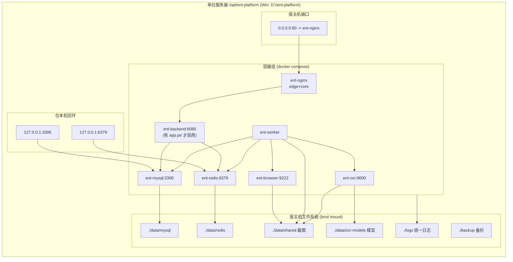
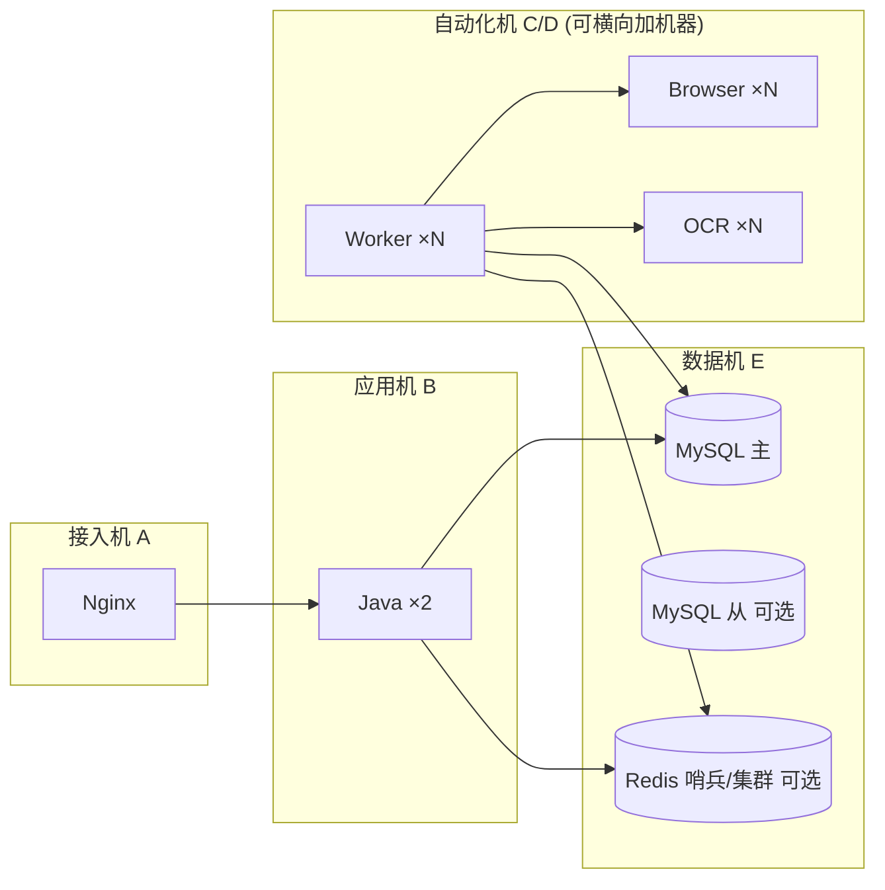

# 02 · 部署拓扑

## 1. 单机一体化部署（默认，一台服务器全跑）

## 2. 容器清单与资源基线

| 容器名 | 服务 | 对内端口 | 宿主机端口 | 最低内存 | 生产建议 | 数据卷 |
|---|---|---|---|---|---|---|
| ent-nginx | nginx | 80 | **80**（可改） | 64M | 128M | logs/nginx、data/static |
| ent-backend | Java | 8080 | 不暴露 | 512M | `-Xmx` 按内存 50% | logs/backend、data/uploads |
| ent-worker | Python | 无 | 不暴露 | 256M | 按并发数，1 并发≈200M | data/shared、logs/worker |
| ent-browser | Chromium | 9222 | 不暴露 | 512M | shm_size=2g | 无状态 |
| ent-ocr | OCR | 8000 | 不暴露 | 1G | CPU 2核/GPU 更佳 | data/shared、data/ocr-models |
| ent-mysql | MySQL | 3306 | 127.0.0.1:3306 | 1G | buffer pool=内存50~70% | data/mysql |
| ent-redis | Redis | 6379 | 127.0.0.1:6379 | 256M | maxmemory=60% | data/redis |

### 不同服务器规格的推荐跑法

| 规格 | 跑法 |
|---|---|
| 2C2G（最小验证） | 全组件，OCR 用 rapid、WORKER_CONCURRENCY=1、MySQL pool 384M |
| 4C8G（标准生产） | 全组件，OCR paddle、WORKER_CONCURRENCY=2~3、MySQL pool 4G |
| 8C16G+（高吞吐） | Worker/OCR 各扩 2~3 副本（见 06 扩容），MySQL pool 8G |
| GPU 服务器 | 叠加 `docker-compose.gpu.yml`，OCR 走 GPU，Worker 可扩更多 |

## 3. 多机分离部署（吞吐上来后的演进）

拆分方法（不改代码，只改 `.env` 的主机名）：
1. 数据机：只起 `mysql redis`：`docker compose up -d mysql redis`，防火墙只放行给应用机 IP。
2. 应用机：`.env` 中把 `MYSQL_HOST/REDIS_HOST` 指向数据机 IP（compose 内默认服务名，跨机时 Worker 用环境变量覆盖即可），起 `nginx backend`。
3. 自动化机：起 `worker browser ocr`，Worker 的 `REDIS_URL/MYSQL_HOST/OCR_URL/BROWSER_CDP` 指向对应机器。
4. 多副本：`docker compose up -d --scale worker=3 --scale ocr=2`（OCR 多副本时建议在 Worker 侧做轮询，或前置内网 nginx 负载）。

## 4. 端口总表

| 端口 | 绑定 | 用途 | 冲突时改哪里 |
|---|---|---|---|
| 80 | 0.0.0.0 | Nginx HTTP | `.env: HTTP_PORT` |
| 443 | 0.0.0.0 | HTTPS（默认注释） | compose 取消注释 + 证书 |
| 3306 | 127.0.0.1 | MySQL 本机调试 | `.env: MYSQL_PORT` |
| 6379 | 127.0.0.1 | Redis 本机调试 | `.env: REDIS_PORT` |
| 8080 | 容器内 | Java（不对宿主机暴露） | 应用 `server.port` |
| 8000 | 容器内 | OCR（不对宿主机暴露） | ocr 代码 |
| 9222 | 容器内 | Chromium CDP（不对宿主机暴露） | browser 启动脚本 |

## 5. 数据流向与落盘位置

| 数据 | 产生者 | 路径 | 备份策略 |
|---|---|---|---|
| 业务/任务数据 | MySQL | `./data/mysql/` | `backup.sh` mysqldump |
| 队列/缓存 | Redis | `./data/redis/`（AOF+RDB） | `backup.sh` BGSAVE 打包 |
| 页面截图 | Browser/Worker | `./data/shared/<task_no>.png` | backup 全量时打包，建议定期清理 |
| OCR 模型 | OCR 首次下载 | `./data/ocr-models/` | 一次下载长期复用，可预置实现离线 |
| 各组件日志 | 全部 | `./logs/<组件>/` + docker json 轮转 | logrotate，见 06 |
