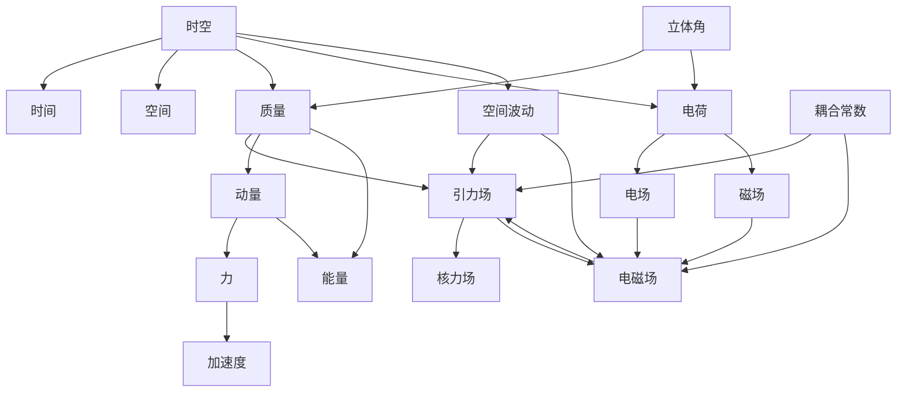

# 统一场论对象定义集合（扩展版）

## 1. 时空（Spacetime）

**符号表示**：$\vec{r}(t)$
**物理量纲**：[L]
**物理意义**：描述物理事件发生的空间位置随时间的变化，是所有物理量的基础框架
**数学表达式**：
- 时空同一化方程：$\vec{r}(t) = \vec{c}t = x\vec{i} + y\vec{j} + z\vec{k}$
- 三维螺旋时空方程：$\vec{r}(t) = r\cos\omega t \cdot \vec{i} + r\sin\omega t \cdot \vec{j} + ht \cdot \vec{k}$
- 四维时空（相对论形式）：$(ct, x, y, z)$
**核心特征**：
- 满足时空同一化原理
- 包含旋转和平移分量
- 决定物质属性和力场的产生
- 适用于从静止到光速的所有速度范围
- 几何结构决定物理定律形式

## 2. 时间（Time）

**符号表示**：$t$
**物理量纲**：[T]
**物理意义**：描述物理事件发生的顺序和持续性
**数学表达式**：
- 时间坐标：$t$
- 固有时：$\tau = t\sqrt{1 - \frac{v^2}{c^2}}$
**核心特征**：
- 与空间统一为时空整体
- 流逝速率与参考系运动状态相关
- 是物理过程演化的基本参数
- 满足因果律约束

## 3. 空间（Space）

**符号表示**：$\vec{r}$
**物理量纲**：[L]
**物理意义**：描述物理事件发生的位置
**数学表达式**：
- 空间坐标：$\vec{r} = x\vec{i} + y\vec{j} + z\vec{k}$
- 空间距离：$r = |\vec{r}|$
**核心特征**：
- 与时间统一为时空整体
- 具有三维欧几里得结构
- 几何变化产生物理效应
- 是物质存在的载体

## 4. 质量（Mass）

**符号表示**：$m$
**物理量纲**：[M]
**物理意义**：物质的基本属性，由时空几何变化率决定，描述物质的惯性和引力特性
**数学表达式**：
- 质量定义方程：$m = k \dfrac{dn}{d\Omega}$
- 静止质量：$m_0$
- 运动质量：$m = \dfrac{m_0}{\sqrt{1 - \dfrac{v^2}{c^2}}}$
- 质量-能量关系：$m = \frac{E}{c^2}$
**核心特征**：
- 与时空几何变化率直接相关
- 是动量、能量等物理量的基础
- 满足质量几何化原理
- 运动状态影响质量大小
- 可与能量相互转换

## 5. 速度（Velocity）

**符号表示**：$\vec{v}$
**物理量纲**：[LT⁻¹]
**物理意义**：描述物体在空间中的运动快慢和方向
**数学表达式**：
- 速度定义：$\vec{v} = \frac{d\vec{r}}{dt}$
- 光速：$\vec{c}$（常数）
**核心特征**：
- 矢量物理量，有大小和方向
- 光速是宇宙中速度的上限
- 是动量、能量等物理量的重要参数
- 运动状态的基本描述量

## 6. 加速度（Acceleration）

**符号表示**：$\vec{a}$
**物理量纲**：[LT⁻²]
**物理意义**：描述物体速度变化的快慢和方向
**数学表达式**：
- 加速度定义：$\vec{a} = \frac{d\vec{v}}{dt} = \frac{d^2\vec{r}}{dt^2}$
- 力产生的加速度：$\vec{a} = \frac{\vec{F}}{m}$
**核心特征**：
- 矢量物理量，有大小和方向
- 由力场作用产生
- 是运动状态变化的量度
- 与力场强度直接相关

## 7. 引力场（Gravitational Field）

**符号表示**：$\vec{A}$
**物理量纲**：[LT⁻²]
**物理意义**：质量产生的力场，影响物体的运动状态
**数学表达式**：$\vec{A} = -Gk\dfrac{\Delta n}{\Delta s}\dfrac{\vec{r}}{r}$
**核心特征**：
- 由质量空间变化率产生
- 满足场的叠加原理
- 可以与电磁场相互转换
- 强度与距离平方成反比
- 是长程力场

## 8. 电场（Electric Field）

**符号表示**：$\vec{E}$
**物理量纲**：[MLT⁻³Q⁻¹]
**物理意义**：电荷产生的力场，影响带电粒子的运动
**数学表达式**：$\vec{E} = -\dfrac{kk^{\prime}}{4\pi\varepsilon_0\Omega^2}\dfrac{d\Omega}{dt}\dfrac{\vec{r}}{r^3}$
**核心特征**：
- 由电荷空间分布产生
- 满足场的叠加原理
- 与磁场相互转换
- 强度与距离平方成反比
- 对带电粒子施加力的作用

## 9. 磁场（Magnetic Field）

**符号表示**：$\vec{B}$
**物理量纲**：[MT⁻¹Q⁻¹]
**物理意义**：运动电荷产生的力场，影响运动带电粒子
**数学表达式**：$\vec{B} = \dfrac{\mu_{0} \gamma k k^{\prime}}{4 \pi \Omega^{2}} \dfrac{d \Omega}{d t} \dfrac{[(x-v t) \vec{i}+y \vec{j}+z \vec{k}]}{[\gamma^{2}(x-v t)^{2}+y^{2}+z^{2}]^{3/2}}$
**核心特征**：
- 由运动电荷产生
- 满足场的叠加原理
- 与电场相互转换
- 对运动带电粒子施加力的作用
- 强度与距离平方成反比

## 10. 电磁场（Electromagnetic Field）

**符号表示**：$(\vec{E}, \vec{B})$
**物理量纲**：[MLT⁻³Q⁻¹, MT⁻¹Q⁻¹]
**物理意义**：电场和磁场的统一体，描述电磁相互作用
**数学表达式**：
- 麦克斯韦方程组：
  - $\vec{\nabla} \cdot \vec{E} = \frac{\rho}{\varepsilon_0}$
  - $\vec{\nabla} \cdot \vec{B} = 0$
  - $\vec{\nabla} \times \vec{E} = -\frac{\partial\vec{B}}{\partial t}$
  - $\vec{\nabla} \times \vec{B} = \mu_0\vec{J} + \mu_0\varepsilon_0\frac{\partial\vec{E}}{\partial t}$
**核心特征**：
- 电场和磁场的统一表现
- 以光速传播
- 可以与引力场相互转换
- 满足能量守恒定律
- 是电磁相互作用的载体

## 11. 动量（Momentum）

**符号表示**：$\vec{P}$
**物理量纲**：[MLT⁻¹]
**物理意义**：物质运动的量度，连接质量、速度与力
**数学表达式**：
- 静止动量：$\vec{p}_{0} = m_{0}\vec{c}_{0}$
- 运动动量：$\vec{P} = m(\vec{c} - \vec{v})$
- 经典力学动量：$\vec{p} = m\vec{v}$（低速近似）
- 四维动量：$(E/c, p_x, p_y, p_z)$
**核心特征**：
- 与质量和速度直接相关
- 力是动量的时间变化率
- 满足动量守恒定律
- 是能量的组成部分
- 相对论效应显著

## 12. 力（Force）

**符号表示**：$\vec{F}$
**物理量纲**：[MLT⁻²]
**物理意义**：改变物体运动状态的作用，使物体产生加速度
**数学表达式**：
- 力的定义：$\vec{F} = \frac{d\vec{P}}{dt}$
- 经典力学力：$\vec{F} = m\vec{a}$
- 引力：$\vec{F} = G\frac{m_1m_2}{r^2}\frac{\vec{r}}{r}$
- 电磁力：$\vec{F} = q(\vec{E} + \vec{v} \times \vec{B})$
**核心特征**：
- 矢量物理量，有大小和方向
- 由力场产生
- 是动量变化的原因
- 满足牛顿第三定律
- 不同类型的力统一于时空几何

## 13. 能量（Energy）

**符号表示**：$E$
**物理量纲**：[ML²T⁻²]
**物理意义**：物质做功的能力，与质量、动量直接相关
**数学表达式**：
- 统一场论能量方程：$E = m_0 c^2 = mc^2\sqrt{1 - \dfrac{v^2}{c^2}}$
- 动能：$E_k = \frac{1}{2}mv^2$（经典力学近似）
- 势能：$E_p = mgh$（重力势能）
- 电磁能：$E = \frac{1}{2}CV^2$（电容能量）
- 相对论能量动量关系：$E^2 = (pc)^2 + (m_0c^2)^2$
**核心特征**：
- 与质量和动量直接相关
- 满足能量守恒定律
- 不同形式的能量可以相互转换
- 质量是能量的一种形式
- 能量密度与场强平方成正比

## 14. 电荷（Charge）

**符号表示**：$q$
**物理量纲**：[Q]
**物理意义**：物质的电磁属性，由时空几何旋转时间变化率决定
**数学表达式**：$q = k^{\prime}k\dfrac{1}{\Omega^{2}}\dfrac{d\Omega}{dt}$
**核心特征**：
- 与时空几何旋转时间变化率直接相关
- 产生电场和磁场
- 满足电荷守恒定律
- 有正、负两种类型
- 量子化特征（基本电荷为电子电荷）

## 15. 核力场（Nuclear Force Field）

**符号表示**：$\vec{D}$
**物理量纲**：[LT⁻²]
**物理意义**：原子核内的强相互作用力场，维持原子核稳定
**数学表达式**：$\vec{D} = - G m \dfrac{ \vec{c} - 3 \dfrac{\vec{r}}{r} \dot{r} }{r^3}$
**核心特征**：
- 由引力场高速运动效应产生
- 作用范围小（约10⁻¹⁵米）
- 强度大，是四种基本力中最强的
- 短程力，随距离迅速衰减
- 维持原子核的稳定结构

## 16. 空间波动（Space Wave）

**符号表示**：$\vec{W}$
**物理量纲**：[L]
**物理意义**：描述空间的波动现象，是力场传播的载体
**数学表达式**：$\frac{\partial^2\vec{W}}{\partial t^2} = c^2\nabla^2\vec{W}$
**核心特征**：
- 以光速传播
- 满足波动方程
- 是力场相互作用的媒介
- 可以携带能量和动量
- 与时空几何直接相关

## 17. 立体角（Solid Angle）

**符号表示**：$\Omega$
**物理量纲**：[ dimensionless ]
**物理意义**：描述空间中某点对周围区域的张角，在质量和电荷定义中起关键作用
**数学表达式**：
- 立体角定义：$\Omega = \frac{A}{r^2}$（A为面积）
- 球面对应的立体角：$\Omega = 4\pi$（整个球面）
**核心特征**：
- 无量纲物理量
- 在质量几何化定义中使用
- 在电荷定义中起关键作用
- 与空间几何直接相关
- 是几何变化率的量度

## 18. 耦合常数（Coupling Constant）

**符号表示**：$Z, Z^{\prime}, G, \alpha$
**物理量纲**：[L³M⁻¹T⁻²]（引力常数）
**物理意义**：描述不同力场之间的耦合强度
**数学表达式**：
- 引力光速统一方程：$Z = \dfrac{Gc}{2}$
- 电磁光速几何耦合常数：$Z^{\prime} = \dfrac{c}{8\pi\varepsilon_0}$
- 万有引力常数：$G$
- 精细结构常数：$\alpha = \dfrac{e^2}{4\pi\varepsilon_0\hbar c}$
**核心特征**：
- 量化不同力场之间的相互作用强度
- 决定力场的作用范围和强度
- 体现力场的统一性
- 是理论预测与实验对比的关键参数
- 可能与时空几何结构相关

## 19. 对象关系总览

## 20. 对象分类

| 分类 | 对象名称 | 符号表示 |
|------|----------|----------|
| 基础时空对象 | 时空、时间、空间 | $\vec{r}(t), t, \vec{r}$ |
| 运动学量 | 速度、加速度 | $\vec{v}, \vec{a}$ |
| 物质属性 | 质量、电荷、立体角 | $m, q, \Omega$ |
| 力场对象 | 引力场、电场、磁场、电磁场、核力场、空间波动 | $\vec{A}, \vec{E}, \vec{B}, (\vec{E},\vec{B}), \vec{D}, \vec{W}$ |
| 动力学量 | 动量、力、能量 | $\vec{P}, \vec{F}, E$ |
| 耦合参数 | 耦合常数 | $Z, Z^{\prime}, G, \alpha$ |

## 21. 对象定义验证

所有对象定义都满足以下验证标准：

1. **物理一致性**：符合已知物理实验结果和观测数据
2. **数学自洽性**：满足数学公理和逻辑规则
3. **统一性**：体现不同物理现象之间的内在联系
4. **可验证性**：可以通过实验或观测进行验证
5. **范畴论兼容性**：符合统一场论范畴的对象定义要求
6. **逻辑完整性**：对象之间存在明确的态射关系
7. **理论一致性**：与统一场论的核心公理保持一致

## 22. 扩展对象的物理意义

### 22.1 时间和空间
时间和空间作为时空的组成部分，分别描述了物理事件的顺序性和位置性。它们的独立定义有助于更清晰地理解时空的几何结构，以及在不同物理理论中的表现形式。

### 22.2 速度和加速度
速度和加速度是描述物体运动状态和状态变化的基本物理量，它们与力场的关系是理解动力学的关键。通过明确这些对象的定义，可以更好地连接统一场论与经典力学。

### 22.3 电磁场
电磁场作为电场和磁场的统一体，体现了电磁现象的统一性。它的定义有助于理解电磁相互作用的本质，以及与引力场的统一关系。

### 22.4 力
力是改变物体运动状态的直接原因，它的明确定义有助于理解各种力场的作用机制，以及力与动量、能量之间的关系。

### 22.5 空间波动
空间波动是力场传播的载体，它的定义有助于理解力场的传播机制，以及时空的动态性质。

### 22.6 立体角
立体角在质量和电荷的几何化定义中起关键作用，它的明确定义有助于理解物质属性的几何起源。

## 23. 结论

通过扩展对象定义集合，我们构建了一个更完整、更系统的统一场论对象体系。这些对象不仅涵盖了传统物理学中的基本概念，还包括了统一场论特有的几何概念，为理解物理现象的本质提供了更全面的框架。

对象之间的关系通过态射网络连接，形成一个有机整体，体现了物理现象的统一性和内在联系。这种系统化的对象定义方法，为统一场论的深入研究和应用奠定了坚实的基础。