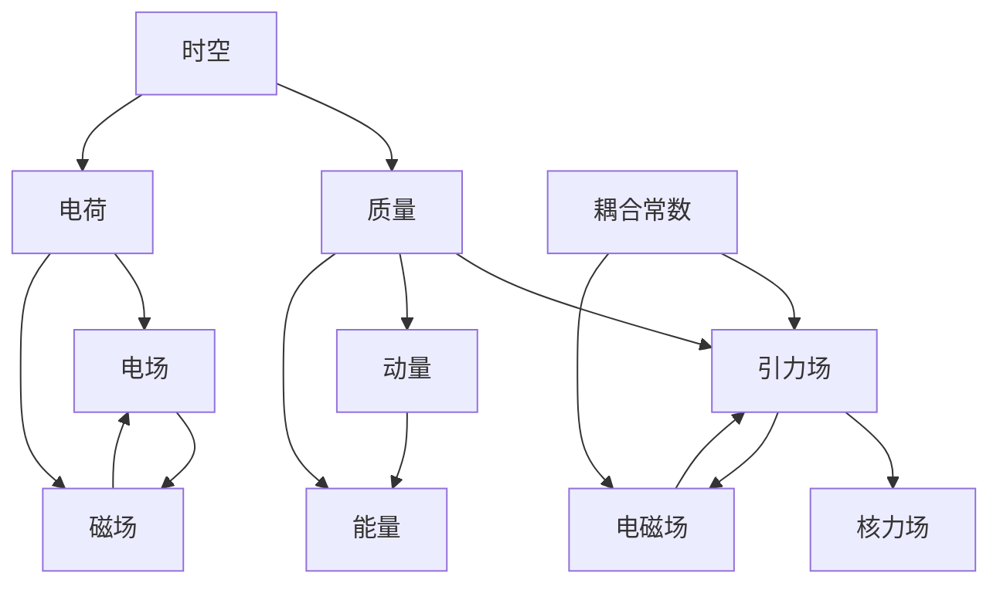

# 统一场论对象定义集合

## 1. 时空（Spacetime）

**符号表示**：$\vec{r}(t)$
**物理量纲**：[L]
**物理意义**：描述物理事件发生的空间位置随时间的变化，是所有物理量的基础框架
**数学表达式**：
- 时空同一化方程：$\vec{r}(t) = \vec{c}t = x\vec{i} + y\vec{j} + z\vec{k}$
- 三维螺旋时空方程：$\vec{r}(t) = r\cos\omega t \cdot \vec{i} + r\sin\omega t \cdot \vec{j} + ht \cdot \vec{k}$
**核心特征**：
- 满足时空同一化原理
- 包含旋转和平移分量
- 决定物质属性和力场的产生

## 2. 质量（Mass）

**符号表示**：$m$
**物理量纲**：[M]
**物理意义**：物质的基本属性，由时空几何变化率决定，描述物质的惯性和引力特性
**数学表达式**：
- 质量定义方程：$m = k \dfrac{dn}{d\Omega}$
- 静止质量：$m_0$
- 运动质量：$m = \dfrac{m_0}{\sqrt{1 - \dfrac{v^2}{c^2}}}$
**核心特征**：
- 与时空几何变化率直接相关
- 是动量、能量等物理量的基础
- 满足质量几何化原理

## 3. 引力场（Gravitational Field）

**符号表示**：$\vec{A}$
**物理量纲**：[LT⁻²]
**物理意义**：质量产生的力场，影响物体的运动状态
**数学表达式**：$\vec{A} = -Gk\dfrac{\Delta n}{\Delta s}\dfrac{\vec{r}}{r}$
**核心特征**：
- 由质量空间变化率产生
- 满足场的叠加原理
- 可以与电磁场相互转换

## 4. 电场（Electric Field）

**符号表示**：$\vec{E}$
**物理量纲**：[MLT⁻³Q⁻¹]
**物理意义**：电荷产生的力场，影响带电粒子的运动
**数学表达式**：$\vec{E} = -\dfrac{kk^{\prime}}{4\pi\varepsilon_0\Omega^2}\dfrac{d\Omega}{dt}\dfrac{\vec{r}}{r^3}$
**核心特征**：
- 由电荷空间分布产生
- 满足场的叠加原理
- 与磁场相互转换

## 5. 磁场（Magnetic Field）

**符号表示**：$\vec{B}$
**物理量纲**：[MT⁻¹Q⁻¹]
**物理意义**：运动电荷产生的力场，影响运动带电粒子
**数学表达式**：$\vec{B} = \dfrac{\mu_{0} \gamma k k^{\prime}}{4 \pi \Omega^{2}} \dfrac{d \Omega}{d t} \dfrac{[(x-v t) \vec{i}+y \vec{j}+z \vec{k}]}{[\gamma^{2}(x-v t)^{2}+y^{2}+z^{2}]^{3/2}}$
**核心特征**：
- 由运动电荷产生
- 满足场的叠加原理
- 与电场相互转换

## 6. 动量（Momentum）

**符号表示**：$\vec{P}$
**物理量纲**：[MLT⁻¹]
**物理意义**：物质运动的量度，连接质量、速度与力
**数学表达式**：
- 静止动量：$\vec{p}_{0} = m_{0}\vec{c}_{0}$
- 运动动量：$\vec{P} = m(\vec{c} - \vec{v})$
**核心特征**：
- 与质量和速度直接相关
- 力是动量的时间变化率
- 满足动量守恒定律

## 7. 能量（Energy）

**符号表示**：$E$
**物理量纲**：[ML²T⁻²]
**物理意义**：物质做功的能力，与质量、动量直接相关
**数学表达式**：$E = m_0 c^2 = mc^2\sqrt{1 - \dfrac{v^2}{c^2}}$
**核心特征**：
- 与质量和动量直接相关
- 满足能量守恒定律
- 不同形式的能量可以相互转换

## 8. 电荷（Charge）

**符号表示**：$q$
**物理量纲**：[Q]
**物理意义**：物质的电磁属性，由时空几何旋转时间变化率决定
**数学表达式**：$q = k^{\prime}k\dfrac{1}{\Omega^{2}}\dfrac{d\Omega}{dt}$
**核心特征**：
- 与时空几何旋转时间变化率直接相关
- 产生电场和磁场
- 满足电荷守恒定律

## 9. 核力场（Nuclear Force Field）

**符号表示**：$\vec{D}$
**物理量纲**：[LT⁻²]
**物理意义**：原子核内的强相互作用力场
**数学表达式**：$\vec{D} = - G m \dfrac{ \vec{c} - 3 \dfrac{\vec{r}}{r} \dot{r} }{r^3}$
**核心特征**：
- 由引力场高速运动效应产生
- 作用范围小，强度大
- 维持原子核的稳定

## 10. 耦合常数（Coupling Constant）

**符号表示**：$Z, Z^{\prime}$
**物理量纲**：[L³M⁻¹T⁻²]
**物理意义**：描述不同力场之间的耦合强度
**数学表达式**：
- 引力光速统一方程：$Z = \dfrac{Gc}{2}$
- 电磁光速几何耦合常数：$Z^{\prime} = \dfrac{c}{8\pi\varepsilon_0}$
**核心特征**：
- 量化不同力场之间的相互作用强度
- 决定力场的作用范围和强度
- 体现力场的统一性

## 11. 对象关系总览

## 12. 对象分类

| 分类 | 对象名称 | 符号表示 |
|------|----------|----------|
| 基础对象 | 时空 | $\vec{r}(t)$ |
| 物质属性 | 质量、电荷 | $m, q$ |
| 力场对象 | 引力场、电场、磁场、核力场 | $\vec{A}, \vec{E}, \vec{B}, \vec{D}$ |
| 动力学量 | 动量、能量 | $\vec{P}, E$ |
| 耦合参数 | 耦合常数 | $Z, Z^{\prime}$ |

## 13. 对象定义验证

所有对象定义都满足以下验证标准：

1. **物理一致性**：符合已知物理实验结果和观测数据
2. **数学自洽性**：满足数学公理和逻辑规则
3. **统一性**：体现不同物理现象之间的内在联系
4. **可验证性**：可以通过实验或观测进行验证
5. **范畴论兼容性**：符合统一场论范畴的对象定义要求