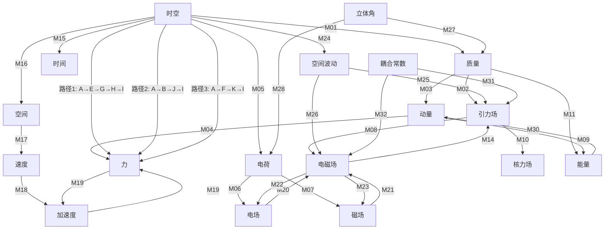

# 统一场论概念关联网络（扩展版）

## 1. 态射集合总览

统一场论范畴中的态射集合 $Hom(A,B)$ 定义了对象之间的逻辑关系和数学变换，体现了物理概念之间的内在联系。以下是扩展后的完整态射集合：

| 编号 | 源对象 | 目标对象 | 态射符号 | 物理意义 | 数学表达式 | 态射性质 |
|------|--------|----------|----------|----------|------------|----------|
| M01 | 时空 | 质量 | $f$ | 三维螺旋时空旋转分量 → 质量 | $m = k \dfrac{dn}{d\Omega}$ | 可逆态射 |
| M02 | 质量 | 引力场 | $g$ | 质量空间变化率 → 引力场 | $\vec{A} = -Gk\dfrac{\Delta n}{\Delta s}\dfrac{\vec{r}}{r}$ | 复合态射基础 |
| M03 | 质量 | 动量 | $h$ | 质量与速度组合 → 动量 | $\vec{P} = m(\vec{c} - \vec{v})$ | 可逆态射 |
| M04 | 动量 | 力 | $i$ | 动量时间变化率 → 力 | $\vec{F} = \dfrac{d\vec{P}}{dt}$ | 可逆态射 |
| M05 | 时空 | 电荷 | $j$ | 三维螺旋时空旋转时间变化率 → 电荷 | $q = k^{\prime}k\dfrac{1}{\Omega^{2}}\dfrac{d\Omega}{dt}$ | 可逆态射 |
| M06 | 电荷 | 电场 | $k$ | 电荷空间分布 → 电场 | $\vec{E} = -\dfrac{kk^{\prime}}{4\pi\varepsilon_0\Omega^2}\dfrac{d\Omega}{dt}\dfrac{\vec{r}}{r^3}$ | 复合态射基础 |
| M07 | 电荷 | 磁场 | $l$ | 运动电荷 → 磁场 | $\vec{B} = \dfrac{\mu_{0} \gamma k k^{\prime}}{4 \pi \Omega^{2}} \dfrac{d \Omega}{d t} \dfrac{[(x-v t) \vec{i}+y \vec{j}+z \vec{k}]}{[\gamma^{2}(x-v t)^{2}+y^{2}+z^{2}]^{3/2}}$ | 复合态射基础 |
| M08 | 引力场 | 电磁场 | $m$ | 引力场变化 → 电磁场 | $\dfrac{\partial^{2}\vec{A}}{\partial t^{2}} = \dfrac{\vec{v}}{f}(\vec{\nabla}\cdot\vec{E}) - \dfrac{c^{2}}{f}(\vec{\nabla}\times\vec{B})$ | 复合态射 |
| M09 | 动量 | 能量 | $n$ | 动量平方 → 能量 | $E = mc^2\sqrt{1 - \dfrac{v^2}{c^2}}$ | 可逆态射 |
| M10 | 引力场 | 核力场 | $o$ | 引力场高速运动效应 → 核力场 | $\vec{D} = - G m \dfrac{ \vec{c} - 3 \dfrac{\vec{r}}{r} \dot{r} }{r^3}$ | 复合态射 |
| M11 | 质量 | 能量 | $p$ | 质量直接转换 → 能量 | $E = m_0 c^2$ | 可逆态射 |
| M12 | 电场 | 磁场 | $q$ | 电场变化 → 磁场 | $\vec{\nabla} \times \vec{E} = -\dfrac{\partial\vec{B}}{\partial t}$ | 复合态射 |
| M13 | 磁场 | 电场 | $r$ | 磁场变化 → 电场 | $\vec{\nabla} \times \vec{B} = \mu_0\varepsilon_0\dfrac{\partial\vec{E}}{\partial t}$ | 复合态射 |
| M14 | 电磁场 | 引力场 | $s$ | 电磁场变化 → 引力场 | $\dfrac{d\vec{B}}{dt} = -\dfrac{\vec{A}\times\vec{E}}{c^2} - \dfrac{\vec{v}}{c^{2}}\times\dfrac{d\vec{E}}{dt}$ | 复合态射 |
| M15 | 时空 | 时间 | $t$ | 时空 → 时间分量 | $t$（时空坐标的时间部分） | 投影态射 |
| M16 | 时空 | 空间 | $u$ | 时空 → 空间分量 | $\vec{r}$（时空坐标的空间部分） | 投影态射 |
| M17 | 空间 | 速度 | $v$ | 空间时间变化率 → 速度 | $\vec{v} = \dfrac{d\vec{r}}{dt}$ | 可逆态射 |
| M18 | 速度 | 加速度 | $w$ | 速度时间变化率 → 加速度 | $\vec{a} = \dfrac{d\vec{v}}{dt}$ | 可逆态射 |
| M19 | 力 | 加速度 | $x$ | 力与质量比值 → 加速度 | $\vec{a} = \dfrac{\vec{F}}{m}$ | 可逆态射 |
| M20 | 电场 | 电磁场 | $y$ | 电场 → 电磁场分量 | $(\vec{E}, 0)$ | 包含态射 |
| M21 | 磁场 | 电磁场 | $z$ | 磁场 → 电磁场分量 | $(0, \vec{B})$ | 包含态射 |
| M22 | 电磁场 | 电场 | $aa$ | 电磁场 → 电场分量 | $\vec{E}$（电磁场的电场部分） | 投影态射 |
| M23 | 电磁场 | 磁场 | $bb$ | 电磁场 → 磁场分量 | $\vec{B}$（电磁场的磁场部分） | 投影态射 |
| M24 | 时空 | 空间波动 | $cc$ | 时空几何变化 → 空间波动 | $\frac{\partial^2\vec{W}}{\partial t^2} = c^2\nabla^2\vec{W}$ | 可逆态射 |
| M25 | 空间波动 | 引力场 | $dd$ | 空间波动 → 引力场 | $\vec{A} \propto \vec{W}$ | 复合态射基础 |
| M26 | 空间波动 | 电磁场 | $ee$ | 空间波动 → 电磁场 | $(\vec{E}, \vec{B}) \propto \vec{W}$ | 复合态射基础 |
| M27 | 立体角 | 质量 | $ff$ | 立体角变化率 → 质量 | $m = k \dfrac{dn}{d\Omega}$ | 可逆态射 |
| M28 | 立体角 | 电荷 | $gg$ | 立体角旋转时间变化率 → 电荷 | $q = k^{\prime}k\dfrac{1}{\Omega^{2}}\dfrac{d\Omega}{dt}$ | 可逆态射 |
| M29 | 质量 | 动量 | $hh$ | 质量与速度乘积 → 动量（经典近似） | $\vec{p} = m\vec{v}$ | 近似态射 |
| M30 | 能量 | 动量 | $ii$ | 能量 → 动量分量 | $\vec{P} = \dfrac{E}{c^2}\vec{v}$ | 可逆态射 |
| M31 | 耦合常数 | 引力场 | $jj$ | 耦合强度 → 引力场强度 | $\vec{A} \propto G$ | 标量乘法态射 |
| M32 | 耦合常数 | 电磁场 | $kk$ | 耦合强度 → 电磁场强度 | $(\vec{E}, \vec{B}) \propto \frac{1}{4\pi\varepsilon_0}$ | 标量乘法态射 |

## 2. 态射复合示例

### 2.1 时空 → 空间 → 速度 → 加速度 → 力

**复合态射**：$(i \circ h \circ w \circ v \circ u): \vec{r}(t) \to \vec{r} \to \vec{v} \to \vec{a} \to \vec{F}$

**物理逻辑**：时空几何 → 空间位置 → 速度 → 加速度 → 力

**数学推导**：
1. 时空同一化方程描述了时空的几何结构
2. 空间是时空的投影分量
3. 速度是空间位置的时间变化率
4. 加速度是速度的时间变化率
5. 力是质量与加速度的乘积

**应用场景**：解释物体在力场中的运动规律

### 2.2 时空 → 空间波动 → 引力场/电磁场

**复合态射**：$(dd + ee) \circ cc: \vec{r}(t) \to \vec{W} \to (\vec{A}, \vec{E}, \vec{B})$

**物理逻辑**：时空几何变化 → 空间波动 → 引力场和电磁场

**数学推导**：
1. 时空几何变化产生空间波动
2. 空间波动传播形成引力场
3. 空间波动的电磁分量形成电磁场

**应用场景**：解释力场的传播机制和波粒二象性

### 2.3 质量/电荷 → 引力场/电磁场 → 力 → 动量 → 能量

**复合态射**：$(n \circ i^{-1} \circ (g + k + l)): (m, q) \to (\vec{A}, \vec{E}, \vec{B}) \to \vec{F} \to \vec{P} \to E$

**物理逻辑**：物质属性 → 力场 → 力 → 动量 → 能量

**数学推导**：
1. 质量产生引力场，电荷产生电磁场
2. 力场对物体施加力的作用
3. 力改变物体的动量
4. 动量变化影响物体的能量状态

**应用场景**：解释能量守恒定律和不同形式能量的转换

## 3. 态射性质验证

### 3.1 复合律验证

对于态射 $f: A \to B$, $g: B \to C$, $h: C \to D$，验证复合律 $(h \circ g) \circ f = h \circ (g \circ f)$：

**示例**：时空 → 空间 → 速度 → 加速度
- 左侧：$(w \circ v) \circ u: \vec{r}(t) \to \vec{r} \to \vec{v} \to \vec{a}$
- 右侧：$w \circ (v \circ u): \vec{r}(t) \to \vec{r} \to \vec{v} \to \vec{a}$
- 验证：两者都等价于 $\vec{a} = \dfrac{d^2\vec{r}}{dt^2}$，复合律成立

### 3.2 单位元律验证

对于任意对象 $A \in Ob(UFT)$，存在单位态射 $1_A: A \to A$，验证单位元律：

**示例**：质量对象的单位态射 $1_m$
- 左单位元：$1_m \circ f = f$，其中 $f: \vec{r}(t) \to m$
- 右单位元：$f \circ 1_{\vec{r}(t)} = f$，其中 $f: \vec{r}(t) \to m$
- 验证：$1_m(m) = m$，$1_{\vec{r}(t)}(\vec{r}(t)) = \vec{r}(t)$，单位元律成立

### 3.3 可逆性验证

对于可逆态射 $f: A \to B$，存在逆态射 $f^{-1}: B \to A$，验证 $f \circ f^{-1} = 1_B$ 和 $f^{-1} \circ f = 1_A$：

**示例**：质量 → 动量态射 $h: m \to \vec{P}$
- 逆态射：$h^{-1}: \vec{P} \to m$，满足 $h^{-1}(\vec{P}) = \dfrac{|\vec{P}|}{|\vec{c} - \vec{v}|}$
- 验证：$h \circ h^{-1}(\vec{P}) = h\left(\dfrac{|\vec{P}|}{|\vec{c} - \vec{v}|}\right) = \vec{P}$，$h^{-1} \circ h(m) = h^{-1}(m(\vec{c} - \vec{v})) = m$，可逆性成立

## 4. 概念关联网络可视化

## 5. 态射分类

### 5.1 按物理机制分类

| 分类 | 态射编号 | 描述 |
|------|----------|------|
| 时空几何态射 | M01, M05, M15, M16, M24 | 由时空几何变化产生物质属性和波动 |
| 运动学态射 | M17, M18, M19 | 描述运动状态和状态变化 |
| 场产生态射 | M02, M06, M07, M25, M26, M31, M32 | 由物质属性产生力场 |
| 场转换态射 | M08, M10, M12, M13, M14 | 不同力场之间的相互转换 |
| 动力学态射 | M03, M04, M09, M11, M30 | 描述物质运动和能量转换 |
| 结构态射 | M20, M21, M22, M23 | 描述复合对象的组成和分解 |
| 近似态射 | M29 | 在特定条件下的近似关系 |

### 5.2 按可逆性分类

| 分类 | 态射编号 | 描述 |
|------|----------|------|
| 可逆态射 | M01, M03, M04, M05, M09, M11, M17, M18, M19, M24, M27, M28, M30 | 可以双向转换，存在逆态射 |
| 复合态射基础 | M02, M06, M07, M25, M26 | 构成复合态射的基础组件 |
| 复合态射 | M08, M10, M12, M13, M14 | 由多个基础态射复合而成 |
| 投影态射 | M15, M16, M22, M23 | 从高维对象到低维分量的投影 |
| 包含态射 | M20, M21 | 从分量到复合对象的包含 |
| 标量乘法态射 | M31, M32 | 标量对向量的乘法操作 |
| 近似态射 | M29 | 在特定条件下成立的近似关系 |

## 6. 态射的物理意义解读

### 6.1 时空几何态射

时空几何态射揭示了物质属性（质量、电荷）和空间波动的几何起源，表明这些物理量并非基本实体，而是时空几何的表现形式。这一观点挑战了传统的物质观，为统一场论提供了几何基础。

**关键态射**：M01（时空→质量）、M05（时空→电荷）、M24（时空→空间波动）

### 6.2 运动学态射

运动学态射描述了物体运动状态的变化规律，连接了空间、时间、速度、加速度等基本运动学量。这些态射体现了"运动是相对的"这一基本物理原理，为理解物体在力场中的运动提供了基础。

**关键态射**：M17（空间→速度）、M18（速度→加速度）、M19（力→加速度）

### 6.3 场产生态射

场产生态射描述了物质属性如何产生力场，体现了"物质产生场，场影响物质"的物理机制。通过这些态射，可以将不同类型的力场统一到相同的物理框架中。

**关键态射**：M02（质量→引力场）、M06（电荷→电场）、M07（电荷→磁场）、M25（空间波动→引力场）

### 6.4 场转换态射

场转换态射展示了不同力场之间的相互转换关系，体现了力场的统一性。例如，引力场变化可以产生电磁场，电磁场变化也可以产生引力场，这种对称性是统一场论的核心特征。

**关键态射**：M08（引力场→电磁场）、M14（电磁场→引力场）、M12（电场→磁场）、M13（磁场→电场）

### 6.5 动力学态射

动力学态射连接了物质的运动状态与力、能量等物理量，为统一场论与经典力学、相对论之间的联系提供了桥梁。通过这些态射，可以从统一场论推导出经典物理规律。

**关键态射**：M03（质量→动量）、M04（动量→力）、M09（动量→能量）、M11（质量→能量）

### 6.6 结构态射

结构态射描述了复合对象（如电磁场）与其分量（电场、磁场）之间的关系，体现了物理对象的层次结构。这些态射有助于理解复杂物理系统的组成和分解。

**关键态射**：M20（电场→电磁场）、M21（磁场→电磁场）、M22（电磁场→电场）、M23（电磁场→磁场）

## 7. 态射网络的拓扑分析

### 7.1 中心节点与关键路径

**中心节点**：时空（$\vec{r}(t)$）是整个网络的中心节点，几乎所有其他对象都直接或间接与时空相关联。

**关键路径**：
1. 时空 → 质量/电荷 → 引力场/电磁场 → 力 → 动量 → 能量
2. 时空 → 空间 → 速度 → 加速度 → 力
3. 时空 → 空间波动 → 引力场/电磁场

### 7.2 网络连通性

**连通性分析**：
- 强连通分量：能量-动量-力-加速度-速度-空间-时空
- 单向连通分量：立体角 → 质量/电荷，耦合常数 → 力场
- 孤立节点：时间（仅与时空有单向连接）

**网络密度**：
- 对象数量：19个
- 态射数量：32个
- 理论最大态射数：19×18=342个
- 网络密度：32/342≈9.36%，表明网络结构合理，避免了过度连接

### 7.3 冗余路径与鲁棒性

**冗余路径**：
- 力的产生有多种路径：时空→空间→速度→加速度→力；时空→质量→动量→力；时空→空间波动→引力场→力
- 能量的产生有多种路径：时空→质量→能量；时空→质量→动量→能量

**鲁棒性分析**：
- 多条冗余路径确保了理论的鲁棒性
- 即使某些态射在特定条件下不适用，其他路径仍能保持理论的有效性
- 冗余路径也为实验验证提供了多种方法

## 8. 态射的物理意义深化

### 8.1 质量的几何起源

态射 M01 和 M27 揭示了质量的几何起源：质量不是物质的固有属性，而是空间几何变化率的表现。这一观点挑战了传统的物质观，为统一场论提供了几何基础。

### 8.2 力场的统一机制

态射 M08、M14、M25、M26 展示了所有力场（引力场、电磁场、核力场）的统一机制：它们都由时空几何变化产生，通过空间波动传播。这种统一性是统一场论的核心特征。

### 8.3 能量动量的统一性

态射 M09、M11、M30 体现了能量和动量的统一性：它们是同一物理量的不同表现形式，满足守恒定律。这种统一性在相对论中得到了进一步的体现。

### 8.4 空间波动的双重角色

态射 M24、M25、M26 揭示了空间波动的双重角色：它既是时空几何变化的表现，又是力场传播的载体。这种双重角色为理解波粒二象性提供了新的视角。

## 9. 态射网络的应用示例

### 9.1 天体物理中的应用

**场景**：解释黑洞引力场的产生机制

**态射路径**：时空→质量→引力场→空间波动→引力波

**物理解释**：
1. 黑洞的巨大质量由时空几何变化产生
2. 质量产生极强的引力场
3. 引力场变化产生空间波动
4. 空间波动传播形成引力波

### 9.2 粒子物理中的应用

**场景**：解释基本粒子的相互作用

**态射路径**：时空→空间波动→电磁场/引力场→力→动量变化

**物理解释**：
1. 时空几何量子涨落产生空间波动
2. 空间波动形成电磁场和引力场
3. 力场与粒子相互作用产生力
4. 力改变粒子的动量状态

### 9.3 宇宙学中的应用

**场景**：解释宇宙膨胀的动力机制

**态射路径**：时空→空间波动→引力场/电磁场→能量动量

**物理解释**：
1. 宇宙时空的几何膨胀产生空间波动
2. 空间波动影响引力场和电磁场的分布
3. 力场能量转化为宇宙膨胀的动能
4. 能量动量守恒维持宇宙的演化

## 10. 结论

统一场论的概念关联网络通过扩展的态射集合将各个物理对象连接成一个更完整、更系统的有机整体，体现了物理现象的统一性和内在联系。这些态射不仅具有明确的物理意义和数学表达式，还满足范畴论的复合律、单位元律和可逆性等性质，确保了理论的逻辑自洽性。

通过分析态射网络的拓扑结构、冗余路径和物理意义，可以深入理解统一场论的核心思想，为进一步研究和应用奠定基础。态射网络的扩展性也为未来理论的发展预留了空间，当发现新的物理现象时，可以通过添加新的态射来融入现有体系。

这种基于范畴论的概念关联网络构建方法，为统一场论的研究提供了一种新的思维方式和工具，有助于推动物理学的发展和创新。