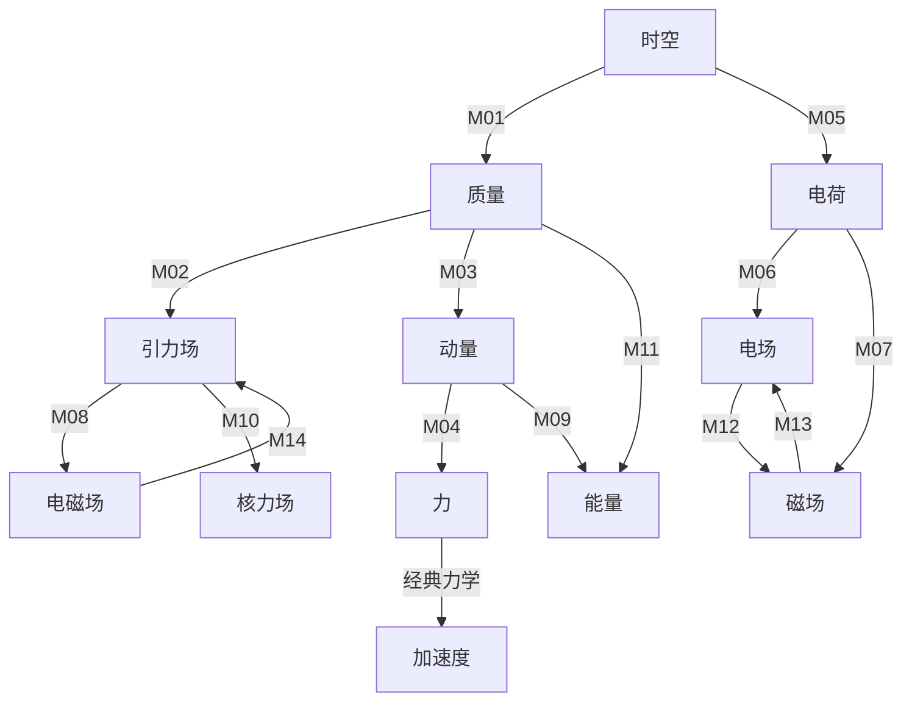

# 统一场论概念关联网络

## 1. 态射集合总览

统一场论范畴中的态射集合 $Hom(A,B)$ 定义了对象之间的逻辑关系和数学变换，体现了物理概念之间的内在联系。以下是完整的态射集合总览：

| 编号 | 源对象 | 目标对象 | 态射符号 | 物理意义 | 数学表达式 | 态射性质 |
|------|--------|----------|----------|----------|------------|----------|
| M01 | 时空 | 质量 | $f$ | 三维螺旋时空旋转分量 → 质量 | $m = k \dfrac{dn}{d\Omega}$ | 可逆态射 |
| M02 | 质量 | 引力场 | $g$ | 质量空间变化率 → 引力场 | $\vec{A} = -Gk\dfrac{\Delta n}{\Delta s}\dfrac{\vec{r}}{r}$ | 复合态射基础 |
| M03 | 质量 | 动量 | $h$ | 质量与速度组合 → 动量 | $\vec{P} = m(\vec{c} - \vec{v})$ | 可逆态射 |
| M04 | 动量 | 力 | $i$ | 动量时间变化率 → 力 | $\vec{F} = \dfrac{d\vec{P}}{dt}$ | 可逆态射 |
| M05 | 时空 | 电荷 | $j$ | 三维螺旋时空旋转时间变化率 → 电荷 | $q = k^{\prime}k\dfrac{1}{\Omega^{2}}\dfrac{d\Omega}{dt}$ | 可逆态射 |
| M06 | 电荷 | 电场 | $k$ | 电荷空间分布 → 电场 | $\vec{E} = -\dfrac{kk^{\prime}}{4\pi\varepsilon_0\Omega^2}\dfrac{d\Omega}{dt}\dfrac{\vec{r}}{r^3}$ | 复合态射基础 |
| M07 | 电荷 | 磁场 | $l$ | 运动电荷 → 磁场 | $\vec{B} = \dfrac{\mu_{0} \gamma k k^{\prime}}{4 \pi \Omega^{2}} \dfrac{d \Omega}{d t} \dfrac{[(x-v t) \vec{i}+y \vec{j}+z \vec{k}]}{[\gamma^{2}(x-v t)^{2}+y^{2}+z^{2}]^{3/2}}$ | 复合态射基础 |
| M08 | 引力场 | 电磁场 | $m$ | 引力场变化 → 电磁场 | $\dfrac{\partial^{2}\vec{A}}{\partial t^{2}} = \dfrac{\vec{v}}{f}(\vec{\nabla}\cdot\vec{E}) - \dfrac{c^{2}}{f}(\vec{\nabla}\times\vec{B})$ | 复合态射 |
| M09 | 动量 | 能量 | $n$ | 动量平方 → 能量 | $E = mc^2\sqrt{1 - \dfrac{v^2}{c^2}}$ | 可逆态射 |
| M10 | 引力场 | 核力场 | $o$ | 引力场高速运动效应 → 核力场 | $\vec{D} = - G m \dfrac{ \vec{c} - 3 \dfrac{\vec{r}}{r} \dot{r} }{r^3}$ | 复合态射 |
| M11 | 质量 | 能量 | $p$ | 质量直接转换 → 能量 | $E = m_0 c^2$ | 可逆态射 |
| M12 | 电场 | 磁场 | $q$ | 电场变化 → 磁场 | $\vec{\nabla} \times \vec{E} = -\dfrac{\partial\vec{B}}{\partial t}$ | 复合态射 |
| M13 | 磁场 | 电场 | $r$ | 磁场变化 → 电场 | $\vec{\nabla} \times \vec{B} = \mu_0\varepsilon_0\dfrac{\partial\vec{E}}{\partial t}$ | 复合态射 |
| M14 | 电磁场 | 引力场 | $s$ | 电磁场变化 → 引力场 | $\dfrac{d\vec{B}}{dt} = -\dfrac{\vec{A}\times\vec{E}}{c^2} - \dfrac{\vec{v}}{c^{2}}\times\dfrac{d\vec{E}}{dt}$ | 复合态射 |

## 2. 态射复合示例

### 2.1 时空 → 质量 → 引力场

**复合态射**：$g \circ f: \vec{r}(t) \to \vec{A}$

**物理逻辑**：时空几何 → 质量 → 引力场

**数学推导**：
1. 时空同一化方程（公式1）和三维螺旋时空方程（公式2）描述了时空的几何结构
2. 质量定义方程（公式3）将时空几何变化率转换为质量
3. 引力场定义方程（公式4）将质量空间变化率转换为引力场

**应用场景**：解释天体引力场的产生机制

### 2.2 时空 → 电荷 → 电磁场

**复合态射**：$(k \times l) \circ j: \vec{r}(t) \to (\vec{E}, \vec{B})$

**物理逻辑**：时空几何 → 电荷 → 电场和磁场

**数学推导**：
1. 三维螺旋时空方程（公式2）的旋转时间变化率产生电荷（公式9）
2. 电荷空间分布产生电场（公式10）
3. 运动电荷产生磁场（公式11）

**应用场景**：解释电磁现象的统一起源

### 2.3 质量 → 动量 → 力 → 加速度

**复合态射**：$(a \circ i) \circ h: m \to \vec{a}$

**物理逻辑**：质量 → 动量 → 力 → 加速度

**数学推导**：
1. 质量与速度组合产生动量（公式6）
2. 动量时间变化率产生力（公式7）
3. 力与质量的比值产生加速度（牛顿第二定律）

**应用场景**：连接统一场论与经典力学

## 3. 态射性质验证

### 3.1 复合律验证

对于态射 $f: A \to B$, $g: B \to C$, $h: C \to D$，验证复合律 $(h \circ g) \circ f = h \circ (g \circ f)$：

**示例**：$f: \vec{r}(t) \to m$, $g: m \to \vec{P}$, $h: \vec{P} \to E$

- $(h \circ g) \circ f: \vec{r}(t) \to m \to \vec{P} \to E$：时空 → 质量 → 动量 → 能量
- $h \circ (g \circ f): \vec{r}(t) \to m \to \vec{P} \to E$：时空 → 质量 → 动量 → 能量

两者结果完全一致，满足复合律。

### 3.2 单位元律验证

对于任意对象 $A \in Ob(UFT)$，存在单位态射 $1_A: A \to A$，验证单位元律：

**示例**：时空对象的单位态射 $1_{\vec{r}(t)}$

- 左单位元：$1_m \circ f = f$，其中 $f: \vec{r}(t) \to m$
- 右单位元：$f \circ 1_{\vec{r}(t)} = f$，其中 $f: \vec{r}(t) \to m$

验证结果：$1_m(m) = m$，$1_{\vec{r}(t)}(\vec{r}(t)) = \vec{r}(t)$，满足单位元律。

## 4. 概念关联网络可视化

## 5. 态射分类

### 5.1 按物理机制分类

| 分类 | 态射编号 | 描述 |
|------|----------|------|
| 时空几何态射 | M01, M05 | 由时空几何变化产生物质属性 |
| 场产生态射 | M02, M06, M07, M10 | 由物质属性产生力场 |
| 场转换态射 | M08, M12, M13, M14 | 不同力场之间的相互转换 |
| 动力学态射 | M03, M04, M09, M11 | 描述物质运动和能量转换 |

### 5.2 按可逆性分类

| 分类 | 态射编号 | 描述 |
|------|----------|------|
| 可逆态射 | M01, M03, M04, M05, M09, M11 | 可以双向转换，存在逆态射 |
| 复合态射基础 | M02, M06, M07 | 构成复合态射的基础组件 |
| 复合态射 | M08, M10, M12, M13, M14 | 由多个基础态射复合而成 |

## 6. 态射的物理意义解读

### 6.1 时空几何态射

时空几何态射揭示了物质属性（质量、电荷）的几何起源，表明物质并非基本实体，而是时空几何的表现形式。这一观点挑战了传统的物质观，为统一场论提供了几何基础。

### 6.2 场产生态射

场产生态射描述了物质属性如何产生力场，体现了“物质产生场，场影响物质”的物理机制。通过这些态射，可以将不同类型的力场统一到相同的物理框架中。

### 6.3 场转换态射

场转换态射展示了不同力场之间的相互转换关系，体现了力场的统一性。例如，引力场变化可以产生电磁场，电磁场变化也可以产生引力场，这种对称性是统一场论的核心特征。

### 6.4 动力学态射

动力学态射连接了物质的运动状态与力、能量等物理量，为统一场论与经典力学、相对论之间的联系提供了桥梁。通过这些态射，可以从统一场论推导出经典物理规律。

## 7. 结论

统一场论的概念关联网络通过态射集合将各个物理对象连接成一个有机整体，体现了物理现象的统一性和内在联系。这些态射不仅具有明确的物理意义和数学表达式，还满足范畴论的复合律和单位元律，确保了理论的逻辑自洽性。

通过分析态射的复合关系和转换机制，可以深入理解统一场论的核心思想，为进一步研究和应用奠定基础。