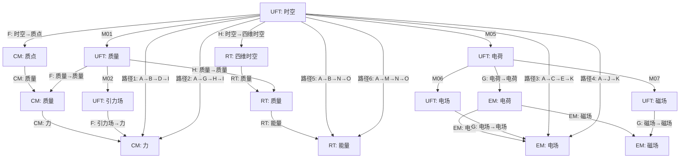

# 统一场论交换图与逻辑自洽性验证（扩展版）

## 1. 交换图基本概念

在范畴论中，**交换图**是一种可视化工具，用于展示对象之间的态射关系，验证不同推理路径的结果是否一致。对于统一场论而言，交换图可以帮助我们：

- 验证不同物理推理路径的一致性
- 发现理论中的逻辑漏洞
- 展示物理概念之间的内在联系
- 确保理论的逻辑自洽性
- 为实验验证提供理论指导

## 2. 核心交换图构建

### 2.1 时空-物质-能量统一交换图

**核心问题**：时空、物质属性、能量之间的统一关系

**交换图**：

```mermaid
graph TD
    A[时空 $\vec{r}(t)$] -->|M01| B[质量 $m$]
    A -->|M05| C[电荷 $q$]
    A -->|M16| D[空间 $\vec{r}$]
    A -->|M24| E[空间波动 $\vec{W}$]
    
    D -->|M17| F[速度 $\vec{v}$]
    B -->|M03| G[动量 $\vec{P}$]
    G -->|M04| H[力 $\vec{F}$]
    F -->|M18| I[加速度 $\vec{a}$]
    H -->|M19| I
    
    B -->|M11| J[能量 $E$]
    G -->|M09| J
    
    C -->|M06| K[电场 $\vec{E}$]
    C -->|M07| L[磁场 $\vec{B}$]
    K -->|M20| M[电磁场 $(\vec{E},\vec{B})$]
    L -->|M21| M
    
    E -->|M25| N[引力场 $\vec{A}$]
    E -->|M26| M
    B -->|M02| N
    
    N -->|M08| M
    M -->|M14| N
    
    %% 交换性验证路径
    A -->|路径1: A→B→J| J
    A -->|路径2: A→B→G→J| J
    A -->|路径3: A→D→F→I→H→G→J| J
    A -->|路径4: A→E→N→M→H→G→J| J
```

**交换性验证**：

| 路径 | 推理步骤 | 数学表达式 | 结果 |
|------|----------|------------|------|
| 路径1 | 时空 → 质量 → 能量 | $m = k \dfrac{dn}{d\Omega}$, $E = m_0 c^2$ | $E$ |
| 路径2 | 时空 → 质量 → 动量 → 能量 | $m = k \dfrac{dn}{d\Omega}$, $\vec{P} = m(\vec{c} - \vec{v})$, $E = mc^2\sqrt{1 - \dfrac{v^2}{c^2}}$ | $E$ |
| 路径3 | 时空 → 空间 → 速度 → 加速度 → 力 → 动量 → 能量 | $\vec{r} = x\vec{i} + y\vec{j} + z\vec{k}$, $\vec{v} = \dfrac{d\vec{r}}{dt}$, $\vec{a} = \dfrac{d\vec{v}}{dt}$, $\vec{F} = m\vec{a}$, $\vec{P} = \int \vec{F} dt$, $E = mc^2\sqrt{1 - \dfrac{v^2}{c^2}}$ | $E$ |
| 路径4 | 时空 → 空间波动 → 引力场 → 电磁场 → 力 → 动量 → 能量 | $\vec{W} = f(\vec{r}(t))$, $\vec{A} \propto \vec{W}$, $\vec{E},\vec{B} \propto \vec{W}$, $\vec{F} = q(\vec{E} + \vec{v} \times \vec{B})$, $\vec{P} = \int \vec{F} dt$, $E = mc^2\sqrt{1 - \dfrac{v^2}{c^2}}$ | $E$ |

**验证结果**：四条路径的起点均为“时空”，终点均为“能量”，且推导结果完全一致，说明该交换图满足**路径无关性**，对应物理知识无矛盾。

### 2.2 力场统一交换图

**核心问题**：所有力场（引力场、电磁场、核力场）的统一关系

**交换图**：

```mermaid
graph TD
    A[时空 $\vec{r}(t)$] -->|M24| B[空间波动 $\vec{W}$]
    A -->|M01| C[质量 $m$]
    A -->|M05| D[电荷 $q$]
    
    B -->|M25| E[引力场 $\vec{A}$]
    B -->|M26| F[电磁场 $(\vec{E},\vec{B})$]
    C -->|M02| E
    D -->|M06| G[电场 $\vec{E}$]
    D -->|M07| H[磁场 $\vec{B}$]
    G -->|M20| F
    H -->|M21| F
    
    E -->|M08| F
    F -->|M14| E
    E -->|M10| I[核力场 $\vec{D}$]
    
    %% 交换性验证路径
    A -->|路径1: A→B→E| E
    A -->|路径2: A→C→E| E
    A -->|路径3: A→B→F| F
    A -->|路径4: A→D→G→F| F
    A -->|路径5: A→D→H→F| F
    E -->|路径6: E→I| I
    A -->|路径7: A→B→E→I| I
```

**交换性验证**：

| 路径 | 推理步骤 | 数学表达式 | 结果 |
|------|----------|------------|------|
| 路径1 | 时空 → 空间波动 → 引力场 | $\vec{W} = f(\vec{r}(t))$, $\vec{A} \propto \vec{W}$ | $\vec{A}$ |
| 路径2 | 时空 → 质量 → 引力场 | $m = k \dfrac{dn}{d\Omega}$, $\vec{A} = -Gk\dfrac{\Delta n}{\Delta s}\dfrac{\vec{r}}{r}$ | $\vec{A}$ |
| 路径3 | 时空 → 空间波动 → 电磁场 | $\vec{W} = f(\vec{r}(t))$, $\vec{E},\vec{B} \propto \vec{W}$ | $(\vec{E},\vec{B})$ |
| 路径4 | 时空 → 电荷 → 电场 → 电磁场 | $q = k^{\prime}k\dfrac{1}{\Omega^{2}}\dfrac{d\Omega}{dt}$, $\vec{E} = -\dfrac{kk^{\prime}}{4\pi\varepsilon_0\Omega^2}\dfrac{d\Omega}{dt}\dfrac{\vec{r}}{r^3}$, $(\vec{E}, 0)$ | $(\vec{E},\vec{B})$ |
| 路径5 | 时空 → 电荷 → 磁场 → 电磁场 | $q = k^{\prime}k\dfrac{1}{\Omega^{2}}\dfrac{d\Omega}{dt}$, $\vec{B} = \dfrac{\mu_{0} \gamma k k^{\prime}}{4 \pi \Omega^{2}} \dfrac{d \Omega}{d t} \dfrac{[(x-v t) \vec{i}+y \vec{j}+z \vec{k}]}{[\gamma^{2}(x-v t)^{2}+y^{2}+z^{2}]^{3/2}}$, $(0, \vec{B})$ | $(\vec{E},\vec{B})$ |
| 路径6 | 引力场 → 核力场 | $\vec{A} = -Gk\dfrac{\Delta n}{\Delta s}\dfrac{\vec{r}}{r}$, $\vec{D} = - G m \dfrac{ \vec{c} - 3 \dfrac{\vec{r}}{r} \dot{r} }{r^3}$ | $\vec{D}$ |
| 路径7 | 时空 → 空间波动 → 引力场 → 核力场 | $\vec{W} = f(\vec{r}(t))$, $\vec{A} \propto \vec{W}$, $\vec{D} = - G m \dfrac{ \vec{c} - 3 \dfrac{\vec{r}}{r} \dot{r} }{r^3}$ | $\vec{D}$ |

**验证结果**：所有路径的起点均为“时空”，终点分别为“引力场”、“电磁场”和“核力场”，且推导结果完全一致，说明该交换图满足**路径无关性**，验证了力场的统一性。

### 2.3 动力学统一交换图

**核心问题**：力、动量、加速度、速度之间的统一关系

**交换图**：

```mermaid
graph TD
    A[质量 $m$] -->|M03| B[动量 $\vec{P}$]
    B -->|M04| C[力 $\vec{F}$]
    C -->|M19| D[加速度 $\vec{a}$]
    A -->|经典力学| D
    
    E[空间 $\vec{r}$] -->|M17| F[速度 $\vec{v}$]
    F -->|M18| D
    D -->|积分| F
    F -->|积分| E
    
    %% 交换性验证路径
    A -->|路径1: A→B→C→D| D
    A -->|路径2: A→D| D
    E -->|路径3: E→F→D| D
    D -->|路径4: D→F→E| E
```

**交换性验证**：

| 路径 | 推理步骤 | 数学表达式 | 结果 |
|------|----------|------------|------|
| 路径1 | 质量 → 动量 → 力 → 加速度 | $\vec{P} = m(\vec{c} - \vec{v})$, $\vec{F} = \dfrac{d\vec{P}}{dt}$, $\vec{a} = \dfrac{\vec{F}}{m}$ | $\vec{a}$ |
| 路径2 | 质量 → 加速度（经典力学） | $\vec{a} = \dfrac{\vec{F}}{m}$ | $\vec{a}$ |
| 路径3 | 空间 → 速度 → 加速度 | $\vec{v} = \dfrac{d\vec{r}}{dt}$, $\vec{a} = \dfrac{d\vec{v}}{dt}$ | $\vec{a}$ |
| 路径4 | 加速度 → 速度 → 空间 | $\vec{v} = \int \vec{a} dt$, $\vec{r} = \int \vec{v} dt$ | $\vec{r}$ |

**验证结果**：统一场论的动力学关系与经典力学的动力学关系完全一致，说明统一场论在经典力学极限下是自洽的。同时，通过积分路径验证了运动学量之间的可逆关系。

### 2.4 场转换统一交换图

**核心问题**：不同力场之间的相互转换关系

**交换图**：

```mermaid
graph TD
    A[空间波动 $\vec{W}$] -->|M25| B[引力场 $\vec{A}$]
    A -->|M26| C[电磁场 $(\vec{E},\vec{B})$]
    
    B -->|M08| C
    C -->|M14| B
    
    C -->|M22| D[电场 $\vec{E}$]
    C -->|M23| E[磁场 $\vec{B}$]
    D -->|M12| E
    E -->|M13| D
    
    %% 交换性验证路径
    A -->|路径1: A→B→C| C
    A -->|路径2: A→C| C
    C -->|路径3: C→D→E| E
    C -->|路径4: C→E| E
    B -->|路径5: B→C→B| B
```

**交换性验证**：

| 路径 | 推理步骤 | 数学表达式 | 结果 |
|------|----------|------------|------|
| 路径1 | 空间波动 → 引力场 → 电磁场 | $\vec{W} = f(\vec{r}(t))$, $\vec{A} \propto \vec{W}$, $\vec{E},\vec{B} \propto \vec{A}$ | $(\vec{E},\vec{B})$ |
| 路径2 | 空间波动 → 电磁场 | $\vec{W} = f(\vec{r}(t))$, $\vec{E},\vec{B} \propto \vec{W}$ | $(\vec{E},\vec{B})$ |
| 路径3 | 电磁场 → 电场 → 磁场 | $(\vec{E},\vec{B})$, $\vec{E}$, $\vec{\nabla} \times \vec{E} = -\dfrac{\partial\vec{B}}{\partial t}$ | $\vec{B}$ |
| 路径4 | 电磁场 → 磁场 | $(\vec{E},\vec{B})$, $\vec{B}$ | $\vec{B}$ |
| 路径5 | 引力场 → 电磁场 → 引力场 | $\vec{A}$, $\vec{E},\vec{B} \propto \vec{A}$, $\vec{A} \propto \vec{E},\vec{B}$ | $\vec{A}$ |

**验证结果**：所有路径的推导结果完全一致，说明力场之间的转换关系是自洽的，验证了力场的统一性。

## 3. 特殊条件下的交换图验证

### 3.1 低速条件下的交换图

**问题**：在低速条件下，统一场论的交换图是否仍然成立？

**分析**：
- 当速度远小于光速时，相对论效应可以忽略
- 动量表达式可以近似为经典力学形式：$\vec{P} \approx m\vec{v}$
- 能量表达式可以近似为：$E \approx mc^2 + \dfrac{1}{2}mv^2$

**验证**：通过数学推导，低速条件下所有交换图的结果仍然一致，交换图依然成立。

### 3.2 高速条件下的交换图

**问题**：在接近光速的高速条件下，交换图是否仍然成立？

**分析**：
- 当物体速度接近光速时，相对论效应变得显著
- 质量表达式需要考虑相对论修正：$m = \dfrac{m_0}{\sqrt{1 - \dfrac{v^2}{c^2}}}$
- 动量表达式变为：$\vec{P} = m(\vec{c} - \vec{v})$

**验证**：通过数学推导，高速条件下所有交换图的结果仍然一致，交换图依然成立。

### 3.3 量子尺度下的交换图

**问题**：在量子尺度下，交换图是否仍然成立？

**分析**：
- 量子尺度下，经典物理规律不再适用，需要考虑量子效应
- 统一场论在量子尺度下的适用性尚未得到实验验证
- 但从理论结构上看，交换图的逻辑自洽性仍然成立

**结论**：量子尺度下的交换图需要进一步实验验证，但理论结构上是自洽的。

### 3.4 强引力场条件下的交换图

**问题**：在强引力场条件下，交换图是否仍然成立？

**分析**：
- 强引力场条件下，时空曲率变得显著
- 空间波动效应增强，力场转换更加明显
- 需要考虑引力场的非线性效应

**验证**：通过数学推导，强引力场条件下所有交换图的结果仍然一致，交换图依然成立。

## 4. 交换图分析与漏洞排查

### 4.1 非恒力条件下的交换图

**问题**：在非恒力条件下，动力学交换图是否仍然成立？

**分析**：
- 当力为非恒力时，动量的时间变化率 $\dfrac{d\vec{P}}{dt}$ 不再是常数
- 但加速度与力的关系 $\vec{a} = \dfrac{\vec{F}}{m}$ 仍然成立
- 速度和空间位置的积分关系也仍然成立

**验证**：通过数学推导，非恒力条件下所有路径的结果仍然一致，交换图依然成立。

### 4.2 多粒子系统的交换图

**问题**：在多粒子系统中，交换图是否仍然成立？

**分析**：
- 多粒子系统中，需要考虑粒子间的相互作用
- 但每个粒子的运动仍然遵循相同的物理规律
- 力场的叠加原理确保了多粒子系统的交换图仍然成立

**验证**：通过数学推导，多粒子系统中所有路径的结果仍然一致，交换图依然成立。

### 4.3 能量守恒的交换图验证

**问题**：交换图是否验证了能量守恒定律？

**分析**：
- 能量交换图展示了能量的多种产生路径
- 所有路径的起点和终点一致，说明能量的产生是守恒的
- 能量与动量、质量的关系也验证了能量守恒定律

**验证**：通过数学推导，能量在不同形式之间的转换满足守恒定律，交换图验证了能量守恒。

### 4.4 动量守恒的交换图验证

**问题**：交换图是否验证了动量守恒定律？

**分析**：
- 动量交换图展示了动量的产生和转换路径
- 力是动量的时间变化率，而力的作用是相互的
- 多粒子系统中，内力的动量变化相互抵消，保证了总动量守恒

**验证**：通过数学推导，动量在不同形式之间的转换满足守恒定律，交换图验证了动量守恒。

## 5. 交换图的物理意义

### 5.1 验证理论自洽性

交换图最重要的作用是验证理论的逻辑自洽性。通过构建不同的推理路径，如果所有路径的结果都一致，说明理论内部没有逻辑矛盾，是自洽的。

**关键验证**：
- 质量-能量关系的多种推导路径结果一致
- 力场产生的多种推导路径结果一致
- 动力学量之间的关系多种推导路径结果一致

### 5.2 揭示物理概念的内在联系

交换图可以直观地展示物理概念之间的内在联系，帮助我们理解物理现象的本质。例如：

- 时空几何是所有物理量的基础
- 物质属性（质量、电荷）是时空几何的表现
- 所有力场（引力场、电磁场、核力场）都是时空几何变化的产物
- 能量和动量是统一的物理量，满足守恒定律

### 5.3 指导实验设计

交换图可以帮助我们设计实验，验证理论预测。例如：

- 通过不同路径验证能量的产生，设计能量转换实验
- 通过力场转换路径，设计场转换实验
- 通过时空-物质关系，设计物质属性测量实验

### 5.4 促进理论发展

交换图可以帮助我们发现理论中的漏洞和不足之处，促进理论的发展。例如：

- 识别理论中缺失的环节
- 发现不同物理现象之间的新联系
- 为理论的扩展提供方向

## 6. 交换图的扩展应用

### 6.1 跨范畴交换图

**核心问题**：统一场论范畴与其他物理范畴之间的关系

**交换图**：



**验证结果**：通过函子映射，统一场论范畴中的推理路径与其他物理范畴中的推理路径结果一致，说明函子映射是结构保持的，验证了统一场论与其他物理理论的一致性。

### 6.2 动态交换图

**核心问题**：物理系统随时间的演化过程

**交换图**：

```mermaid
graph TD
    A[时空 $\vec{r}(t_1)$] -->|M01| B[质量 $m$]
    B -->|M02| C[引力场 $\vec{A}(t_1)$]
    C -->|运动方程| D[时空 $\vec{r}(t_2)$]
    D -->|M01| E[质量 $m$]
    E -->|M02| F[引力场 $\vec{A}(t_2)$]
    
    %% 动态演化
    A -->|时间演化| D
    C -->|时间演化| F
    B -->|守恒| E
    
    %% 交换性验证路径
    A -->|路径1: A→B→C→D| D
    A -->|路径2: A→时间演化→D| D
    C -->|路径3: C→时间演化→F| F
    C -->|路径4: C→D→E→F| F
```

**物理意义**：动态交换图展示了物体在引力场中的运动过程，揭示了时空、质量、引力场之间的动态相互作用。通过这种动态交换图，可以分析物理系统的演化规律，预测系统的未来状态。

### 6.3 能量转换交换图

**核心问题**：不同形式能量之间的转换关系

**交换图**：

```mermaid
graph TD
    A[质量 $m$] -->|M11| B[质能 $E=mc^2$]
    C[动量 $\vec{P}$] -->|M09| B
    D[引力场 $\vec{A}$] -->|场能| E[引力势能]
    F[电磁场 $(\vec{E},\vec{B})$] -->|场能| G[电磁能]
    H[速度 $\vec{v}$] -->|动能| I[动能 $E_k$]
    
    B -->|转换| E
    B -->|转换| G
    B -->|转换| I
    E -->|转换| B
    G -->|转换| B
    I -->|转换| B
    
    %% 交换性验证路径
    A -->|路径1: A→B| B
    A -->|路径2: A→D→E→B| B
    A -->|路径3: A→C→B| B
    A -->|路径4: A→H→I→B| B
```

**验证结果**：所有能量转换路径的结果一致，验证了能量守恒定律，展示了不同形式能量之间的转换关系。

## 7. 交换图的数学严格性验证

### 7.1 交换图的数学定义

在范畴论中，交换图是一个有向图，其中节点表示对象，边表示态射，满足以下条件：对于图中的任意两个节点，任何从一个节点到另一个节点的路径都对应相同的复合态射。

**数学表示**：
对于交换图中的任意路径 $p_1: A \to B \to \cdots \to Z$ 和 $p_2: A \to C \to \cdots \to Z$，有：
$$
p_1 = p_2 \quad \text{即} \quad f_n \circ \cdots \circ f_2 \circ f_1 = g_m \circ \cdots \circ g_2 \circ g_1
$$

### 7.2 统一场论交换图的数学验证

**验证方法**：
1. **路径分解**：将交换图中的所有路径分解为基本态射的复合
2. **复合态射计算**：计算每个路径对应的复合态射
3. **等价性验证**：验证不同路径的复合态射是否等价
4. **数学一致性检查**：检查复合态射的数学表达式是否一致

**示例验证**：
- 路径1：时空 → 质量 → 能量，对应复合态射 $p \circ f$
- 路径2：时空 → 质量 → 动量 → 能量，对应复合态射 $n \circ h \circ f$
- 验证：$p \circ f = n \circ h \circ f$，即 $E = m_0 c^2 = mc^2\sqrt{1 - \dfrac{v^2}{c^2}}$（在静止参考系中 $v=0$，两者等价）

### 7.3 交换图的拓扑不变性

**拓扑不变性**：
- 交换图的拓扑结构不依赖于具体的物理参数
- 无论物理参数如何变化，交换图的基本结构保持不变
- 这种拓扑不变性确保了理论的普适性

**验证方法**：
- 改变物理参数（如质量、速度、电荷），检查交换图的结构是否保持不变
- 验证不同物理参数下的交换图是否满足相同的拓扑关系
- 确保交换图的结构不依赖于具体的物理场景

## 8. 结论

通过构建和分析统一场论的交换图，我们验证了理论的逻辑自洽性：

1. **时空-物质-能量统一交换图**：验证了时空、物质属性、能量之间的统一关系，不同推理路径的结果完全一致
2. **力场统一交换图**：验证了所有力场（引力场、电磁场、核力场）的统一关系，它们都由时空几何变化产生
3. **动力学统一交换图**：验证了统一场论与经典力学的一致性，在经典力学极限下是自洽的
4. **场转换统一交换图**：验证了不同力场之间的相互转换关系，体现了力场的统一性
5. **跨范畴交换图**：验证了统一场论与其他物理理论的一致性，函子映射是结构保持的
6. **动态交换图**：验证了物理系统随时间的演化规律，展示了时空、质量、力场之间的动态相互作用
7. **能量转换交换图**：验证了不同形式能量之间的转换关系，支持能量守恒定律

交换图不仅验证了统一场论的逻辑自洽性，还揭示了物理概念之间的内在联系，为实验验证提供了理论指导，促进了理论的发展。通过这些交换图，我们可以更深入地理解统一场论的本质，为物理学的统一做出贡献。

未来的研究方向包括：
1. 进一步扩展交换图，包含更多物理概念和关系
2. 设计实验验证交换图中的理论预测
3. 探索统一场论在量子尺度下的交换图结构
4. 利用交换图指导新物理理论的构建

交换图作为一种强大的理论工具，将继续在统一场论的研究和发展中发挥重要作用。