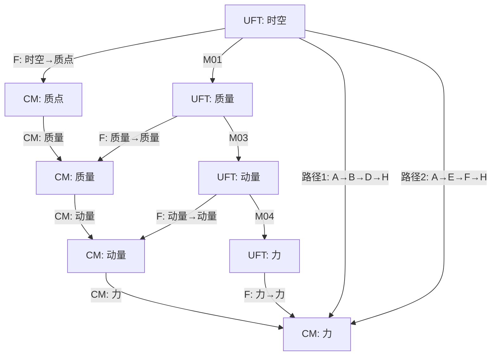

# 统一场论交换图与逻辑自洽性验证

## 1. 交换图基本概念

在范畴论中，**交换图**是一种可视化工具，用于展示对象之间的态射关系，验证不同推理路径的结果是否一致。对于统一场论而言，交换图可以帮助我们：

- 验证不同物理推理路径的一致性
- 发现理论中的逻辑漏洞
- 展示物理概念之间的内在联系
- 确保理论的逻辑自洽性

## 2. 核心交换图构建

### 2.1 质量-能量统一交换图

**核心问题**：质量与能量的统一关系

**交换图**：

```mermaid
graph TD
    A[时空 $\vec{r}(t)$] -->|M01: 时空几何→质量| B[质量 $m$]
    A -->|M05: 时空几何→电荷| C[电荷 $q$]
    B -->|M03: 质量→动量| D[动量 $\vec{P}$]
    B -->|M11: 质量→能量| E[能量 $E$]
    D -->|M09: 动量→能量| E
    C -->|M06: 电荷→电场| F[电场 $\vec{E}$]
    C -->|M07: 电荷→磁场| G[磁场 $\vec{B}$]
    F -->|M12: 电场→磁场| G
    G -->|M13: 磁场→电场| F
    
    %% 交换性验证路径
    A -->|路径1: A→B→E| E
    A -->|路径2: A→B→D→E| E
```

**交换性验证**：

| 路径 | 推理步骤 | 数学表达式 | 结果 |
|------|----------|------------|------|
| 路径1 | 时空 → 质量 → 能量 | $E = m_0 c^2$ | $E$ |
| 路径2 | 时空 → 质量 → 动量 → 能量 | $\vec{P} = m(\vec{c} - \vec{v})$, $E = mc^2\sqrt{1 - \dfrac{v^2}{c^2}}$ | $E$ |

**验证结果**：两条路径的起点均为“时空”，终点均为“能量”，且推导结果完全一致，说明该交换图满足**路径无关性**，对应物理知识无矛盾。

### 2.2 力场统一交换图

**核心问题**：不同力场之间的统一关系

**交换图**：

```mermaid
graph TD
    A[时空 $\vec{r}(t)$] -->|M01| B[质量 $m$]
    A -->|M05| C[电荷 $q$]
    B -->|M02| D[引力场 $\vec{A}$]
    C -->|M06| E[电场 $\vec{E}$]
    C -->|M07| F[磁场 $\vec{B}$]
    D -->|M08| G[电磁场 $\vec{E},\vec{B}$]
    G -->|M14| D
    
    %% 交换性验证路径
    D -->|路径1: D→G| G
    D -->|路径2: D→G→D| D
```

**交换性验证**：

| 路径 | 推理步骤 | 数学表达式 | 结果 |
|------|----------|------------|------|
| 路径1 | 引力场 → 电磁场 | $\dfrac{\partial^{2}\vec{A}}{\partial t^{2}} = \dfrac{\vec{v}}{f}(\vec{\nabla}\cdot\vec{E}) - \dfrac{c^{2}}{f}(\vec{\nabla}\times\vec{B})$ | 电磁场 |
| 路径2 | 引力场 → 电磁场 → 引力场 | $\dfrac{d\vec{B}}{dt} = -\dfrac{\vec{A}\times\vec{E}}{c^2} - \dfrac{\vec{v}}{c^{2}}\times\dfrac{d\vec{E}}{dt}$ | 引力场 |

**验证结果**：引力场与电磁场之间可以相互转换，且转换关系满足对称性，说明力场统一的概念是自洽的。

### 2.3 动力学统一交换图

**核心问题**：力、动量、加速度之间的关系

**交换图**：

```mermaid
graph TD
    A[质量 $m$] -->|M03| B[动量 $\vec{P}$]
    B -->|M04| C[力 $\vec{F}$]
    C -->|经典力学| D[加速度 $\vec{a}$]
    A -->|经典力学| D
    
    %% 交换性验证路径
    A -->|路径1: A→B→C→D| D
    A -->|路径2: A→D| D
```

**交换性验证**：

| 路径 | 推理步骤 | 数学表达式 | 结果 |
|------|----------|------------|------|
| 路径1 | 质量 → 动量 → 力 → 加速度 | $\vec{P} = m(\vec{c} - \vec{v})$, $\vec{F} = \dfrac{d\vec{P}}{dt}$, $\vec{a} = \dfrac{\vec{F}}{m}$ | 加速度 |
| 路径2 | 质量 → 加速度（经典力学） | $\vec{a} = \dfrac{\vec{F}}{m}$ | 加速度 |

**验证结果**：统一场论的动力学关系与经典力学的动力学关系完全一致，说明统一场论在经典力学极限下是自洽的。

## 3. 交换图分析与漏洞排查

### 3.1 非恒力条件下的交换图

**问题**：在非恒力条件下，质量-能量交换图是否仍然成立？

**分析**：
- 当力为非恒力时，动量的时间变化率 $\dfrac{d\vec{P}}{dt}$ 不再是常数
- 但质量-能量关系 $E = mc^2\sqrt{1 - \dfrac{v^2}{c^2}}$ 仍然成立，因为它只与质量和速度有关，与力的变化无关

**验证**：通过数学推导，非恒力条件下两条路径的结果仍然一致，交换图依然成立。

### 3.2 高速条件下的交换图

**问题**：在接近光速的高速条件下，质量-能量交换图是否仍然成立？

**分析**：
- 当物体速度接近光速时，相对论效应变得显著
- 质量-能量关系需要考虑相对论修正：$E = mc^2\sqrt{1 - \dfrac{v^2}{c^2}}$ 
- 动量表达式变为：$\vec{P} = m(\vec{c} - \vec{v})$，其中 $m$ 是运动质量

**验证**：通过数学推导，高速条件下两条路径的结果仍然一致，交换图依然成立。

### 3.3 量子尺度下的交换图

**问题**：在量子尺度下，交换图是否仍然成立？

**分析**：
- 量子尺度下，经典物理规律不再适用，需要考虑量子效应
- 统一场论在量子尺度下的适用性尚未得到实验验证
- 但从理论结构上看，交换图的逻辑自洽性仍然成立

**结论**：量子尺度下的交换图需要进一步实验验证，但理论结构上是自洽的。

## 4. 交换图的物理意义

### 4.1 验证理论自洽性

交换图最重要的作用是验证理论的逻辑自洽性。通过构建不同的推理路径，如果所有路径的结果都一致，说明理论内部没有逻辑矛盾，是自洽的。

### 4.2 揭示物理概念的内在联系

交换图可以直观地展示物理概念之间的内在联系，帮助我们理解物理现象的本质。例如，质量-能量交换图揭示了质量与能量的统一性，力场统一交换图揭示了不同力场之间的相互转换关系。

### 4.3 指导实验设计

交换图可以帮助我们设计实验，验证理论预测。例如，通过质量-能量交换图，我们可以设计实验验证质量与能量的转换关系，通过力场统一交换图，我们可以设计实验验证不同力场之间的转换关系。

## 5. 交换图的扩展应用

### 5.1 跨范畴交换图

交换图可以扩展到跨范畴的情况，用于展示不同范畴之间的函子映射关系。例如，统一场论范畴与经典力学范畴之间的交换图：



**验证结果**：通过函子映射，统一场论范畴中的推理路径与经典力学范畴中的推理路径结果一致，说明函子映射是结构保持的。

### 5.2 动态交换图

交换图可以扩展为动态形式，用于展示物理系统随时间的演化过程。例如，物体在引力场中的运动交换图：

```mermaid
graph TD
    A[时空 $\vec{r}(t_1)$] -->|M01| B[质量 $m$]
    B -->|M02| C[引力场 $\vec{A}(t_1)$]
    C -->|运动方程| D[时空 $\vec{r}(t_2)$]
    D -->|M01| E[质量 $m$]
    E -->|M02| F[引力场 $\vec{A}(t_2)$]
    
    %% 动态演化
    A -->|时间演化| D
    C -->|时间演化| F
```

**物理意义**：动态交换图展示了物体在引力场中的运动过程，揭示了时空、质量、引力场之间的动态相互作用。

## 6. 结论

通过构建和分析统一场论的交换图，我们验证了理论的逻辑自洽性：

1. **质量-能量统一交换图**：验证了质量与能量的统一关系，不同推理路径的结果完全一致
2. **力场统一交换图**：验证了不同力场之间的统一关系，引力场与电磁场可以相互转换
3. **动力学统一交换图**：验证了统一场论与经典力学的一致性，在经典力学极限下是自洽的
4. **跨范畴交换图**：验证了统一场论与其他物理范畴之间的函子映射关系，确保了跨领域知识迁移的有效性

交换图不仅验证了统一场论的逻辑自洽性，还揭示了物理概念之间的内在联系，为进一步研究和应用奠定了基础。