# 统一场论核心概念泛性质与层级知识树（扩展版）

## 1. 泛性质基本概念

在范畴论中，**泛性质**是对象在范畴中的“普遍”或“本质”特征，它描述了对象的核心功能和作用，剥离了具体的实现细节。对于统一场论而言，提炼核心概念的泛性质可以帮助我们：

- 抓住物理概念的本质，避免碎片化记忆
- 构建“本质→实例”的层级知识树
- 发现不同物理概念之间的内在联系
- 实现跨领域的知识迁移和应用
- 为理论的扩展和发展提供指导

## 2. 核心概念泛性质提炼

### 2.1 时空（Spacetime）

**泛性质**：物理现象的几何载体，所有物理量的基础框架

**本质特征**：
- 描述物理事件发生的位置和时间
- 提供物理量的几何背景
- 决定物质属性和力场的产生
- 满足时空同一化原理
- 几何结构决定物理定律形式
- 适用于从静止到光速的所有速度范围

**具体实例**：
- 时空同一化方程：$\vec{r}(t) = \vec{c}t = x\vec{i} + y\vec{j} + z\vec{k}$
- 三维螺旋时空方程：$\vec{r}(t) = r\cos\omega t \cdot \vec{i} + r\sin\omega t \cdot \vec{j} + ht \cdot \vec{k}$
- 四维时空（相对论范畴）：$(ct, x, y, z)$
- 弯曲时空（广义相对论）：$ds^2 = g_{\mu\nu}dx^\mu dx^\nu$

### 2.2 时间（Time）

**泛性质**：物理事件的顺序性和持续性度量

**本质特征**：
- 描述物理事件发生的先后顺序
- 提供物理过程演化的参数
- 与空间统一为时空整体
- 流逝速率与参考系运动状态相关
- 满足因果律约束
- 是不可逆的单向流

**具体实例**：
- 坐标时间：$t$
- 固有时：$\tau = t\sqrt{1 - \frac{v^2}{c^2}}$
- 宇宙时间：宇宙演化的全局时间
- 热力学时间：熵增方向的时间

### 2.3 空间（Space）

**泛性质**：物理事件的位置性度量

**本质特征**：
- 描述物理事件发生的位置
- 提供物质存在的三维框架
- 与时间统一为时空整体
- 具有欧几里得或非欧几里得几何结构
- 几何变化产生物理效应
- 是力场传播的载体

**具体实例**：
- 笛卡尔坐标系：$(x, y, z)$
- 球坐标系：$(r, \theta, \phi)$
- 柱坐标系：$(r, \theta, z)$
- 弯曲空间：由度规张量描述的非欧空间

### 2.4 质量（Mass）

**泛性质**：物质的基本属性，由时空几何变化率决定

**本质特征**：
- 描述物质的惯性和引力特性
- 与时空几何变化率直接相关
- 是动量、能量等物理量的基础
- 满足质量几何化原理
- 运动状态影响质量大小
- 可与能量相互转换

**具体实例**：
- 质量定义方程：$m = k \dfrac{dn}{d\Omega}$
- 静止质量：$m_0$
- 运动质量：$m = \dfrac{m_0}{\sqrt{1 - \dfrac{v^2}{c^2}}}$
- 引力质量：产生引力场的质量
- 惯性质量：抵抗加速度的质量

### 2.5 速度（Velocity）

**泛性质**：物体位置变化的速率和方向

**本质特征**：
- 描述物体运动的快慢和方向
- 是动量、动能等物理量的组成部分
- 光速是宇宙中速度的上限
- 与参考系选择相关
- 是矢量物理量
- 相对论效应随速度增加而显著

**具体实例**：
- 平均速度：$\vec{v} = \frac{\Delta\vec{r}}{\Delta t}$
- 瞬时速度：$\vec{v} = \frac{d\vec{r}}{dt}$
- 光速：$\vec{c} = 3 \times 10^8 \, m/s$
- 四维速度：$u^\mu = \gamma(c, \vec{v})$

### 2.6 加速度（Acceleration）

**泛性质**：物体速度变化的速率和方向

**本质特征**：
- 描述物体运动状态的变化
- 由力场作用产生
- 与力和质量的关系由牛顿第二定律描述
- 是矢量物理量
- 相对论效应显著
- 是力的直接表现

**具体实例**：
- 平均加速度：$\vec{a} = \frac{\Delta\vec{v}}{\Delta t}$
- 瞬时加速度：$\vec{a} = \frac{d\vec{v}}{dt}$
- 重力加速度：$g = 9.8 \, m/s^2$
- 向心加速度：$\vec{a} = \frac{v^2}{r}\hat{r}$

### 2.7 力（Force）

**泛性质**：改变物体运动状态的相互作用

**本质特征**：
- 使物体产生加速度
- 是动量的时间变化率
- 由力场产生
- 满足牛顿第三定律（作用力与反作用力）
- 是矢量物理量
- 不同类型的力统一于时空几何

**具体实例**：
- 万有引力：$\vec{F} = G\frac{m_1m_2}{r^2}\hat{r}$
- 电磁力：$\vec{F} = q(\vec{E} + \vec{v} \times \vec{B})$
- 核力：短程强相互作用力
- 摩擦力：接触表面的阻力
- 弹力：弹性形变产生的力

### 2.8 动量（Momentum）

**泛性质**：物质运动的量度，连接质量、速度与力

**本质特征**：
- 描述物质的运动状态
- 与质量和速度直接相关
- 力是动量的时间变化率
- 满足动量守恒定律
- 是能量的组成部分
- 相对论效应显著

**具体实例**：
- 经典力学动量：$\vec{p} = m\vec{v}$
- 相对论动量：$\vec{p} = \gamma m_0\vec{v}$
- 统一场论动量：$\vec{P} = m(\vec{c} - \vec{v})$
- 四维动量：$(E/c, \vec{p})$
- 角动量：$\vec{L} = \vec{r} \times \vec{p}$

### 2.9 能量（Energy）

**泛性质**：物质做功的能力，与质量、动量直接相关

**本质特征**：
- 描述物质的能量状态
- 与质量和动量直接相关
- 满足能量守恒定律
- 不同形式的能量可以相互转换
- 质量是能量的一种形式
- 能量密度与场强平方成正比

**具体实例**：
- 质能：$E = mc^2$
- 动能：$E_k = \frac{1}{2}mv^2$（经典），$E_k = (\gamma - 1)m_0c^2$（相对论）
- 势能：重力势能 $mgh$，电势能 $qV$
- 场能：电场能 $\frac{1}{2}\varepsilon_0E^2$，磁场能 $\frac{1}{2\mu_0}B^2$
- 内能：物体内部的总能量

### 2.10 电荷（Charge）

**泛性质**：物质的电磁属性，由时空几何旋转时间变化率决定

**本质特征**：
- 描述物质的电磁特性
- 与时空几何旋转时间变化率直接相关
- 产生电场和磁场
- 满足电荷守恒定律
- 有正、负两种类型
- 量子化特征（基本电荷为电子电荷）

**具体实例**：
- 电荷定义方程：$q = k^{\prime}k\dfrac{1}{\Omega^{2}}\dfrac{d\Omega}{dt}$
- 电子电荷：$e = 1.602 \times 10^{-19} \, C$
- 质子电荷：$+e$
- 中子：电中性
- 夸克电荷：分数电荷（$\pm\frac{1}{3}e, \pm\frac{2}{3}e$）

### 2.11 力场（Force Field）

**泛性质**：改变物体运动状态的作用场

**本质特征**：
- 对物体施加作用力，改变其运动状态
- 由物质属性（质量、电荷等）产生
- 满足场的叠加原理
- 不同力场之间可以相互转换
- 通过空间波动传播
- 是时空几何变化的表现

**具体实例**：
- 引力场：$\vec{A} = -Gk\dfrac{\Delta n}{\Delta s}\dfrac{\vec{r}}{r}$
- 电场：$\vec{E} = -\dfrac{kk^{\prime}}{4\pi\varepsilon_0\Omega^2}\dfrac{d\Omega}{dt}\dfrac{\vec{r}}{r^3}$
- 磁场：$\vec{B} = \dfrac{\mu_{0} \gamma k k^{\prime}}{4 \pi \Omega^{2}} \dfrac{d \Omega}{d t} \dfrac{[(x-v t) \vec{i}+y \vec{j}+z \vec{k}]}{[\gamma^{2}(x-v t)^{2}+y^{2}+z^{2}]^{3/2}}$
- 电磁场：统一的电场和磁场
- 核力场：$\vec{D} = - G m \dfrac{ \vec{c} - 3 \dfrac{\vec{r}}{r} \dot{r} }{r^3}$

### 2.12 电场（Electric Field）

**泛性质**：电荷产生的力场，影响带电粒子的运动

**本质特征**：
- 由电荷空间分布产生
- 对带电粒子施加静电力
- 满足库仑定律
- 可以与磁场相互转换
- 是电磁场的一个分量
- 强度与距离平方成反比

**具体实例**：
- 点电荷电场：$\vec{E} = \frac{q}{4\pi\varepsilon_0}\frac{\vec{r}}{r^3}$
- 匀强电场：$\vec{E} = const$
- 电偶极子电场：$\vec{E} \propto \frac{\vec{p}}{r^3}$
- 变化电场：产生磁场的电场

### 2.13 磁场（Magnetic Field）

**泛性质**：运动电荷产生的力场，影响运动带电粒子

**本质特征**：
- 由运动电荷产生
- 对运动带电粒子施加洛伦兹力
- 满足毕奥-萨伐尔定律
- 可以与电场相互转换
- 是电磁场的一个分量
- 强度与距离平方成反比

**具体实例**：
- 通电导线磁场：$\vec{B} = \frac{\mu_0I}{4\pi}\frac{\vec{v} \times \vec{r}}{r^3}$
- 匀强磁场：$\vec{B} = const$
- 磁偶极子磁场：$\vec{B} \propto \frac{\vec{m}}{r^3}$
- 变化磁场：产生电场的磁场

### 2.14 电磁场（Electromagnetic Field）

**泛性质**：电场和磁场的统一体，描述电磁相互作用

**本质特征**：
- 电场和磁场的统一表现
- 以光速传播
- 可以与引力场相互转换
- 满足麦克斯韦方程组
- 是电磁相互作用的载体
- 具有波粒二象性

**具体实例**：
- 电磁波：电场和磁场的振荡传播
- 静电场：静止电荷产生的电场
- 静磁场：恒定电流产生的磁场
- 电磁场张量：$F_{\mu\nu}$（相对论描述）

### 2.15 空间波动（Space Wave）

**泛性质**：时空几何的振动，力场传播的载体

**本质特征**：
- 由时空几何变化产生
- 以光速传播
- 是力场传播的载体
- 满足波动方程
- 可以携带能量和动量
- 与量子力学的波函数相关

**具体实例**：
- 引力波：时空曲率的波动
- 电磁波：电磁场的波动
- 物质波：粒子的波动性表现
- 德布罗意波：$\lambda = \frac{h}{p}$

### 2.16 立体角（Solid Angle）

**泛性质**：空间中某点对周围区域的张角，质量和电荷定义的关键参数

**本质特征**：
- 描述空间中角度的三维扩展
- 在质量几何化定义中起关键作用
- 在电荷定义中起关键作用
- 无量纲物理量
- 球面对应的立体角为$4\pi$
- 与空间几何直接相关

**具体实例**：
- 点光源的立体角：$\Omega = \frac{A}{r^2}$
- 圆锥体的立体角：$\Omega = 2\pi(1 - \cos\theta)$
- 质量定义中的立体角变化率：$\frac{dn}{d\Omega}$
- 电荷定义中的立体角旋转时间变化率：$\frac{1}{\Omega^2}\frac{d\Omega}{dt}$

### 2.17 耦合常数（Coupling Constant）

**泛性质**：描述不同力场之间的耦合强度

**本质特征**：
- 量化不同力场之间的相互作用强度
- 决定力场的作用范围和强度
- 体现力场的统一性
- 是理论预测与实验对比的关键参数
- 可能与时空几何结构相关
- 不同力的耦合常数差异很大

**具体实例**：
- 万有引力常数：$G = 6.674 \times 10^{-11} \, m^3kg^{-1}s^{-2}$
- 电磁光速几何耦合常数：$\frac{1}{4\pi\varepsilon_0} = 8.988 \times 10^9 \, Nm^2C^{-2}$
- 精细结构常数：$\alpha = \frac{e^2}{4\pi\varepsilon_0\hbar c} \approx \frac{1}{137}$
- 强相互作用耦合常数：$\alpha_s$
- 弱相互作用耦合常数：$G_F$

## 3. 本质→实例层级知识树

基于上述泛性质提炼，构建统一场论核心概念的层级知识树：

```mermaid
graph TD
    A[物理现象的本质框架] --> B[时空：几何载体]
    A --> C[物质属性：物理量基础]
    A --> D[力场：运动状态改变者]
    A --> E[动力学量：运动与能量描述]
    A --> F[时空组成：基本度量]
    A --> G[几何参数：空间关系]
    A --> H[耦合参数：力场相互作用]
    
    %% 时空分支
    B --> B1[时空同一化方程]
    B --> B2[三维螺旋时空方程]
    B --> B3[四维时空（相对论）]
    B --> B4[弯曲时空（广义相对论）]
    
    %% 时空组成分支
    F --> F1[时间]
    F --> F2[空间]
    F1 --> F11[坐标时间]
    F1 --> F12[固有时]
    F1 --> F13[宇宙时间]
    F1 --> F14[热力学时间]
    F2 --> F21[笛卡尔坐标系]
    F2 --> F22[球坐标系]
    F2 --> F23[柱坐标系]
    F2 --> F24[弯曲空间]
    
    %% 物质属性分支
    C --> C1[质量]
    C --> C2[电荷]
    C1 --> C11[质量定义方程]
    C1 --> C12[静止质量]
    C1 --> C13[运动质量]
    C1 --> C14[引力质量]
    C1 --> C15[惯性质量]
    C2 --> C21[电荷定义方程]
    C2 --> C22[电子电荷]
    C2 --> C23[质子电荷]
    C2 --> C24[夸克电荷]
    
    %% 力场分支
    D --> D1[引力场]
    D --> D2[电磁场]
    D --> D3[核力场]
    D --> D4[空间波动]
    D2 --> D21[电场]
    D2 --> D22[磁场]
    D21 --> D211[点电荷电场]
    D21 --> D212[匀强电场]
    D21 --> D213[电偶极子电场]
    D22 --> D221[通电导线磁场]
    D22 --> D222[匀强磁场]
    D22 --> D223[磁偶极子磁场]
    D4 --> D41[引力波]
    D4 --> D42[电磁波]
    D4 --> D43[物质波]
    
    %% 动力学量分支
    E --> E1[动量]
    E --> E2[能量]
    E --> E3[力]
    E --> E4[速度]
    E --> E5[加速度]
    E1 --> E11[经典动量]
    E1 --> E12[相对论动量]
    E1 --> E13[统一场论动量]
    E1 --> E14[四维动量]
    E1 --> E15[角动量]
    E2 --> E21[质能]
    E2 --> E22[动能]
    E2 --> E23[势能]
    E2 --> E24[场能]
    E2 --> E25[内能]
    E3 --> E31[万有引力]
    E3 --> E32[电磁力]
    E3 --> E33[核力]
    E3 --> E34[摩擦力]
    E3 --> E35[弹力]
    E4 --> E41[平均速度]
    E4 --> E42[瞬时速度]
    E4 --> E43[光速]
    E4 --> E44[四维速度]
    E5 --> E51[平均加速度]
    E5 --> E52[瞬时加速度]
    E5 --> E53[重力加速度]
    E5 --> E54[向心加速度]
    
    %% 几何参数分支
    G --> G1[立体角]
    G1 --> G11[点光源立体角]
    G1 --> G12[圆锥体立体角]
    G1 --> G13[质量定义中的立体角变化率]
    G1 --> G14[电荷定义中的立体角旋转时间变化率]
    
    %% 耦合参数分支
    H --> H1[万有引力常数]
    H --> H2[电磁光速几何耦合常数]
    H --> H3[精细结构常数]
    H --> H4[强相互作用耦合常数]
    H --> H5[弱相互作用耦合常数]
    H --> H6[引力光速统一方程]
    H --> H7[电磁光速几何耦合常数]
```

## 4. 泛性质的层级结构

统一场论核心概念的泛性质可以分为以下几个层级：

### 4.1 第一层级：最基本的泛性质

**时空**是最基本的泛性质，它提供了所有物理现象的几何载体和基础框架。其他所有物理概念都建立在时空的基础上，依赖于时空的几何结构。

### 4.2 第二层级：时空组成的泛性质

**时间**和**空间**是时空的组成部分，分别描述了物理事件的顺序性和位置性。它们的泛性质是理解时空几何的基础。

### 4.3 第三层级：物质属性的泛性质

**质量**和**电荷**是物质的基本属性，它们由时空几何变化率决定，是构建其他物理量的基础。

### 4.4 第四层级：力场和动力学量的泛性质

**力场**、**动量**、**能量**、**力**、**速度**、**加速度**是描述物质运动和相互作用的核心概念，它们由物质属性产生，又反过来影响物质的运动状态。

### 4.5 第五层级：几何参数和耦合参数的泛性质

**立体角**和**耦合常数**是描述空间关系和力场相互作用强度的参数，它们是理解物质属性和力场产生机制的关键。

## 5. 泛性质的应用示例

### 5.1 基于泛性质的概念扩展

**示例**：扩展力场概念

- **泛性质**：改变物体运动状态的作用场
- **新实例**：假设发现了一种新的力场，只要它满足“改变物体运动状态的作用场”这一泛性质，就可以将其归入“力场”范畴
- **验证**：通过实验验证新力场是否满足场的叠加原理、是否由物质属性产生、是否可以与其他力场相互转换

### 5.2 基于泛性质的跨范畴迁移

**示例**：力场概念从经典力学迁移到量子力学

- **泛性质**：改变物体运动状态的作用场
- **经典力学实例**：引力、弹力、摩擦力
- **量子力学实例**：量子场、虚粒子交换
- **迁移过程**：剥离具体的实现细节，抓住“改变物体运动状态的作用场”这一泛性质，将力场概念迁移到量子力学领域

### 5.3 基于泛性质的理论整合

**示例**：统一场论中力场的统一

- **泛性质**：改变物体运动状态的作用场
- **不同力场**：引力场、电场、磁场、核力场
- **统一过程**：抓住“改变物体运动状态的作用场”这一泛性质，发现不同力场都是由时空几何变化产生的，从而实现力场的统一

### 5.4 基于泛性质的实验设计

**示例**：验证质量几何化原理

- **泛性质**：质量由时空几何变化率决定
- **实验设计**：测量不同时空几何条件下的质量变化
- **预期结果**：质量与时空几何变化率成正比
- **验证方法**：通过精密测量和理论计算对比

## 6. 泛性质与其他范畴论概念的关系

### 6.1 泛性质与态射

泛性质描述了对象的本质特征，而态射描述了对象之间的关系。泛性质为态射提供了基础，态射则体现了泛性质的具体实现。

**示例**：
- 力场的泛性质：改变物体运动状态的作用场
- 态射：质量 → 引力场，电荷 → 电场，电场 → 磁场等
- 关系：态射体现了力场泛性质的具体实现，描述了力场如何由物质属性产生，以及不同力场之间如何相互转换

### 6.2 泛性质与交换图

泛性质确保了交换图的逻辑自洽性，而交换图则验证了泛性质的具体实现。

**示例**：
- 质量-能量关系的泛性质：能量与质量直接相关
- 交换图：时空 → 质量 → 能量，时空 → 动量 → 能量
- 关系：交换图验证了质量-能量泛性质的具体实现，确保不同推理路径的结果一致

### 6.3 泛性质与函子

泛性质是函子映射的基础，函子则保持了泛性质的结构。

**示例**：
- 动量的泛性质：物质运动的量度
- 函子映射：统一场论范畴 → 经典力学范畴，动量 → 动量
- 关系：函子映射保持了动量的泛性质，确保在不同范畴中动量的本质特征不变

### 6.4 泛性质与对象定义

泛性质是对象定义的核心，对象定义则是泛性质的具体表现。

**示例**：
- 时空的泛性质：物理现象的几何载体
- 对象定义：时空同一化方程，三维螺旋时空方程等
- 关系：对象定义是泛性质的具体数学表达，不同的对象定义体现了同一泛性质的不同实现

## 7. 泛性质的物理意义深化

### 7.1 质量的几何起源

泛性质分析揭示了质量的几何起源：质量不是物质的固有属性，而是空间几何变化率的表现。这一观点挑战了传统的物质观，为统一场论提供了几何基础。

### 7.2 力场的统一机制

泛性质分析展示了所有力场（引力场、电磁场、核力场）的统一机制：它们都由时空几何变化产生，通过空间波动传播。这种统一性是统一场论的核心特征。

### 7.3 能量动量的统一性

泛性质分析体现了能量和动量的统一性：它们都是描述物质运动状态的物理量，满足守恒定律，在相对论中统一为四维动量。

### 7.4 时空的本质

泛性质分析深化了我们对时空本质的理解：时空不是被动的容器，而是主动的参与者，其几何结构决定了物理定律的形式，产生了物质属性和力场。

## 8. 泛性质的层级知识树应用

### 8.1 知识组织与记忆

**应用**：
- 基于泛性质构建的层级知识树可以帮助学习者更好地组织和记忆物理概念
- 从本质到实例的结构使得知识体系更加清晰，避免碎片化记忆
- 层级结构反映了概念之间的逻辑关系，有助于理解物理理论的整体框架

**示例**：
- 学习力场概念时，首先理解其泛性质“改变物体运动状态的作用场”
- 然后学习具体实例：引力场、电场、磁场等
- 最后学习每种力场的具体数学表达式和应用

### 8.2 理论发展与创新

**应用**：
- 泛性质分析可以帮助科学家发现现有理论的不足之处，为理论创新提供方向
- 通过扩展泛性质的具体实例，可以发展新的物理理论
- 泛性质的统一性可以启发科学家寻找不同物理现象之间的新联系

**示例**：
- 基于力场的泛性质，科学家可以尝试统一不同类型的力
- 基于时空的泛性质，科学家可以发展新的时空理论
- 基于能量的泛性质，科学家可以探索新的能量形式

### 8.3 跨领域知识迁移

**应用**：
- 泛性质分析可以帮助科学家实现跨领域的知识迁移
- 通过识别不同领域中概念的共同泛性质，可以将一个领域的知识应用到另一个领域
- 跨领域知识迁移可以促进学科交叉，产生新的研究方向

**示例**：
- 将场论的概念从物理学迁移到其他学科
- 将能量守恒的概念应用到信息学和经济学
- 将时空几何的概念应用到计算机科学中的数据结构

### 8.4 实验设计与验证

**应用**：
- 泛性质分析可以帮助科学家设计实验，验证理论预测
- 通过泛性质的具体实例，可以确定实验的测量对象和方法
- 实验结果可以验证泛性质的正确性，从而验证整个理论体系

**示例**：
- 基于质量的几何起源泛性质，设计实验测量时空几何变化对质量的影响
- 基于力场统一的泛性质，设计实验验证不同力场之间的转换
- 基于能量动量统一的泛性质，设计实验验证能量守恒和动量守恒

## 9. 结论

通过强化泛性质分析，我们构建了一个更完整、更系统的统一场论层级知识树。这个知识树从最基本的泛性质出发，通过层层细化，最终到达具体的物理概念和数学表达式，形成了一个逻辑严密、结构清晰的知识体系。

泛性质分析帮助我们：

1. **抓住本质**：剥离具体实现细节，抓住物理概念的核心特征
2. **构建层级**：建立从本质到实例的层级结构，避免碎片化记忆
3. **促进迁移**：基于泛性质实现跨范畴的知识迁移和应用
4. **支持扩展**：为新物理概念的引入和整合提供框架
5. **验证自洽**：确保理论的逻辑自洽性和结构完整性
6. **指导实验**：为实验设计和验证提供理论指导
7. **启发创新**：为理论发展和创新提供思路

这种基于范畴论的泛性质分析方法，为统一场论的深入研究和应用提供了新的思路和工具，有助于推动统一场论的发展和完善。通过不断深化泛性质分析，我们可以更深入地理解物理现象的本质，为物理学的统一做出更大的贡献。