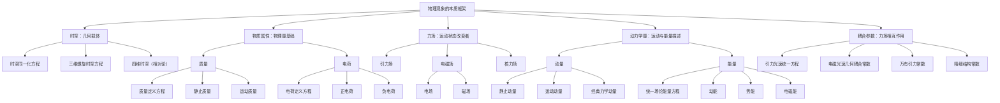

# 统一场论核心概念泛性质与层级知识树

## 1. 泛性质基本概念

在范畴论中，**泛性质**是对象在范畴中的“普遍”或“本质”特征，它描述了对象的核心功能和作用，剥离了具体的实现细节。对于统一场论而言，提炼核心概念的泛性质可以帮助我们：

- 抓住物理概念的本质，避免碎片化记忆
- 构建“本质→实例”的层级知识树
- 发现不同物理概念之间的内在联系
- 实现跨领域的知识迁移和应用

## 2. 核心概念泛性质提炼

### 2.1 时空（Spacetime）

**泛性质**：物理现象的几何载体，所有物理量的基础框架

**本质特征**：
- 描述物理事件发生的位置和时间
- 提供物理量的几何背景
- 决定物质属性和力场的产生
- 满足时空同一化原理

**具体实例**：
- 时空同一化方程：$\vec{r}(t) = \vec{c}t = x\vec{i} + y\vec{j} + z\vec{k}$
- 三维螺旋时空方程：$\vec{r}(t) = r\cos\omega t \cdot \vec{i} + r\sin\omega t \cdot \vec{j} + ht \cdot \vec{k}$
- 四维时空（相对论范畴）：$(ct, x, y, z)$

### 2.2 质量（Mass）

**泛性质**：物质的基本属性，由时空几何变化率决定

**本质特征**：
- 描述物质的惯性和引力特性
- 与时空几何变化率直接相关
- 是动量、能量等物理量的基础
- 满足质量几何化原理

**具体实例**：
- 质量定义方程：$m = k \dfrac{dn}{d\Omega}$
- 静止质量：$m_0$
- 运动质量：$m = \dfrac{m_0}{\sqrt{1 - \dfrac{v^2}{c^2}}}$
- 引力质量（产生引力场）

### 2.3 力场（Force Field）

**泛性质**：改变物体运动状态的作用场

**本质特征**：
- 对物体施加作用力，改变其运动状态
- 由物质属性（质量、电荷等）产生
- 满足场的叠加原理
- 不同力场之间可以相互转换

**具体实例**：
- 引力场：$\vec{A} = -Gk\dfrac{\Delta n}{\Delta s}\dfrac{\vec{r}}{r}$
- 电场：$\vec{E} = -\dfrac{kk^{\prime}}{4\pi\varepsilon_0\Omega^2}\dfrac{d\Omega}{dt}\dfrac{\vec{r}}{r^3}$
- 磁场：$\vec{B} = \dfrac{\mu_{0} \gamma k k^{\prime}}{4 \pi \Omega^{2}} \dfrac{d \Omega}{d t} \dfrac{[(x-v t) \vec{i}+y \vec{j}+z \vec{k}]}{[\gamma^{2}(x-v t)^{2}+y^{2}+z^{2}]^{3/2}}$
- 核力场：$\vec{D} = - G m \dfrac{ \vec{c} - 3 \dfrac{\vec{r}}{r} \dot{r} }{r^3}$

### 2.4 动量（Momentum）

**泛性质**：物质运动的量度，连接质量、速度与力

**本质特征**：
- 描述物质的运动状态
- 与质量和速度直接相关
- 力是动量的时间变化率
- 满足动量守恒定律

**具体实例**：
- 静止动量：$\vec{p}_{0} = m_{0}\vec{c}_{0}$
- 运动动量：$\vec{P} = m(\vec{c} - \vec{v})$
- 经典力学动量：$\vec{p} = m\vec{v}$
- 相对论四维动量：$(E/c, p_x, p_y, p_z)$

### 2.5 能量（Energy）

**泛性质**：物质做功的能力，与质量、动量直接相关

**本质特征**：
- 描述物质的能量状态
- 与质量和动量直接相关
- 满足能量守恒定律
- 不同形式的能量可以相互转换

**具体实例**：
- 统一场论能量方程：$E = m_0 c^2 = mc^2\sqrt{1 - \dfrac{v^2}{c^2}}$
- 动能：$E_k = \dfrac{1}{2}mv^2$（经典力学近似）
- 势能：$E_p = mgh$（重力势能）
- 电磁能：$E = \dfrac{1}{2}CV^2$（电容能量）

### 2.6 电荷（Charge）

**泛性质**：物质的电磁属性，由时空几何旋转时间变化率决定

**本质特征**：
- 描述物质的电磁特性
- 与时空几何旋转时间变化率直接相关
- 产生电场和磁场
- 满足电荷守恒定律

**具体实例**：
- 电荷定义方程：$q = k^{\prime}k\dfrac{1}{\Omega^{2}}\dfrac{d\Omega}{dt}$
- 正电荷：质子电荷
- 负电荷：电子电荷
- 点电荷：理想化的电荷模型

### 2.7 耦合常数（Coupling Constant）

**泛性质**：描述不同力场之间的耦合强度

**本质特征**：
- 量化不同力场之间的相互作用强度
- 决定力场的作用范围和强度
- 是统一场论中的关键参数
- 体现力场的统一性

**具体实例**：
- 引力光速统一方程：$Z = \dfrac{Gc}{2}$
- 电磁光速几何耦合常数：$Z^{\prime} = \dfrac{c}{8\pi\varepsilon_0}$
- 万有引力常数：$G$
- 精细结构常数：$\alpha = \dfrac{e^2}{4\pi\varepsilon_0\hbar c}$

## 3. 本质→实例层级知识树

基于上述泛性质提炼，构建统一场论核心概念的层级知识树：

## 4. 泛性质的层级结构

统一场论核心概念的泛性质可以分为以下几个层级：

### 4.1 第一层级：最基本的泛性质

**时空**是最基本的泛性质，它提供了所有物理现象的几何载体和基础框架。其他所有物理概念都建立在时空的基础上，依赖于时空的几何结构。

### 4.2 第二层级：物质属性的泛性质

**质量**和**电荷**是物质的基本属性，它们由时空几何变化率决定，是构建其他物理量的基础。

### 4.3 第三层级：力场和动力学量的泛性质

**力场**和**动力学量**（动量、能量）是描述物质运动和相互作用的核心概念，它们由物质属性产生，又反过来影响物质的运动状态。

### 4.4 第四层级：耦合参数的泛性质

**耦合常数**是描述不同力场之间相互作用强度的参数，它们体现了力场的统一性，是统一场论中的关键参数。

## 5. 泛性质的应用示例

### 5.1 基于泛性质的概念扩展

**示例**：扩展力场概念

- **泛性质**：改变物体运动状态的作用场
- **新实例**：假设发现了一种新的力场，只要它满足“改变物体运动状态的作用场”这一泛性质，就可以将其归入“力场”范畴
- **验证**：通过实验验证新力场是否满足场的叠加原理、是否由物质属性产生、是否可以与其他力场相互转换

### 5.2 基于泛性质的跨范畴迁移

**示例**：力场概念从经典力学迁移到电磁学

- **泛性质**：改变物体运动状态的作用场
- **经典力学实例**：引力场、弹力场、摩擦力场
- **电磁学实例**：电场、磁场
- **迁移过程**：剥离具体的实现细节，抓住“改变物体运动状态的作用场”这一泛性质，将力场概念迁移到电磁学领域

### 5.3 基于泛性质的理论整合

**示例**：统一场论中力场的统一

- **泛性质**：改变物体运动状态的作用场
- **不同力场**：引力场、电场、磁场、核力场
- **统一过程**：抓住“改变物体运动状态的作用场”这一泛性质，发现不同力场都是由时空几何变化产生的，从而实现力场的统一

## 6. 泛性质与其他范畴论概念的关系

### 6.1 泛性质与态射

泛性质描述了对象的本质特征，而态射描述了对象之间的关系。泛性质为态射提供了基础，态射则体现了泛性质的具体实现。

**示例**：
- 力场的泛性质：改变物体运动状态的作用场
- 态射：质量 → 引力场，电荷 → 电场，电场 → 磁场等
- 关系：态射体现了力场泛性质的具体实现，描述了力场如何由物质属性产生，以及不同力场之间如何相互转换

### 6.2 泛性质与交换图

泛性质确保了交换图的逻辑自洽性，而交换图则验证了泛性质的具体实现。

**示例**：
- 质量-能量关系的泛性质：能量与质量直接相关
- 交换图：时空 → 质量 → 能量，时空 → 动量 → 能量
- 关系：交换图验证了质量-能量泛性质的具体实现，确保不同推理路径的结果一致

### 6.3 泛性质与函子

泛性质是函子映射的基础，函子则保持了泛性质的结构。

**示例**：
- 动量的泛性质：物质运动的量度
- 函子映射：统一场论范畴 → 经典力学范畴，动量 → 动量
- 关系：函子映射保持了动量的泛性质，确保在不同范畴中动量的本质特征不变

## 7. 结论

通过提炼统一场论核心概念的泛性质，我们构建了从本质到实例的层级知识树，实现了对物理概念的深入理解和系统化组织。

泛性质分析帮助我们：

1. **抓住本质**：剥离具体实现细节，抓住物理概念的核心特征
2. **构建层级**：建立从本质到实例的层级结构，避免碎片化记忆
3. **促进迁移**：基于泛性质实现跨范畴的知识迁移和应用
4. **支持扩展**：为新物理概念的引入和整合提供框架
5. **验证自洽**：确保理论的逻辑自洽性和结构完整性

这种基于范畴论的泛性质分析方法，为统一场论的深入研究和应用提供了新的思路和工具，有助于推动统一场论的发展和完善。