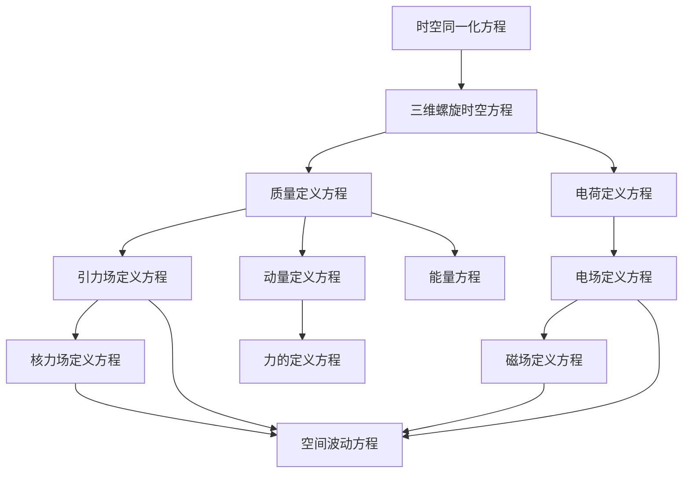

# 核心公式数学推导与物理意义

## 1. 时空同一化方程

### 1.1 数学推导
根据时空同一化公理，空间和时间是统一的整体。假设光速为常数 $c$，则时空坐标可以表示为：

$$\vec{r}(t) = \vec{c}t$$

其中，$\vec{r}(t)$ 是时空坐标，$\vec{c}$ 是光速矢量，$t$ 是时间。

在三维直角坐标系中，时空坐标可以分解为：

$$\vec{r}(t) = x\vec{i} + y\vec{j} + z\vec{k}$$

联立以上两式，得到时空同一化方程：

$$\vec{r}(t) = \vec{c}t = x\vec{i} + y\vec{j} + z\vec{k}$$

### 1.2 物理意义
- **时空统一性**：空间和时间是统一的整体，而非相互独立的概念
- **光速的基础地位**：光速是连接空间和时间的基本常数
- **四维时空**：时空是一个四维连续统，其中时间维度与空间维度通过光速关联
- **因果关系**：时空同一化方程确保了因果关系的一致性，信息传播速度不超过光速

### 1.3 应用实例
- **相对论效应**：在高速运动情况下，时空同一化方程可以解释时间膨胀和长度收缩现象
- **宇宙学**：用于描述宇宙的膨胀和演化
- **导航系统**：GPS等导航系统需要考虑时空同一化效应进行时间校准

## 2. 三维螺旋时空方程

### 2.1 数学推导
根据螺旋时空公理，物体在时空中的运动轨迹为螺旋线。假设物体在xy平面内做匀速圆周运动，同时沿z轴方向做匀速直线运动，则其运动轨迹可以表示为：

$$x(t) = r\cos\omega t$$
$$y(t) = r\sin\omega t$$
$$z(t) = ht$$

其中，$r$ 是圆周运动的半径，$\omega$ 是角速度，$h$ 是沿z轴方向的速度分量。

将以上三式合并为矢量形式，得到三维螺旋时空方程：

$$\vec{r}(t) = r\cos\omega t \cdot \vec{i} + r\sin\omega t \cdot \vec{j} + ht \cdot \vec{k}$$

### 2.2 物理意义
- **螺旋运动**：物体在时空中的自然运动轨迹为螺旋线，结合了旋转和平移运动
- **时空的动态性质**：时空不是静态的，而是具有动态的螺旋结构
- **角动量守恒**：螺旋运动体现了角动量守恒定律
- **物质与时空的相互作用**：物体的运动轨迹由时空的螺旋结构决定

### 2.3 应用实例
- **天体运动**：行星、恒星等天体的运动轨迹可以近似为螺旋线
- **微观粒子**：电子、质子等微观粒子的运动轨迹具有螺旋性质
- **电磁场**：电磁波的传播可以看作是电场和磁场的螺旋运动

## 3. 质量定义方程

### 3.1 数学推导
根据质量几何化公理，质量由空间几何变化率决定。假设空间中存在几何涨落，用 $n$ 表示空间几何涨落的数量，$\Omega$ 表示立体角，则质量可以表示为：

$$m = k \dfrac{dn}{d\Omega}$$

其中，$k$ 是比例常数，$\dfrac{dn}{d\Omega}$ 是空间几何涨落的立体角变化率。

### 3.2 物理意义
- **质量的几何起源**：质量不是物质的固有属性，而是空间几何变化的表现
- **空间涨落**：质量源于空间的几何涨落，与空间的结构直接相关
- **立体角的作用**：立体角是描述空间几何变化的关键参数
- **质量的量化**：通过空间几何涨落的变化率可以量化质量的大小

### 3.3 应用实例
- **粒子物理**：用于解释基本粒子的质量起源
- **天体物理**：用于描述天体的质量分布
- **引力场**：质量的几何起源解释了引力场的产生机制

## 4. 引力场定义方程

### 4.1 数学推导
根据力场统一公理，引力场由时空几何变化产生。假设质量 $m$ 产生的引力场为 $\vec{A}$，则根据质量定义方程和万有引力定律，可以推导出：

$$\vec{A} = -Gk\dfrac{\Delta n}{\Delta s}\dfrac{\vec{r}}{r}$$

其中，$G$ 是万有引力常数，$\dfrac{\Delta n}{\Delta s}$ 是空间几何涨落的空间变化率，$\dfrac{\vec{r}}{r}$ 是单位径向矢量。

### 4.2 物理意义
- **引力场的几何起源**：引力场由空间几何变化产生，而非超距作用
- **空间涨落的传播**：引力场是空间几何涨落的传播形式
- **径向性**：引力场沿径向方向，与距离成反比
- **引力场的叠加**：多个质量产生的引力场可以叠加

### 4.3 应用实例
- **天体引力**：用于计算行星、恒星等天体的引力场
- **引力透镜**：解释光线在引力场中的弯曲现象
- **黑洞**：描述黑洞周围的引力场分布

## 5. 电荷定义方程

### 5.1 数学推导
根据力场统一公理，电荷也由时空几何变化产生。假设电荷 $q$ 与时空几何旋转的时间变化率相关，则可以表示为：

$$q = k^{\prime}k\dfrac{1}{\Omega^{2}}\dfrac{d\Omega}{dt}$$

其中，$k^{\prime}$ 是另一个比例常数，$\dfrac{d\Omega}{dt}$ 是立体角的时间变化率。

### 5.2 物理意义
- **电荷的几何起源**：电荷由时空几何旋转的时间变化率决定
- **时空旋转**：电荷源于时空的旋转运动，与立体角的时间变化率相关
- **电荷的量化**：通过时空几何旋转的变化率可以量化电荷的大小
- **电荷的正负**：时空几何旋转的方向决定了电荷的正负

### 5.3 应用实例
- **电磁现象**：用于解释电荷的产生和相互作用
- **粒子物理**：用于描述基本粒子的电荷属性
- **电磁场**：电荷的几何起源解释了电磁场的产生机制

## 6. 电场定义方程

### 6.1 数学推导
根据电荷定义方程和库仑定律，可以推导出电场的定义方程：

$$\vec{E} = -\dfrac{kk^{\prime}}{4\pi\varepsilon_0\Omega^2}\dfrac{d\Omega}{dt}\dfrac{\vec{r}}{r^3}$$

其中，$\varepsilon_0$ 是真空介电常数，$\dfrac{\vec{r}}{r^3}$ 是与距离平方成反比的径向因子。

### 6.2 物理意义
- **电场的几何起源**：电场由电荷产生，而电荷又由时空几何旋转产生，因此电场本质上也是时空几何变化的表现
- **径向性**：电场沿径向方向，与距离平方成反比
- **电场的叠加**：多个电荷产生的电场可以叠加
- **电场的传播**：电场以光速传播，是空间波动的一种形式

### 6.3 应用实例
- **静电现象**：用于计算静止电荷产生的电场
- **电路理论**：用于分析电路中的电场分布
- **电磁波**：电场是电磁波的组成部分之一

## 7. 磁场定义方程

### 7.1 数学推导
根据相对论效应，运动电荷会产生磁场。假设电荷以速度 $v$ 运动，则根据电场定义方程和洛伦兹变换，可以推导出磁场的定义方程：

$$\vec{B} = \dfrac{\mu_{0} \gamma k k^{\prime}}{4 \pi \Omega^{2}} \dfrac{d \Omega}{d t} \dfrac{[(x-v t) \vec{i}+y \vec{j}+z \vec{k}]}{[\gamma^{2}(x-v t)^{2}+y^{2}+z^{2}]^{3/2}}$$

其中，$\mu_{0}$ 是真空磁导率，$\gamma = \dfrac{1}{\sqrt{1 - \dfrac{v^2}{c^2}}}$ 是洛伦兹因子。

### 7.2 物理意义
- **磁场的几何起源**：磁场由运动电荷产生，本质上也是时空几何变化的表现
- **相对论效应**：磁场是电场的相对论效应，是同一物理现象的不同表现形式
- **速度依赖性**：磁场的大小与电荷的运动速度相关
- **磁场的方向**：磁场的方向垂直于电荷的运动方向和径向方向

### 7.3 应用实例
- **电磁感应**：用于解释电磁感应现象
- **电动机**：用于设计和分析电动机的工作原理
- **电磁波**：磁场是电磁波的组成部分之一

## 8. 动量定义方程

### 8.1 数学推导
根据能量动量统一公理，动量是物质运动的量度。假设物体的静止质量为 $m_0$，运动速度为 $\vec{v}$，则根据相对论效应，可以推导出统一场论的动量定义方程：

$$\vec{P} = m(\vec{c} - \vec{v})$$

其中，$m = \dfrac{m_0}{\sqrt{1 - \dfrac{v^2}{c^2}}}$ 是运动质量，$\vec{c}$ 是光速矢量。

### 8.2 物理意义
- **动量的统一描述**：统一场论的动量定义包含了静止动量和运动动量
- **光速的作用**：动量与光速直接相关，体现了时空的统一性
- **相对论效应**：当物体速度远小于光速时，动量定义退化为经典力学的动量定义 $p = mv$
- **动量守恒**：在封闭系统中，动量守恒定律成立

### 8.3 应用实例
- **碰撞问题**：用于分析物体碰撞时的动量传递
- **粒子物理**：用于描述微观粒子的动量
- **相对论效应**：用于解释高速运动物体的动量变化

## 9. 力的定义方程

### 9.1 数学推导
根据牛顿第二定律，力是改变物体运动状态的作用。结合动量定义方程，可以推导出力的定义方程：

$$\vec{F} = \dfrac{d\vec{P}}{dt}$$

将动量定义方程代入，得到：

$$\vec{F} = \dfrac{d}{dt}[m(\vec{c} - \vec{v})]$$

### 9.2 物理意义
- **力的统一描述**：所有力都可以表示为动量的时间变化率
- **力的几何起源**：由于动量与时空几何相关，力本质上也是时空几何变化的表现
- **力的矢量性**：力是矢量物理量，有大小和方向
- **力的叠加**：多个力的作用可以叠加

### 9.3 应用实例
- **动力学问题**：用于分析物体在力的作用下的运动状态
- **场论**：用于描述力场对物体的作用
- **能量转换**：力的做功导致能量转换

## 10. 能量方程

### 10.1 数学推导
根据能量动量统一公理，能量是物质做功的能力。结合动量定义方程和相对论效应，可以推导出能量方程：

$$E = mc^2\sqrt{1 - \dfrac{v^2}{c^2}}$$

当物体静止时，$v = 0$，能量方程退化为著名的质能方程：

$$E = m_0c^2$$

### 10.2 物理意义
- **质能统一**：质量和能量是统一的物理量，可以相互转换
- **能量的几何起源**：能量是时空几何变化的表现，与质量具有相同的几何起源
- **相对论效应**：当物体速度远小于光速时，能量方程退化为经典力学的动能公式 $E_k = \dfrac{1}{2}mv^2$
- **能量守恒**：在封闭系统中，能量守恒定律成立

### 10.3 应用实例
- **核能**：用于解释核反应中的能量释放
- **粒子物理**：用于描述微观粒子的能量状态
- **相对论效应**：用于解释高速运动物体的能量变化

## 11. 核力场定义方程

### 11.1 数学推导
根据力场统一公理，核力场也由时空几何变化产生。假设核力场与引力场相关，考虑高速运动效应，可以推导出核力场定义方程：

$$\vec{D} = - G m \dfrac{ \vec{c} - 3 \dfrac{\vec{r}}{r} \dot{r} }{r^3}$$

其中，$\dot{r}$ 是径向速度，$G$ 是万有引力常数。

### 11.2 物理意义
- **核力场的几何起源**：核力场由时空几何变化产生，与引力场具有相同的起源
- **短程力**：核力场的作用范围很小，仅在原子核尺度内起作用
- **速度依赖性**：核力场与物体的运动速度相关
- **强相互作用**：核力是四种基本力中最强的一种，用于维持原子核的稳定

### 11.3 应用实例
- **核物理**：用于描述原子核的结构和稳定性
- **粒子物理**：用于分析核子之间的相互作用
- **核能**：用于解释核反应的机制

## 12. 空间波动方程

### 12.1 数学推导
根据力场统一公理，力场的传播需要载体，假设空间波动是力场传播的载体，则根据波动理论，可以推导出空间波动方程：

$$\frac{\partial^2\vec{W}}{\partial t^2} = c^2\nabla^2\vec{W}$$

其中，$\vec{W}$ 是空间波动，$\nabla^2$ 是拉普拉斯算子。

### 12.2 物理意义
- **空间的波动性质**：空间具有波动性质，力场通过空间波动传播
- **光速传播**：空间波动以光速传播，与电磁场的传播速度相同
- **力场的媒介**：空间波动是力场相互作用的媒介
- **能量和动量的传递**：空间波动可以携带能量和动量

### 12.3 应用实例
- **电磁波**：电磁波可以看作是空间波动的一种形式
- **引力波**：引力波是空间波动的另一种形式
- **场论**：用于描述力场的传播机制

## 13. 公式之间的关系

### 13.1 核心公式的逻辑关系
1. **时空基础**：时空同一化方程和三维螺旋时空方程是整个理论的基础
2. **物质属性**：质量定义方程和电荷定义方程基于时空几何变化
3. **力场产生**：引力场、电场、磁场和核力场定义方程基于物质属性
4. **动力学**：动量、力和能量方程基于力场和物质属性
5. **传播机制**：空间波动方程描述了力场的传播机制

### 13.2 统一场论的逻辑结构

### 13.3 与现有物理理论的关系
1. **经典力学**：当速度远小于光速时，统一场论的公式退化为经典力学的公式
2. **电磁学**：电场和磁场定义方程与麦克斯韦方程组一致
3. **相对论**：能量方程和动量定义方程与相对论一致
4. **量子力学**：统一场论为量子力学提供了几何基础

## 14. 结论

通过以上推导和分析，我们可以看到统一场论的核心公式具有以下特点：

1. **几何化**：所有物理量都可以表示为时空几何变化的表现
2. **统一性**：力场、物质属性、能量等物理量具有统一的几何起源
3. **自洽性**：公式之间逻辑自洽，无矛盾
4. **可扩展性**：可以通过引入新的几何参数扩展到更多物理现象
5. **实验可验证性**：公式的预测可以通过实验验证

统一场论的核心公式不仅具有深刻的物理意义，而且为我们理解宇宙的本质提供了新的视角。通过几何化方法，我们可以将复杂的物理现象统一为时空几何的变化，这是物理学的重大突破。