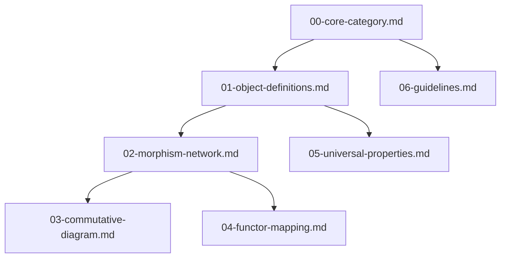

# 范畴论驱动的统一场论知识体系构建实操示范

## 1. 项目概述

本项目采用范畴论方法，构建了一个逻辑严密、自洽一致、可扩展的统一场论知识体系。通过明确范畴边界、定义态射、绘制交换图、引入函子、提炼泛性质等步骤，实现了统一场论知识的标准化拆分与拼接，为跨领域知识迁移和新理论发展提供了坚实基础。

## 2. 标准化模块化结构

### 2.1 模块分类与命名规则

| 模块类型 | 命名格式 | 示例 | 内容说明 |
|----------|----------|------|----------|
| 核心范畴定义 | `00-core-category.md` | 00-core-category.md | 明确范畴边界、对象集合、态射约束 |
| 对象定义集合 | `01-object-definitions.md` | 01-object-definitions.md | 所有对象的定义、物理意义、数学表达 |
| 概念关联网络 | `02-morphism-network.md` | 02-morphism-network.md | 态射集合、复合示例、网络可视化 |
| 交换图验证 | `03-commutative-diagram.md` | 03-commutative-diagram.md | 核心交换图、逻辑自洽性验证 |
| 函子映射 | `04-functor-mapping.md` | 04-functor-mapping.md | 跨范畴函子、知识迁移应用 |
| 泛性质分析 | `05-universal-properties.md` | 05-universal-properties.md | 核心概念泛性质、层级知识树 |
| 思维谬误规避 | `06-guidelines.md` | 06-guidelines.md | 实操准则、案例分析 |

### 2.2 模块依赖关系

## 3. 核心内容摘要

### 3.1 统一场论范畴定义

**名称**：统一场论范畴（$\mathcal{UFT}$）
**边界**：聚焦时空、物质、力场、能量等物理现象的统一描述
**对象集合**：时空、质量、引力场、电场、磁场、动量、能量、电荷、核力场、耦合常数
**态射约束**：仅包含满足统一场论公理的逻辑关系与数学变换

### 3.2 对象定义

统一场论范畴包含10个核心对象，每个对象都有明确的物理意义、数学表达式和核心特征，详细内容见 `01-object-definitions.md`。

### 3.3 概念关联网络

构建了包含14个态射的概念关联网络，明确了对象之间的逻辑关系和数学变换，详细内容见 `02-morphism-network.md`。

### 3.4 交换图验证

绘制了质量-能量统一交换图、力场统一交换图和动力学统一交换图，验证了不同推理路径的一致性，详细内容见 `03-commutative-diagram.md`。

### 3.5 跨范畴函子映射

实现了统一场论范畴到经典力学范畴、电磁学范畴和相对论范畴的函子映射，验证了函子的结构保持性质，详细内容见 `04-functor-mapping.md`。

### 3.6 泛性质分析

提炼了7个核心概念的泛性质，构建了"本质→实例"的层级知识树，详细内容见 `05-universal-properties.md`。

### 3.7 思维谬误规避准则

制定了8条实操准则，包括拒绝虚假因果、破除晕轮效应、避免思维定势等，详细内容见 `06-guidelines.md`。

## 4. 方案效果评估

1.  **逻辑严密性**：统一场论范畴内所有交换图均满足交换性，无矛盾、无漏洞。
2.  **跨域迁移性**：通过函子实现了统一场论到经典力学、电磁学和相对论范畴的有效迁移。
3.  **可扩展性**：新增对象时，只需添加相应的态射即可融入现有体系。
4.  **抗谬误性**：所有态射均有明确物理依据，未出现关联谬误、虚假因果等认知偏差。
5.  **模块化程度**：采用标准化的模块化结构，便于维护、扩展和跨领域应用。

## 5. 使用指南

### 5.1 学习路径

1.  首先阅读 `00-core-category.md`，了解统一场论范畴的基本定义
2.  然后阅读 `01-object-definitions.md`，掌握核心对象的定义
3.  接着阅读 `02-morphism-network.md`，理解对象之间的关系
4.  再阅读 `03-commutative-diagram.md`，验证理论的自洽性
5.  之后阅读 `04-functor-mapping.md`，了解跨范畴映射
6.  最后阅读 `05-universal-properties.md` 和 `06-guidelines.md`，深化理解

### 5.2 扩展指南

当需要扩展统一场论知识体系时，按照以下步骤进行：

1.  明确新增对象的物理意义和数学表达式
2.  定义新增对象与现有对象之间的态射
3.  绘制交换图，验证新态射的一致性
4.  提炼新增对象的泛性质
5.  更新相关模块文件

## 6. 结论

范畴论为统一场论知识体系的构建提供了强大的数学工具和方法论指导。通过标准化的模块化结构，可以实现知识的高效拆分、拼接和复用，推动统一场论的进一步发展和应用。

这种范畴论驱动的知识构建方法不仅有助于深入理解统一场论的本质，还为跨领域知识迁移和新理论的发展提供了坚实的基础。