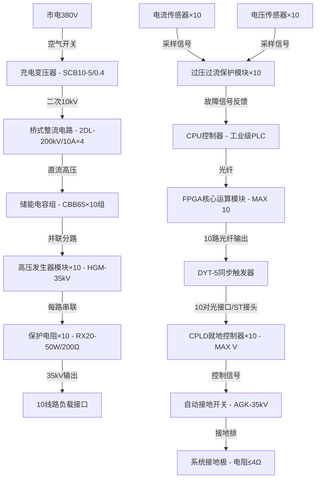

# 35kV 10线路同步启动模块选型清单+接线示意图

### 一、核心模块选型清单（含参数 + 选型依据）

| 系统分类   | 部件名称       | 型号规格                         | 核心参数                                | 数量   | 选型依据                                      |
| ------ | ---------- | ---------------------------- | ----------------------------------- | ---- | ----------------------------------------- |
| 高压发生单元 | 高压发生器模块    | HGM-35kV/5kVA                | 额定电压 35kV，油浸式绝缘，电缆绕组串联结构，绝缘等级 F 级   | 10 台 | 单模块独立供电，避免单路故障影响整体，油浸式设计适配 35kV 高压场景      |
|        | 恒流充电单元     | HVC-35kV/10A                 | 双边充电，输出电流 0-10A，电压精度 ±1%，10-100% 可调 | 1 台  | 满足 10 路同时启动的能量供给，精度匹配同步控制需求               |
| 同步控制单元 | 同步触发器      | DYT-5（西安西电）                  | 10 对光接口输出，同步精度 1ns，支持外部 / 定时 / 软件触发 | 1 台  | 原生支持 10 路同步，光接口抗干扰，相位调节精度满足时序偏差≤0.01μs 要求 |
|        | FPGA 芯片    | Altera MAX 10 10M08SAU169C8G | 50k 逻辑单元，内置 ADC，支持 300MHz 时钟        | 1 片  | 并行数据运算和 PWM 脉冲生成，适配分布式控制架构                |
|        | CPLD 就地控制器 | Altera MAX V EPM570T100C5    | 570 逻辑单元，静态功耗 45μW，3.3V 供电          | 10 片 | 每路独立控制，低功耗适配就地部署，支持在系统编程                  |
|        | 光纤通信模块     | HFBR-5805Z                   | 850nm 波长，ST 接口，传输速率 100Mbps         | 20 个 | 匹配 DYT-5 光接口，实现控制信号无延迟传输                  |
| 绝缘防护单元 | 硅橡胶绝缘软管    | SRH-100kV                    | 内径 10mm，耐压≥100kV，耐温 - 40\~120℃      | 50 米 | 绕组级间绝缘，应对热胀冷缩，满足 100kV 耐压要求               |
|        | 无碱玻璃丝带     | GB/T 18374-2008              | 厚度 0.1mm，耐电压≥50kV/mm                | 10 卷 | 端部绑扎固定，符合高压绝缘规范                           |
|        | 自动接地开关     | AGK-35kV                     | 额定电压 35kV，响应时间≤1ms，电动操作             | 1 台  | 试验后自动短路接地，保障运维安全                          |
| 保护装置   | 过压过流保护模块   | OVP-35kV/50A                 | 过压阈值 40kV，过流阈值 50A，响应时间≤1ms         | 10 个 | 每路独立保护，避免单路故障扩散                           |
|        | 保护电阻       | RX20-50W/200Ω                | 功率 50W，阻值 200Ω，耐压≥50kV              | 10 个 | 限制故障电流，匹配 35kV 线路阻抗                       |
| 供电系统   | 充电变压器      | SCB10-5/0.4                  | 容量 5kV・A，一次 0.4kV，二次 10kV，油浸式       | 1 台  | 能量供给核心，电压损失控制在 5% 以内                      |
|        | 高压整流硅堆     | 2DL-200kV/10A                | 反向耐压 200kV，额定整流电流 10A               | 4 个  | 桥式整流，满足 35kV 输出的整流需求，冗余设计提升可靠性            |
|        | 储能电容组      | CBB65-35kV/1000μF            | 电压 35kV，容量 1000μF，漏电流≤1μA           | 10 组 | 平衡瞬时负荷，避免启动电压跌落                           |
| 监测单元   | 电流传感器      | CT-35kV/100A                 | 测量范围 0-100A，精度 ±0.5%                | 10 个 | 每路电流监测，反馈至保护模块                            |
|        | 电压传感器      | VT-35kV/0.1kV                | 变比 350:1，精度 ±0.2%                   | 10 个 | 实时监测线路电压，保障输出稳定                           |

### 二、10 线路接线示意图（分层拓扑 + 关键节点）

#### （一）接线核心原则

1. 控制信号采用 “光纤传输”，高压功率信号采用 “铜芯电缆 + 步进式绝缘”

2. 10 线路并联设计，单路独立保护，控制层与功率层物理隔离（间距≥30cm）

3. 所有高压节点接地电阻≤4Ω，符合 35kV 安全规范

#### （二）分层接线示意图（文字拓扑版）

#### （三）关键接线标注

1. 高压线路：采用 YJV22-8.7/15kV 铜芯电缆（3 芯 ×25mm²），导线间距≥30cm

2. 控制光纤：ST 接口单模光纤，弯曲半径≥30mm，避免与高压电缆平行敷设（交叉角度≥90°）

3. 储能电容组：4 串 2 并连接，正负极采用硅橡胶绝缘帽封装，间距≥10cm

4. 保护模块接线：过压过流模块输入端接传感器，输出端接 CPU，触发信号直接控制高压发生器跳闸

5. 接地系统：所有金属外壳、高压设备底座均接入接地排，接地排与接地极采用 50mm² 铜排连接

### 三、接线注意事项

1. 同步触发器与 CPLD 的光纤接线需一一对应（编号 1-10），避免触发时序错乱

2. 高压发生器模块安装时，底部垫绝缘垫（厚度≥5cm，耐压≥50kV）

3. 接线完成后需进行绝缘测试：级间绝缘用 100kV 直流耐压试验，持续 1min 无放电

4. 控制电源与高压电源分开敷设（间距≥50cm），避免电磁干扰

