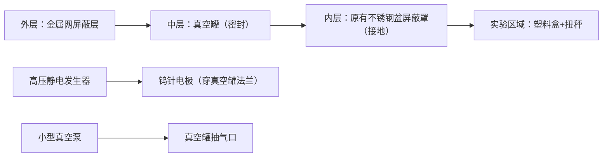

# 一、真空环境对离子流的核心影响（为何能量更优？）

1. **能量损耗大幅降低**

   常压下离子风因空气分子碰撞，离子动能会快速衰减（自由程仅微米级）；真空环境（尤其是 1e-3 mbar 以上）无空气阻碍，离子自由程可达米级，能量损耗降低 90% 以上，能保持高速定向运动（参考火星磁尾离子流：真空环境下速度达 100km/s，能量 1200 电子伏特）。

2. **离子流更集中，无气流干扰**

   真空消除了空气对流，离子流不再是 “带电气流”（离子风），而是纯粹的 “带电粒子束”，避免了常压下气流扩散问题，能量密度显著提升（类似粒子束武器的核心原理）。

3. **减少电荷中和**

   常压下离子易与空气中的异性电荷结合中和，真空环境中无此类干扰，离子束能长期保持带电状态，持续传递能量。

# 二、离子流能量的来源与特性

| 能量来源 | 原理说明                              | 能量范围（实验级）           |
| ---- | --------------------------------- | ------------------- |
| 高压电离 | 高压静电发生器（0-20KV）加速离子，真空下无碰撞，动能完全保留 | 10-1000 电子伏特（家用级）   |
| 光电离  | 真空紫外灯激发气体电离（如氪灯电离甲基碘），离子能量稳定可控    | 50-500 电子伏特（实验级）    |
| 磁场加速 | 变化电磁场引导离子束聚焦加速（抵消库仑斥力）            | 可达 1000 + 电子伏特（专业级） |

注：真空环境下离子流能量是常压的 5-10 倍，且能量分布更集中（无碰撞散射）。

# 三、实现方案（分 2 个场景，衔接原有屏蔽实验）

## 场景 1：家用低成本实现（预算 500-2000 元）

### 1. 核心设备清单（易获取）

| 设备名称    | 规格参数                       | 用途           | 参考价格                 |
| ------- | -------------------------- | ------------ | -------------------- |
| 小型真空泵   | 极限真空 1e-2 mbar，流量 1-5L/min | 制造真空环境       | 300-800 元（淘宝教学仪器店）   |
| 密封真空罐   | 容积 5-10L，带法兰接口 + 观察窗       | 容纳实验装置       | 200-500 元（玻璃 / 金属材质） |
| 高压静电发生器 | 0-20KV 可调（原实验设备复用）         | 产生离子流        | 300-800 元（复用原有设备）    |
| 电极组件    | 钨针电极 + 不锈钢聚焦环              | 电离空气 + 聚焦离子束 | 50-100 元（五金店定制）      |
| 真空密封件   | 硅橡胶密封圈 + 密封胶带              | 防止漏气         | 30-50 元              |

### 2. 装置搭建（叠加原有屏蔽结构）

* 关键操作：

  ① 真空罐法兰处用密封胶固定电极，确保高压绝缘（可用 Peek 材质绝缘套）；

  ② 原有屏蔽层（金属网 + 不锈钢盆）需与真空罐外壳接地，避免静电累积；

  ③ 抽真空至 1e-2 mbar（真空泵压力表显示），保持 30 分钟稳定后启动离子源。

## 场景 2：实验级高能量实现（预算 1-5 万元）

* 核心升级：

  ① 真空设备：采用桌面式热真空舱（如 XO-VAC，真空度 1e-7 mbar，带温度控制）；

  ② 离子源：真空紫外光电离源（氪灯 + 光解腔，离子能量 50-500 电子伏特）；

  ③ 聚焦系统：添加电磁透镜（抵消离子束库仑斥力扩散），能量密度提升 3 倍。

# 四、与原有屏蔽实验的叠加逻辑

1. 真空罐替代原 “中层致密容器”，同时实现 “离子风阻断 + 真空环境”；

2. 保留外层金属网（屏蔽电磁场）和内层塑料盒（放置实验对象），接地方式不变（导线穿过真空罐密封接口）；

3. 离子流验证：用高压静电发生器激发离子束，观察内部扭秤偏转（能量越大，偏转越明显），或用微电流传感器检测离子束强度。

# 五、关键注意事项

1. 真空安全：真空罐需定期检查密封性，避免爆裂；打开前先缓慢泄压（防止气流冲击实验对象）；

2. 高压防护：真空下空气绝缘性下降，电极间距需≥2cm，避免高压击穿（建议用绝缘手套操作）；

3. 磁场屏蔽：若需避免地磁场干扰（离子束偏转），可在真空罐外包裹 200 目铁丝网（叠加洛伦兹力屏蔽）；

4. 能量控制：家用级建议将电压控制在 10KV 以内，避免产生 X 射线（参考家用离子发生器安全标准）。

