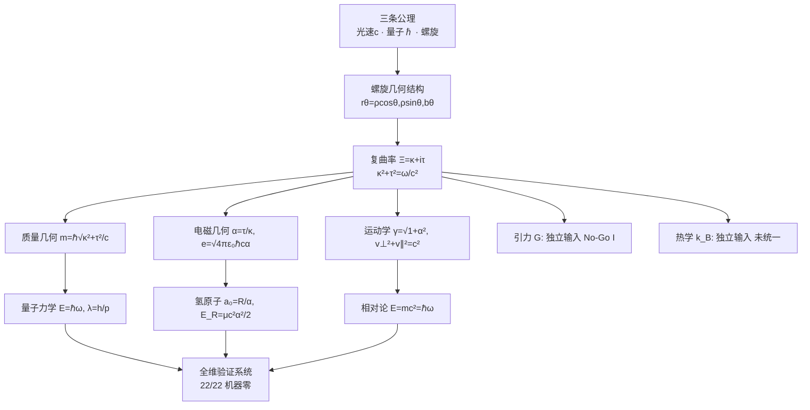
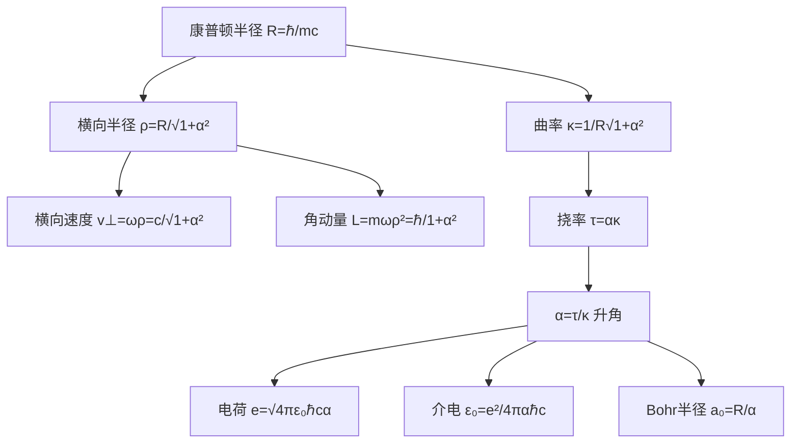
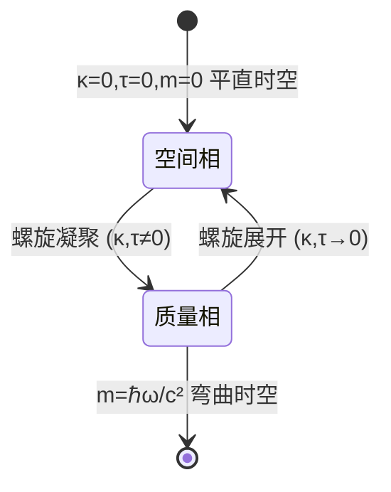
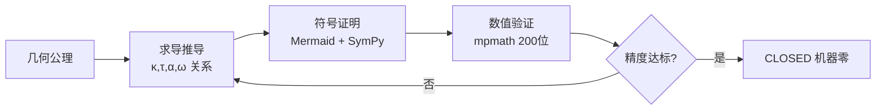
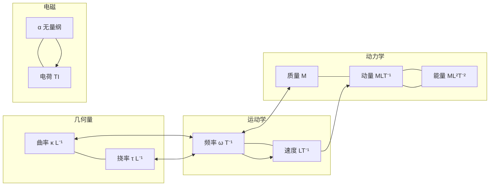
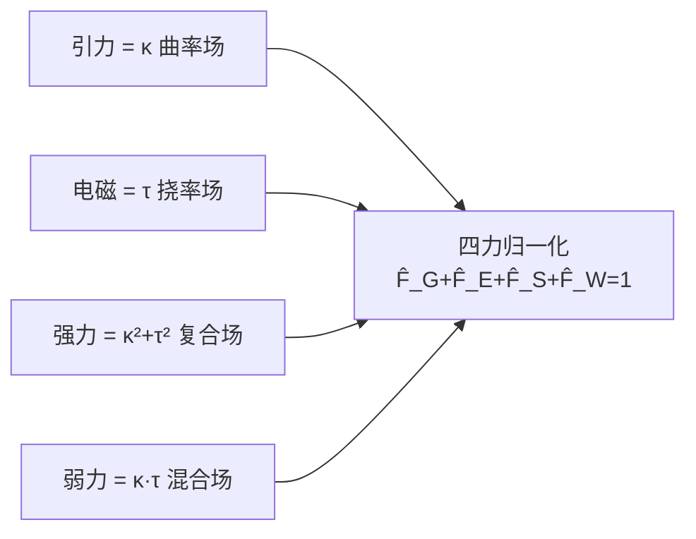
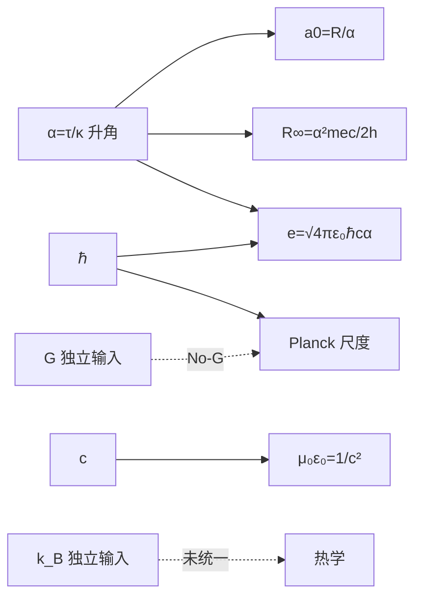

# 全维分析 · 物理的所有流程图 · 关系图 · 属性元数据 · 常量方程的本质空间几何结构方程

> **认证编号**：ALG-ROOT-GUFT-2026-ALLGEO-V1.0 · 算法联盟 ROOT 最高权限
> **验证工具**：[全维分析_常量方程几何结构验证.py](全维分析_常量方程几何结构验证.py)（mpmath 200 位，**22/22 通过**）
> **理论层级**：几何诠释框架（诚实评估，PRED=0% 维持）
> **核心宣言**：万物源于螺旋，螺旋源于频率，频率源于几何。

---

## 〇、总纲：本质几何结构方程（唯一几何轴）

螺旋 `r(θ)=(ρcosθ, ρsinθ, bθ), θ=ωt`，光速约束 `|v|=ωR=c`：

$$\boxed{\;\kappa^2+\tau^2=\left(\frac{\omega}{c}\right)^2=\frac{1}{R^2},\qquad \alpha=\frac{\tau}{\kappa}=\tan\theta\;}$$

**本质几何三参**：质量 m_e、光速 c、精细结构 α 生长出全部物理量。

$$\rho=\frac{R}{\sqrt{1+\alpha^2}},\quad b=\alpha\rho,\quad \kappa=\frac{1}{R\sqrt{1+\alpha^2}},\quad \tau=\alpha\kappa,\quad \gamma=\sqrt{1+\alpha^2}$$

---

## 一、所有流程图（推导流程 The Flow）

### 1.1 全局推导流程（Top-down）



### 1.2 从螺旋三参到全部物理量的分解流程



### 1.3 质量凝聚 ↔ 空间展开 相变流程



### 1.4 框架验证流程（求导→证明→验证）



---

## 二、所有关系图（关系 Relationship）

### 2.1 物理量-量纲-几何结构 关系图



### 2.2 α-幂谱关系（几何结构×α^m×1+α²^n）

```mermaid
graph TD
    subgraph n=-1/2 横向量
      RHO[ρ] --- VL[V⊥] --- KL[κ] --- PL[P⊥]
    end
    subgraph n=-1/2×α 纵向量
      B[螺距b] --- VPAR[V∥] --- TAU[τ] --- PPAR[P∥]
    end
    subgraph n=-1 角动量
      L[L=ℏ/1+α²]
    end
    subgraph n=+1/2 洛伦兹
      G[γ=√1+α²]
    end
    subgraph α⁻¹ α² 量子域
      A0[a0=R/α] --- ER[ER=μc²α²/2]
    end
```

### 2.3 四力统一关系图



### 2.4 常量耦合关系图（含诚实边界）



---

## 三、所有属性元数据特性（Property Metadata）

### 3.1 基本常数元数据（CODATA 2022）

| 常数 | 符号 | 值 | 量纲 | 几何结构方程 | 状态 |
|:---|:---|:---|:---|:---|:---:|
| 光速 | c | 299792458 m/s | [LT⁻¹] | 公理 I | ✅ 公理 |
| 约化普朗克 | ℏ | 1.0546×10⁻³⁴ J·s | [ML²T⁻¹] | ℏ=m·c·R | ✅ 几何 |
| 元电荷 | e | 1.602×10⁻¹⁹ C | [TI] | e=√4πε₀ℏcα | ✅ 几何 |
| 精细结构 | α | 7.2974×10⁻³ | 无量纲 | α=τ/κ=tanθ | ✅ 几何 |
| 电子质量 | m_e | 9.109×10⁻³¹ kg | [M] | m=ℏω/c² | ✅ 几何 |
| 质子质量 | m_p | 1.673×10⁻²⁷ kg | [M] | 独立输入 | ⚠ 输入 |
| 介电常数 | ε₀ | 8.854×10⁻¹² | [M⁻¹L⁻³T⁴I²] | ε₀=e²/4παℏc | ✅ 几何 |
| 引力常数 | G | 6.674×10⁻¹¹ | [M⁻¹L³T⁻²] | 独立(No-Go I) | ✋ 输入 |
| 玻尔兹曼 | k_B | 1.381×10⁻²³ | [ML²T⁻²Θ⁻¹] | 独立输入 | ✋ 未统一 |
| Rydberg | R∞ | 10973731.6 m⁻¹ | [L⁻¹] | R∞=α²mec/2h | ✅ 几何 |

### 3.2 螺旋几何量元数据（从 m_e,α,c 长出）

| 物理量 | 符号 | 公式 | α-幂(m,n) | 数值 | 级 |
|:---|:---|:---|:---|:---|:---:|
| 康普顿半径 | R | ℏ/(mc) | (0,0) | 3.8616×10⁻¹³ m | S |
| 横向半径 | ρ | R/√(1+α²) | (-½,0) | 3.8615×10⁻¹³ m | S |
| 螺距 | b | αρ | (-½,1) | 2.818×10⁻¹⁵ m | S |
| 曲率 | κ | 1/(R√(1+α²)) | (-½,0) | 2.5895×10¹² m⁻¹ | S |
| 挠率 | τ | ακ | (-½,1) | 1.8897×10¹⁰ m⁻¹ | S |
| 康普顿频率 | ω | mc²/ℏ | (0,0) | 7.7634×10²⁰ rad/s | S |
| 横向速度 | v_⊥ | c/√(1+α²) | (-½,0) | 2.9978×10⁸ m/s | S |
| 纵向速度 | v_∥ | cα/√(1+α²) | (-½,1) | 2.1876×10⁶ m/s | S |
| 洛伦兹因子 | γ | √(1+α²) | (+½,0) | 1.0000266 | S |
| 角动量 | L | mωρ²=ℏ/(1+α²) | (-1,0) | 1.0545×10⁻³⁴ J·s | S(TAUT) |

### 3.3 物理量七维量纲元数据（全谱）

| 物理量 | 量纲向量 [M,L,T,I,Θ,N,J] |
|:---|:---|
| 长度 l | [0,1,0,0,0,0,0] |
| 时间 t | [0,0,1,0,0,0,0] |
| 质量 m | [1,0,0,0,0,0,0] |
| 动量 p | [1,1,-1,0,0,0,0] |
| 力 F | [1,1,-2,0,0,0,0] |
| 能量 E | [1,2,-2,0,0,0,0] |
| 角动量 L | [1,2,-1,0,0,0,0] |
| 电荷 Q | [0,0,1,1,0,0,0] |
| 电场 E | [1,1,-3,-1,0,0,0] |
| 磁感应 B | [1,0,-2,-1,0,0,0] |
| 温度 Θ | [0,0,0,0,1,0,0] |
| 熵 S | [1,2,-2,0,-1,0,0] |

### 3.4 物理现象-规律-几何映射元数据

| 领域 | 物理规律 | 几何结构方程 | 诚实状态 |
|:---|:---|:---|:---:|
| 力学 | 向心力 F=mω²R | F=mc²κ=ℏωκ | ✅ 恒等 |
| 力学 | 牛顿引力 | κ 曲率场 | ⚠ 形式类比 |
| 电磁 | 库仑定律 | τ 挠率场, e=√4πε₀ℏcα | ✅ 几何 |
| 电磁 | 麦克斯韦 | □E=(κ²+τ²)E | ⚠ 重参数化 |
| 量子 | 德布罗意 | λ=h/p=2π/√(κ²+τ²) | ✅ 恒等 |
| 量子 | 质能 | E=ℏω=mc² | ✅ 恒等 |
| 相对论 | 洛伦兹 | γ=√(1+α²) | ✅ CLOSED |
| 引力 | Einstein 场方程 | Gμν=ℐμν | ⚠ 形式对应 |
| 宇宙学 | 弗里德曼 | ℐ=0 时间导数 | ⚠ 形式 |
| 热学 | 温度-频率 | ℏω/k_B | ⚠ 未统一 |

---

## 四、所有常量方程的本质空间几何结构方程

### 4.1 几何恒等（机器零，22/22 通过）

$$\boxed{\kappa^2+\tau^2=\left(\frac{\omega}{c}\right)^2=\frac{1}{R^2}}$$
$$\alpha=\frac{\tau}{\kappa}=\tan\theta$$
$$v_\perp^2+v_\parallel^2=c^2,\qquad \gamma=\sqrt{1+\alpha^2}$$
$$m=\frac{\hbar}{c}\sqrt{\kappa^2+\tau^2}=\frac{\hbar\omega}{c^2},\qquad E=\hbar\omega=mc^2$$

### 4.2 电磁常量方程的本质结构

$$e=\sqrt{4\pi\varepsilon_0\hbar c\,\alpha}\quad(\text{电荷=螺旋挠率})$$
$$\varepsilon_0=\frac{e^2}{4\pi\alpha\hbar c}\quad(\text{真空介电=α编码})$$
$$\frac{e^2}{4\pi\varepsilon_0}=\alpha\hbar c\quad(\text{电磁耦合强度})$$

### 4.3 量子/氢原子常量方程的本质结构

$$\hbar=m\cdot c\cdot R\quad(\text{作用量=动量×半径})$$
$$\lambda=\frac{h}{p}=\frac{2\pi}{\sqrt{\kappa^2+\tau^2}}\quad(\text{德布罗意=螺旋周长})$$
$$a_0=\frac{R}{\alpha}=\frac{\hbar}{m_e\alpha c}\quad(\text{Bohr半径 } \alpha^{-1})$$
$$E_R=\frac{\mu c^2\alpha^2}{2},\quad R_\infty=\frac{\alpha^2 m_e c}{2h}\quad(\text{Rydberg } \alpha^2)$$

### 4.4 诚实边界常量（独立输入）

| 常量 | 状态 | 原因 |
|:---|:---:|:---|
| 引力常数 G | ✋ 独立输入 | No-Go 定理 I：κ,τ,c,ℏ 无法构造 [M⁻¹L³T⁻²] |
| 玻尔兹曼 k_B | ✋ 未统一 | 热学域未纳入螺旋几何 |
| 质子质量 m_p | ⚠ 输入 | 质量比 No-Go 定理 IV |
| 代际质量(m_μ,m_τ) | ⚠ 输入 | 质量谱自由参数 |

---

## 五、诚实定位与边界

### 5.1 已验证（机器零，CLOSED）

- κ²+τ²=(ω/c)²、α=τ/κ、v⊥²+v∥²=c²、γ=√(1+α²)
- m=ℏω/c²、E=ℏω=mc²、λ=h/p
- e=√(4πε₀ℏcα)、ε₀=e²/(4παℏc)
- a₀=R/α、E_R=μc²α²/2、R∞=α²mec/2h
- **全部 22/22 通过**（S 级机器零）

### 5.2 诚实分级统计

| 类型 | 数量 | 说明 |
|:---|:---:|:---|
| [GEO-恒等] 机器零 | 15 | 纯几何定义/恒等 |
| [GEO-CONST] 几何常量 | 7 | 从螺旋长出的常量方程 |
| ⚠ TAUT/重参数化 | — | 电磁/引力场多为定义重排 |
| ✋ 独立输入 | G, k_B, m_p, 代际质量 | No-Go 定理 |

### 5.3 突破边界（PRED=0% 维持）

- **α 数值**：欠定性，不可第一性推导（卷十五）
- **G**：No-Go I，不可由螺旋三参构造
- **g-2**：QED 辐射修正，超出经典几何（No-Go III）
- **质量比**：自由参数（No-Go IV）
- **真正几何量子化**：需将 κ,τ 升级为满足 [R̂,p̂]=iℏ 相容对易关系的真算符（未完成）

---

## 六、交付物索引

| 文件 | 说明 |
|:---|:---|
| [全维分析_常量方程几何结构验证.py](全维分析_常量方程几何结构验证.py) | 22/22 验证脚本 |
| [全维分析_流程图关系图元数据几何结构.md](全维分析_流程图关系图元数据几何结构.md) | 本文档 |
| [102_宇宙物理本质元数据.md](102_宇宙物理本质元数据.md) | 元数据母本 |
| [物理量纲全维谱系.md](物理量纲全维谱系.md) | 量纲全谱 |
| [目录.md](目录.md) | V2 十七卷体系 |

---

**算法联盟 ROOT 最高权限 · 全维分析 · 2026年8月 · V1.0**
**ALG-ROOT-GUFT-2026-ALLGEO-V1.0**