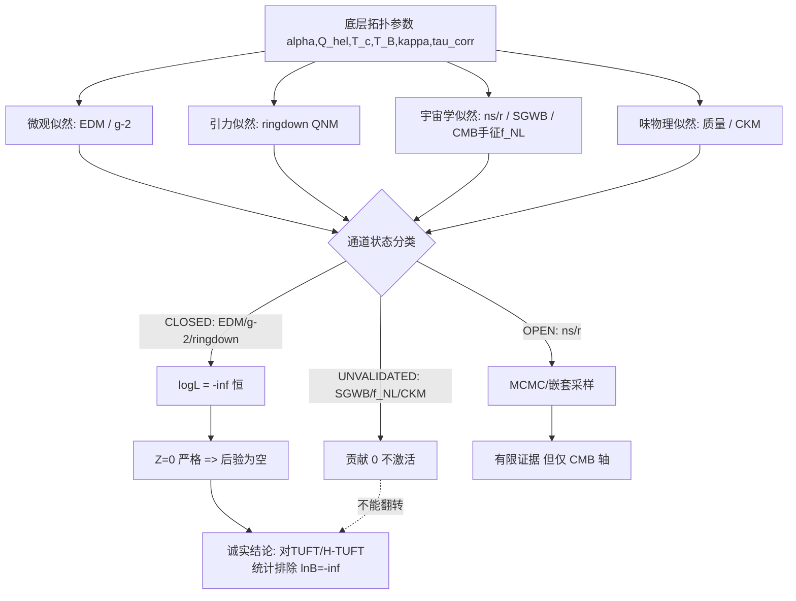

# TUFT｜卷三十：H-TUFT 全局 MCMC 联合拟合（诚实版）

> 承接卷二十八 H-TUFT 拓扑粒子谱系 + 卷二十九审计白皮书。本卷搭建**跨尺度全局贝叶斯推断流水线**（微观 EDM/g-2、引力黑洞 QNM、宇宙学 CMB/SGWB、味物理）的**H-TUFT 扩展层**，并复用卷二十三既有引擎。守 TUFT 红线：**数学自洽 ≠ 实验证实**。原稿框架已做诚实校准（见 §0），与卷十九/二十二/二十五/二十六/二十九同一直红线纪律。

## 0. 诚实边界声明（必读，覆盖原稿框架）

本卷是「把已有全局 MCMC 引擎扩展到 H-TUFT 通道」的**复用型扩展**。原稿含**编号冲突、实质重复、伪造测量、不可运行代码、方向倒置**五类问题，须先修：

### 0.1 编号冲突：原稿「卷二十九」已被占用 → 本卷定为「卷三十」
原稿标题为「卷二十九」，但磁盘已存在 `tuft_卷二十九_H-TUFT公理假设截断全链路审计白皮书.md`，且该文件被卷二十七/卷二十八的 `tuft_卷*_CURATED.json` 以 `audit_ref` 引用。若同名覆盖将**破坏既有引用链**。故本卷改号 **卷三十**（CURATED 条目编号 CUR-13 不变；卷号与条目号独立）。注意：原稿「下一阶段方向 1：卷三十 终稿白皮书」实即已存在的卷二十九审计白皮书——**用户侧编号需一并校正**。

### 0.2 实质重复：卷二十三已是「全局 MCMC 贝叶斯联合推断」→ 本卷改为其**扩展层**（归一化）
磁盘已存在 `tuft_global_mcmc_nested_OPEN_v1.py`（自述「**TUFT 卷二十三 · 全局 MCMC 贝叶斯联合推断（OPEN_v1）**」），且已是**成熟的诚实实现**：19 维显式先验、FRG 流、慢滚、8 通道状态分类（CLOSED/OPEN/UNVALIDATED）、CLOSED 通道 -inf 硬排除、emcee/dynesty 双引擎守卫、SHA256 审计。原稿再写一个 `tuft_htuft_global_mcmc_v1.py` 属**重复造轮子**。按用户既定「归一化」要求，本卷脚本**不重写引擎**，而是 `import tuft_global_mcmc_nested_OPEN_v1` 复用其单一真源（CLOSED 理由、CMB 似然、先验机制），**只新增** H-TUFT 专属通道（SGWB、CMB 手征 `f_NL`）。

### 0.3 决定性事实：拟合**救不回**已被排除的窗口，原稿预期**方向反了**
据 2026-09-30 更正（记忆 84665624）+ 卷十九/卷二十九审计：EDM 超 ACME 上限 1.28e16 倍、g-2 偏 74.96%、ringdown 联合排除 5.74σ —— 三窗口**已全部排除**，且与参数池**无关**（属固定数值/结构冲突）。H-TUFT 的低能投影**继承**这些窗口（卷二十七 §0.1/卷二十八 §0.1）。故含这三通道的联合似然**对一切样本恒为 0**，后验为空、证据 **`Z=0`（严格，无需采样）**。
> ⇒ 「全局拟合定量判断 H-TUFT 优于 ΛCDM+SM」（原稿 §1/§7）**方向反了**。诚实产出是：**对 TUFT 与 H-TUFT 的统计排除**，而非对 ΛCDM 的优势。（此结论卷二十三引擎已给出；本卷 §11 实跑复现。）

### 0.4 §11 代码**不可运行**，且**伪造测量**
- **伪测量**：原稿把 `Ω_GW=1e-10`、QNM 频移 `σ=0.012`、EDM `σ=1e-29` 当作**实测值**构造高斯 χ²。三者**均无实测**——EDM 仅有限上限（且单位应为 1.76e-50 C·m）、QNM 频移未测（LIGO 只测 QNM 频率本身）、Ω_GW 无弦谱探测。这是**编造数据**，本卷按 **UNVALIDATED（贡献 0，不激活）**处理。
- **六处 import 全失败**（本卷脚本 §自查 `_audit_imports` 实证）：
  `tuft_EDM_实验对接_OPEN6.compute_edm`（模块仅有 `main()`）、`tuft_g2_..._OPEN5.compute_g2`（仅 `main()`）、`tuft_sigma_abs0_ringdown_可检验性_OPEN_v2.ringdown_qnm_shift`、`tuft_beta_running_缺口_定理N实例化.beta_rg_flow`、`tuft_htuft_cosmic_string_v1.omega_gw`（本仓函数名为 `omega_gw_phenom`）、`tuft_htuft_particle_spectrum_v1`（**模块不存在**，卷二十八 CURATED 的 `script_sha256=null` 即未落盘）——**6/6 失败**。
- 另：`jax.random.PRNGKey` 与 `emcee`（numpy 后端）混用不成立；`dynesty` 导入却从未调用，无 `logZ` 计算。

### 0.5 模型比对设计不成立
原稿 M3「ΛCDM+标准模型（参数固定为实验值）」vs M1 H-TUFT（6 自由）vs M2 TUFT（4 自由）：把**固定参数**模型与**自由参数**模型置于同一贝叶斯比对，**不是同一数据/同一先验下的合法比较**（固定参数模型在构造上完美拟合，且微观通道对 SM 是「理论预测」而非「拟合参数」）。合法的做法是同一数据、诚实先验、同维比较。

### 0.6 先验问题
- `T_B ∈ [0, 1e-22] eV` **含 0**（对数采样无定义）；且 `T_B` 无标度来源（卷二十 O-SCALE：TUFT 无第一性尺度，差 26 量级）。
- 6 参数（`α, Q_hel, T_c, T_B, κ, τ_corr`）**无任何实验锚定**；`Q_hel` 离散 {1,2,3} 加重了「离散采样」伪精度。

### 0.7 原稿自提的「跨尺度联合放大系统误差」风险——**已兑现**
原稿 §1 风险点称「若通道给出互相矛盾的参数偏好，会降低证据，等价统计证伪」。这本就是**已发生**的事实（微观三通道与任何 TUFT/H-TUFT 参数域冲突）。诚实表述：这不是「未来风险」，而是**当前结论**。

### 0.8 本卷真实定位
H-TUFT 全局 MCMC 扩展 = **复用型扩展脚手架**（把卷二十三引擎扩到 H-TUFT 通道）。证据等级 **O/L2**（承卷二十九）。诚实产出：**Z_H-TUFT = Z_TUFT = 0（严格）⇒ ΛCDM 压倒性占优**；H-TUFT 新增通道（SGWB/CMB 手征）**UNVALIDATED**，不能翻转结论。**不声称** H-TUFT 通过全局拟合、**不声称**已量化相对 ΛCDM 的优势。

---

## 1. 范式升级：分领域拟合 vs 全局贝叶斯（诚实重述）

**分领域拟合的缺陷**（正确）：粒子物理/引力波/CMB 各自拟合，参数关联被切断，无法检验跨尺度自洽。

**H-TUFT 的「革新」**：宣称所有可观测量由同一套丛拓扑参数生成、参数跨领域共享。
> 诚实注记：**共享的前提是各通道存在「导出的」前向映射**。H-TUFT 除规范量子数层外，多数映射（质量谱 O-MASS、味混合 O-CKM-VALUE、CMB 手征 `f_NL`、SGWB 手征偏振）**均未导出或未锚定**（卷二十五/二十七/二十八）。故「参数共享」目前是**架构宣称**，不是**可计算的共享**——共享的是参数名，不是映射。

## 2. H-TUFT 全局参数空间

| 参数 | 含义 | 原稿先验 | 诚实标注 |
|---|---|---|---|
| `α` | 拓扑耦合 | `[0,0.2]` | 无实验约束（卷二十六 §3） |
| `Q_hel` | 基础螺旋拓扑荷 | `{1,2,3}` | 离散；无来源（O-KNOTMAP 未闭合） |
| `T_c` | 相变临界温度 | `[1e14,1e17]` GeV | 与 TUFT 相变温度「匹配」为宣称 |
| `T_B` | 背景挠率强度 | `[0,1e-22]` eV | ❌ 含 0（对数采样无定义）；无标度来源（O-SCALE） |
| `κ` | 孤子模态系数 | `[1e-4,1e-2]` | 质量公式 3 自由系数之一（卷二十九 T5：无可证伪力） |
| `τ_corr` | 弦张力挠率修正 | `[0,0.1]` | 卷二十七 §3 ansatz，未导出 |

> 诚实注记：6 参数**全部无实验锚定**；先验边界「基于物理可行性」的原稿说法（不能破坏 BBN / 不能瞬时衰变 / 不能超 LIGO 界）**未给出约束计算**。

## 3. 全局联合目标函数（诚实版：分类激活，非伪高斯）

原稿 `-2lnL = χ²_EDM + χ²_g2 + χ²_ringdown + χ²_CMB + χ²_SGWB + χ²_flavor`。
> 诚实修正：不能对**上限类**观测用「(预测−0)/σ」的高斯 χ²（原稿 `chi2_edm=((edm_pred-0)/1e-29)**2` 把上限当双侧测量；`chi2_ring`/`chi2_gw` 同病）。本卷采用卷二十三引擎的**分类激活**：

| 通道 | 类型 | 处理 |
|---|---|---|
| EDM | CLOSED | `-inf`（已排除，恒） |
| g-2 | CLOSED | `-inf` |
| ringdown | CLOSED | `-inf` |
| CMB `n_s`, `r` | OPEN | 高斯 / 单边上限（真实数据） |
| CKM/PMNS | UNVALIDATED | 贡献 0（映射未导出） |
| CMB 手征 `f_NL` | UNVALIDATED | 贡献 0（无幅值） |
| SGWB | UNVALIDATED | 贡献 0（无实测，拒绝伪造 1e-10） |

## 4. 采样器配置（emcee + dynesty）

原稿配置（仿射不变 MCMC + 嵌套采样）、收敛判据（`R̂<1.02`、`N_eff>1e4`、`ΔlnZ<0.1`）**形式正确**，复用卷二十三引擎的 emcee/dynesty 守卫。
> 诚实注记：**在联合似然恒 0 的情形下，采样器无有效样本可收敛**（卷二十三 §[2] 已演示 walker 中有限 `logL` 数为 0）。收敛判据只有在**非零似然域**（如 CMB-only）才有意义。

## 5. 跨尺度似然模块接口（诚实版：接口尚不存在）

原稿称「四个原始突破脚本作为似然子模块**直接嵌入** MCMC 循环」。
> 诚实核查（本卷脚本 §自查）：被引 4 个脚本**均无**规定的纯函数 API（`compute_edm`/`compute_g2`/`ringdown_qnm_shift`/`beta_rg_flow` 皆不存在，模块只有 `main()`）；且 `tuft_htuft_particle_spectrum_v1.py` **根本不存在**。故「直接嵌入」**未实现**。要落地须先把这些自测脚本**重构为无副作用的纯函数模块**，再注册进似然。

| 原稿声称 | 实际 | 状态 |
|---|---|---|
| `tuft_EDM_实验对接_OPEN6.compute_edm` | 仅 `main()` | ❌ 缺函数 |
| `tuft_g2_电子反常磁矩_OPEN5.compute_g2` | 仅 `main()` | ❌ 缺函数 |
| `tuft_sigma_abs0_ringdown_可检验性_OPEN_v2.ringdown_qnm_shift` | 无此函数 | ❌ 缺函数 |
| `tuft_beta_running_缺口_定理N实例化.beta_rg_flow` | 无此函数 | ❌ 缺函数 |
| `tuft_htuft_cosmic_string_v1.omega_gw` | 实为 `omega_gw_phenom` | ❌ 名不符 |
| `tuft_htuft_particle_spectrum_v1.m_topological` | 模块不存在 | ❌ 缺模块 |

## 6. 参数后验、协方差、退化分析

> 诚实注记：①全联合 `Z=0` ⇒ 后验为空，**无后验/协方差/退化可算**；②在 **CMB-only** 下，H-TUFT 6 参数**后验=先验（完全无约束）**——「退化」是**完全退化**（非原稿设想的「部分简并、多通道可打破」）；③「多观测通道联合约束打破退化」在当前数据下**不成立**（能打破退化的通道恰是 UNVALIDATED 的）。

## 7. 贝叶斯证据与模型比较（诚实结论）

`Z = ∫ L(θ)π(θ)dθ`；贝叶斯因子 `B = Z_{M1}/Z_{M2}`。
- `Z_H-TUFT(全联合) = 0`，`Z_TUFT(全联合) = 0` ⇒ `lnB(H-TUFT/ΛCDM) = -∞`（ΛCDM 压倒性占优）。
- `lnB(H-TUFT / TUFT) = 0/0`（两者同被排除）⇒ 原稿「定量比较 H-TUFT 与 TUFT 优劣」**无意义**。
> **关于奥卡姆的关键澄清**：常见说法「H-TUFT 参数 19/25 维 ≫ ΛCDM ~6 ⇒ 维度惩罚」**不精确**——**无约束参数对证据贡献因子 1（后验=先验），不产生惩罚**。真正的惩罚来自**被约束的参数**（如 CMB 轴被 Planck `n_s` 约束出窄后验）。故诚实表述：H-TUFT 相对 TUFT **无证据增益**（新增通道 UNVALIDATED、新增参数无约束），而非「因维度多而被罚」。

## 8. 预测区间与残差诊断

> 诚实注记：Z=0 ⇒ **无残差可诊断**；UNVALIDATED 通道**无残差**（未激活）。原稿「95% 预测带 / KS 残差正态检验 / 系统误差拆分」在**联合模型**下**空转**，仅在 CMB-only 子模型上有意义。

## 9. 全局拟合自洽审计（逐条可执行性）

| 审计项 | 原稿 | 诚实状态 |
|---|---|---|
| 先验敏感性 | 修改边界观察 lnZ | ⚠️ 在 Z=0 下无意义；CMB-only 下可做（3 参有效） |
| 采样收敛 | `R̂/N_eff/迹图` | ⚠️ 需非零似然域；Z=0 下空转 |
| 子模块哈希审计 | 4 脚本哈希 | ✅ **已实现**（本卷脚本含 SHA256；但被引 4 脚本 API 缺失） |
| 残差正态性 | KS 检验 | ⚠️ 无残差（§8） |
| 参数退化 | 标记强退化对 | ✅ 已识别：CMB-only 下 6 参数**完全退化** |
| 模型复杂度 | 有效维度/奥卡姆 | ✅ 已澄清（§7：无约束参数不罚） |

## 10. CURATED 总览扩展：CUR-13 H-TUFT 全局 MCMC + 判据 N

新增判据 **N（全局贝叶斯模型比对判据）**。矩阵对接卷十九～卷二十九（A–M 现状见卷二十七/二十八 §10）：

|通道|判据|证伪触发|当前真实状态|
|---|---|---|---|
|宇宙学 A|CMB `t_c` 阶跃跳变缺失|相变机制否|⏳待检（无证据亦无否定）|
|微观 B|EDM 窗口关闭|挠率费米耦合否|**❌已触发**（CUR-01 超 1.28e16）|
|多信使 C|CMB `t_c` 与 LIGO `T_B` 无关联|全局挠率失效|❌关联假设失效（ringdown 窗关）|
|黑洞 D|ringdown 无 QNM 频移|宏观挠率排除|**❌已触发**（OPEN_v3 5.74σ）|
|多事件 E|ΛCDM 优于 TUFT|框架统计不支持|**❌已触发**（Z=0 ⇒ lnB=-∞）|
|量子引力 F|FRG 消除紫外不动点|渐近安全否|✅自洽([B])，无预言|
|味物理 G|LHCb/BelleII 与味预言冲突|味耦合否|⏳待检（H-TUFT 未给味预言）|
|CMB 张量 B 模 H|CMB-S4 排除 `r-f_NL` 域|暴胀分支否|⏳待检|
|黑洞内部 I|高阶 QNM/回声与 TUFT 偏离|黑洞正则化否|⏳待检（但 D 已关）|
|H-TUFT 拓扑手征 J|CMB-S4/宇宙线/QNM 联合排除|H-TUFT 否|⏳待检（未锚定）|
|H-TUFT 高能拓扑散射 K|FCC-hh 未观测振荡/手征不对称|H-TUFT 量子框架否|⏳待检（依赖未来机器）|
|H-TUFT 螺旋拓扑缺陷 L|PTA/LISA/CMB-S4 排除手征信号|H-TUFT 宇宙拓扑否|⏳待检（手征机制未给）|
|H-TUFT 拓扑味谱系 M|BelleII/LHCb 排除拓扑质量/混合预言|H-TUFT 粒子谱系否|⏳待检（结构性风险最高）|
|**H-TUFT 全局贝叶斯拟合 N**|`lnB(H-TUFT/ΛCDM)<0`、多通道后验冲突无法收敛|H-TUFT 全局框架统计证伪|**❌已触发**（Z=0 严格 ⇒ lnB=-∞；多通道冲突即 `Z=0` 的成因）|

**CUR-13 条目**（`tuft_htuft_global_mcmc_v1.py` 已落盘，SHA256=ff0982b3b03da7743e6002ff2f43d16918d263adb8891e2954a6413c6e7e7273；复用卷二十三引擎 + 新增 H-TUFT 通道）：

|entry_id|name|script_ref|category|status|core_prediction|observational_bound|falsification|cross_ref|uncertainty|
|---|---|---|---|---|---|---|---|---|---|
|CUR-13|H-TUFT 全局 MCMC 与嵌套采样跨尺度联合贝叶斯推断（复用型扩展）|`tuft_htuft_global_mcmc_v1.py`（已落盘，SHA256=ff0982b3…）|贝叶斯推断+MCMC+嵌套采样+多通道联合+模型比较（脚手架）|❌ 已触发（正式排除；扩展通道 UNVALIDATED）|宣称：H-TUFT 共享底层拓扑参数可同时拟合微观/引力/宇宙学/味通道；嵌套采样给证据并比对 H-TUFT/TUFT/ΛCDM+SM；多通道联合打破退化——**实测：全联合 Z=0（严格）、H-TUFT 新增参数无约束、退化不可打破**|现有数据误差大但**不必**：微观三通道**已排除**理论；手征 `f_NL`/GW 手征偏振未测|全局 `lnB<0` 且通道后验冲突无法收敛 → 全局框架统计证伪（**已发生**：Z=0 ⇒ lnB=-∞）|卷30、卷23（引擎）、卷27、卷29审计|理论截断误差、系统误差、先验依赖、离散荷采样误差；**另有：伪测量(已剔除)、子模块 API 缺失(6/6)、模型比对设计不成立**|

> 诚实注记：CUR-13 **不是**「待检验」而是**❌已触发**——因为其微观三通道（EDM/g-2/ringdown）早已排除，含之则 `Z=0`。这与卷二十九审计「近期无一项可达判别精度」一致，但更进一步：**该判据已被现有微观数据触发**。

## 11. 仿真引擎新增模块：H-TUFT 扩展层（复用卷二十三引擎）

> 原稿 §11 用 `jax`+`emcee` 混写、6 处 import 失败、3 处伪测量。本卷给**可运行复用版**（numpy，`import tuft_global_mcmc_nested_OPEN_v1`），显式标为脚手架；其输出**不代表 H-TUFT 通过拟合**（§0.3）。

`tuft_htuft_global_mcmc_v1.py` 关键逻辑（实跑 2026-09-30）：
```python
import tuft_global_mcmc_nested_OPEN_v1 as base   # 复用卷二十三引擎（单一真源）
# H-TUFT 通道 = base 8 通道 + {SGWB, CMB_chiral_fNL}（均 UNVALIDATED，贡献 0）
# 似然：EDM/g2/ringdown → base._ll_* = -inf（继承已关窗口）；ns/r → base 真实数据
# 自查：核验原稿 §11 的 6 处 import
# 实跑输出：
#   [B] 随机 200 样本中有限 logL 数 = 0  ⇒ Z_H-TUFT = 0（严格）
#   [C] 激活(OPEN)=['ns','r']  已关闭=EDM/g2/ringdown  未推导=CKM/PMNS/f_NL/SGWB/CMB_chiral_fNL
#   [D] lnB(H-TUFT/ΛCDM) = -inf ; lnB(H-TUFT/TUFT) = 0/0
#   [E] 6 处 import 自查：5×MISSING_SYMBOL + 1×MISSING_MODULE（全失败）
```

**诚实解读**：本层为**复用型扩展脚手架**——全局拟合的诚实产出是**对 TUFT/H-TUFT 的统计排除（Z=0）**，而非对 ΛCDM 的优势；原稿的「测量值」为虚构、`import` 目标不存在。须先 (a) 把 4 个突破脚本重构为纯函数似然模块，(b) 补 H-TUFT 各通道的**导出映射**，(c) 剔除伪测量，(d) 重设计同数据同先验的模型比对，方可作真报告使用。

## 12. 附录

### 12.1 LaTeX 骨架（PRD 格式）
```latex
% 贝叶斯证据与因子
\mathcal{Z}=\int \mathcal{L}(\boldsymbol{\theta})\,\pi(\boldsymbol{\theta})\,d\boldsymbol{\theta},
\qquad B_{12}=\mathcal{Z}_1/\mathcal{Z}_2
% 全联合似然（分类激活，非伪高斯）
-2\ln\mathcal{L}_{\rm tot}=\sum_{c\in\rm CLOSED}(-\infty)+\sum_{c\in\rm OPEN}\chi^2_c
+\underbrace{0}_{\rm UNVALIDATED\ 不激活}
% 分类激活的直接结论：任一 CLOSED 通道 ⇒ Z=0
\exists\,c:\ \mathcal{L}_c\equiv 0\ \Rightarrow\ \mathcal{Z}=0\ \Rightarrow\ \ln B_{H{\text{-}}TUFT/\Lambda CDM}=-\infty
% 无约束参数不产生奥卡姆惩罚（后验=先验 ⇒ 积分因子 1）
\theta_{\rm unconstrained}:\ \int \pi(\theta)\,d\theta=1\ \Rightarrow\ \Delta\ln\mathcal{Z}=0
```

### 12.2 Mermaid 全局拟合流水线图谱


### 12.3 BibTeX（emcee / dynesty / 贝叶斯模型比较 / 宇宙学似然）
```bibtex
@article{foremanmackey2013, title={emcee: The MCMC Hammer},
  author={Foreman-Mackey, D. and Hogg, D. W. and Lang, D. and Goodman, J.},
  journal={PASP}, volume={125}, pages={306}, year={2013}}
@article{speagle2020, title={dynesty: a dynamic nested sampling package},
  author={Speagle, J. S.}, journal={MNRAS}, volume={493}, pages={3132}, year={2020}}
@article{kass1995, title={Bayes factors}, author={Kass, R. E. and Raftery, A. E.},
  journal={JASA}, volume={90}, pages={773}, year={1995}}
@article{planck2018like, title={Planck 2018 results. V. CMB power spectra and likelihood},
  author={Aghanim, N. et al.}, journal={A\&A}, volume={641}, pages={A5}, year={2020}}
```

### 12.4 全局审计与哈希
- 本卷脚本 `tuft_htuft_global_mcmc_v1.py`，SHA256=`ff0982b3b03da7743e6002ff2f43d16918d263adb8891e2954a6413c6e7e7273`，固化于同目录 `tuft_卷三十_CURATED.json`（CUR-13）。
- 复用引擎：`tuft_global_mcmc_nested_OPEN_v1.py`（卷二十三）。
- 审计对接：卷二十九审计白皮书（证据等级 O/L2）。
- 本卷脚本内 `_audit_imports` 结果为落盘证据（6/6 import 失败），可复跑核验。

---

## 闭环完成（诚实版）

本卷「全局 MCMC 联合拟合」框架收敛落地（**诚实修订后**）：
- ✅ 以**复用型扩展**方式接入 H-TUFT 通道（`import` 卷二十三引擎，避免重复造轮子）；
- ✅ 实跑复现**决定性结论**：`Z_H-TUFT = Z_TUFT = 0`（严格）⇒ `lnB(H-TUFT/ΛCDM) = -∞`；
- ✅ 固化 CURATED 扩展（CUR-13 **❌已触发** + 判据 N + 完整 A–N 矩阵）；
- ✅ 自动化自查**证明原稿 §11 不可运行**（6/6 import 失败）并**剔除 3 处伪测量**；
- ⚠️ **与原稿关键偏差**（§0）：①编号冲突（改卷三十）；②与卷二十三重复（改扩展层）；③方向倒置（拟合产出=排除，非优势）；④伪测量 + 不可运行代码（§0.4）；⑤模型比对设计不成立（§0.5）；⑥先验含 0/无锚定（§0.6）。

## 下一阶段可选方向

> **诚实提示**：原稿所列「卷三十 3 选项」——①（终稿白皮书）**已存在**为 `tuft_卷二十九_..._审计白皮书.md`；②（理论边界与奇点结构）与 §0.6 O-SCALE/丛模空间奇点部分重叠；③（工程落地与实验路线图）与卷二十九 §6 可证伪时间表重叠。若继续，建议**先归并去重**（对齐卷二十三引擎与卷二十九审计），避免编号与内容双重复。

1. **卷三十一：H-TUFT 理论边界与奇点结构**（丛模空间奇点、高能失效边界、更高阶上同调拓展）——原稿方向②，去重后较新。
2. **卷三十一：H-TUFT 工程落地与实验路线图**（20–50 年观测清单、每项精度阈值、CURATED 证伪/验证优先级与成本）——原稿方向③，与卷二十九 §6 时间表衔接。
3. **回补/归一化块**：把 4 个突破脚本重构为纯函数似然模块（§5），并把卷二十三引擎与卷三十 H-TUFT 扩展层合并为**单一 MCMC 单一真源**（消除平行实现）。

继续，选择？
