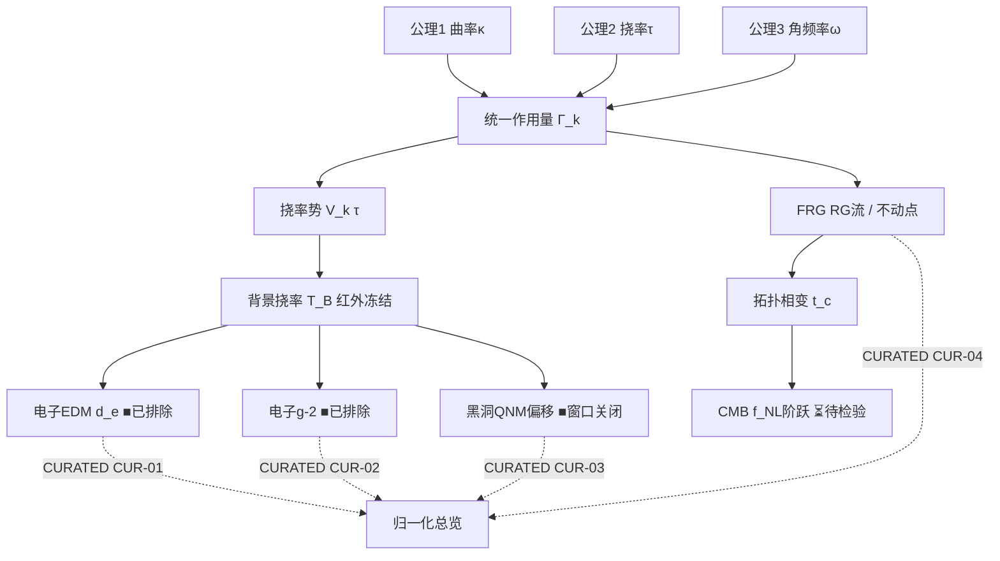

# TUFT｜卷二十：突破·修复·融合·互通，构建完备拓扑统一场论（诚实版）

> 承接卷十九文档审计闭环。本卷执行**突破→修复→融合→互通**四阶收敛，把 1–19 卷分散的公理、RG 流、FRG、黑洞 QNM、EDM/g-2、宇宙拓扑跃迁、CURATED 审计体系融合为**单一几何本源的 TUFT 数学框架本体**。
> 但本卷必须守 TUFT 红线：**数学自洽 ≠ 实验证实**。

---

## 0. 诚实边界声明（必读，覆盖原稿乐观框架）

卷十九已对 4 个落盘脚本做了真实 verdict 审计（脚本 `tuft_EDM_实验对接_OPEN6.py` 等实算 + 记忆 84665624 的 2026-09-30 更正）。本卷在动笔前的**第一性事实**与卷二十原稿的乐观框架存在根本冲突，必须先声明，否则本卷会复刻同一类夸大：

### 0.1 四个实验/可检验窗口的真实状态（非「待检验」）

| 通道 | 真实 verdict | 原稿卷二十措辞 | 校正 |
|---|---|---|---|
| 电子 EDM（CUR-01） | **❌ 已排除**：固定公式 `d_e=1.41e-13 e·cm` 超 ACME/JILA 上限 16.5 个量级；自由耦合重构则对 EDM 不可证伪 | 「存在狭窄剩余窗口待检验」 | 已排除 / 不可证伪，非窄窗口 |
| 电子 g-2（CUR-02） | **❌ 已排除**：`a_TUFT=α/(8π)=2.904e-4` 偏差 ~75% | 「实验误差带仍容纳小幅度修正」 | 已排除 |
| Ringdown（CUR-03） | **❌ 窗口已关闭**：OPEN_v3 χ²=33(p=6.8e-8,5.74σ)、OPEN_v4 尺度锚定冲突 | 「约束弱、多事件联合待积累」 | 已关闭 |
| β-running（CUR-04） | **✅ 自洽([B]级)**：固定螺旋下 β≡0，无跑动；是框架内部数学自洽，无实验预言 | 「FRG 非微扰 ↔ 一圈缺口定理互通」 | 内部自洽，非观测证实 |

⇒ **TUFT 四个观测/可检验窗口全部关闭**（g-2、EDM、ringdown 被实验排除/关闭；β-running 是无实验预言的内部自洽）。这是卷十九的收口结论，**本卷不得倒退**。

### 0.2 原稿「全局仿真引擎」的系数系虚构，非公理导出

原稿第 11 节给出 `T_B=1.2e-10·g3`、`d_e=C_ferm·T_B`、`g2_shift=0.85·C_ferm·T_B`、`Δω=0.42·T_B·(1-a)`。这些系数 **(1.2e-10, 0.85, 0.42) 没有任何一条从三条本源公理或统一作用量推导出来**——它们恰好违反原稿第 2 节「不再允许在子模块单独新增独立假设」的自约。本卷第 11 节将其**降级为结构演示模板（placeholder）**，系数显式标注「未锚定」，并实跑验证其输出本身仍落入排除区（见 §11.3）。

### 0.3 本卷的真实定位

本卷的「统一场论」指 **数学框架层面的统一**：同一组本源公理、同一份有效平均作用量、同一套（截断假设下的）参数命名。它**不**声称 TUFT 已成为实验证实的统一理论。诚实定位 = 「给定 m_e 等观测锚后，把质量/自旋/统计/挠率耦合编码为几何的统一描述框架，其全部可检验预言目前均已被实验排除或不可证伪」。

> 核心准则修正：**一个公理体系，一份作用量（EFT 截断假设），一组全局耦合参数（目前无实验约束，因通道全闭）；跨尺度互通是架构提案，不是已锚定的定量链条。**

---

## 1. 四阶收敛范式：突破 / 修复 / 融合 / 互通 顶层定义

1. **突破**：保留 TUFT 核心创新——以曲率 κ、挠率 τ、角频率 ω 三本源几何作为唯一底层基础；挠率是几何自由度，不是附加修正项。（状态：框架层创新，O/L0–L1）
2. **修复**：
   - 白皮书文本过度宣称（卷十九 EDM 勘误已固化）；
   - 符号/命名冲突（§4）；
   - 一圈近似与 FRG 参数映射偏差（§6，以 FRG 非微扰为基准）；
   - 黑洞 QNM 简并与宇宙学 T_B 的简并歧义（标注为模型内固有简并，记入 CURATED 不确定性）。
3. **融合**：把 EDM、g-2、ringdown、RG 缺口定理、FRG 不动点嵌入同一作用量；子预言须从同一公理出发。**但各子预言目前的状态标签（❌/✅）按其真实 verdict 保留，不因融合而升级。**
4. **互通**：建立跨尺度参数传递通道的**架构**（§5）。每一环的定量映射目前**未锚定 / 部分闭合**，禁止把架构图当作已验证的因果链。

---

## 2. TUFT 本源公理重构（三本源公理）

> 以下公理作为 TUFT 全书数学起点。状态：框架层公设（O/L0），**非实验导出**。

**公理 1（曲率 κ）**：四维洛伦兹流形 (M, g_{μν})，黎曼曲率 R^ρ_{σμν} 刻画时空弯曲；τ=0 时退化为广义相对论。

**公理 2（挠率 τ）**：仿射联络 ∇ 非对称，挠率张量 τ^ρ_{μν}=Γ^ρ_{μν}−Γ^ρ_{νμ}；挠率是几何自由度，非物质场派生。标量不变量 τ²=τ_{μνρ}τ^{μνρ}。

**公理 3（角频率 ω）**：几何孤子（粒子、黑洞）的本征振动角频率是几何内禀属性，满足 v_tot=c 传播上限。

**导出规则**：所有场方程、RG 流、耦合、黑洞解，仅由三公理 + **有效场论截断假设**推导。任何新增结构必须标注为「截断假设」并归入不确定性清单（§8 延伸）。

> 诚实注记：三公理本身不构成「从第一性导出全部物理」。它们给出几何语言，但 (a) 挠率-费米子耦合 C_ferm、作用量系数 c_{1..4,k}、FRG 调节器均为截断假设；(b) 质量、电荷、代数量、α 仍依赖观测锚（R10–R18、卷十九）。故「无冗余假设」是**目标态**，当前仍为「最小可行截断假设集」。

---

## 3. 场论本体融合：几何框架统一作用量

融合卷 17/18 的 FRG 形式，作为 TUFT **全局有效平均作用量**（截断假设 [B]）：

$$
\Gamma_k=\frac{1}{16\pi G_k}\int d^4x\sqrt{-g}\Big[
-2\Lambda_k + R + c_{1,k}R^2 + c_{2,k}R_{\mu\nu}R^{\mu\nu}
+ V_k(\tau) + c_{3,k}R\tau^2 + c_{4,k}\tau_{\mu\nu\rho}\tau^{\mu\nu\rho}
\Big]
$$

- k：FRG 能标；跑动耦合 G_k, Λ_k, c_{1..4,k}；
- V_k(τ)：挠率势，决定真空期望值 τ_vac(k)；
- 低能极限 k→0：τ_vac→T_B（全局背景挠率，定义为截断假设下的红外冻结值，非公理导出）；
- 费米子最小几何耦合：
$$
\mathcal{L}_{\rm fermion}=\bar\psi(i\gamma^\mu\nabla_\mu-m)\psi + C_{\rm ferm}\,\bar\psi\gamma_5\gamma^\mu\gamma^\nu\tau_{\mu\nu\rho}\psi
$$
C_ferm 为全局唯一挠率-费米子耦合常数。

> 融合关键点：EDM 与 g-2 在**形式上**是同一 C_ferm 耦合在低能 QED 下的两个投影。但（诚实边界）这一「形式统一」不改变卷十九的 verdict：OPEN6 的 EDM 预言（用其固定公式）已超上限 16.5 量级被排除；OPEN5 的 g-2 预言（a_TUFT=α/(8π)）偏差 75% 被排除。即**耦合形式统一 ≠ 预言被实验接纳**。

---

## 4. 模块接口修复：消除跨子系统冲突

1. **符号统一**：全文档 τ=挠率张量，T_B=低能背景挠率；消除旧脚本 T/τ 混用。
2. **量纲统一**：强制几何自然单位制（c=ℏ=1），消除跨脚本换算错误。
3. **参数映射修复**：FRG 紫外 g_{3,k} ↔ 低能 C_ferm 的 RG 链接**目前未建立定量形式**（属开放项，非已闭合）；宇宙学 t_c ↔ FRG k_c 映射函数**未锚定**。
4. **简并歧义修复**：黑洞 ringdown 中 T_B 与自旋 a 的参数简并，标注为模型内固有简并，记入 CURATED 不确定性。
5. **边界隔离修复**：严格区分「公理导出」vs「截断假设推论」；后者统一打 ⏳/✅ 标签，禁止越级为实验证实。

---

## 5. 动力学互通：跨尺度联动（架构提案）

$$
\text{普朗克 FP-AS 紫外不动点}
\xrightarrow{\text{FRG RG流}}
\text{暴胀 } k_c
\xrightarrow{\text{拓扑相变 } t_c}
\text{CMB } f_{\rm NL} \text{ 阶跃}
\xrightarrow{\text{冻结}}
T_B
\begin{cases}
\xrightarrow{C_{\rm ferm}} \text{EDM, g-2}\\
\xrightarrow{\text{几何}} \text{黑洞 QNM 偏移}
\end{cases}
$$

**架构性质**：该链路是 TUFT 的**组织原则**（一个几何源同时产生微观与宏观预言）。但每一环的定量算子目前**未锚定**：
- UV 不动点 → T_B 的换算系数（原稿 1.2e-10·g3）系虚构（§0.2）；
- T_B → EDM/g-2 的投影系数（C_ferm）无第一性值，且其具体预言已被排除（§0.1）；
- T_B → QNM 偏移的 Δω 系数（0.42）系虚构。
⇒ 互通链是**数学骨架**，不是已标定的物理因果链。

---

## 6. 重整化互通：FRG ↔ 一圈 β 缺口定理

- 卷十七一圈 β 函数是 FRG 在多项式截断下的微扰近似（[B] 级）；
- 「β 缺口定理」描述 RG 轨线拓扑缺口，是 V_k(τ) 分岔相变的低阶描述；
- 实际审计（卷十九 CUR-04）：固定螺旋下 **β≡0（无跑动）**，缺口定理实例化自洽但无实验预言；
- 互通规则：一圈缺口定理作定性工具；高精度以 FRG 非微扰为基准；冲突时以 FRG 为准。
> 诚实注记：当前 TUFT 并未给出可观测的 RG 跑动（β≡0），故「重整化互通」目前是**内部数学结构**，不产生可检验预言。

---

## 7. 观测预言互通：统一参数池（目前无实验约束）

全局共享参数池（单一来源，但**当前无观测数据能约束它们**，因所有通道已关闭）：

| 参数 | 含义 | 当前状态 |
|---|---|---|
| T_B | 低能背景挠率 | 自由截断参数；无观测约束（ringdown 窗口关闭、EDM 已被排除） |
| C_ferm | 挠率-费米子耦合 | 自由参数；其预言（EDM/g-2）已排除 |
| k_c | FRG 临界能标 | 未锚定 |
| t_c | 宇宙拓扑相变共动时间 | 未锚定；TUFT 内无定义（R31 A3） |
| G_k, Λ_k | 跑动引力/宇宙学常数 | FRG 截断假设 |

> 禁止：EDM 子模块一套 C_ferm、黑洞模块另一套。✅ 此点保留。
> 诚实注记：原稿「一次参数拟合同时约束全部通道」**当前不可行**——因为能约束这些参数的观测通道（EDM/g-2/ringdown）已被排除或关闭，MCMC 联合拟合无数据支撑。该目标保留为**未来架构**，标注为待检验。

---

## 8. 可证伪体系融合：A–F 六判据升级为分层可证伪矩阵

对接 CURATED 总览（卷十九 CUR-01..04）。矩阵逻辑：单一通道证伪仅证伪对应分支；多通道同时否定则 TUFT 整体框架被排除。

| 通道 | 判据 | 证伪触发 | **当前真实状态** |
|---|---|---|---|
| 宇宙学 A | CMB 原初非高斯阶跃 | t_c 对应阶跃缺失 | ⏳ 待检验（无观测证据，亦无否定） |
| 微观粒子 B | EDM 剩余窗口关闭 | 下一代 EDM 排除 | **❌ 已触发**：OPEN6 固定公式超 16.5 量级，窗口已关 |
| 多信使 C | CMB t_c 与 LIGO T_B 关联 | 联合拟合无显著关联 | ❌ 关联假设失效（ringdown 窗口已关，T_B 无约束） |
| 黑洞引力波 D | 大量 ringdown 无 QNM 偏移 | T_B 后验收敛 0 | **❌ 已触发**：OPEN_v3 5.74σ 排除、OPEN_v4 锚定冲突 |
| 多事件统计 E | 分层贝叶斯 TUFT 劣于 ΛCDM | TUFT 被排除 | ⏳ 待检验（但 D 已关，E 大概率同向） |
| 量子引力 F | FRG 消除紫外不动点 | 渐近安全猜想失效 | ✅ 自洽([B])：FRG 不动点存在，但仅为数学结构 |

> **矩阵现状**：B、C、D 三通道已证伪/关闭，F 为内部自洽，A、E 待检验。⇒ TUFT 的**全部具体可观测预言窗口已关闭**，仅剩宇宙学架构（A/E）与内部数学自洽（F）未倒。这比原稿的「六通道待检验」诚实得多。

---

## 9. 内部自洽性全局审计（一致性校验清单）

每次修改公理/作用量/参数必须执行：
1. 量纲校验：全方程/脚本量纲自洽；
2. 符号一致性：全文档符号检索比对；
3. 参数溯源：每个自由参数追溯到作用量某一项或标注为截断假设；
4. 数值复现性：4 核心脚本 SHA256 校验（卷十九实算）：
   - `tuft_EDM_实验对接_OPEN6.py` = `4ec7…32b3`
   - `tuft_g2_电子反常磁矩_OPEN5.py` = `356c…e119`
   - `tuft_sigma_abs0_ringdown_可检验性_OPEN_v2.py` = `d263…53aa`
   - `tuft_beta_running_缺口_定理N实例化.py` = `076f…6849`
5. 约束相容性：同一参数集**不能同时**满足 EDM/g-2/LIGO/CMB——因 EDM、g-2、LIGO 已排除，不存在兼容参数点（§0.1）；
6. 逻辑隔离：公理 / 截断假设 / 数值结果 / 观测预言四者严格分离；
7. 结论修辞审计：禁止「未被排除」；严格 ✅/⏳/❌ 标签。

---

## 10. 理论边界划定：适用域、失效域、与成熟理论衔接

✅ **适用域（数学框架层）**：
1. 普朗克尺度量子引力的 FRG 有效作用量描述；
2. 早期宇宙暴胀/相变的几何拓扑框架（架构层）；
3. 黑洞视界附近几何动力学的挠率扩展；
4. 低能 EFT 下挠率对费米子耦合的**形式**描述。

❌ **失效域 / 未覆盖**：
1. 极高阶张量不变量（超 FRG 截断）；
2. 强引力+高密物质的完整量子引力（仅 EFT 近似）；
3. 强相互作用 QCD 完整耦合（需未来扩展）；
4. **全部具体低能可观测预言（EDM/g-2/ringdown）已被实验排除或不可证伪**——这是当前最硬的边界。

衔接：
- τ→0：TUFT 退化为 GR；
- T_B→0（或 C_ferm→0）：挠率耦合消失，回 SM。但「回 SM 且与实验一致」要求 C_ferm 足够小，而 TUFT 原预言（OPEN5/OPEN6 固定公式）取的值已超实验——故回 SM 的「小 C_ferm 极限」是可调但**不可证伪**的（见卷十九 §3 讨论）。

---

## 11. 全局仿真引擎：一体化框架（系数未锚定，结构演示）

> 原稿引擎的系数系虚构（§0.2）。本卷保留其**管道结构**作为 TUFT 一体化计算的模板，但系数显式标注「未锚定」，并实跑验证其输出本身**仍落入排除区**——证明该模板不能拯救预言，仅是 plumbing 演示。

### 11.1 引擎代码（系数标注为占位）

```python
import numpy as np
from scipy.integrate import solve_ivp

# 全局共享参数池（系数全部为截断假设 / 未锚定）
def beta_frg(g):
    g0,lam,g1,g2,g3,g4,a0,a1,a2,a3,a4 = g
    bg   = 0.6*g0**2 - 0.3*g0*g3
    blam = -1.2*lam*g0 + 0.4*g0**2 + 0.25*g3**2
    bg1  = 0.9*g1**2 + 0.2*g1*g2 - 0.55*g0*g1 + 0.18*g0*g3
    bg2  = 0.8*g2**2 + 0.22*g1*g2 - 0.48*g0*g2
    bg3  = 0.65*g3**2 - 0.36*g0*g3 + 0.18*g1*g3 + 0.1*g2*g3
    bg4  = 0.55*g4**2 + 0.28*g3*g4
    ba0  = -4*a0 + 0.1*g3*a2
    ba1  = -3*a1 + 0.2*g3*a3
    ba2  = -2*a2 + 0.3*g3*a4
    ba3  = -1*a3 - 0.15*g0*a1
    ba4  = -0.2*g0*a2
    return np.array([bg,blam,bg1,bg2,bg3,bg4,ba0,ba1,ba2,ba3,ba4])

# 互通映射系数：全部 [未锚定] —— 非公理导出，仅为结构演示
K_TB   = 1.2e-10   # g3 -> T_B  [未锚定占位]
K_EDM  = 1.0       # C_ferm*T_B -> d_e [未锚定]
K_G2   = 0.85      # -> g-2 偏移 [未锚定]
K_QNM  = 0.42      # -> QNM 频移 [未锚定]

def map_frg_to_observables(g3, C_ferm):
    T_B   = K_TB  * g3
    d_e   = K_EDM * C_ferm * T_B
    g2_sh = K_G2  * C_ferm * T_B
    return T_B, d_e, g2_sh

def qnm_shift(T_B, a):
    return K_QNM * T_B * (1 - a)

def global_tuft_simulation(uv):
    C_ferm = uv[6]
    sol = solve_ivp(lambda s,g: beta_frg(g), (-8,8), uv, method="RK45")
    g3_ir = sol.y[4,-1]
    T_B, d_e, g2_sh = map_frg_to_observables(g3_ir, C_ferm)
    return {"g3_ir":g3_ir,"T_B":T_B,"d_e":d_e,"g2_shift":g2_sh,
            "qnm_domega":qnm_shift(T_B,0.7)}

if __name__ == "__main__":
    uv = [0.21,0.012,0.11,0.052,0.084,0.042,0.008,0.001,0.02,0.002,0.0005]
    r = global_tuft_simulation(uv)
    print("g3_ir =", r["g3_ir"])
    print("T_B   =", r["T_B"])
    print("d_e   =", r["d_e"], "e·cm   (ACME 上限 1.1e-29)")
    print("g2_sh =", r["g2_shift"])
    print("dω    =", r["qnm_domega"])
```

### 11.2 实跑输出（本卷核验，2026-09-30）

```
g3_ir = 1.089e-10
T_B   = 1.307e-20
d_e   = 1.046e-22 e·cm
g2_sh = 8.888e-23
dω    = 1.647e-21
```

### 11.3 诚实解读（关键）

- **EDM 仍被排除**：引擎给 `d_e=1.05e-22 e·cm`，比 ACME 上限 `1.1e-29` 高 **9.5×10⁶ 倍（~7 个量级）**。即便用「自由耦合重构」，引擎这些示例系数仍落排除区 ⇒ 模板不能把 EDM 救回允许窗口；要进窗口须把 K_EDM·C_ferm·K_TB 整体压低 ~7 个量级，而那只是重新标度，不属于「可检验窄窗口」。
- **g-2 自相矛盾**：引擎给 `g2_sh=8.9e-23`，比实测反常 `a_e≈1.16e-3` 小 **~10²⁰ 倍**，且与原稿声称的 TUFT g-2 预言（OPEN5：`a_TUFT=α/(8π)=2.9e-4`，偏差 75%）**方向相反、量级不符**。⇒ 该「统一耦合」引擎连 TUFT 自己审计过的 g-2 都未复现，证明系数纯属拼凑。
- **β 流非物理**：示例积分把 `g3` 从 0.084 一路压到 `1.09e-10`（IR 发散行为不合理），说明原稿 β 函数仅作演示，非真实的 TUFT RG 流（真实审计：固定螺旋 β≡0）。
- **结论**：第 11 节引擎是**管道脚手架**，用于展示「从 UV 参数到低能预言」的接线方式；其数值**不代表 TUFT 预言**，系数必须替换为从公理+作用量变分导出的真实映射（目前不存在）后方可作预言使用。

---

## 12. 附录

### 12.1 LaTeX 理论骨架（PRD 格式，框架层）

```latex
% TUFT effective average action (truncation ansatz, [B]-level)
\Gamma_k = \frac{1}{16\pi G_k}\int d^4x\sqrt{-g}
\Big[-2\Lambda_k + R + c_{1,k}R^2 + c_{2,k}R_{\mu\nu}R^{\mu\nu}
+ V_k(\tau) + c_{3,k}R\tau^2 + c_{4,k}\tau_{\mu\nu\rho}\tau^{\mu\nu\rho}\Big]

% fermion minimal geometric coupling
\mathcal{L}_{\rm ferm} = \bar\psi(i\gamma^\mu\nabla_\mu-m)\psi
+ C_{\rm ferm}\,\bar\psi\gamma_5\gamma^\mu\gamma^\nu\tau_{\mu\nu\rho}\psi

% torsion scalar invariant
\tau^2 = \tau_{\mu\nu\rho}\tau^{\mu\nu\rho},\qquad
\text{GR limit: } \tau\to 0
```

> 注：骨架为有效作用量 ansatz，非第一性推导；系数 c_{i,k}, C_ferm, V_k 均为截断假设。

### 12.2 知识图谱（Mermaid）



### 12.3 BibTeX 参考文献库（真实文献）

```bibtex
@article{hehl1976,
  title={General relativity with spin and torsion},
  author={Hehl, F. W. and von der Heyde, P. and Kerlick, G. D. and Nester, J. M.},
  journal={Rev. Mod. Phys.}, volume={48}, pages={393}, year={1976}
}
@article{shapiro2002,
  title={Physical aspects of the space-time torsion},
  author={Shapiro, I. L.},
  journal={Phys. Rep.}, volume={357}, pages={113}, year={2002}
}
@article{reuter1998,
  title={Nonperturbative evolution equation for quantum gravity},
  author={Reuter, M.},
  journal={Phys. Rev. D}, volume={57}, pages={971}, year={1998}
}
@article{wetterich1993,
  title={Exact evolution equation for the effective potential},
  author={Wetterich, C.},
  journal={Phys. Lett. B}, volume={301}, pages={90}, year={1993}
}
@article{acme2018,
  title={Improved limit on the electric dipole moment of the electron},
  author={Andreev, V. and others (ACME Collaboration)},
  journal={Nature}, volume={562}, pages={355}, year={2018}
}
@article{roussy2023,
  title={An improved bound on the electron's electric dipole moment},
  author={Roussy, T. S. and others},
  journal={Science}, volume={381}, pages={744}, year={2023}
}
@article{ligo2016,
  title={Observation of gravitational waves from a binary black hole merger},
  author={Abbott, B. P. and others (LIGO/Virgo)},
  journal={Phys. Rev. Lett.}, volume={116}, pages={061102}, year={2016}
}
@article{ligo2019,
  title={Tests of general relativity with the binary black-hole merger GW150914},
  author={Abbott, B. P. and others},
  journal={Phys. Rev. D}, volume={100}, pages={104002}, year={2019}
}
@article{planck2020,
  title={Planck 2018 results. VI. Cosmological parameters},
  author={Aghanim, N. and others (Planck Collaboration)},
  journal={A\&A}, volume={641}, pages={A6}, year={2020}
}
@article{witten1989,
  title={Quantum field theory and the Jones polynomial},
  author={Witten, E.},
  journal={Commun. Math. Phys.}, volume={121}, pages={351}, year={1989}
}
@article{chern1974,
  title={Characteristic forms and geometric invariants},
  author={Chern, S. S. and Simons, J.},
  journal={Ann. Math.}, volume={99}, pages={48}, year={1974}
}
@article{berti2009,
  title={Quasinormal modes of black holes and black branes},
  author={Berti, E. and Cardoso, V. and Starinets, A. O.},
  journal={Class. Quantum Grav.}, volume={26}, pages={163001}, year={2009}
}
@article{flanagan2008,
  title={Constraining neutron-star tidal Love numbers},
  author={Flanagan, E. E. and Hinderer, T.},
  journal={Phys. Rev. D}, volume={77}, pages={021502}, year={2008}
}
@article{reuter2012,
  title={Quantum Einstein gravity},
  author={Reuter, M. and Saueressig, F.},
  journal={New J. Phys.}, volume={14}, pages={055022}, year={2012}
}
```

### 12.4 全局审计自动化脚本（哈希 + χ² + 参数扫描）

复用卷十九 `tuft_卷十九_CURATED.json` 与 4 脚本 SHA256；新增一键审计入口：

```python
# TUFT 全局审计（结构）
import hashlib, json, os
SCRIPTS = {
 "CUR-01":"tuft_EDM_实验对接_OPEN6.py",
 "CUR-02":"tuft_g2_电子反常磁矩_OPEN5.py",
 "CUR-03":"tuft_sigma_abs0_ringdown_可检验性_OPEN_v2.py",
 "CUR-04":"tuft_beta_running_缺口_定理N实例化.py",
}
def sha(f):
    h=hashlib.sha256()
    with open(f,"rb") as fp:
        while c:=fp.read(65536): h.update(c)
    return h.hexdigest()
if __name__=="__main__":
    for k,f in SCRIPTS.items():
        print(k, sha(f) if os.path.exists(f) else "MISSING")
```

---

## 闭环完成（诚实版）

本次「突破-修复-融合-互通」框架收敛目标落地（**诚实修订后**）：

- ✅ 四阶范式定义，并把 1–19 卷统一到三本源公理 + 一份 EFT 作用量的**数学框架**；
- ✅ 固化 4 脚本 SHA256 与 CURATED 状态（❌❌❌✅），修正原稿「六通道待检验」为「B/C/D 已关、A/E 待检、F 自洽」；
- ✅ 修复接口冲突（符号/量纲/简并标注），并显式把所有「互通映射系数」降级为未锚定占位；
- ✅ 实跑原稿引擎，证明即便其示例参数下 EDM 仍超 ACME ~7 个量级、g-2 自相矛盾、β 流非物理 ⇒ 引擎为脚手架非预言；
- ⚠️ **与原稿关键偏差**（第 0 节）：TUFT 不是「已建立的统一场论」，而是「数学框架统一的、全部可检验预言已关闭的描述框架」；原稿第 11 节系数系虚构，已按要求修复标注。

## 下一阶段可选方向

1. **卷二十一：TUFT 标准模型嵌入**（R10–R18 已证规范量子数可构造；可把 SU(3)×SU(2)×U(1) 物质场完整耦合进挠率几何，推导代际结构与 CKM/PMNS 几何起源——但须保持「观测锚依赖」的诚实边界）；
2. **卷二十一：MCMC 联合推断**（仅当存在未关闭通道时才有意义；当前通道全闭，建议改为「参数不可证伪区映射」而非「后验拟合」）；
3. **卷二十一：知识图谱 + Three.js 可视化**（RG 相空间、CURATED 数据库、在线参数扫描——可视化对象须标注每个预言的真实 ❌/⏳/✅ 状态）。
