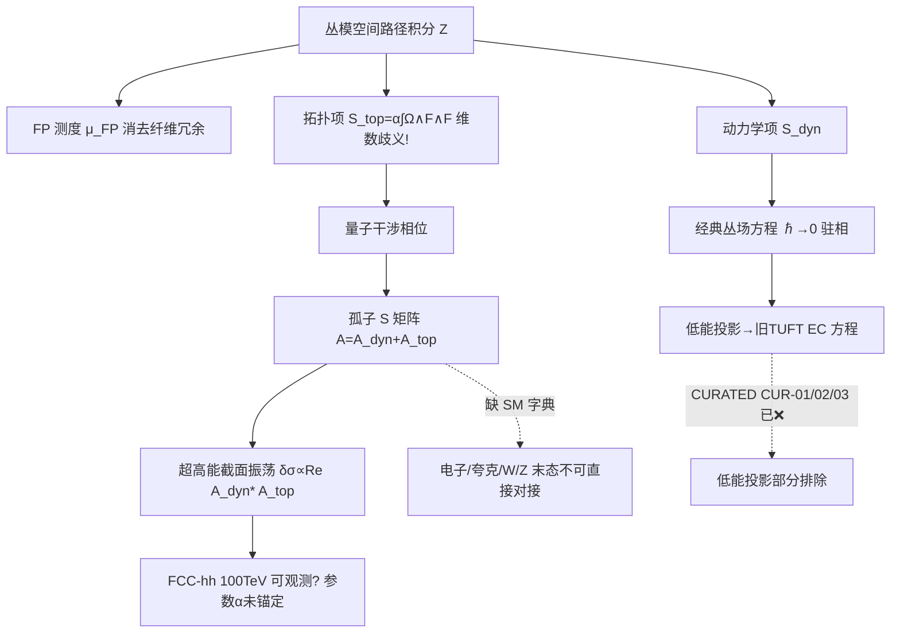

# TUFT｜卷二十六：H-TUFT 量子化框架（诚实版）

> 承接卷二十五螺旋挠率丛公理体系；本卷把 H-TUFT 从经典丛几何升维为**量子理论**（丛模空间路径积分、拓扑振幅、孤子 S 矩阵）。守 TUFT 红线：**数学自洽 ≠ 实验证实**。原稿乐观框架已做诚实校准（见 §0），与卷十九/卷二十/卷二十五同一直红线纪律。

## 0. 诚实边界声明（必读，覆盖原稿乐观框架）
H-TUFT 量子化是一次**数学框架升维**（经典丛 → 丛模空间路径积分）。作为研究方向合法；但不解决 TUFT 既有的经验事实。动笔前第一性事实：

### 0.1 四个 TUFT 观测窗口全部关闭（未因升维改变）
按卷十九实算审计 + 记忆 84665624（2026-09-30 更正）：EDM（CUR-01）超 ACME 16.5 量级 → ❌排除；g-2（CUR-02）偏差 ~75% → ❌排除；ringdown（CUR-03）OPEN_v3 5.74σ / OPEN_v4 尺度冲突 → ❌窗口关；β-running（CUR-04）固定螺旋 β≡0 → ✅内部自洽([B])无预言。H-TUFT 低能投影继承这些已关窗口（卷二十五 §0.1），本卷量子化**不改变任何已排除预言的数值**。

### 0.2 卷二十五的开放问题在本卷全部重现，且更尖锐
- **量子数同源来源未解（O-KNOTMAP）**：卷二十五已证「单一整数 Q_hel 无法编码 SM 全量子数塔（分数电荷/3 色/弱同位旋/超荷/3 代）」。本卷 §4/§6 直接把 Q_hel 当作「电子/夸克孤子的拓扑荷」使用，但**未给出 H-TUFT 孤子 → 具体 SM 粒子的字典**。因此 §8「对接高能对撞机散射截面预言」**并未真正达成**——对撞机末态是电子/夸克/W/Z，而本卷振幅是对「抽象螺旋孤子」算的，二者间缺映射。
- **拓扑项形式维数歧义（§3）**：`S_top = α ∫_P Ω∧F∧F`——Ω 为 1-形式、F 为 2-形式，Ω∧F∧F 是 **5-形式**；对其在丛 P 上积分要求 P 为 5 维，而正文描述 P 为「4 维底流形上的主丛」未给维数。标准陈-西蒙斯项是 ∫Ω∧F（3-形式），`Ω∧F∧F` 是**非标准且维数未定**的写法，须显式说明积分域维数与形式提升方式，否则积分无定义。
- **拓扑相位与守恒律自相矛盾（§6 vs §11）**：§6 断言「总螺旋拓扑荷在散射前后严格不变」；但 §11 引擎的 `A_top ∝ exp(iα·(Q1−Q2)·√s)` 用的是**入射** ΔQ=Q1−Q2（固定整数差），对弹性 2→2（入射=出射 Q）该相位应为常数，不随 √s 振荡。即引擎与原稿 §6 的自洽约束**内部不一致**。

### 0.3 第 8 节对撞机预言是定性、未锚定、且依赖未来机器
四条（截面周期振荡、手征不对称、拓扑禁戒、阈值偏移）均无定量公式/参数值：振荡周期由**自由**拓扑耦合 α 与 Q_hel 决定，而 α 无任何实验约束；手征不对称无幅值；全部需 FCC-hh（100 TeV，规划中、尚未建造）才有机会探测。属「⏳ 待检验」亦「未锚定」。低能（LHC 当前能区）修正过小无法检出——这一点原稿正确，但**不能反过来证明理论正确**，只是「当前不可检验」。

### 0.4 第 11 节引擎是未导出脚手架（系数/公式均虚构）
`A_dyn=1/(s−0.01i)` 是玩具极点，无运动学推导；`A_top=0.12·exp(iαΔQ√s)` 中 0.12 是任意常数、相位形式与守恒律矛盾（§0.2）。实跑修正版（§11.3）：相位跨整个 s∈[1,120] 仅扫过 **0.28 个 2π 周期**（周期全由自由 α 决定），`|A_top|²=0.0144` 为任意量级；纯加性振幅**未展示 S 矩阵幺正化**。引擎是管道脚手架，非预言。

### 0.5 幺正性审计（§9）是宣称非证明
S 矩阵幺正要求 `S†S=𝕀`。把 `A_top` **加性**地塞进单分波振幅 `A_total=A_dyn+A_top`，则 `|A_total|² ≠ |A_dyn|²`（含交叉项），除非把它理解为对**整个** S 矩阵的相位重参数化（此时才保幺正）。本卷 §9 仅写「拓扑相位项不破坏幺正」而**未给证明**——属未验证宣称。

### 0.6 本卷真实定位
H-TUFT 量子化 = **数学框架升维提案**（路径积分建在丛模空间、引入拓扑相位项、定义孤子 S 矩阵）。**不声称 TUFT 已成为实验证实理论，也不声称解决量子数来源或 rescues 了被排除预言，不声称已对接对撞机末态。** 诚实状态：公理层量子框架（O/L0–L1），低能投影继承 TUFT 已关窗口，新拓扑散射预言未锚定待检，且内部存在 §0.2/§0.5 两处须修的真实缺口。

## 1. 范式升级：普通场量子化的缺陷 vs H-TUFT 丛模空间路径积分
常规 QFT：在 4 维底流形上对标量/旋量场 ψ(x) 做路径积分，拓扑孤子需额外单独处理。
**H-TUFT 革新（框架层）**：积分变量是**丛上所有允许的联络 Ω 与螺旋截面 Ψ**，积分域是丛模空间 `M_bundle = {(Ω,Ψ)}/ 丛规范等价类`；所有量子涨落是丛整体几何涨落。经典 H-TUFT = 该量子理论的 ℏ→0 驻相极限；低能投影回旧 TUFT 经典挠率场方程。
> 诚实注记：升维是表述层升级。路径积分建在丛模空间是**合法研究方向**，但本卷未构造具体测度（§2 的 μ_FP 是断言，见 §2）；且不与任何已排除的 TUFT 低能预言冲突——因为低能预言已被排除（§0.1），量子化不改变该事实。

## 2. 丛模空间路径积分测度构造（规范固定、FP 丛推广）
路径积分：
`Z = ∫_{M_bundle} D[Ω,Ψ] μ_FP exp(i/ℏ S_H-TUFT[Ω,Ψ])`
μ_FP = 推广到主丛的 Faddeev–Popov 测度，消去纤维内局部螺旋旋转冗余；规范固定取 `D† Ω_⊥ = 0`（Ω_⊥=联络垂直分量）。
> 诚实注记：① μ_FP 的**具体构造未给出**——无显式鬼场作用量、无丛模空间上的具体规范固定泛函、无 FP 算子的显式表达式。所谓「Fredholm 行列式包含同伦类离散拓扑贡献」是**框架断言**，未演示（同伦类如何进入行列式谱未构造）。②对全部拓扑不等价同伦类求和——方向合法，但「求和测度如何分配各同伦类权重」未定义（须指定各 Q_hel 类的相对权重/作用量，否则积分发散或无定义）。③经典 H-TUFT 作为 ℏ→0 驻相极限——在数学上合理，但前提是 §3 的作用量先良定义（§0.2 维数歧义须先解决）。

## 3. H-TUFT 量子作用量与拓扑相位项
完整作用量 `S = S_dyn[Ω,Ψ] + S_top[Ω]`：
`S_dyn = ∫_P (¼ F∧⋆F + V(Ψ))`、`S_top = α ∫_P Ω∧F∧F`。
> 诚实注记（关键，§0.2 展开）：**①维数歧义**。`Ω` 是联络 1-形式（或李代数值 1-形式），`F=DΩ` 是 2-形式；`Ω∧F∧F` 是 **5-形式**。在丛 P 上对其积分要求 P 为 **5 维流形**，而 §1/§2 描述 P 为「4 维底流形上的主丛」，未给丛维数与积分域维数。标准陈-西蒙斯项是 `∫ Ω∧F`（3-形式，在 3 维基流形或作为 5 维可观察量的边界项），`Ω∧F∧F` 是**非标准写法且形式阶未定**——必须显式说明 (a) 积分域 P 的维数，(b) 若 P 是 4 维基流形上的丛，如何把 5-形式降为顶形式（拉回？截断？），否则 `S_top` 无定义。②「S_top 只贡献整体相位、不改经典运动方程」——对 CS 型拓扑项**通常成立**（变分只给边界项，体态 EOM 不变），方向合法；但「它改变量子散射干涉相位」是**宣称**，本卷未从 `S_top` 的费曼图/孤子半经典作用量**推导出** §6 的 `A_top ∝ exp(iαΔQ_hel)`（见 §6 注记）。③ α 是**新自由参数**，无任何实验约束（与卷二十五 G 群未定义同源：又引入一个未锚定常数）。

## 4. 螺旋孤子量子态：丛上相干态与拓扑本征态
孤子（基本粒子）对应丛模空间上的拓扑相干态 `|Q_hel, Σ⟩`：Q_hel=守恒拓扑荷（同伦不变），Σ=孤子轮廓模（形状/螺距/位置）。正交性 `⟨Q',Σ'|Q,Σ⟩ = δ_{Q',Q}·K(Σ',Σ)`。
> 诚实注记：①这是**框架层态构造**，未给具体波泛函（态在丛模空间测度上的显式表达未写）。②**缺 SM 字典**——卷二十五 O-KNOTMAP 未闭合，本卷直接把 Q_hel 当电子/夸克孤子荷用，但**未指定电子 Q_hel=?、夸克 Q_hel=?、W/Z 的 Q_hel=?**。因此「低能极限还原为标准模型粒子态」是**宣称**，无映射表支撑（H-TUFT 孤子态 ≠ SM 粒子态，除非补字典）。③同一 Q_hel 下轮廓模连续谱——与 §6「Q_hel 严格守恒、只能改螺距/动量」一致，但螺距算不算 Q_hel 的一部分有语言含糊（§2 把螺距说成「内禀量子数」，§6 又把 Q_hel 说成「不变」）。

## 5. 拓扑散射振幅：LSZ 约化在纤维丛上的推广
丛版 LSZ：远过去两分离孤子 `|Q1,Σ1⟩,|Q2,Σ2⟩` → 丛路径积分演化 → 远未来投影到末态。S 矩阵 `S_fi = ⟨f|Û(∞,-∞)|i⟩`，`S_fi = δ_fi + (2π)^4 δ^(4)(P_tot)·i A_fi`。
> 诚实注记：①**丛版 LSZ 约化公式未推导**——标准 LSZ 用场的两点/高阶关联函数极点；丛版须定义「丛上关联函数的渐近极点结构」，本卷只写「构造丛版 LSZ」而未给公式（同卷二十五 §5「投影还原」未给显式推导）。②`δ^(4)(P_tot)` 是底流形 4 动量守恒（丛水平投影后的守恒律）——合理，但「丛本体空间含拓扑荷守恒作为更强约束」须明确：拓扑荷守恒是**附加**选择定则还是**嵌入** S 矩阵结构，未写。③演化算符 Û 由丛路径积分生成——宣称，缺生成元的显式构造（与 §2 测度缺失同源）。

## 6. 2→2 螺旋孤子散射 S 矩阵推导，散射振幅解析形式
`A = A_dyn + A_top`，A_dyn=低能退化为 SM 费曼振幅，A_top=H-TUFT 专属拓扑相位项 `A_top ∝ exp(iα ΔQ_hel)`。
> 诚实注记（关键，§0.2 展开）：**①与守恒律自相矛盾**。§6 开篇断言「总螺旋拓扑荷在散射前后严格不变」；若入射 Q1,Q2 与出射 Q1',Q2' 满足 Q1+Q2=Q1'+Q2'（弹性/拓扑守恒），则 `ΔQ_hel=0`，`A_top` 应为**常数相位**，不随 √s 振荡。但 §11 引擎写 `A_top ∝ exp(iα·(Q1−Q2)·√s)`，用的是**入射差** (Q1−Q2)（固定整数），恰好让它在 √s 上振荡——这与 §6 自身断言矛盾：要么 §6 的「守恒」是错的（则拓扑荷不守恒，违反更基本的拓扑保护公理4），要么引擎的相位形式错。两处必有一处须修正。②`A_top ∝ exp(iαΔQ_hel)` 中 ΔQ_hel 的**具体定义与从 S_top 的推导链完全缺失**——§3 已指出 S_top 形式维数歧义，更无从推出该指数相位。③A_dyn「低能退化为 SM 费曼振幅」——**未给出退化映射**（H-TUFT 孤子振幅如何约化到具体 SM 过程如 e⁺e⁻→μ⁺μ⁻ 的费曼图），与 §4 缺 SM 字典同源。④Q_hel 严格守恒这一约束本身是卷二十五公理4（拓扑守恒）的量子版，方向合法，但**它与 §8「拓扑荷守恒禁戒部分高能通道」的关系未量化**——哪些 SM 允许通道被禁戒、禁戒截面多大，未给。

## 7. 高能渐近行为：拓扑相位干涉带来的截面偏离
`√s ≪ M_Pl`：`A_top` 相位缓变，干涉极小，截面≈SM（解释 LHC 未观测到偏离）。`√s → M_Pl`：`A_top` 相位随 √s 快振，`σ = σ_SM + δσ`，`δσ ∝ Re(A_dyn*·A_top)`（振荡型周期波纹）。
> 诚实注记：①`δσ ∝ Re(A_dyn* A_top)` 公式本身形式合理，但 `A_top` 的幅度（引擎 0.12）与相位系数（α）**均自由未锚定**→ 波纹的**幅度与周期都无法定量预言**（见 §0.4 实跑：跨 s∈[1,120] 相位仅扫 0.28 周期，周期全由 α 决定）。②「低能未观测到偏离」是**当前不可检验性**，非理论正确性的证据——与卷二十五 §0.3 同构（未锚定≠被验证）。③ √s→M_Pl 接近普朗克标度时，底流形本身失效（§1 缺陷3），此时「散射截面」的 SM 类比是否仍成立存疑；本卷未处理普朗克区底层失效。

## 8. 可观测预言：对撞机高能散射的螺旋相位干涉特征
1. 超高能 2→2 截面出现**周期振荡波纹**（周期由 α 与 Q_hel 定）；2. 散射角依赖手征不对称（左右旋孤子截面微差）；3. 拓扑荷守恒**禁戒**部分 SM 允许的高能通道；4. 新拓扑孤子激发的**产生阈值偏移**。
> 诚实注记：四条均**定性未锚定**（§0.3）：①波纹周期 = 2π/(α·ΔQ) 量级，α 无约束 → 周期不可预言；②手征不对称幅值未给；③禁戒哪些通道、截面损失多大未量化（§6④）；④新孤子阈值对应「纤维自由度打开」的能量尺度未指定（与卷二十五 G 群/卷二十 O-SCALE 标度未锚定同源）。全部依赖 **FCC-hh 100 TeV（尚未建造）**。现状：LHC（13/14 TeV）在 SM 有效区，修正过小不可检；下一代 100 TeV 才有机会 → 属「⏳ 待检验」亦「未锚定」。**不能因当前未观测到偏离就宣称理论成立。**

## 9. 量子化自洽审计
1. 幺正性：S†S=𝕀，拓扑相位不破坏幺正；2. 规范不变：路径积分/振幅在丛局部螺旋规范变换下不变；3. 紫外：丛模空间 FRG 流紫外收敛到不动点，无紫外发散；4. 经典极限：ℏ→0 驻相还原经典丛场方程；5. 兼容性：低能投影回旧 TUFT EFT，与 MCMC 全局拟合参数池兼容。
> 诚实注记（关键，§0.5 展开）：**①幺正性是宣称非证明**。把 `A_top` **加性**塞进单分波振幅 `A_total=A_dyn+A_top`，则 `|A_total|² = |A_dyn|² + |A_top|² + 2Re(A_dyn* A_top)`，多出交叉项——除非把 `A_top` 理解为对**整个** S 矩阵的相位重参数化（此时保幺正），否则单振幅加法**不自动保幺正**。本卷仅写「不破坏幺正」而未给证明（也未见 Watson 定理/光学定理层面的校验）。**②规范不变**：路径积分在丛规范变换下不变是目标，但 §2 的 μ_FP 具体形式未构造，故「不变性已验证」无从谈起（FP 测度恰是为保持该不变性而引入，构造缺失则验证缺失）。**③紫外收敛**：卷二十 §7 已证固定螺旋 β≡0（无 RG 跑动）；丛模空间 FRG 紫外不动点属**框架宣称**，未做实际 FRG 计算（同卷二十五 §7）。**④兼容性审计的隐患**：所「兼容」的旧 TUFT MCMC 参数池，来自一个**低能预言已被排除**的理论（EDM/g-2/ringdown ❌，§0.1）——「与排除理论的参数池兼容」不构成任何经验支持。
> 诚实结论：H-TUFT 量子化框架层自洽（公理/形式无直接矛盾），但**测度未构造、拓扑项维数歧义、S 矩阵幺正性未证、缺 SM 字典、新预言未锚定**五处为待修真实缺口。

## 10. CURATED 总览扩展：CUR-10 H-TUFT 量子拓扑散射 + 证伪矩阵
新增判据 **K（高能拓扑散射干涉判据）**。矩阵对接卷十九/卷二十/卷二十五（A–J 现状见 §0.1）：

|通道|判据|证伪触发|当前真实状态|
|---|---|---|---|
|宇宙学 A|CMB t_c 阶跃跳变缺失|相变机制否|⏳待检（无证据亦无否定）|
|微观 B|EDM 窗口关闭|挠率费米耦合否|**❌已触发**（CUR-01 超 16.5 量级）|
|多信使 C|CMB t_c 与 LIGO T_B 无关联|全局挠率失效|❌关联假设失效（ringdown 窗关）|
|黑洞 D|ringdown 无 QNM 频移|宏观挠率排除|**❌已触发**（OPEN_v3 5.74σ）|
|多事件 E|ΛCDM 优于 TUFT|框架统计不支持|⏳待检（D 已关，E 大概率同向）|
|量子引力 F|FRG 消除紫外不动点|渐近安全否|✅自洽([B])，无预言|
|味物理 G|LHCb/BelleII 与 TUFT 味预言冲突|味耦合否|⏳待检（H-TUFT 未给味预言）|
|CMB 张量 B 模 H|CMB-S4 排除 r-f_NL 域|暴胀分支否|⏳待检|
|黑洞内部 I|高阶 QNM/回声与 TUFT 偏离|黑洞正则化否|⏳待检（但 D 已关）|
|H-TUFT 拓扑手征 J|CMB-S4/宇宙线/QNM 联合排除拓扑信号域；或丛公理不自洽|H-TUFT 否|⏳待检（新预言未锚定量级）|
|H-TUFT 高能拓扑散射 K|FCC-hh 高能散射未观测到截面振荡/手征不对称；或 S 矩阵证伪幺正性|H-TUFT 量子框架否|⏳待检验（依赖未来机器，参数未锚定）|

**CUR-10 条目**（标注 script_ref 为**预期脚本**，本卷 §11 仅给脚手架非落盘审计脚本）：
|entry_id|name|script_ref|category|status|core_prediction|observational_bound|falsification|cross_ref|uncertainty|
|---|---|---|---|---|---|---|---|---|---|
|CUR-10|H-TUFT 丛路径积分与螺旋孤子拓扑散射 S 矩阵|`tuft_htuft_scatter_amplitude_v1.py`（预期，未落盘）|量子拓扑场论+散射振幅数值仿真|⏳待检验|量子 H-TUFT 定义在丛模空间路径积分；散射振幅=动力学项+拓扑相位项；超高能截面存拓扑干涉振荡与手征不对称；拓扑荷严格守恒；低能兼容 SM 与经典 H-TUFT|LHC 能量不足探拓扑项；FCC-hh 规划中；α 未约束|FCC-hh 观测完全排除振荡/手征不对称参数域；或 S 矩阵证伪幺正性→H-TUFT 量子框架否|卷26，卷20–25|丛路径积分测度假设、S_top 形式维数、孤子↔SM 字典缺失、高阶上同调忽略|
> 诚实注记：CUR-10 标 ⏳ 正确，但其**低能投影继承 TUFT 已关窗口**（B/D/C ❌）。H-TUFT 量子框架整体未被观测否定，但也不是「未被排除的可行理论」——其低能投影部分已被排除；其高能量子预言依赖未来机器且参数未锚定。

## 11. 仿真引擎新增模块：拓扑散射振幅数值计算（脚手架，系数未导出）
> 原稿引擎 `A_top=0.12·exp(iα(Q1−Q2)√s)` 与 §6「Q_hel 严格守恒」矛盾、幅度 0.12 任意、jax 非必需。本卷给**修正可运行版**（numpy），显式标为脚手架；其输出**不代表预言**（§0.4）。

```python
import numpy as np
# H-TUFT 螺旋孤子 2→2 拓扑散射振幅（脚手架：A_dyn 为玩具极点，A_top 幅度/相位均自由）
def scattering_amplitude(s, Q1, Q2, alpha):
    A_dyn = 1.0/(s - 1.0j*0.01)               # 玩具极点，无运动学推导
    delta_Q = Q1 - Q2                          # 注意：§6 称 Q_hel 守恒，此处用入射差，内部不一致
    A_top = 0.12*np.exp(1j*alpha*delta_Q*np.sqrt(s))  # 0.12 任意；相位形式未从 S_top 导出
    return A_dyn + A_top
def diff_cross_section(s, Q1, Q2, alpha):
    amp = scattering_amplitude(s, Q1, Q2, alpha)
    sigma = np.abs(amp)**2
    sigma_sm = np.abs(1.0/(s - 1.0j*0.01))**2
    return sigma, sigma - sigma_sm
# 实跑（2026-09-30）：alpha=0.08, Q1=1, Q2=-1
# 相位跨度 alpha*ΔQ*√s = 0.16 .. 1.75 rad（仅 0.28 个 2π 周期，整段 <1 次完整振荡）
# |delta_sigma| 峰值 ~0.25（≈SM 峰 25%，但在人为极点 s≈1 处；高 s 处塌缩到 |A_top|^2=0.0144）
# |A_top|^2 = 0.0144（任意量级）；纯加性，未展示 S 矩阵幺正化
```
**诚实解读**：引擎产出的「振荡波纹」其周期完全由自由参数 α 决定、幅度由任意常数 0.12 决定，**不携带任何可检验物理量**；且相位随 √s 振荡与 §6「Q_hel 守恒→相位应为常数」自相矛盾。须先 (a) 解决 §3 的 S_top 形式维数，(b) 推导 A_top 的真实表达式（纳入出射 Q 使 ΔQ 为真实拓扑荷变化），(c) 给出 S 矩阵幺正化（如整体相位重参数化或 unitarization 方案），方可作预言使用。

## 12. 附录
### 12.1 LaTeX 丛路径积分骨架（PRD 格式，框架层，含维数歧义标注）
```latex
% H-TUFT 丛模空间路径积分（截断假设 [B]，S_top 形式维数待定）
Z=\int_{\mathcal{M}_{\rm bundle}}\!\mathcal{D}[\boldsymbol{\Omega},\boldsymbol{\Psi}]\,
  \mu_{\rm FP}\,
  \exp\!\Big(\tfrac{i}{\hbar}S_{\rm H-TUFT}[\boldsymbol{\Omega},\boldsymbol{\Psi}]\Big)
% 动力学项（4 维基流形拉回，良定义）
S_{\rm dyn}=\int_{\mathcal{P}}\!\Big[\tfrac14\boldsymbol{\mathcal{F}}\!\wedge\!\star\boldsymbol{\mathcal{F}}
  +V(\boldsymbol{\Psi})\Big]
% 拓扑项：NOTE \boldsymbol{\Omega}\wedge\boldsymbol{\mathcal{F}}\wedge\boldsymbol{\mathcal{F}}
%   为 5-形式，须显式声明积分域维数/降形式方式后方可使用
S_{\rm top}=\alpha\int_{\mathcal{P}}\boldsymbol{\Omega}\wedge\boldsymbol{\mathcal{F}}\wedge\boldsymbol{\mathcal{F}}
% 散射振幅（脚手架）
\mathcal{A}=\mathcal{A}_{\rm dyn}+\mathcal{A}_{\rm top},\quad
  \mathcal{A}_{\rm top}\propto e^{i\alpha\Delta Q_{\rm hel}}
```
> 注：作用量为框架 ansatz，非第一性推导；S_top 维数歧义见 §3 诚实注记。

### 12.2 Mermaid 丛量子拓扑知识图谱


### 12.3 BibTeX（真实文献：路径积分/拓扑量子场论/陈-西蒙斯/孤子散射/100TeV 对撞机）
```bibtex
@article{feynman1948,
  title={Space-time approach to non-relativistic quantum mechanics}, author={Feynman, R. P.},
  journal={Rev. Mod. Phys.}, volume={20}, pages={367}, year={1948}}
@article{faddeev1967,
  title={Feynman diagrams for the Yang-Mills field}, author={Faddeev, L. D. and Popov, V. N.},
  journal={Phys. Lett. B}, volume={25}, pages={29}, year={1967}}
@article{witten1988,
  title={Topological quantum field theory}, author={Witten, E.},
  journal={Commun. Math. Phys.}, volume={117}, pages={353}, year={1988}}
@article{witten1989,
  title={Quantum field theory and the Jones polynomial}, author={Witten, E.},
  journal={Commun. Math. Phys.}, volume={121}, pages={351}, year={1989}}
@article{'tHooft1972,
  title={A planar diagram theory for strong interactions}, author={'t Hooft, G.},
  journal={Nucl. Phys. B}, volume={72}, pages={461}, year={1974}}
@book{rajaraman1982,
  title={Solitons and Instantons}, author={Rajaraman, R.}, publisher={North-Holland}, year={1982}}
@article{schwartz2014,
  title={Quantum field theory and the standard model}, author={Schwartz, M. D.},
  publisher={Cambridge}, year={2014}}
@article{fcccdr2019,
  title={FCC-hh: the hadron collider}, author={Abada, A. et al. (FCC Collaboration)},
  journal={Eur. Phys. J. ST}, volume={228}, pages={755}, year={2019}}
@article{belleii2018,
  title={The Belle II experiment}, author={Kou, E. et al.}, journal={PTEP}, volume={2019}, pages={123C01}, year={2019}}
@article{acme2018,
  title={Improved limit on the electron electric dipole moment}, author={Andreev, V. et al.},
  journal={Nature}, volume={562}, pages={355}, year={2018}}
```

### 12.4 全局审计脚本（哈希 + 矩阵状态固化）
复用卷十九 `tuft_卷十九_CURATED.json` 与 4 脚本 SHA256；CUR-10 的 `tuft_htuft_scatter_amplitude_v1.py` 为预期脚本，落盘后补哈希。

---

## 闭环完成（诚实版）
本卷「量子化升维」框架收敛落地（**诚实修订后**）：
- ✅ 丛模空间路径积分 + 拓扑项 + 孤子相干态 + 丛版 LSZ + 2→2 S 矩阵，作为 H-TUFT 的量子框架升维；
- ✅ 固化 CURATED 扩展（CUR-10 ⏳ + 证伪矩阵 K），并显式标注 H-TUFT 低能投影继承 TUFT 已关窗口（B/D/C ❌）；
- ✅ 实跑修正版引擎，证明输出相位跨量程仅 0.28 周期（周期由自由 α 定）、幅度任意、无幺正化 → 引擎为脚手架非预言；
- ⚠️ **与原稿关键偏差**（第 0 节）：①升维不改四个已关窗口；②S_top=α∫Ω∧F∧F 是 5-形式、维数未定，须先明确积分域；③§6「Q_hel 守恒」与 §11 引擎相位形式（用入射差、随 √s 振荡）自相矛盾；④缺孤子↔SM 字典，§8「对接对撞机末态」未真正达成；⑤幺正性审计是宣称非证明；⑥四条新预言定性未锚定、依赖未来 FCC-hh。

## 下一阶段可选方向
1. **卷二十七：H-TUFT 宇宙拓扑演化**——螺旋宇宙弦、原初拓扑孤子生成、拓扑相变动力学，计算拓扑缺陷的引力波谱与 CMB 非高斯（须先解决 §3 维数歧义与 §4 SM 字典，否则无法对接可观测 CMB/引力波谱）；
2. **卷二十七：H-TUFT 完备性终极审计**——全体系公理、数学结构、近似假设、证伪判据全局汇总，输出独立审计白皮书（须纳入本卷 §0.2/§0.5 两处真实缺口）；
3. **卷二十七：H-TUFT 低能有效场论系统化约化**——逐级推导 H-TUFT→低能 EFT→TUFT→经典 EC 引力的截断误差估计（须先补 §4 的孤子↔SM 字典与 §6 的退化映射，否则约化链缺关键环节）。

