# 知识结构图集

本附录提供了统一场论的核心知识结构图，包括宇宙的二元结构、物理概念关系图、四种基本力的统一和时空同一化原理示意图，帮助读者直观理解统一场论的核心思想和知识体系。

## 一、宇宙的二元结构

### 1.1 宇宙的基本构成

宇宙由**物体**和**空间**构成，不存在第三种与之并存的东西，一切物理现象都是观察者对物体和空间运动的描述。

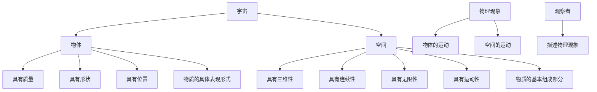

### 1.2 物体与空间的关系

物体存在于空间中，影响空间的运动；空间运动影响物体的行为。物质与空间相互影响，相互转化，形成了我们所观察到的物理世界。

| 特性 | 物体 | 空间 |
|------|------|------|
| 存在形式 | 具体的、有形的 | 抽象的、无形的 |
| 基本属性 | 质量、形状、位置 | 三维性、连续性、无限性、运动性 |
| 运动形式 | 位置变化、旋转、振动等 | 流动、振动、旋转、螺旋运动等 |
| 相互作用 | 物体影响空间运动 | 空间运动决定物体行为 |
| 转化关系 | 物质可以转化为空间 | 空间可以转化为物质 |

## 二、物理概念关系图

### 2.1 统一场论核心概念关系

统一场论的核心概念包括时空同一化、物理量几何化、运动统一性和场的统一性，它们之间相互关联，构成了统一场论的理论体系。

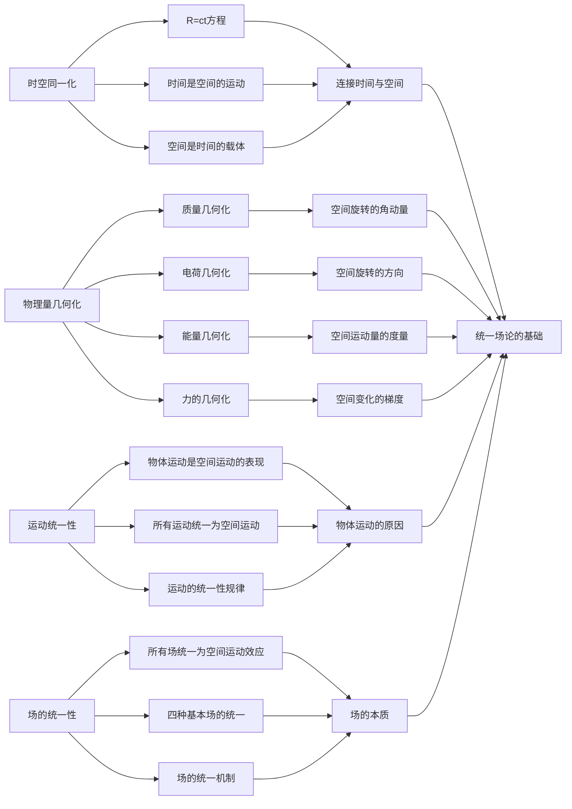

### 2.2 物理量与空间运动的关系

所有物理量都可以几何化为空间的运动，质量、电荷、能量、动量、力等物理量都是空间运动的不同表现形式。

| 物理量 | 几何化描述 | 空间运动形式 |
|--------|------------|--------------|
| 质量 | 空间旋转的角动量 | 空间单元的旋转运动 |
| 电荷 | 空间旋转的方向 | 空间单元的旋转方向 |
| 能量 | 空间运动量的度量 | 空间单元的运动速度 |
| 动量 | 空间运动的矢量表现 | 空间单元的定向运动 |
| 力 | 空间变化的梯度 | 空间单元的梯度变化 |
| 引力场 | 空间向中心流动 | 空间单元的汇聚运动 |
| 电场 | 空间旋转的表现 | 空间单元的旋转运动 |
| 磁场 | 空间旋转的表现 | 空间单元的旋转运动 |
| 核力 | 空间短程作用 | 空间单元的高维作用 |

## 三、四种基本力的统一

### 3.1 四种基本力的比较

自然界中存在四种基本力：引力、电磁力、强力和弱力。它们的强度、作用范围和表现形式各不相同，但在统一场论中，它们都可以统一为空间运动的效应。

| 基本力 | 强度 | 作用范围 | 统一场论解释 | 空间运动形式 |
|--------|------|----------|--------------|--------------|
| 引力 | 10⁻³⁸ | 无限远 | 空间向中心流动 | 空间单元的汇聚运动 |
| 电磁力 | 10⁻² | 无限远 | 空间旋转的表现 | 空间单元的旋转运动 |
| 强力 | 1 | 10⁻¹⁵m | 空间短程作用 | 空间单元的高维作用 |
| 弱力 | 10⁻¹³ | 10⁻¹⁸m | 空间特殊作用 | 空间单元的特殊运动 |

### 3.2 四种基本力的统一机制

在统一场论中，四种基本力都是空间运动的不同表现形式，它们的区别在于空间运动的形式和范围不同。随着空间尺度的变化，四种力可以相互转化，最终统一为一种基本力。

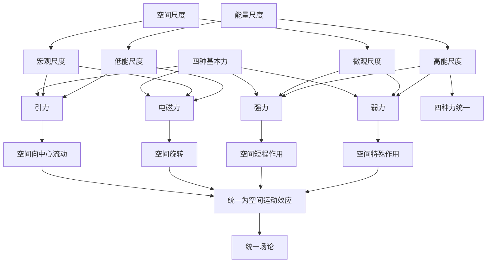

## 四、时空同一化原理示意图

### 4.1 时空同一化的概念

时空同一化原理指出，时间和空间是同一事物的不同表现，时间是空间的运动，空间是时间的载体，二者通过光速相互转化。

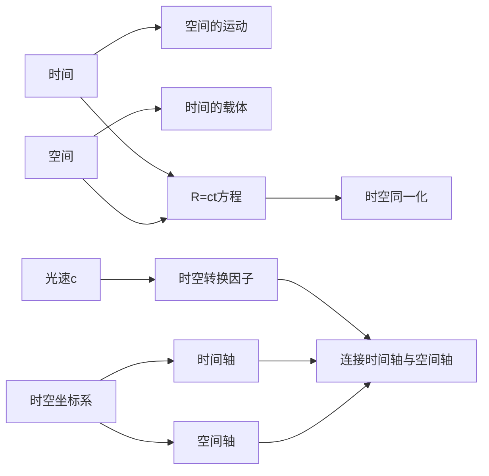

### 4.2 时空同一化的数学表达

时空同一化的数学表达式为：

$$ R = ct $$

其中，$R$表示空间位移，$c$表示光速，$t$表示时间。这个方程揭示了时间和空间的本质关系，即1秒的时间等价于30万公里的空间距离。

### 4.3 三维螺旋时空方程

空间单元的运动轨迹是圆柱状螺旋线，由旋转运动和直线运动组成，其数学表达式为：

$$ R = r \cos(\omega t) \mathbf{i} + r \sin(\omega t) \mathbf{j} + h t \mathbf{k} $$

这个方程描述了空间单元的螺旋运动，是空间三维性的必然结果，也是基本粒子的本质运动形式。

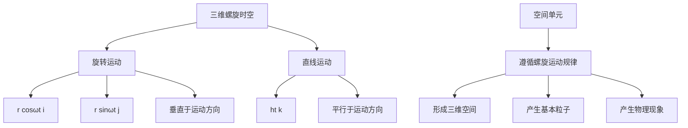

## 五、物理量几何化关系图

### 5.1 质量与空间运动的关系

质量是物体周围空间旋转运动的表现，反映了物体周围空间旋转的角动量。

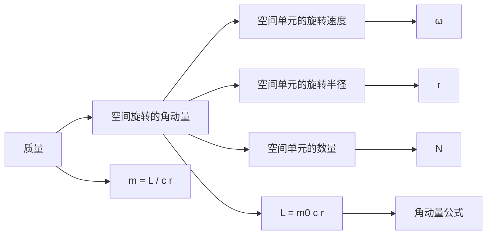

### 5.2 电荷与空间运动的关系

电荷是物体周围空间旋转方向的表现，正电荷和负电荷对应空间旋转方向的不同。

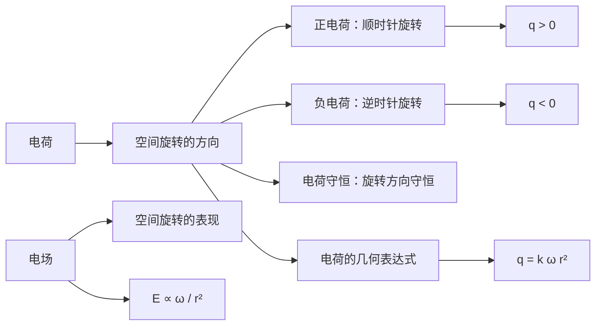

### 5.3 能量与空间运动的关系

能量是空间运动量的度量，包括静止能量和动能，静止能量$E_0 = m_0 c^2$。

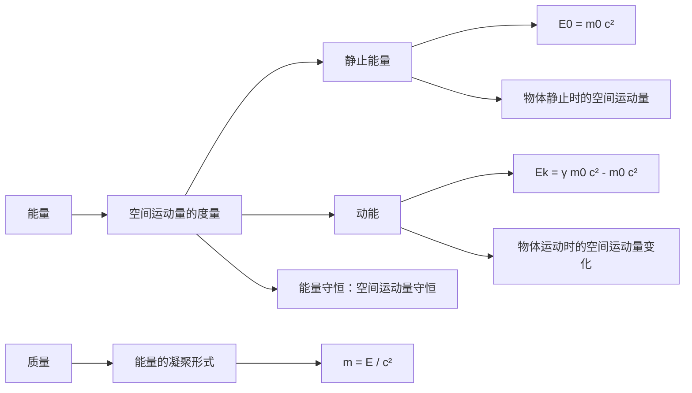

## 六、场的几何本质关系图

### 6.1 引力场的几何本质

引力场是空间向中心流动的表现，物体的质量越大，空间向中心流动的速度越快。

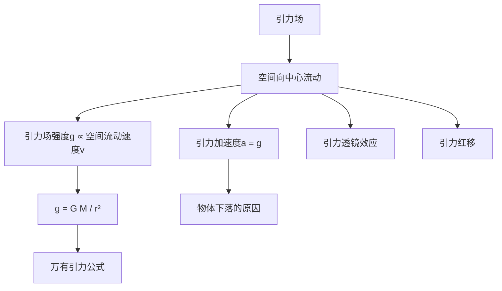

### 6.2 电磁场的几何本质

电磁场是空间旋转的表现，电场和磁场是同一事物的两个方面，相互激发，形成电磁波。

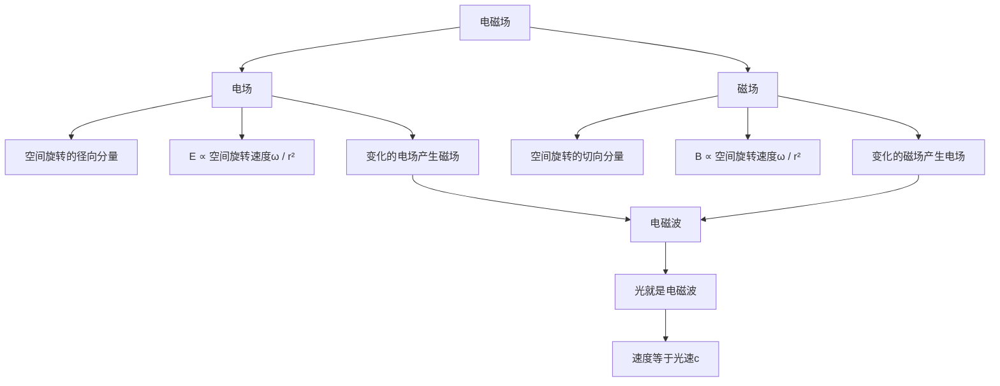

## 七、知识结构总览

### 7.1 统一场论的核心思想

统一场论的核心思想可以概括为以下四点：

1. **时空同一化**：时间和空间是同一事物的不同表现
2. **物理量几何化**：所有物理量都可以几何化描述
3. **运动统一性**：所有运动都可以统一为空间的运动
4. **场的统一性**：所有场都可以统一为空间运动的效应

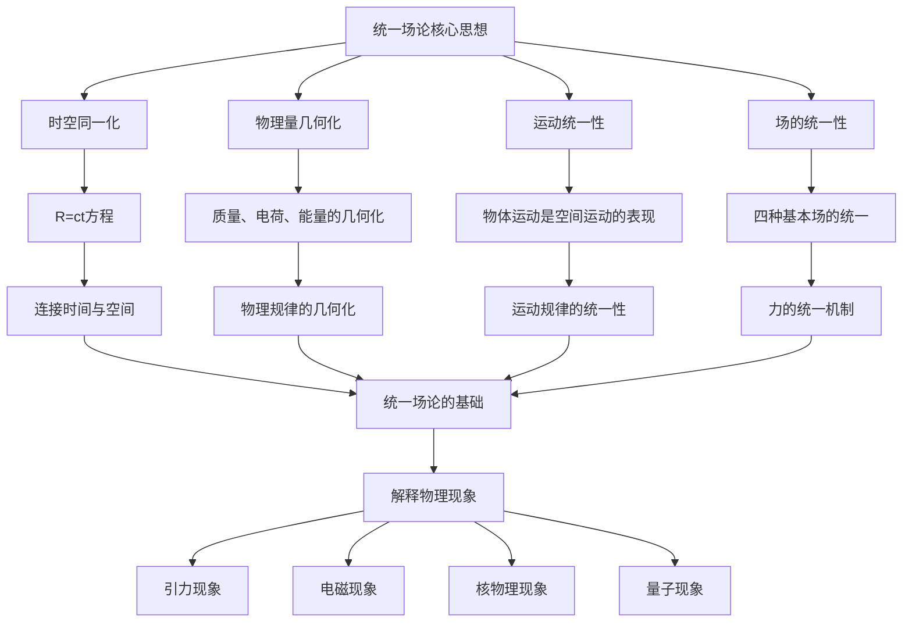

### 7.2 学习路径图

学习统一场论的建议路径：

1. 先了解**基础概念**：空间的本质、时间的本质、运动的本质
2. 掌握**核心原理**：时空同一化、物理量几何化、运动统一性、场的统一性
3. 学习**具体应用**：引力场的几何本质、电磁场的几何本质、核力的几何解释
4. 探索**前沿话题**：宇宙学、量子力学、相对论与统一场论的关系

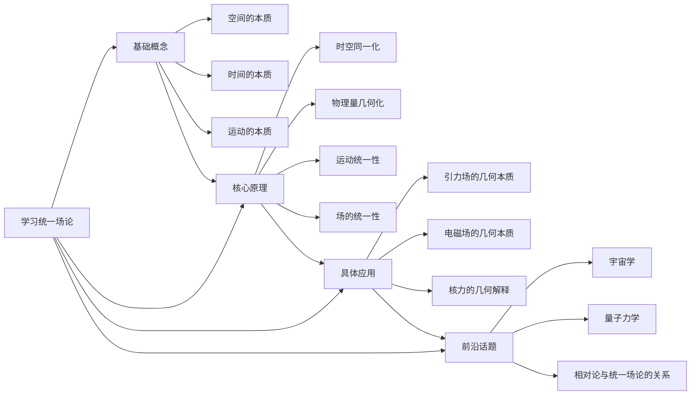

通过这些知识结构图，读者可以直观理解统一场论的核心思想和知识体系，把握各概念之间的关系，建立起完整的统一场论知识框架。